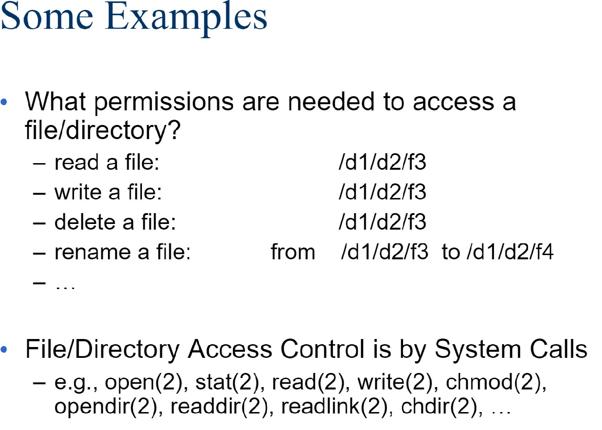
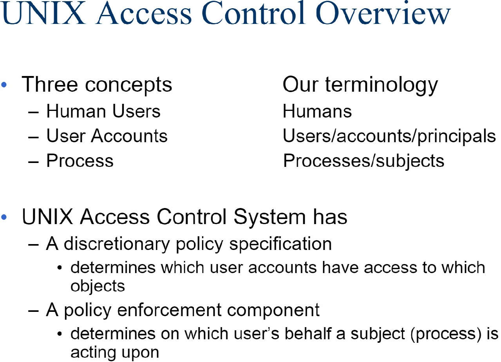

#  Lecture 1: User Authentication

## 用户认证（User Authentication）

Definition: Using a method to validate users who attempt toaccess a computer system or resources, to ensure they are authorized.

Types of user authentication:

- Something you know
  - E.g.,user account names and passwords
- Something you have
  - Smart cards or other security tokens
- Something you are
  - BiometricS

## Entropy（密码熵）

Definition: The measure of the uncertainty of a random variable.

而在密码学里，熵是量化的。

具体而言，熵的计算为：

$$H(X) = -\sum_{i=1}^n p_i \log_2 p_i$$

其中，$X$ 是随机变量，$p_i$ 是 $X$ 的第 $i$ 个可能值出现的概率。

# Lecture 2: Unix and Access Control

访问控制模型

User principal subject

12 bits permission

RUID EUID SUID

Lecture 3: MAC and Integrity Protection

BLP