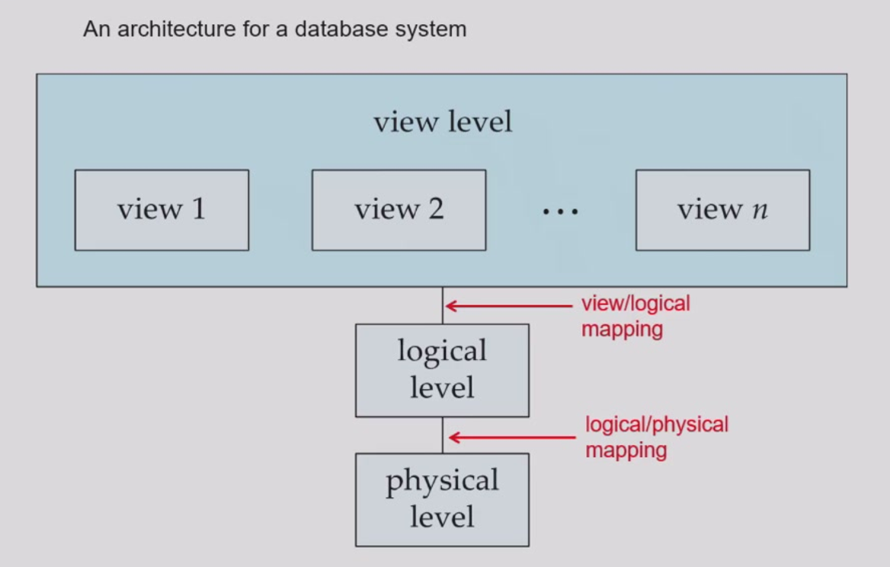
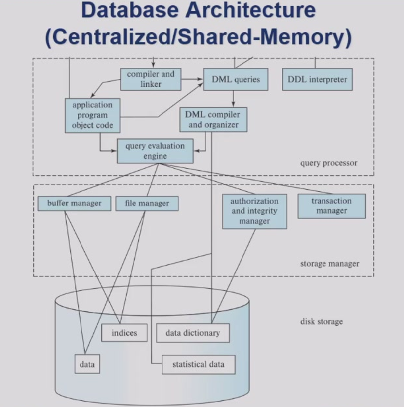

# Lecture 1: Introduction

## 数据库管理系统（DBMS）核心概念

数据库管理系统是用于管理相互关联数据集合的复杂软件系统，其核心功能包括：

1. 数据持久性：长期存储数据
2. 高效访问：提供多用户并发访问支持
3. 完整性控制：通过约束保证数据逻辑正确性
4. 故障恢复：确保系统异常时的数据一致性
5. 安全控制：实现权限管理与审计功能

典型应用场景覆盖金融交易、航空订票、医疗记录等社会各领域，例如：

- 银行账户管理系统的并发交易
- 电商平台的商品推荐算法

## 数据抽象三层体系

| 抽象层级 | 描述内容 | 示例 |
|---------|---------|-----|
| 物理层 | 数据存储细节 | 磁盘块分配策略 |
| 逻辑层 | 数据结构关系 | `instructor`表模式定义：`(ID char(5), name varchar(20), dept_name varchar(20), salary numeric(8,2))` |
| 视图层 | 用户定制视角 | 隐藏敏感字段（如工资）的安全视图 |



物理数据独立性允许修改存储结构而不影响上层应用逻辑。

## 关系模型基础

关系模型采用二维表结构组织数据：

- 属性（列）：描述实体特征（如`学号`、`姓名`）
- 元组（行）：记录具体实例（如`(31801001, 张三)`）

规范化理论确保数据无冗余，函数依赖关系可表示为：
$$
X \rightarrow Y \quad \text{（表示属性集X唯一确定Y）}
$$

## 数据库语言体系

### 数据定义语言（DDL）

DDL用于定义数据库的**模式（Schema）**，即数据的结构和约束。核心功能包括：

- 创建/修改表结构
- 定义完整性约束（如主键、外键）
- 管理权限（授权与撤销权限）

```sql
CREATE TABLE department (
    dept_name VARCHAR(20) PRIMARY KEY,
    building VARCHAR(15),
    budget NUMERIC(12,2)
);
```

### 数据操作语言（DML）

DML负责数据的查询与更新，分为两类：

- 过程式DML：需指定操作步骤（如关系代数）
- 声明式DML：仅描述目标结果（如SQL）

```sql
SELECT name, salary 
FROM instructor 
WHERE dept_name = 'CS' AND salary > 8000;
```

## 数据库引擎核心组件

**存储管理器：**

- 文件管理：与操作系统交互，管理磁盘存储
- 缓存管理：通过缓冲区减少I/O操作
- 索引管理：维护B+树等加速查询

**查询处理器：**

- 解析与翻译：将SQL转为关系代数表达式
- 逻辑优化：重写查询（如谓词下推）  
- 物理优化：选择成本最低的执行计划（如索引扫描 vs 全表扫描）

**事务管理器：**

通过ACID特性保障可靠性：

- 原子性（Atomicity）：事务要么全执行，要么全回滚
- 一致性（Consistency）：满足所有约束（如余额≥0）
- 隔离性（Isolation）：并发事务互不干扰（通过锁机制）
- 持久性（Durability）：提交后数据永久保存

