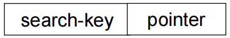
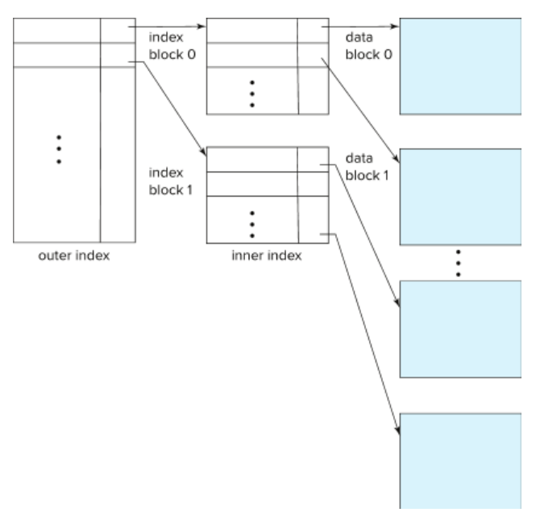
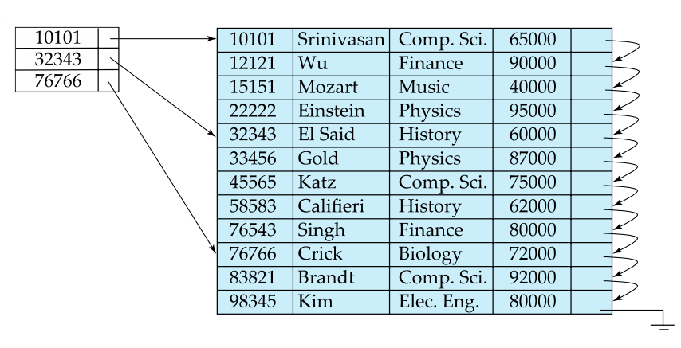
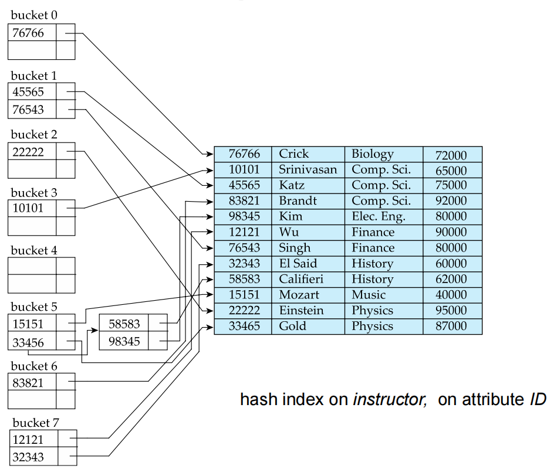
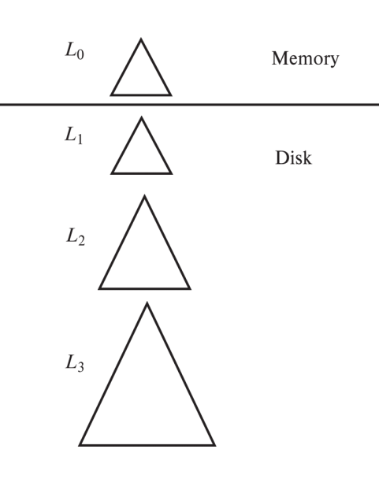

# Lecture 10: Index

## 一、索引基础概念

### 1. 索引

- **作用**：**加速**数据访问。类似图书馆目录系统，快速定位目标数据。
- **搜索键(Search Key)**：用于查找记录的属性或属性组合。
- **索引文件结构**：由(index entries)组成，格式为:



### 2. 索引类型对比

在有序索引（ordered index）中，索引条目按**搜索键的值**排序存储。（这个好说，所谓的“从小到大”依次排列就是这个意思）

在哈希索引中，使用哈希函数将键值映射到对应的“**桶**”（Bucket），每个桶保存指向数据记录的指针。

在聚集索引（Clustering index）中，数据文件本身是按**索引键排序组织**的（所以它其实也是有序索引）表中记录的物理存储顺序与索引顺序一致（这个很好理解，比如从上到下的查询结果往往都是1，2，3，...）。不过一张表只能有一个聚集索引，因为数据只能有一种物理顺序。

在非聚集索引（nonclustering index）中，**索引的逻辑顺序与数据的物理顺序无关**，索引叶子节点保存的是指向数据行的指针（通常是主键值）。这个不太好懂，举个例子：

!!! example "非聚集索引示例"

    ```sql
    CREATE INDEX idx_name ON student(name);
    ```

    索引结构可能是这样的：

    ```
    'Ting' → student_id = 101
    'Wen'  → student_id = 102
    ...
    ```

    当你执行：

    ```sql
    SELECT * FROM student WHERE name = 'Wen';
    ```

    那么它就会先查索引得到 `student_id = 102`这样一条，再去主键索引找完整记录。

| 类型          | 特点                          | 适用场景              |
|---------------|-----------------------------|---------------------|
| 有序索引               | 按键值排序存储                   | 范围查询              |
| 哈希索引                | 均匀分布到桶中                   | 精确查找              |
| 聚集索引(又称主索引)        | 数据物理顺序与索引顺序一致   | 频繁范围扫描            |
| 非聚集索引(又称二级索引)      | 数据物理顺序独立于索引顺序   | 辅助访问路径            |

### 3. 索引评估指标

- 支持的访问类型(点查询/范围查询)
- 访问时间
- 插入/删除时间
- 空间开销
- 维护成本


## 二、有序索引详解

### 1. 稠密索引（Dense Index）与稀疏索引（Sparse Index）

#### 1.1 稠密索引

**定义**：**每一个搜索键值**在索引中都有一个对应的索引记录，指向数据文件中的具体位置。

**优缺点**：

- 每条记录都有一个索引项；
- 可以直接通过索引定位到具体的记录，支持精确查找和范围查询；
- 空间占用大；
- 更新代价高；

!!! example "稠密索引"

    假设有如下数据表（按`id`排序）：

    | id | name     |
    |----|----------|
    | 10 | Alice    |
    | 20 | Bob      |
    | 30 | Charlie  |
    | 40 | David    |

    稠密索引会为每个`id`都建立一个索引项：

    ```txt
    Index:
    10 → pointer to record 10
    20 → pointer to record 20
    30 → pointer to record 30
    40 → pointer to record 40
    ```

#### 1.2 稀疏索引

**定义**：每个**数据块（block）或页（page）的第一个键值**才有索引记录，而不是每条记录都有索引。

**优缺点**：

- 节省空间；
- 查询时需要先找到最近的索引项，然后顺序扫描直到目标记录；
- 更新代价低，更适合大数据量、批量访问的场景；
- 但是它不太适合处理大量重复键值（和上一条不矛盾，大量重复键值导致数据分布不清晰）；
- 查询较慢（需要顺序扫描）

!!! example "稀疏索引"

    还是上面的数据，假设每两个记录存在一个磁盘块中：

    - 块1：id=10, 20
    - 块2：id=30, 40

    稀疏索引只记录每个块的起始键值：

    ```
    Index:
    10 → pointer to block1
    30 → pointer to block2
    ```

    当要查找 `id=35` 时，先找到 `30` 的索引项，进入块2，再顺序查找。

#### 1.3 对比

| 特性          | 稠密索引                     | 稀疏索引                     |
|--------------|----------------------------|----------------------------|
| 索引覆盖率     | 每个搜索键值都有索引记录          | 仅部分键值有索引记录            |
| 空间开销       | 高                          | 低                         |
| 查询性能       | 直接定位(快)                 | 需顺序扫描(慢)               |
| 更新代价       | 高(每次数据变更都需更新索引)      | 低(仅块边界变化时需要更新)       |

### 2. 多级索引

- **定义**：**多级索引（Multi-level Index）**是一种将索引结构组织成**树状层级**的技术。它把索引当作“数据”，再为索引建立上层索引，从而形成“索引的索引”。
- **设计原理**：将大型索引视为文件，建立上层稀疏索引。

> 如果你的表有几百万甚至上亿条记录，那么它的索引也会非常庞大；
> 
> 那么如果把这个索引当作一个“文件”来处理；
> 
> 为这个索引文件建立一个新的“稀疏索引”——也就是第二级索引；
> 
> 这样就可以快速定位到一级索引中的某个区域，而不必加载整个索引。

- **典型结构**：

    

    示例图如下：

    

- **优势**：减少I/O次数，例如百万级数据只需3-4次磁盘访问

## 三、B+树索引

### 1. B+树

- **定义**：B+树是一种自平衡的树结构，广泛用于数据库和文件系统中，用来组织大量的键值对数据，使得查找、顺序访问、插入和删除都具有良好的性能。
- **平衡树结构**：所有叶节点在同一层，这保证了所有查询路径长度相同，不会出现“一边很深一边很浅”的情况（见下图示例）

    ```mermaid
    graph TD
        A[根索引（第1级）] --> B1[中间索引块1（第2级）]
        A --> B2[中间索引块2]
        A --> B3[中间索引块3]

        B1 --> C1[数据块0]
        B1 --> C2[数据块1]
        B2 --> C3[数据块2]
        B2 --> C4[数据块3]
        B3 --> C5[数据块4]
        B3 --> C6[数据块5]
    ```

- **节点容量**：非根节点保持半满到全满

    - 非叶节点：子节点个数为\(⌈\frac{n}{2}⌉\)到\(n\)
    - 叶节点：其键值的个数为\(⌈\frac{n - 1}{2}⌉\)到\(n-1\)

- **实践参数**：典型节点大小4KB，扇出(fan-out)约100。

> 一个磁盘块通常为 4KB；
> 
> 每个节点可以容纳约 100 个子节点（扇出为 100）；
> 
> 因此即使有上百万条记录，树的高度也只有 3~4 层；
> 
> 意味着每次查询最多只需 3~4 次磁盘 I/O！

### 2. B+树操作算法

ADS的东西，就不多说了。

#### 查询算法

```python
def BplusTree_Find(root, search_key):
    current = root
    while not current.is_leaf:
        # 找到第一个 ≥ search_key的键
        idx = bisect_right(current.keys, search_key)
        current = current.children[idx]
    # 在叶节点中查找
    if search_key in current.keys:
        return current.pointers[current.keys.index(search_key)]
    return None
```

#### 插入算法（关键步骤）

1. 查找目标叶节点
2. 若节点未满直接插入
3. 节点已满时分裂：

    ```python
    def split_leaf(original_node):
        new_node = Node()
        split_pos = len(original_node.keys) // 2
        # 分配键值和指针
        new_node.keys = original_node.keys[split_pos:]
        original_node.keys = original_node.keys[:split_pos]
        # 处理叶节点链表指针
        new_node.next = original_node.next
        original_node.next = new_node
        return new_node
    ```

4. 向上传播分裂直到满足B+树条件

### 3. B+树性能优势

- 高度计算：对于\(K\)个键值，每个节点最多有\(n\)个子节点，我们可以计算高度：\( \text{h} \leq \left\lceil \log_{\left\lceil n/2 \right\rceil}(K) \right\rceil \)（实例：\(n=100\)时，百万左右数据仅需4~5层）
- 对比平衡二叉树：相同数据量需要更多访问。

## 四、哈希索引

### 1. 静态哈希问题

静态哈希（Static Hashing）是最简单的哈希索引实现方式：

- 使用一个固定的哈希函数将键值映射到一组桶中；
- 每个桶保存指向数据记录的指针；
- 查询时通过`hash(key) % N`确定去哪个桶查找.



然而这种做法有缺点：

- **桶溢出**：数据增长导致性能退化。
- **空间浪费**：预分配空间利用率低。

那么解决方案呢？我们使用动态哈希技术。

### 2. 动态哈希技术

#### 2.1 基本对比

~~ADS！坏东西！~~

| 技术                    | 核心机制                                                                 | 优点                                      | 缺点                                           |
|-------------------------|--------------------------------------------------------------------------|-------------------------------------------|------------------------------------------------|
| **可扩展哈希**<br>(Extendible Hashing) | 使用目录表间接管理桶<br>插入导致桶分裂时只更新目录部分<br>目录按需翻倍       | 渐进式重组<br>支持快速扩展<br>适合内存数据库 | 目录可能膨胀很快<br>空间利用率较低               |
| **线性哈希**<br>(Linear Hashing)       | 不使用目录<br>每次只分裂当前桶<br>使用多个哈希函数逐步迁移数据              | 平滑扩展<br>无需额外目录<br>适合磁盘存储     | 插入/查询逻辑稍复杂<br>需要维护阶段和层级信息     |
| **布谷鸟哈希**<br>(Cuckoo Hashing)     | 使用两个哈希函数<br>冲突时踢出已有元素<br>最多两次查找                      | 查找性能稳定<br>空间利用率高（可达90%以上）   | 插入可能失败<br>实现较复杂<br>不适合大规模存储    |
| **周期性重哈希**<br>(Periodic Rehashing) | 定期将所有键重新哈希并迁移到新桶中<br>或根据负载因子触发                     | 负载均衡好<br>空间利用率高<br>适合分布式系统   | 需要暂停或渐进迁移<br>实现成本较高                |

#### 2.2 可扩展哈希（Extendible Hashing）

**核心思想**：

- 使用一个“目录（Directory）”来间接指向桶；
- 每个桶有一个局部深度（Local Depth）；
- 当某个桶满了，就分裂它，并更新目录；
- 如果目录不够大，就翻倍扩容；

> 这个可以看看网上的资料，我看的是这篇[【数据库】可拓展哈希（Extendable Hashing）](https://zhuanlan.zhihu.com/p/375039823)。

#### 2.3 线性哈希（Linear Hashing）

#### 核心思想：

- 不使用目录；
- 每次只分裂当前桶；
- 使用多个哈希函数（h₀, h₁, ...）；
- 插入时如果桶满，则根据当前阶段选择是否分裂；

#### 特点：

- 扩展是线性的，不会突然翻倍；
- 插入和查找都可能要用不同的哈希函数尝试；

> 这个也可以看看网上的资料，我看的是这篇[ 算法 Linear Hash 原理及实现](https://ruby-china.org/topics/39466)。

## 五、高级索引技术

### 1. 位图索引（Bitmap Index）

#### 定义：

一种为**低基数字段**（如性别、状态、是否启用等）设计的索引结构。每个不同的值对应一个**位向量（Bit Vector）**，每一位表示某条记录是否具有这个值。

#### 存储结构：

```python
gender_bitmaps = {
    'Male':   BitVector('1010'),  # 第1、3位为男（Bob 和 Dave）
    'Female': BitVector('0101')   # 第2、4位为女（Alice 和 Carol）
}
```

#### 查询优化：

- 支持高效的布尔运算（AND / OR / NOT）进行多条件查询；
- 比如查找 `gender='Male' AND status='Active'`，只需要对两个位图做按位与操作；

#### 示例说明：

假设我们有如下员工表（4人）：

| id | name  | gender |
|----|-------|--------|
| 1  | Alice | Female |
| 2  | Bob   | Male   |
| 3  | Carol | Female |
| 4  | Dave  | Male   |

使用位图索引表示 `gender` 字段：

```python
gender_bitmaps = {
    'Male':   BitVector('1010'),
    'Female': BitVector('0101')
}
```

#### 优点：

- 对低基数字段查询极快；
- 多条件组合查询效率高；
- 压缩后占用空间小；

#### 缺点：

- 不适合高基数字段（如身份证号）；
- 更新频繁时性能差（因为要修改大量位）；

### 2. LSM树（Log Structured Merge Tree）

#### 定义：

一种**写入优化的存储结构**，广泛用于 NoSQL 数据库（如 LevelDB、RocksDB、Cassandra、HBase）。

#### 核心思想：

将**随机写**转换为**顺序写**，提升写入性能。

#### 层次结构：

```
L0(内存) → L1(磁盘) → L2(磁盘) → ...
```

#### 工作流程：

1. 写入操作先写入内存（MemTable）；
2. MemTable 达到大小限制后，写入磁盘形成 SSTable（Sorted String Table）文件，放在 L0 层；
3. 定期执行 **Compaction（合并压缩）**，将上层的数据合并到下一层；
4. 越往下层级的数据越有序、越紧凑；

#### 示例流程：

- 插入数据 → 写入 MemTable；
- MemTable 满 → 写入 L0；
- L0 文件过多 → 合并到 L1；
- L1 文件过多 → 合并到 L2；
- …依此类推；



#### 优点：

- 极高的写入吞吐量；
- 支持大规模数据写入；
- 高效压缩机制节省空间；

#### 缺点：

- 读取可能需要查找多个层级的文件；
- Compaction 过程可能影响写入性能（称为“写放大”）；

### 3. 覆盖索引（Covering Index）

#### 定义：

一种特殊的复合索引，**包含查询所需的所有字段**，从而避免回表查询。

#### 回表查询是什么？

- 当你使用普通索引查询时，数据库会先通过索引找到主键；
- 然后再去主键索引中查找完整记录；
- 这个过程叫“回表”，耗时；

#### 创建方式（以 SQL 为例）：

```sql
CREATE INDEX idx_covering ON employee(dept_id)
INCLUDE (name, salary);  -- 包含非键字段，覆盖查询字段
```

#### 查询示例：

```sql
SELECT name, salary FROM employee WHERE dept_id = 5;
```

如果使用上面的覆盖索引，数据库可以直接从索引中拿到所有需要的字段，**无需回表**！

#### 优点：

- 显著减少 I/O 次数；
- 提升查询速度；
- 减少锁竞争（不访问主表）；

#### 缺点：

- 占用额外存储空间；
- 插入/更新成本更高（因为要维护索引）；


### 4. 缓冲树（Buffer Tree）

#### 定义：

缓冲树（Buffer Tree）是一种为**高效处理大量写操作**而设计的外部内存索引结构。它是对传统B+树的改进版本，通过引入**缓冲区机制**，将多个写操作合并成一次I/O操作，从而显著降低磁盘访问次数。

#### 核心思想：

- 每个节点维护一个**缓冲区（buffer）**；
- 写操作先缓存在节点的缓冲区中；
- 当缓冲区满或满足一定条件时，才将数据批量“下推”到子节点；
- 叶节点最终负责将数据写入磁盘；

#### 结构组成：

```
根节点（Root Node）
│
├── 内部节点1（Internal Node）
│   └── 缓冲区 + 子节点指针
│
├── 内部节点2
│   └── 缓冲区 + 子节点指针
│
└── 叶节点（Leaf Nodes）
    └── 缓冲区 + 实际数据记录（或指向磁盘页的指针）
```

#### 工作流程：

1. **插入操作**：

      - 数据首先被插入到根节点的缓冲区；
      - 当缓冲区满了，数据会被“flush”到下一层节点；
      - 这个过程会逐层向下传递，直到到达叶节点；
      - 叶节点也会有缓冲区，当其满时，数据才会最终写入磁盘；

2. **查询操作**：

      - 类似于B+树，从根节点开始查找，沿着正确的分支向下搜索，直到找到目标数据；
      - 缓冲区中的数据也需要参与查询，因为它们可能包含最新的更新；

3. **Flush操作**：

      - 定期或在特定条件下（如缓冲区满），触发 flush 操作，将缓冲区中的数据写入磁盘；
      - Flush 操作可以是异步的，以减少对主操作的影响；

#### 示例说明：

假设你正在向系统中批量插入日志数据：

```text
Log1 → Buffer Tree Insert
Log2 → Buffer Tree Insert
...
Log1000 → Buffer Tree Insert
```

这些日志不会立即写入磁盘，而是先缓存在树的不同节点中。当某个节点的缓冲区满后，会一次性将这 1000 条日志写入磁盘，从而大大减少了 I/O 次数。

#### 优点：

| 特点          | 描述                                      |
|---------------|-------------------------------------------|
| **高性能写入** | 批量写入减少I/O操作                        |
| **低延迟查询** | 缓冲区允许快速查找最新插入的数据           |
| **可扩展性强** | 支持大规模数据写入                         |
| **适应性强**   | 能根据负载动态调整flush策略                |

#### 缺点：

- **实现复杂度高**：相比B+树更难实现；
- **内存占用大**：每个节点都需要缓冲区；
- **数据一致性风险**：缓冲区未刷盘时断电可能导致数据丢失（可通过 WAL 解决）；

!!! example "BufferTree例题"

    这道题的设计改编自某历年卷。

    BufferTree是在标准B+树基础上改进的一种数据结构，其核心思想是在每个内部节点添加一个缓冲区。当缓冲区满时，新插入的数据不会立即写入磁盘，而是先在缓冲区中进行批量处理，从而减少磁盘I/O次数。具体规则如下：

    1. 每个内部节点都包含一个缓冲区
    2. 当插入新值时，首先将其放入根节点的缓冲区
    3. 如果缓冲区已满，则将缓冲区中的所有值按B+树规则下推到对应的子节点
    4. 如果子节点是内部节点，则将值放入其缓冲区；如果子节点是叶子节点，则将缓冲区中的最小值插入该叶子节点
    5. 所有叶子节点形成一个双向链表结构

    本题中，B+树的阶数n=4（即每个节点最多存储3个键），每个缓冲区最多可以存储2个元素。现在给出三个问题，请解答。

    **问题一**：范围查询需要访问多少个节点？

    **假设当前BufferTree已包含键值{5,15,25,35,45}，且所有内部节点的缓冲区均为空**。现在需要执行一个范围查询操作，查找所有大于10且小于30的键值。请问这个范围查询操作需要访问多少个节点？

    **问题二**：插入三个值后的BufferTree结构

    如果**初始BufferTree为空**，现在依次插入三个值：10、20、30。请画出插入操作完成后的BufferTree结构图，并标注所有节点中的键值和缓冲区内容。

    **问题三**：每次插入操作修改的块数量

    **同样基于问题二的插入过程**，假设根节点始终在内存中不计入修改块数量，其他节点均在磁盘中，每次访问磁盘（无论是读取还是写入）都计为一次块修改。请计算在插入10、20、30这三个值时，每次插入操作后会修改多少个磁盘块。

    问题解答：

    问题一：范围查询需要访问多少个节点？

    **解答过程**：

    1. 首先构建n=4的标准B+树（每个内部节点最多3个键，4个指针）：

        - 叶子节点：[5,15,25] → [35,45]
        - 根节点：指向这两个叶子节点的指针，键值为25（第一个叶子节点的最大值）

    2. 执行范围查询(10,30)：

        - 访问根节点（1次）
        - 访问包含15和25的第一个叶子节点（1次）
        - 由于25 < 30，继续访问下一个叶子节点（发现35 > 30，停止）

    3. 总访问节点数：

        - 内部节点：1（根节点）
        - 叶子节点：2（[5,15,25]和[35,45]）
        - 总计：3个节点

    **最终答案**：需要访问3个节点

    问题二：插入三个值后的BufferTree结构

    **解答过程**：

    1. 初始状态：空树
    2. 插入10：

        - 根节点（此时是叶子节点）缓冲区：[10]
        - 结构：
           
            ```
            [根(叶子)]
            Buffer: [10]
            ```

    3. 插入20：
       
        - 根节点缓冲区：[10,20]（达到容量2）
        - 需要下推，但因为是叶子节点，直接创建键值：
        
            ```
            [根(内部)]
            Buffer: []
            Keys: [ ]
            Children: 
            [叶子1]
            Keys: [10,20]
            ```

    4. 插入30：
        
        - 放入根节点缓冲区：[30]
        - 结构：
            
            ```
            [根(内部)]
            Buffer: [30]
            Keys: [ ]
            Children:
            [叶子1]
            Keys: [10,20]
            ```

    **最终结构图**：

    ```plaintext
            [根(内部)]
            Buffer: [30]
            Keys: [ ]
            |
        [叶子1]
        Keys: [10,20]
    ```

    问题三：每次插入操作修改的块数量

    **解答过程**：

    1. 插入10：
        
        - 仅修改根节点（在内存中，不计入）
        - 磁盘修改：0块

    2. 插入20：

        - 根节点缓冲区满，需要下推
        - 操作：
            a. 创建新叶子节点（1次写）
            b. 将[10,20]写入叶子节点（1次写）
            c. 清空根节点缓冲区（内存操作）
        - 磁盘修改：1块（新叶子节点）

    3. 插入30：
        
        - 仅加入根节点缓冲区
        - 缓冲区未满（容量为2，当前有1个）
        - 磁盘修改：0块

    **最终答案**：
    
    - 插入10：0块修改
    - 插入20：1块修改
    - 插入30：0块修改