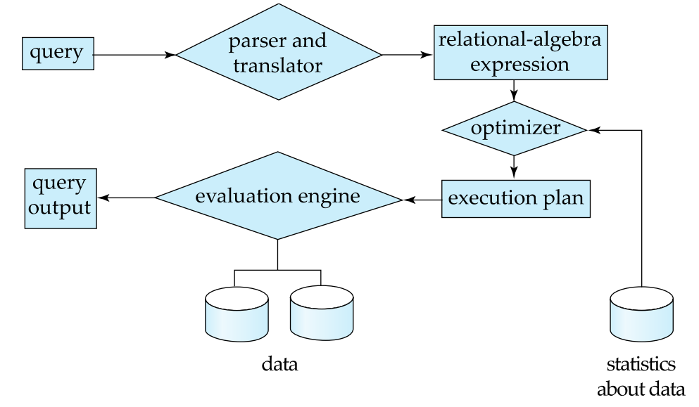
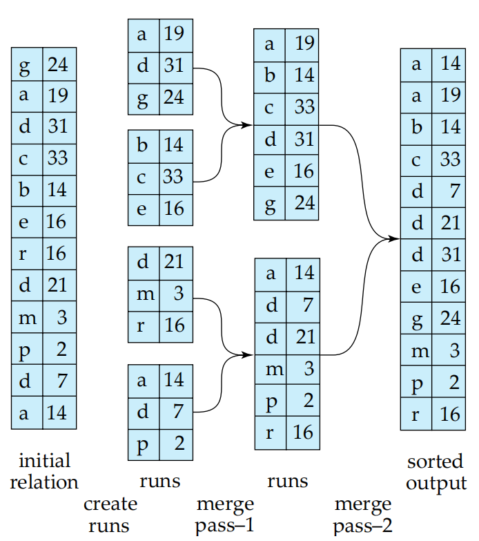
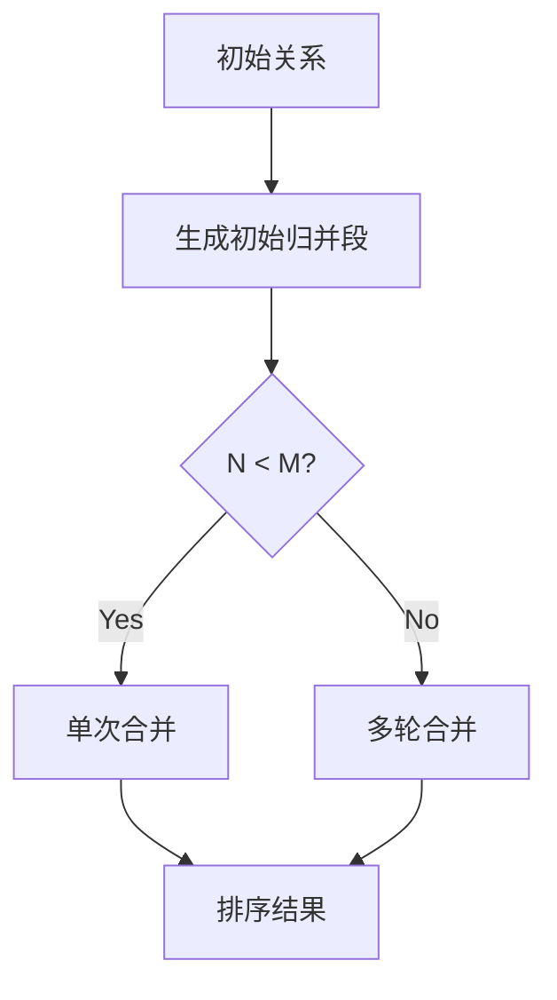
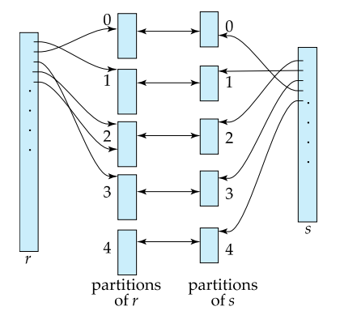
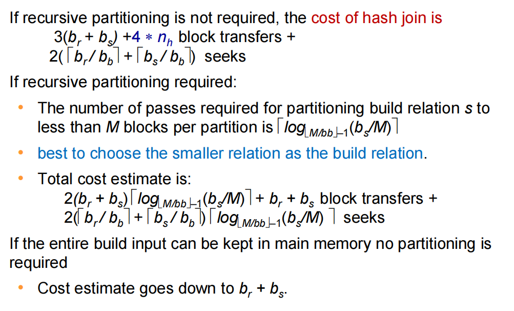
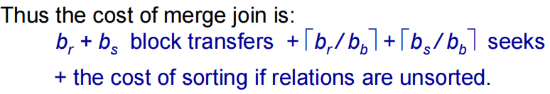
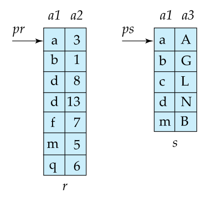
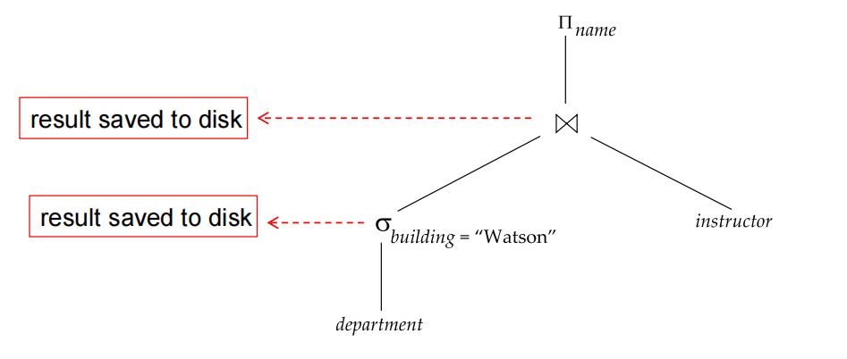

# Lecture 11: Query Processing

> 这一节更像是在教你套公式。

## 一、查询处理基础概念

### 1. 查询处理三大步骤

1. Parsing and translation
2. Optimization
3. Evaluation



1. **解析与翻译**(Parsing and translation)：

      - 将SQL查询转换为关系代数表达式
      - 检查语法和关系存在性
      - 示例：
    
    对于`SELECT * FROM instructor WHERE salary < 75000`，我们有：

    \[\sigma_{\text{salary} < 75000}(\text{instructor})\]

2. **优化**(Optimization)：

      - 生成多个等价执行计划
      - 选择成本最低的计划（基于统计信息）
      - 示例：索引扫描 vs 全表扫描

3. **执行**(Evaluation)：查询执行引擎运行优化后的计划

### 2. 查询代价度量

- **主要因素**：
    
    - 磁盘I/O（块传输次数 + 寻道次数）
    - CPU成本（通常忽略）
    - 网络通信（分布式系统）

- **计算公式**：

\[
T_{\text{总代价}} = b \cdot t_T + S \cdot t_S
\quad \text{其中：}
\begin{aligned}
    &b = \text{传输的块数} \\
    &t_T = \text{传输一个块的时间（HDD: 0.1ms, SSD: 2-10μs）} \\
    &S = \text{寻道次数} \\
    &t_S = \text{单次寻道时间（HDD: 4ms, SSD: 20-90μs）}
\end{aligned}    
\]

## 二、选择操作算法

### 1. 基本方法对比

| 算法 | 条件 | 代价公式 | 适用场景 |
|------|------|----------|----------|
| **A1 线性扫描** | 任意条件 | $ b_r + 1 $ 次寻道 | 无索引/全表扫描 |
| **A2 聚集索引(主键)** | α=val | $(h+1) \cdot (t_T + t_S)$ | 主键等值查询 |
| **A3 聚集索引(非主键)** | α=val | $h(t_T + t_S) + t_S + b \cdot t_T$ | 非唯一值查询 |
| **A4 二级索引** | α=val | $(h+n) \cdot (t_T + t_S)$ | 非聚集索引查询 |

> **关键说明：**
> $h$ = 索引高度（B+树或类似结构）
> 
> $n$ = 匹配记录数
> 
> 二级索引在 $n$ 大时性能可能比线性扫描更差

#### 解析：
- **A1 线性扫描**：此方法适用于没有合适索引的情况，或是需要进行全表扫描的查询。每次访问一个块，并且对于整个关系需要进行 $b_r + 1$ 次寻道。
  
- **A2 聚集索引(主键)**：当对主键进行等值查询时使用。从根节点到叶子节点的过程中，每层需一次磁盘访问，总共 $(h+1)$ 层。每个访问包括传输时间和寻道时间。

- **A3 聚集索引(非主键)**：用于非唯一字段的等值查询。首先通过索引找到匹配的记录位置，这需要 $h$ 层的访问；然后读取实际的数据块，这可能涉及额外的寻道和传输时间。

- **A4 二级索引**：适合于非主键字段上的查询。虽然可以快速定位起始点，但如果存在多个匹配记录（即 $n$ 较大），则每个记录都可能导致新的磁盘访问，增加总代价。

### 2. 复杂选择处理

针对更加复杂的查询条件，如合取（AND）和析取（OR）操作，数据库系统提供了多种优化策略：

- **合取选择(AND)**：
    
    - **A7 使用单个最佳索引+内存过滤**：选择最有效的索引进行初步筛选，然后在内存中进一步过滤满足所有条件的记录。
    - **A8 使用复合索引**：利用包含所有查询条件字段的复合索引来直接获取结果，减少I/O开销。
    - **A9 多索引求交集（需记录指针）**：分别使用不同索引获取符合条件的部分记录集合，再求交集得到最终结果。

- **析取选择(OR)**：
  
    - **A10 多索引求并集（需所有条件有索引）**：通过每个条件对应的索引分别检索出满足条件的记录，最后合并这些结果以获得完整的结果集。

- **PostgreSQL位图索引扫描**：
    
    ```python
    # 伪代码流程
    1. 用索引设置位图（每页1bit）
    2. 只扫描位图标记的页
    # 自适应：在稀疏和密集情况下都表现良好
    ```
    这种技术先为每个使用的索引创建一个位图，其中每一位代表数据页是否满足查询条件。然后，根据逻辑运算符（AND/OR）将这些位图进行相应的组合，最后仅扫描那些被标记的页面。这种方法能够有效减少不必要的I/O操作，特别适合于复杂查询条件下的优化。

## 三、排序算法

### 外部排序-归并排序

当需要对超过内存容量的数据进行排序时，通常使用外部排序方法。其中，最常用的策略是**外部归并排序**。这种方法首先将数据**分割成多个小部分**，每个部分都可以**装入内存中进行独立排序**，然后通过**多次归并**这些已排序的部分来生成最终的有序结果。（这个早在君のC程课里就有了）



#### 过程图示



1. **初始关系**：包含待排序的所有数据。
2. **生成初始归并段**：将原始数据划分为若干个小段，每段大小适合内存处理，并对每个段单独进行排序。
3. **判断是否可以直接合并**：检查当前内存缓冲区是否足够大以容纳所有归并段的一次性合并。
4. **单次合并**：如果内存足够，则直接执行一次合并操作完成排序。
5. **多轮合并**：若内存不足，则需分多轮逐步合并各段，直到所有数据完全有序。
6. **排序结果**：经过上述步骤后得到最终排序好的数据集。

#### 关键参数

- **M** = 内存缓冲区块数，表示可用作排序和归并过程中的内存块数量。
- **b<sub>r</sub>** = 关系块数，指的是整个待排序数据集的总块数。
- **b<sub>b</sub>** = 每个归并段的缓冲区块数，影响每次归并过程中可同时处理的归并段数量。

#### 代价分析

在评估外部归并排序的成本时，主要考虑两个方面：块传输次数和寻道次数。

- **块传输**：
    
    - 公式：$2b_r(\log_{\lfloor M/b_b \rfloor}(b_r/M)+1)$
    - 解释：此公式反映了在整个排序过程中所需进行的数据块读写操作总数。考虑到每一轮归并都会涉及到数据的读取和写出，因此乘以2。
  
- **寻道次数**：
    
    - 公式：$2\lceil b_r/M \rceil + \lceil b_r/b_b \rceil(2\log_{\lfloor M/b_b \rfloor}(b_r/M)-1)$
    - 解释：这个计算包含了从磁盘加载数据到内存以及将排序后的数据写回磁盘所需的磁头移动次数。前一部分与数据的划分有关，后一部分则关联到实际的归并阶段。

通过这种基于分区和归并的方法，即使面对远超内存大小的数据集，也能有效地实现排序任务。值得注意的是，合理选择内存分配方案（如M和b<sub>b</sub>值）对于优化性能至关重要，因为它直接影响了I/O操作的频率和总量。

## 四、连接操作（Join Operations）

连接是关系数据库中最常用的多表操作之一。根据数据分布、索引情况、内存大小等不同条件，数据库系统提供了多种连接算法，每种都有其适用场景与代价特征。

### 1. 算法对比表

| 算法 | 代价公式 | 适用条件 | 特点 |
|------|----------|----------|------|
| **嵌套循环连接 (Nested Loop Join)** | $b_r + n_r \cdot b_s$ | 任意连接 | 内存小时性能差 |
| **块嵌套循环连接 (Block Nested Loop Join)** | $b_r \cdot b_s + b_r$ | 内存有限 | 利用缓冲区优化访问次数 |
| **索引嵌套循环连接 (Index Nested Loop Join)** | $b_r(t_T + t_S) + n_r \cdot c$ | 内表有索引 | 查询效率高，但依赖索引 |
| **归并连接 (Sort-Merge Join)** | $b_r + b_s$ | 表已排序 | 最理想情况下的线性I/O |
| **哈希连接 (Hash Join)** | $3(b_r + b_s)$ | 等值连接 | 大数据量下最优 |

**关键参数说明**：

- $b_r$: 外表所占磁盘块数
- $n_r$: 外表中的元组数
- $b_s$: 内表所占磁盘块数
- $t_T$: 单次块传输时间（transfer time per block）
- $t_S$: 单次寻道时间（seek time per disk access）
- $c$: 使用索引查找单个记录的成本

### 2. 哈希连接（Hash Join）

哈希连接是一种高效的等值连接算法，特别适合大规模数据集。其核心思想是利用哈希函数将两个表的数据分区处理，然后逐个分区进行匹配。

#### 三阶段过程（Three-Phase Process）

1. **分区阶段（Partitioning Phase）**  
      
      - 使用哈希函数 $h_1$ 将两个关系（R 和 S）分别划分成若干个分区（partition），确保每个分区能够装入内存中。
      - 每个分区都写入磁盘，为后续构建和探测做准备。

2. **构建阶段（Build Phase）**  
      
      - 对每个分区内的关系（通常是内表 S）建立内存哈希表（in-memory hash table）。
      - 使用第二个哈希函数 $h_2$ 构建桶结构，用于快速查找匹配元组。

3. **探测阶段（Probe Phase）**  
      
      - 遍历外表（R）的每个分区，使用相同的哈希函数 $h_2$ 在对应的哈希表中查找匹配项。
      - 匹配成功的元组对即为连接结果的一部分。



#### 分区策略

- 如果一次无法将所有分区放入内存，则需要进行**递归分区（Recursive Partitioning）**。
- 当分区数量 $n > M$（M为可用内存块数）时，必须进行多轮分区，划分后细分。

#### 计算分析

分为不递归和递归的情况



!!! example "student ⋈ takes"

    假设我们使用 Hash Join 来计算 `student` 和 `takes` 表的连接，以下是具体的步骤和计算过程：

    - **内存大小**：假设内存可以容纳 20 个块。
    - **表信息**：
        
        - `b_student = 100` 块
        - `b_takes = 400` 块


    **第一步**：分区

    - **`student` 表分区**：将 `student` 表作为构建输入，将其分为五个分区，每个分区大小为 20 个块。这种分区可以在一次扫描中完成。
    - **`takes` 表分区**：同样地，将 `takes` 表分为五个分区，每个分区大小为 80 个块。这也能够在一次扫描中完成。

    **第二步**：总代价计算

    忽略部分填充块的写入成本，总代价计算如下：

    - **块传输次数**：
        
        - 每个分区需要读取和写入两次（一次用于分区，一次用于实际的哈希连接操作）。
        - 因此，总的块传输次数为 \(3 \times (b_{student} + b_{takes})\)。
        - 具体计算为：\(3 \times (100 + 400) = 1500\) 块传输。

    - **寻道次数**：

        - 寻道次数取决于分区的数量和每次分区操作所需的磁盘访问次数。
        - 对于 `student` 表，分区数为 5，每次分区需要访问 \(\lceil \frac{100}{20} \rceil = 5\) 次磁盘。
        - 对于 `takes` 表，分区数同样为 5，每次分区需要访问 \(\lceil \frac{400}{80} \rceil = 5\) 次磁盘。
        - 因此，总的寻道次数为 \(2 \times (\lceil \frac{100}{20} \rceil + \lceil \frac{400}{80} \rceil) = 2 \times (5 + 5) = 20\) 次。

    综上所述，总代价为：

    ```
    Cost = 1500 块传输 + 20 寻道
    ```

#### 混合哈希优化（Hybrid Hash Optimization）

为了减少分区次数和提升性能，可以采用“混合哈希”技术，在内存中保留一个分区以避免写回磁盘。

**示例内存分配方案**

- 分区0（Partition 0）：20块 ← 保留在内存中
- 输入缓冲（Input Buffer）：1块
- 其他分区缓冲：各1块


这样做的好处是减少了 I/O 操作，因为部分数据始终驻留在内存中，无需频繁读写磁盘。

### 3. 归并连接（Sort-Merge Join）

归并连接是一种高效的表连接算法，特别适用于两个已排序的输入表。其基本思想是利用已经排好序的数据来减少比较次数，从而提高连接效率。

#### 适用条件

- **表已排序**：参与连接的两个表需要基于连接键按相同顺序排序。
- **等值连接**：主要适用于等值连接操作。

#### 特点

- 在最理想情况下，归并连接的I/O成本为线性复杂度 \(O(b_r + b_s)\)，其中 \(b_r\) 和 \(b_s\) 分别代表外表和内表的块数。
- 如果数据**未预先排序，则需先对数据进行排序**，这将增加额外的成本。

#### 过程描述

1. **检查排序状态**：首先确认两个表是否已按连接键排序。如果未排序，则需执行排序步骤。
2. **同步扫描**：从两个表的起始位置开始，同时向后读取记录：
   - 如果发现匹配的键值，则输出对应的元组组合。
   - 若一个表的当前记录小于另一个表的记录，则跳过较小的记录继续比较。
3. **处理重复键值**：对于存在多个相同键值的情况，确保所有可能的配对都被正确地识别和输出。

#### 代价分析

归并连接的主要优势在于它能够在一次遍历中完成连接操作，因此在数据量较大但已排序的情况下非常高效。然而，如果需要对数据进行预排序，那么总的代价将会显著增加，包括排序所需的磁盘I/O和CPU时间。

- **块传输**：\(b_r + b_s\)
- **寻道次数**：取决于具体实现细节和硬件特性，但在最佳情况下接近于线性。



其中\(b_b\)是缓冲池的大小，不过这里我们默认整个\(b_b\)都用于分别一前一后实现两块归并，而实际中可能会有分配问题，举个例子说明：

!!! example "bookshelf"

    

    我们假定缓冲池大小为\(M = 3\)块，上图这分别是两个书架上的书对应的表，我们应怎样分配缓冲池给这两个关系，使得我们有最小化归并连接的成本？

    **步骤 1**: 分配缓冲区

    由于缓冲池大小 \(M = 3\)，我们需要决定如何分配这 3 块空间用于处理表 `r` 和表 `s` 的归并过程。对于最优化的归并连接，通常我们会根据每个表的数据块数量来按**大致比例**分配缓冲区（但在这个例子中，因为缓冲池非常小，我这里列出考虑的比较可能的分配方式，并选择导致最低总成本的方式）。

    可能的分配方案：

    - **方案 1**：\(x_r = 2, x_s = 1\)
    - **方案 2**：\(x_r = 1, x_s = 2\)

    **步骤 2**: 计算块传输和寻道次数

    **方案 1**： (\(x_r = 2, x_s = 1\))

    - **块传输**：总共有 \(b_r + b_s = 7 + 5 = 12\) 次块传输。
    - **寻道次数**：
        
        - 对于表 `r`：\(\lceil \frac{b_r}{x_r} \rceil = \lceil \frac{7}{2} \rceil = 4\) 次寻道。
        - 对于表 `s`：\(\lceil \frac{b_s}{x_s} \rceil = \lceil \frac{5}{1} \rceil = 5\) 次寻道。
        - 总计：\(4 + 5 = 9\) 次寻道。

    **方案 2**： (\(x_r = 1, x_s = 2\))

    - **块传输**：同样地，总共有 \(b_r + b_s = 7 + 5 = 12\) 次块传输。
    - **寻道次数**：
        
        - 对于表 `r`：\(\lceil \frac{b_r}{x_r} \rceil = \lceil \frac{7}{1} \rceil = 7\) 次寻道。
        - 对于表 `s`：\(\lceil \frac{b_s}{x_s} \rceil = \lceil \frac{5}{2} \rceil = 3\) 次寻道。
        - 总计：\(7 + 3 = 10\) 次寻道。

    显然，**方案 1**（\(x_r = 2, x_s = 1\)）具有更低的总寻道次数，因此在这种情况下是更优的选择。

    因此在给定缓冲池大小为 3 的条件下，为了最小化归并连接的成本，应将缓冲区分配为：给表 `r` 分配 2 块，给表 `s` 分配 1 块。这样做的总开销为：

    - **块传输**：12 次
    - **寻道次数**：9 次


### 3. 各类连接算法适用场景总结

| 算法 | 是否支持等值连接 | 是否需排序 | 是否需索引 | 适合大数据？ | 特点 |
|------|------------------|------------|------------|---------------|------|
| 嵌套循环 | ✅ | ❌ | ❌ | ❌ | 实现简单，内存小则慢 |
| 块嵌套循环 | ✅ | ❌ | ❌ | ❌ | 缓冲优化，但仍受限 |
| 索引嵌套循环 | ✅ | ❌ | ✅ | ✅ | 依赖索引，查询快 |
| 归并连接 | ✅（仅等值） | ✅ | ❌ | ✅ | 已排序时最优 |
| 哈希连接 | ✅（仅等值） | ❌ | ❌ | ✅✅✅ | 大数据首选 |

## 五、表达式求值（Expression Evaluation）

在数据库系统中，表达式求值是执行查询计划的关键步骤之一。它涉及到如何高效地处理中间结果以及优化数据流的管理方式。下面我们将详细讨论两种主要的求值策略：物化(Materialization)与流水线(Pipelining)，并介绍现代数据库系统中的几种优化技术。

### 1. 物化与流水线的对比

| 方法 | 优点 | 缺点 | 适用场景 |
|------|------|------|----------|
| **物化 (Materialization)** | 实现简单 | 临时存储开销 | 中间结果复用 |
| **流水线 (Pipelining)** | 无I/O开销 | 内存压力大 | 线性操作链 |

#### 简介

- **物化**：指的是将每个操作的结果先写入磁盘或内存中，然后再供后续操作使用。这种方法实现起来相对直接，易于理解和调试，但是会带来额外的I/O和存储成本。
- **流水线**：则是一种更高效的处理方式，它避免了中间结果的显式存储，通过直接传递数据流来减少I/O开销。然而，这种方式可能会增加内存使用的复杂度，并且要求上下游的操作能够很好地协同工作。

### 2. 物化评估（Materialized Evaluation）

**定义：**

- **逐层评估**：从最低级别的操作开始，逐步向上评估每个操作。
- **中间结果物化**：将每个操作的中间结果保存到临时关系（即临时表）中，然后使用这些临时结果来评估更高层次的操作。

听着很抽象，实际上很好懂，请看下面这个例子。

!!! example "\(\sigma_{building=Watson}(department)\)"

    假设我们有以下查询：

    ```sql
    SELECT name FROM (
        SELECT * FROM department WHERE building = 'Watson'
    ) AS temp_dept
    JOIN instructor ON temp_dept.dept_name = instructor.dept_name;
    ```

    **第一步：选择操作**

    首先，执行选择操作 \(\sigma_{building="Watson"}(department)\)，筛选出 `department` 表中 `building` 列值为 "Watson" 的所有行。

    **结果保存到磁盘**：将这个选择操作的结果保存到一个**临时表**中，标记为 `temp_dept`。

    **第二步：连接操作**

    接下来，使用第一步生成的临时表 `temp_dept` 和 `instructor` 表进行连接操作。

    **结果保存到磁盘**：将连接操作的结果也保存到另一个**临时表**中。

    **第三步：投影操作**

    最后，对第二步生成的临时表执行投影操作 \(\Pi_{name}\)，只保留 `name` 列。

    

    这也就是这张图代表的意思了。

### 3. 流水线评估（Pipelined Evaluation）

**定义**：它是数据库查询处理中的一种策略，它允了**许多个操作同时进行**，并将**一个操作的结果直接传递给下一个操作**，而不需要将中间结果存储到磁盘或临时表中。

!!! example "\(\sigma_{building=Watson}(department)\)"

    ```sql
    SELECT name FROM (
        SELECT * FROM department WHERE building = 'Watson'
    ) AS temp_dept
    JOIN instructor ON temp_dept.dept_name = instructor.dept_name;
    ```

    还是刚才的查询语句，如果我们使用流水线的话：

    **第一步：选择操作**

    首先，执行选择操作 \(\sigma_{building="Watson"}(department)\)，筛选出 `department` 表中 `building` 列值为 "Watson" 的所有行。

    **流水线方式**：不将结果保存到磁盘，而是直接将满足条件的元组传递给下一步的连接操作。

    **第二步：连接操作**

    接下来，使用第一步生成的元组与 `instructor` 表进行连接操作。

    **流水线方式**：同样地，不将连接结果保存到磁盘，而是直接将满足连接条件的元组传递给最后的投影操作。

    **第三步：投影操作**

    最后，对第二步生成的元组执行投影操作 \(\Pi_{name}\)，只保留 `name` 列。

**执行方式**

流水线可以以两种方式执行：

- **需求驱动（Demand Driven）**：下游操作请求数据时，上游操作才开始生成数据。
- **生产者驱动（Producer Driven）**：上游操作尽可能快地生成数据，下游操作则按需接收数据。

为了更好地理解流水线的工作机制，这里提供这两种典型的实现模式：

- **需求驱动(拉取) (Demand-driven/Pull Model)**：
    
    ```python
    # 类似迭代器模式
    def next_tuple():
        while True:
            tuple = child.next()
            if not tuple: return None
            processed = do_work(tuple)
            yield processed
    ```
    在这种模式下，下游操作请求上游操作产生下一个元组，类似于消费者从生产者那里拉取消息的过程。

- **生产者驱动(推送) (Producer-driven/Push Model)**：
    
    ```python
    # 数据流驱动
    def receive_tuple(tuple):
        processed = do_work(tuple)
        parent.receive(processed)
    ```
    生产者主动将新生成的数据推送给消费者，减少了等待时间，提高了效率。

这两种模式各有优缺点，在实际应用中需要根据具体情况选择最合适的方案。

### 4. 现代优化技术

随着硬件技术的发展和对性能要求的提高，现代数据库系统引入了许多先进的优化技术来提升表达式求值的效率。

- **查询编译 (Query Compilation)**：将SQL查询或者逻辑计划编译成低级语言（如机器码），利用即时编译器（Just-In-Time Compilation, JIT）等工具来加速执行过程。
  
- **缓存感知算法 (Cache-aware Algorithms)**：
    
    - **排序**：设计算法使得归并段大小尽可能匹配L3缓存大小，从而最大化利用高速缓存，减少缓存未命中率。
    - **哈希连接**：确保子分区的大小适合缓存行大小，以提高查找速度和降低内存访问延迟。

- **向量化处理 (Vectorized Processing)**：采用列式存储结构结合单指令多数据(Single Instruction Multiple Data, SIMD)指令集，可以同时处理多个数据元素，显著提升了计算密集型任务的性能表现。
