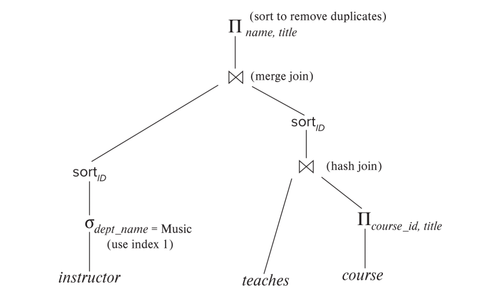
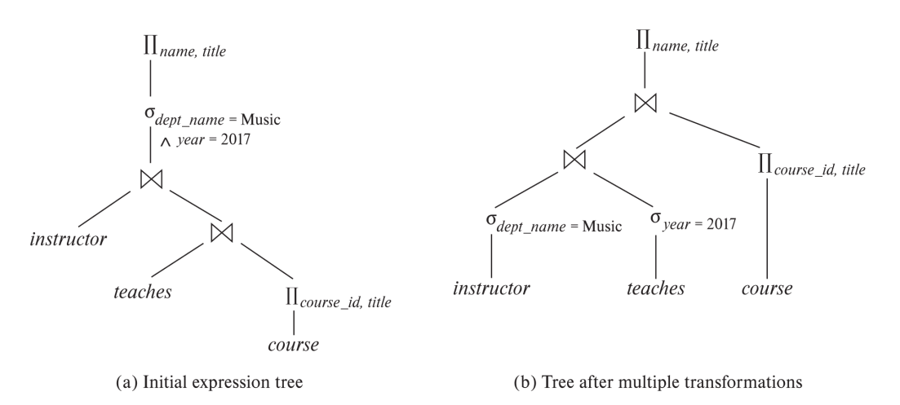

# Lecture 12: Query Optimization

查询优化是关于如何最有效地执行数据库查询的过程。由于一个查询通常有多种执行方式，数据库系统需要选择资源消耗最少的方式，比如时间和内存。这可以显著提升性能，比如将耗时数天的查询缩短到几秒钟。本章参考了苗的PPT，主要分为五个关键部分：引言、关系表达式转换、统计信息估计、评估计划选择和物化视图。

## 一、引言

- **什么是查询优化？**
    - 它是为了在多种查询执行方案中找到最优解。
    - 方案包括不同的关系代数表达式以及各种操作算法（例如，不同的连接方法）。

- **评估计划**
    - 评估计划明确了每个操作使用的算法以及操作的协调方式。
    - 可以通过数据库命令查看这些计划，例如 `EXPLAIN`（语法因数据库而异，例如 Oracle：`EXPLAIN PLAN FOR <query>`，SQL Server：`SET SHOWPLAN_TEXT ON`）。

- **为什么重要？**
    - 不同计划的成本差异可能巨大（例如，s vs. day）。
    - **基于成本的优化步骤**：
        1. 使用等价规则生成逻辑上等价的表达式。
        2. 为这些表达式添加注释，生成备选查询计划。
        3. 根据估计成本选择最便宜的计划。

- **成本估计基础**
    - 依赖于统计数据，例如元组数量、每个属性的唯一值数量，以及中间结果的估计。
    - 使用基于统计的算法成本公式。

- **查看计划**
    - `EXPLAIN ANALYZE`（例如 PostgreSQL）显示实际运行时统计信息和计划。
    - 成本可能以 `f..l` 形式显示（首个元组成本 vs. 总成本）。

## 二、关系表达式转换

### 2.1 表达式等价性

- 两个表达式在任何合法数据库实例上产生相同的元组集合，则称为**等价**（元组顺序无关）。
- 在 SQL 中，处理的是多重集，因此等价意味着产生相同的元组多重集。
- **等价规则**允许我们将表达式重写为可能运行更快的形式。

### 2.2 关键等价规则

以下是一些主要规则（附带示例以便理解）：

1. **合取选择**：

    \[
    \sigma_{\theta_1 \wedge \theta_2}(E) \equiv \sigma_{\theta_1}(\sigma_{\theta_2}(E))
    \]
    
      将复杂条件拆分为多个步骤。

2. **选择操作的交换性**：
    
    \[
    \sigma_{\theta_1}(\sigma_{\theta_2}(E)) \equiv \sigma_{\theta_2}(\sigma_{\theta_1}(E))
    \]
    
      选择操作的顺序无关紧要。

3. **投影简化**：
    
    \[
    \Pi_{L_1}(\Pi_{L_2}(\ldots(\Pi_{L_n}(E))\ldots)) \equiv \Pi_{L_1}(E) \quad \text{其中 } L_1 \subseteq L_2 \ldots \subseteq L_n
    \]

      仅保留最后的投影操作。

4. **选择与连接结合**：

      - a. \(\sigma_\theta(E_1 \times E_2) \equiv E_1 \bowtie_\theta E_2\)
      - b. \(\sigma_{\theta_1}(E_1 \bowtie_{\theta_2} E_2) \equiv E_1 \bowtie_{\theta_1 \wedge \theta_2} E_2\)
      - 将笛卡尔积转为连接或向连接添加条件。

5. **连接的交换性**：
    
    \[
    E_1 \bowtie E_2 \equiv E_2 \bowtie E_1
    \]
      
      可以交换连接顺序。

6. **连接的结合性**：
      - a. \((E_1 \bowtie E_2) \bowtie E_3 \equiv E_1 \bowtie (E_2 \bowtie E_3)\)
      - b. 对于 theta 连接：\((E_1 \bowtie_{\theta_1} E_2) \bowtie_{\theta_2 \wedge \theta_3} E_3 \equiv E_1 \bowtie_{\theta_1 \wedge \theta_3} (E_2 \bowtie_{\theta_2} E_3)\)
      - 允许重新排列连接顺序（theta 连接需调整条件）。

7. **选择分布到连接**：
      - a. \(\sigma_{\theta_0}(E_1 \bowtie E_2) \equiv (\sigma_{\theta_0}(E_1)) \bowtie E_2\) （如果 \(\theta_0\) 仅涉及 \(E_1\)）
      - b. \(\sigma_{\theta_1 \wedge \theta_2}(E_1 \bowtie E_2) \equiv (\sigma_{\theta_1}(E_1)) \bowtie (\sigma_{\theta_2}(E_2))\) （如果 \(\theta_1\) 仅涉及 \(E_1\)，\(\theta_2\) 仅涉及 \(E_2\)）
      - 提前执行选择，减少连接前的关系规模。

8. **投影分布到连接**：
      
      - a. \(\Pi_{L_1 \cup L_2}(E_1 \bowtie_\theta E_2) \equiv \Pi_{L_1}(E_1) \bowtie_\theta \Pi_{L_2}(E_2)\) （如果 \(\theta\) 仅使用 \(L_1 \cup L_2\)）
      - b. 更复杂情况：需要调整投影以包含连接属性。

9.  **集合操作**：
       
       - 并集 (\(\cup\)) 和交集 (\(\cap\)) 具有交换性和结合性。
       - 差集 (\(-\)) 不具有交换性。

10. **选择分布到集合操作**：
        
      - \(\sigma_\theta(E_1 \cup E_2) \equiv \sigma_\theta(E_1) \cup \sigma_\theta(E_2)\)，对 \(\cap\) 和 \(-\) 类似。

11. **投影分布到并集**：
        
      - \(\Pi_L(E_1 \cup E_2) \equiv \Pi_L(E_1) \cup \Pi_L(E_2)\)

12. **聚合与选择**：
        
      - \(\sigma_\theta( {}_G \gamma_A (E) ) \equiv {}_G \gamma_A (\sigma_\theta (E))\) （如果 \(\theta\) 仅涉及 \(G\)）。

13. **外连接规则**：
        
      - 全外连接具有交换性：\(E_1 \bowtie E_2 \equiv E_2 \bowtie E_1\)。
      - 左/右外连接：\(E_1 \bowtie E_2 \equiv E_2 \bowtie E_1\)。
      - 选择可以分布到外连接，前提是条件仅涉及一侧。

### 2.3 转换示例

- **提前执行选择**：
    - 查询：音乐系教师姓名及其课程标题。
    - 原始：\(\Pi_{\text{name, title}}(\sigma_{\text{dept_name} = Music}(instructor \bowtie (teaches \bowtie \Pi_{\text{course_id, title}}(course))))\)
    - 转换后：\(\Pi_{\text{name, title}}((\sigma_{\text{dept_name} = Music}(instructor)) \bowtie (teaches \bowtie \Pi_{\text{course_id, title}}(course)))\)
    - 原因：提前过滤 instructor 表，减少连接规模。

- **多重转换**：
    - 查询：2017 年授课的音乐系教师姓名及课程标题。
    - 原始：\(\Pi_{\text{name, title}}(\sigma_{\text{dept_name} = Music \wedge year = 2017}(instructor \bowtie (teaches \bowtie \Pi_{\text{course_id, title}}(course))))\)
    - 步骤 1（结合性）：\(\Pi_{\text{name, title}}(\sigma_{\text{dept_name} = Music \wedge year = 2017}((instructor \bowtie teaches) \bowtie \Pi_{\text{course_id, title}}(course)))\)
    - 步骤 2（提前选择）：\(\Pi_{\text{name, title}}((\sigma_{\text{dept_name} = Music}(instructor) \bowtie \sigma_{\text{year = 2017}}(teaches)) \bowtie \Pi_{\text{course_id, title}}(course))\)

- **提前执行投影**：
    - 尽早减少属性数量，例如从完整的 instructor 模式投影到仅 `name, course_id`。

- **连接顺序优化**：
    - 对于 \(r_1 \bowtie r_2 \bowtie r_3\)，选择中间结果最小的连接顺序。

### 2.4 生成等价表达式

- **系统化方法**：对所有子表达式反复应用等价规则。
- **优化**：使用动态规划和共享子表达式减少时间/空间成本。

## 三、统计信息估计

### 3.1 目录信息
- \(n_r\)：关系 \(r\) 中的元组数量(多少行),优化器用它来估计操作（如选择或连接）的结果规模。（number of tuples in a relation r）
- \(b_r\)：计算公式(\(b_r = n_r / f_r\))。\(b_r\)表示存储整个表\(r\)需要的块数。（number of blocks containing tuples of r）
- \(l_r\)：每个元组（一行记录）的平均字节大小。（size of a tuple of r）
- \(f_r\)：块因子（每块的元组数）。表示一个磁盘块能存储多少个元组。（the number of tuples of r that fit into one block）
- \(V(A, r)\)：属性 \(A\) 在 \(r\) 中的唯一值数量，表示表 $r$ 中属性 $A$（某列）的不同值的个数。优化器用它估计选择或连接操作的结果规模。例如，查询 `WHERE age = 20` 的结果规模估计为 \(\sigma_{A=v}(r)\)：\(\frac{n_r}{V(A, r)}\)（若 \(A\) 为键，则为 1）。（number of distinct values that appear in r for attribute A; same as 
the size of \(\Pi\)A(r).）

### 3.2 直方图（Histograms）

直方图是数据库用来记录表中某列（属性）数据分布的统计工具。它们比简单的统计信息（如 \(V(A, r)\) 表示唯一值数量）更精细，能帮助查询优化器更准确地估计查询结果的规模，比如 `SELECT * FROM student WHERE age BETWEEN 18 AND 25` 会返回多少行。直方图将属性的值域分成多个区间（bins），记录每个区间的元组数量或频率。

直方图的主要**目的**是帮助优化器估计**选择操作**（如 `WHERE age = 20` 或 `WHERE salary BETWEEN 50k AND 100k`）和**连接操作**的结果规模。它们提供了比平均分布假设更精确的数据分布信息。例如：

- 如果 `student` 表有 10,000 行，`age` 列有 10 个唯一值 (\(V(\text{age}, \text{student}) = 10\))，简单估计 `WHERE age = 20` 的结果是 \(10,000 / 10 = 1,000\) 行。
- 但如果数据分布不均匀（比如 50% 的学生是 18 岁），这种平均假设就不准了。直方图能告诉优化器真实分布。

PPT 强调直方图用于：

- **范围查询**（如 `age BETWEEN 18 AND 25`）。
- **等值查询**（如 `age = 20`）。
- **连接操作**（通过估计连接属性值的分布）。

#### **等宽直方图**：区间范围均等

- **定义**：将属性的值域分成**范围大小相等**的区间，**每个区间宽度相同**。
- **特点**：
    - 区间边界是均匀的，例如对于 `age` 列，值域是 18 到 60，可能分成 4 个区间：
        - `[18, 28.5), [28.5, 39), [39, 49.5), [49.5, 60]`
        - 每个区间宽度 = \((60 - 18) / 4 = 10.5\)。
    - 每个区间记录元组数量，可能分布不均（有的区间可能有很多元组，有的很少）。
- **优点**：
    - 简单，易于构建和理解。
    - 适合数据分布较为均匀的场景。
- **缺点**：如果数据分布倾斜（skewed），某些区间可能包含大量元组，而其他区间几乎为空，导致估计不准。
- **示例**：
    - 假设 `student` 表有 10,000 行，`age` 列值域 [18, 60]，分成 4 个等宽区间：
        - [18, 28.5): 8,000 元组（大部分学生是年轻人）
        - [28.5, 39): 1,500 元组
        - [39, 49.5): 400 元组
        - [49.5, 60]: 100 元组
    - 查询 `WHERE age BETWEEN 18 AND 25`：优化器用 [18, 28.5) 的 8,000 元组，估计比例 \((25 - 18) / (27.5 - 18) \approx 0.74\)，结果约 \(8,000 \times 0.74 \approx 5,920\) 行。

#### **等深直方图**：每个区间包含大致相同的元组数量。

- **定义**：将属性的值域分成元组数量大致相等的区间，每个区间包含几乎相同的元组数。
- **特点**：
    - 区间宽度可能不同，确保每个区间元组数接近（例如，每个区间约 \(n_r / k\) 行，其中 \(k\) 是区间数）。
    - 区间边界根据数据分布动态调整，密集区域区间窄，稀疏区域区间宽。
- **优点**：
    - 更适合数据分布倾斜的场景，能更精确地捕捉数据密集区域。
    - 估计结果更准确，尤其对范围查询。
- **缺点**：构建和维护更复杂，需要排序或采样数据来确定边界。
- **示例**：
    - 仍以 `student` 表 10,000 行为例，`age` 列分成 4 个等深区间，每区间约 \(10,000 / 4 = 2,500\) 元组：
        - [18, 19): 2,500 元组（年轻学生密集）
        - [19, 22): 2,500 元组
        - [22, 30): 2,500 元组
        - [30, 60]: 2,500 元组（年龄较大区域稀疏）
    - 查询 `WHERE age BETWEEN 18 AND 25`：
        - 覆盖 [18, 19)（全包含，2,500 行）、[19, 22)（全包含，2,500 行）、[22, 30) 的部分（估计 \((25 - 22) / (30 - 22) \times 2,500 = 937.5\) 行）。
        - 总估计：\(2,500 + 2,500 + 937.5 \approx 5,937.5\) 行。

#### 如何通过采样来构建与更新统计信息

**为什么要采样与更新**：

- 统计信息基于随机采样计算。也就是说统计信息通常不是通过扫描整个表计算的，而是**基于表的一部分数据（随机采样）**来估计。
- 统计信息可能过时。也就是说，如果表的数据发生变化（例如插入、删除、更新行），之前计算的统计信息可能不再准确。

**更新统计信息的方式**:

- **手动更新**：某些数据库要求用户或管理员通过 `ANALYZE` 命令来更新统计信息。
- 自动更新：某些数据库会自动重新计算统计信息。

### 3.3 选择操作规模估计

#### 3.3.1 等值选择

- \(\sigma_{A=v}(r)\)：\(\frac{n_r}{V(A, r)}\)（若 \(A\) 为键，则为 1）。
- 若 $A$ 是关系 $r$ 的主键（或候选键），则结果规模为 1。

**示例**：假设 `student` 表：

- \(n_r = 10,000\)（10,000 行）。
- \(V(\text{age}, \text{student}) = 10\)（年龄有 10 个不同值，18 到 27 岁）。

查询：`SELECT * FROM student WHERE age = 20`：

- 估计结果规模：\(\frac{n_r}{V(\text{age}, r)} = \frac{10,000}{10} = 1,000\) 行。
- 解释：假设年龄均匀分布，每个年龄（如 20 岁）占 \(\frac{1}{10}\) 的元组，即 1,000 行。

如果查询的是主键：`SELECT * FROM student WHERE id = 12345`。因 \(id\) 是主键，\(V(\text{id}, \text{student}) = n_r = 10,000\)，结果规模为 1 行（主键值唯一）。

#### 3.3.2 范围选择

\(\sigma_{A \leq v}(r)\)：\(c = n_r \cdot \frac{v - \min(A, r)}{\max(A, r) - \min(A, r)}\)（无 min/max 时，假设为 \(n_r/2\)）。

**含义**：

- 这个公式估计查询 `WHERE A <= v`（例如，`WHERE salary <= 50000`）会返回多少行。
- **\(\min(A, r)\)、\(\max(A, r)\)**：属性 \(A\) 的最小值和最大值（从目录信息或直方图获取）。
- **\(\frac{v - \min(A, r)}{\max(A, r) - \min(A, r)}\)**：表示值 \(v\) 在 \(A\) 值域中的相对位置，假设值均匀分布。
- 如果无法获取 \(\min\) 或 \(\max\)（例如，目录信息缺失），保守估计结果为表的一半（\(\frac{n_r}{2}\)）。
  
**示例**：假设 `employee` 表：

- \(n_r = 100,000\)（100,000 行）。
- \(V(\text{salary}, \text{employee}) = 1,000\)（薪资有 1,000 个不同值）。
- \(\min(\text{salary}, \text{employee}) = 30,000\)，\(\max(\text{salary}, \text{employee}) = 200,000\)。

查询：`SELECT * FROM employee WHERE salary <= 50,000`

- 计算比例：

    \[
    \frac{v - \min(\text{salary}, r)}{\max(\text{salary}, r) - \min(\text{salary}, r)} = \frac{50,000 - 30,000}{200,000 - 30,000} = \frac{20,000}{170,000} \approx 0.1176
    \]

- 估计结果规模：

    \[
    c = n_r \cdot 0.1176 = 100,000 \cdot 0.1176 \approx 11,760 \text{ 行}
    \]

如果 \(\min\) 和 \(\max\) 未知：假设结果为 \(\frac{n_r}{2} = \frac{100,000}{2} = 50,000\) 行（保守估计）。

### 3.4 复杂选择的估计

#### 1. 选择性的定义
- **定义**：
    - 选择性（Selectivity）是指一个元组（行）满足条件 \(\theta_i\) 的概率。
    - 例如，对于查询 `SELECT * FROM r WHERE age = 20`，选择性是表 \(r\) 中满足 `age = 20` 的元组占总元组的比例。

- **计算**：
    - 如果 \(s_i\) 是满足条件 \(\theta_i\) 的元组数，\(n_r\) 是关系 \(r\) 的总元组数（3.1 节的 \(n_r\)），则选择性为：
      \[
      s_i / n_r
      \]
    - 例如，\(n_r = 10,000\)，\(s_i = 1,000\)（满足 `age = 20` 的行数），选择性 = \(1,000 / 10,000 = 0.1\)（10%）。

#### 2. 合取（Conjunction）：\(\sigma_{\theta_1 \wedge \theta_2 \ldots \wedge \theta_n}(r)\)
- **定义**：
    - 合取表示多个条件同时满足，例如 `WHERE age = 20 AND dept = 'CS'`。
    - 假设条件 \(\theta_1, \theta_2, \ldots, \theta_n\) 之间**相互独立**（Independence），即一个条件的满足不影响另一个条件。

- **估计公式**：
    - 结果元组数的估计为：
      
        \[
        n_r \cdot \frac{s_1}{n_r} \cdot \frac{s_2}{n_r} \cdot \ldots \cdot \frac{s_n}{n_r}
        \]

    - 简化后：
      
        \[
        n_r \cdot \frac{s_1 \cdot s_2 \cdot \ldots \cdot s_n}{n_r^n}
        \]
        
    - 其中：
        - \(n_r\)：关系 \(r\) 的总元组数。
        - \(s_i\)：满足条件 \(\theta_i\) 的元组数。
        - \(\frac{s_i}{n_r}\)：每个条件的选择性。

- **通俗解释**：
    - 假设每个条件的满足是独立的，总体概率是各条件概率的乘积。
    - 例如，`age = 20` 的选择性是 0.1，`dept = 'CS'` 的选择性是 0.2，总选择性 = \(0.1 \cdot 0.2 = 0.02\)，估计元组数 = \(n_r \cdot 0.02\)。

- **示例**：
    - `student` 表：\(n_r = 10,000\)。
    - 条件 1：`age = 20`，\(s_1 = 1,000\)，选择性 = \(1,000 / 10,000 = 0.1\)。
    - 条件 2：`dept = 'CS'`，\(s_2 = 2,000\)，选择性 = \(2,000 / 10,000 = 0.2\)。
    - 合取：\(n_r \cdot \frac{s_1 \cdot s_2}{n_r^2} = 10,000 \cdot \frac{1,000 \cdot 2,000}{10,000^2} = 10,000 \cdot \frac{2,000,000}{100,000,000} = 10,000 \cdot 0.02 = 200\) 行。

#### 3. 析取（Disjunction）：\(\sigma_{\theta_1 \vee \theta_2 \ldots \vee \theta_n}(r)\)
- **定义**：
    - 析取表示条件中至少一个满足，例如 `WHERE age = 20 OR dept = 'CS'`。
    - 同样假设条件相互独立。

- **估计公式**：
    - 结果元组数的估计为：
      
        \[
        n_r \cdot \left[1 - \left(1 - \frac{s_1}{n_r}\right) \cdot \left(1 - \frac{s_2}{n_r}\right) \cdot \ldots \cdot \left(1 - \frac{s_n}{n_r}\right)\right]
        \]

    - 其中：
        - \(1 - \frac{s_i}{n_r}\)：不满足条件 \(\theta_i\) 的概率。
        - 乘积：所有条件都不满足的联合概率。
        - \(1 -\) 乘积：至少一个条件满足的概率。

- **通俗解释**：
    - 计算每个条件不满足的概率，取反后乘以总行数，得到至少一个条件满足的行数。
    - 例如，`age = 20` 不满足概率 0.9，`dept = 'CS'` 不满足概率 0.8，联合不满足概率 = \(0.9 \cdot 0.8 = 0.72\)，满足概率 = \(1 - 0.72 = 0.28\)，估计行数 = \(n_r \cdot 0.28\)。

- **示例**：
    - `student` 表：\(n_r = 10,000\)。
    - 条件 1：`age = 20`，\(s_1 = 1,000\)，选择性 = \(0.1\)，不满足概率 = \(1 - 0.1 = 0.9\)。
    - 条件 2：`dept = 'CS'`，\(s_2 = 2,000\)，选择性 = \(0.2\)，不满足概率 = \(1 - 0.2 = 0.8\)。
    - 析取：
      
        \[
        10,000 \cdot \left[1 - (1 - 0.1) \cdot (1 - 0.2)\right] = 10,000 \cdot [1 - 0.9 \cdot 0.8] = 10,000 \cdot [1 - 0.72] = 10,000 \cdot 0.28 = 2,800 \text{ 行}
        \]

#### 4. 否定（Negation）：\(\sigma_{\neg \theta}(r)\)
- **定义**：
  - 否定表示不满足条件 \(\theta\)，例如 `WHERE NOT (age = 20)`。

- **估计公式**：
    - 结果元组数的估计为：
      
        \[
        n_r - \text{size}(\sigma_\theta(r))
        \]
      
    - 其中 \(\text{size}(\sigma_\theta(r))\) 是满足 \(\theta\) 的元组数。

- **通俗解释**：
    - 总行数减去满足条件的行数，就是不满足的行数。
    - 例如，`age = 20` 返回 1,000 行，则 `NOT (age = 20)` 返回 \(10,000 - 1,000 = 9,000\) 行。

- **示例**：
    - `student` 表：\(n_r = 10,000\)。
    - 条件：`age = 20`，\(\sigma_{\text{age}=20}(r) = 1,000\) 行。
    - 否定：\(10,000 - 1,000 = 9,000\) 行。

### 3.4 连接操作规模估计

估计方法根据连接属性的性质分为三种情况。

假设 `student` 和 `takes` 表的目录信息为 `student`（\(n_{\text{student}} = 5,000\)、\(V(\text{ID}, \text{student}) = 5,000\) 主键）、`takes`（\(n_{\text{takes}} = 10,000\)、\(V(\text{ID}, \text{takes}) = 2,500\) 外键），以下展开说明。

- 若连接属性是键，规则适用时结果规模等于另一关系元组数。

!!! example "`student ⋈ takes` (按 `ID` 连接)"
    
    - **场景**：
        - `student` 表有 5,000 名学生，每个有唯一 `ID`（主键）。
        - `takes` 表记录 10,000 门选课，每行有 `ID` 列（外键，引用 `student.ID`）。
        - 假设数据：
            - 学生 1-5,000 各有 `ID` 从 1 到 5,000。
            - `takes` 表中有 2,500 个学生选课（\(V(\text{ID}, \text{takes}) = 2,500\)），每个学生平均选 4 门课（\(10,000 / 2,500 = 4\)）。
            - 例如，学生 1 选了课程 A、B、C、D（4 行），学生 2 也选了 4 门，依此类推。

    - **连接过程**：
        - 连接条件：`student.ID = takes.ID`。
        - 每行 `takes`（例如，学生 1 选课 A）匹配 `student` 表中对应的学生 1。
        - 因为 `student.ID` 是主键，每行 `takes` 唯一匹配一个 `student`，结果行数 = `takes` 的行数。

    - **计算**：
        - 结果规模 = \(n_{\text{takes}} = 10,000\)。
        - 验证：PPT 运行示例也给出 `student \bowtie takes = 10,000`。

    - **直观想象**：
        - 想象 5,000 个学生，2,500 个选课，每人平均 4 门课，总共 10,000 条选课记录。
        - 连接后，每条选课记录（10,000 行）都找到对应的学生，生成 10,000 行结果。

    - **优化器如何用**：知道结果是 10,000 行（`takes` 表大小），优化器可能选择 `takes` 作为外层表，用索引扫描 `student`（内层），减少 I/O。

- 若为外键，规则适用时结果规模等于引用关系元组数。
    
!!! example "`student ⋈ takes` (按 `ID` 连接，强调外键)"
    
    - **场景**（与例子 1 相同）：
        - `student.ID` 是主键（5,000 唯一值）。
        - `takes.ID` 是外键（2,500 唯一值，10,000 行）。
        - 数据：学生 1-2,500 选课，平均每人 4 门，总 10,000 行。

    - **连接过程**：
        - 外键 `takes.ID` 引用 `student.ID`，确保每行 `takes` 都能找到匹配的 `student`。
        - 例如，学生 1 的 4 门课（4 行 `takes`）都匹配学生 1 的 1 行 `student`。
        - 结果是 `takes` 表的每一行（10,000 行）生成一个匹配。

    - **计算**：
        - 结果规模 = \(n_{\text{takes}} = 10,000\)。
        - PPT 明确：`student \bowtie takes = 10,000`，与外键规则一致。

    - **直观想象**：
        - 想象 10,000 张选课单（`takes`），每张单上有学生 ID。
        - 查学生表（`student`），每张单都能找到对应学生，生成 10,000 行结果。

    - **与“键情况”的区别**：
        - “键情况”从主键表（`student`）角度看，结果 = \(n_{\text{takes}}\)。
        - “外键情况”从引用表（`takes`）角度看，结果 = \(n_{\text{takes}}\)。
        - 这里两者一致，因 `ID` 同时满足键和外键条件。

    - **优化器如何用**：估计 10,000 行，优化器可能用 `takes` 驱动连接，索引 `student.ID`。

- 否则，若连接属性既非主键也非外键，结果规模估计为 \(\frac{n_r \cdot n_s}{\max(V(A, r), V(A, s))}\)。

!!! example "`student ⋈ takes` (按 `dept_name` 连接)"
    
    - **场景**：
        - 假设 `student` 和 `takes` 都有 `dept_name` 列（不是键或外键），表示学生或课程所属系。
        - 数据：
            - `student`：5,000 行，\(V(\text{dept_name}, \text{student}) = 10\)（10 个系）。
            - `takes`：10,000 行，\(V(\text{dept_name}, \text{takes}) = 8\)（8 个系有课程）。
            - 假设每个系的学生和课程分布均匀。

    - **连接过程**：
        - 连接条件：`student.dept_name = takes.dept_name`。
        - 例如，`dept_name = 'CS'` 的学生（500 人，假设均匀分布 \(5,000 / 10\)) 匹配 `dept_name = 'CS'` 的课程（1,250 门，\(10,000 / 8\)）。
        - 每对匹配生成一行，结果依赖 \(V(\text{dept_name})\) 限制重复。

    - **计算**：
        - \(\max(V(\text{dept_name}, \text{student}), V(\text{dept_name}, \text{takes})) = \max(10, 8) = 10\).
        - 估计规模：
            
            \[
            \frac{n_{\text{student}} \cdot n_{\text{takes}}}{\max(V(\text{dept_name}, \text{student}), V(\text{dept_name}, \text{takes}))} = \frac{5,000 \cdot 10,000}{10} = \frac{50,000,000}{10} = 5,000 \text{ 行}
            \]

    - **优化器如何用**：估计 5,000 行，优化器可能用哈希连接，先处理 `student`（较小表）。

!!! example "不同数据（非均匀分布）"
    
    - **场景**：
        - `dept1` 表：\(n_{\text{dept1}} = 1,000\)、\(V(\text{city}, \text{dept1}) = 5\).
        - `dept2` 表：\(n_{\text{dept2}} = 2,000\)、\(V(\text{city}, \text{dept2}) = 4\).
        - 按 `city` 连接。

    - **计算**：
        - \(\max(V(\text{city}, \text{dept1}), V(\text{city}, \text{dept2})) = \max(5, 4) = 5\).
        - 估计规模：
            
            \[
            \frac{1,000 \cdot 2,000}{5} = \frac{2,000,000}{5} = 400 \text{ 行}
            \]

### 3.5 其他操作

- **投影**：\(\Pi_A(r) = V(A, r)\)。
- **聚合**：\({}_G \gamma_A(r) = V(G, r)\)。
- **集合操作**：并集 = 总和，交集 = 最小值，差集 = 第一个关系规模。

## 四、评估计划选择

### 4.1 基于成本的优化
- 考虑操作之间的相互影响（例如，合并连接可能为后续排序操作提供便利）。
- **动态规划**：只计算一次子集的最佳计划，并重复使用。

### 4.2 连接顺序优化
- 连接顺序数量巨大（例如，7 个关系有 665,280 种顺序）。
- 左深树将复杂度降至 \(O(n 2^n)\)。

### 4.3 有趣的排序顺序
- 排序输出（例如，来自合并连接）可降低后续操作成本。

### 4.4 启发式优化

规则：尽早执行选择和投影，优先处理限制性最强的操作。

## 五、物化视图

物化视图是数据库中一种特殊的视图，其查询结果被计算并物理存储在磁盘上，而非像普通视图那样仅逻辑定义。这种存储特性使得物化视图在优化查询性能和支持复杂数据分析时非常有用。本节从定义、维护、查询优化和视图选择四个方面探讨物化视图的核心内容，帮助我们理解其在数据库系统中的作用和实现机制。

### 5.1 定义

物化视图是将视图的查询结果持久化存储的数据库对象。例如，一个名为 `department_total_salary` 的物化视图可能存储每个部门的总薪资，基于查询 `SELECT dept_name, SUM(salary) FROM instructor GROUP BY dept_name`。与普通视图不同，物化视图占用实际存储空间，其数据可以直接访问，无需每次重新计算。这使得它特别适合频繁执行的复杂查询或需要快速响应的场景，如数据仓库中的报表生成。

物化视图的创建通常通过数据库特定的命令完成，例如在 PostgreSQL 中使用 `CREATE MATERIALIZED VIEW`。它们可以像普通表一样被索引，进一步提升查询效率。然而，由于存储的是快照数据，物化视图需要定期维护以反映基表的变化。

### 5.2 维护

物化视图的维护是确保其数据与基表保持一致的关键过程。维护方式主要分为全量刷新和增量维护两种。

全量刷新会重新执行视图的定义查询，替换现有数据，适合数据变化较少或对一致性要求不高的场景。然而，这种方式对于大数据量可能成本较高。

**增量维护**是更高效的方法，仅根据基表的插入、删除或更新操作来调整视图内容。例如：

* 对于连接视图 \(v = r \bowtie s\)，若 \(r\) 中插入新元组 \(i_r\)，则新视图为 \(v^{\text{new}} = v^{\text{old}} \cup (i_r \bowtie s)\)。
* 对于选择视图 \(v = \sigma_\theta(r)\)，插入 \(i_r\) 后，视图更新为 \(v^{\text{new}} = v^{\text{old}} \cup \sigma_\theta(i_r)\)。
* 对于投影视图 \(v = \Pi_A(r)\)，需要跟踪元组计数以处理重复值，例如插入元组时检查是否为新值，删除时更新计数。

增量维护依赖于基表的变更日志（delta），数据库系统通过分析这些变更计算对视图的最小更新。这种方式显著减少了计算和I/O开销，尤其适合频繁更新的环境。实际实现中，数据库可能提供自动刷新机制（如 PostgreSQL 的 `REFRESH MATERIALIZED VIEW`），或通过触发器实现增量更新。

### 5.3 查询优化

物化视图可以作为预计算的中间结果，加速查询执行，数据库的查询优化器会尝试重写用户查询以利用物化视图。例如，若查询需要每个部门的总薪资，而 `department_total_salary` 物化视图已存在，优化器可能直接从视图读取数据，而非重新计算 `instructor` 表的聚合。

然而，重写并非总是最佳选择。若基表上有高效索引，或者查询只需要部分数据，优化器可能选择展开视图（即直接查询基表）。例如，若查询仅需某个部门的薪资总和，且 `instructor` 表上有 `dept_name` 的索引，直接扫描基表可能比全表扫描物化视图更快。优化器会根据成本估计（结合统计信息和索引可用性）决定使用视图还是基表。

查询重写的实现需要视图定义与查询的语义匹配。例如，视图的谓词（如 \(\sigma_{\text{dept_name} = 'Music'}\)）必须包含查询的谓词。这种匹配过程依赖于等价规则和模式匹配技术，确保重写后的查询结果正确。

### 5.4 视图选择

选择合适的物化视图是数据库设计中的一项复杂任务，需根据查询工作负载、存储空间和维护成本进行权衡。视图选择的目标是最大化查询性能，同时最小化存储和维护开销。

数据库管理员需要分析常见查询模式，识别哪些查询可以从物化视图中受益。例如，频繁的聚合查询（如部门薪资统计）是物化视图的理想候选，而很少使用的查询则不值得创建视图。选择时需考虑：

* **查询频率**：高频查询优先。
* **数据规模**：视图存储成本与基表相比是否合理。
* **更新频率**：基表更新频繁可能导致维护开销过高。
* **空间约束**：数据库的存储容量限制。

现代数据库可能提供自动视图选择工具，基于历史查询日志推荐物化视图。例如，SQL Server 的数据库调优顾问可以分析工作负载并建议视图和索引。最终，视图选择需要在查询速度、存储空间和维护成本之间找到平衡点。
