# Lecture 13: Transactions

## 一、事务概念 (Transaction Concept)

### 1.1 事务定义
- **事务** 是一组程序执行单元，涉及对数据库中多个数据项的访问和可能的更新。
- **示例**：从账户 A 转账 50 美元到账户 B：
  ```plaintext
  1. read(A)
  2. A := A - 50
  3. write(A)
  4. read(B)
  5. B := B + 50
  6. write(B)
  ```
- **关键问题**：
    - **故障**：如硬件故障或系统崩溃。
    - **并发执行**：多个事务同时运行可能导致数据不一致。

### 1.2 ACID 属性
数据库系统必须保证事务的以下属性以维护数据完整性：

- **原子性 (Atomicity)**：
    - 事务的所有操作要么全部执行，要么全部不执行。
    - 示例：若转账事务在第 3 步后崩溃，A 减少了 50 美元但 B 未增加，系统需回滚以避免“钱丢失”。
- **一致性 (Consistency)**：
    - 事务执行前后，数据库保持一致状态。
    - 示例：A 和 B 的总和在转账前后应保持不变。
    - 包括显式约束（如主键、外键）和隐式约束（如账户余额总和等于现金持有量）。
- **隔离性 (Isolation)**：
    - 并发执行的事务互不干扰，中间结果对其他事务不可见。
    - 示例：若另一事务在第 3 步后读取 A 和 B，会看到不一致的总和（减少了 50 美元）。
- **持久性 (Durability)**：
    - 事务成功提交后，其更改永久保存，即使发生系统故障。
    - 示例：转账完成后，即使系统崩溃，A 和 B 的新余额必须保留。

### 1.3 事务执行中的问题
- **原子性问题**：部分执行的事务更新不应反映到数据库。
- **隔离性问题**：并发执行可能导致中间状态可见。
- **一致性问题**：错误的事务逻辑可能破坏数据库一致性。

## 二、并发执行 (Concurrent Executions)

### 2.1 并发执行的优势
- **提高资源利用率**：一个事务用 CPU 时，另一个可访问磁盘。
- **缩短响应时间**：短事务无需等待长事务完成。
- **提高吞吐量**：单位时间内处理更多事务。

### 2.2 并发控制
- **并发控制机制**：确保隔离性，防止数据不一致。
- 具体方案将在后续章节详细讨论。

### 2.3 并发异常
并发执行若无控制，可能导致以下问题：

- **丢失更新 (Lost Update)**：

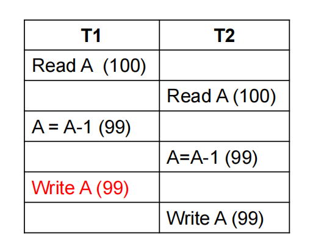

结果：A = 99，但应为 98（两次减 1 只生效一次）

- **脏读 (Dirty Read)**：
  
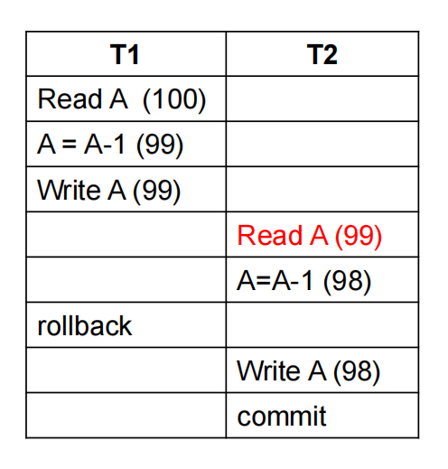

T2 读取了 T1 未提交的数据，若 T1 回滚，T2 使用了错误值。

- **不可重复读 (Unrepeatable Read)**：

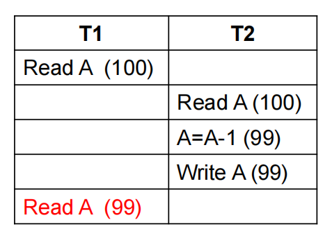

T1 两次读取 A，值不同。

- **幻读 (Phantom Problem)**：

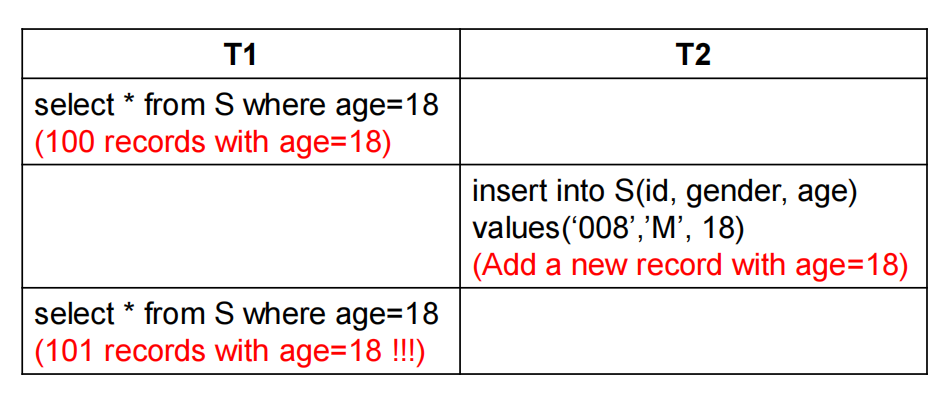

T1 两次查询结果记录数不同，因 T2 插入了新记录。

## 三、串行化 (Serializability)

### 3.1 调度 (Schedule)
- **调度**：指定并发事务指令执行顺序的序列。
- **串行调度**：事务按顺序逐一执行，无并发。
- **要求**：
    - 包含所有事务的所有指令。
    - 保持每个事务内部指令顺序。
- **事务结束**：
    - 成功：以 `commit` 结束。
    - 失败：以 `abort` 结束。

### 3.2 串行化定义
- **串行化**：一个（可能是并发的）调度如果等价于某个串行调度，则称其为可串行化的；一个调度等价于某个串行调度。
- **假设**：每个事务单独执行时保持数据库一致性。
- **类型**：
    - **冲突串行化 (Conflict Serializability)**。
    - **视图串行化 (View Serializability)**。

### 3.3 示例调度

- **Schedule 1 (串行调度 T1 → T2)**：

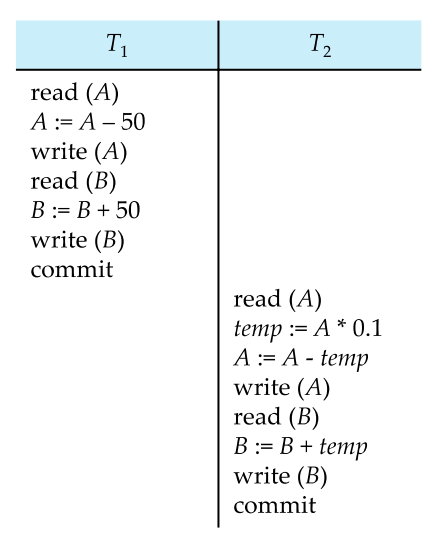

- **Schedule 3 (并发但串行化)**：

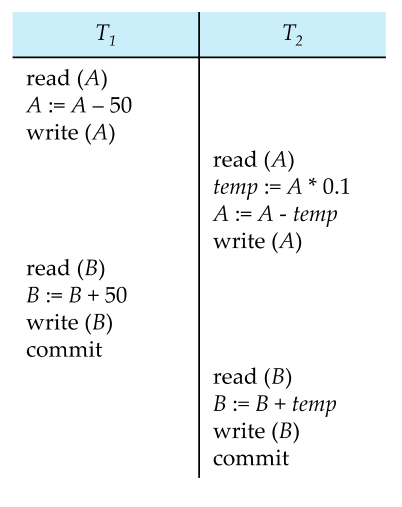

### 3.4 冲突串行化 (Conflict Serializability)

#### 3.4.1 定义
- **冲突串行化**是指一个调度（schedule）可以通过交换非冲突指令，转换为某个串行调度（serial schedule，即事务按顺序逐一执行的调度），且保持冲突操作的顺序不变。
- **冲突指令**：两个指令冲突，当且仅当：
  - 它们来自不同事务。
  - 访问同一数据项（如变量 Q）。
  - 至少一个是写操作。
  - **冲突类型**：
    1. `read(Q)` vs `read(Q)`：**不冲突**，因为读操作不修改数据。
    2. `read(Q)` vs `write(Q)`：**冲突**，写操作可能改变读到的值。
    3. `write(Q)` vs `read(Q)`：**冲突**，读操作依赖于写操作的结果。
    4. `write(Q)` vs `write(Q)`：**冲突**，后一个写操作会覆盖前一个。

#### 3.4.2 冲突等价
- **冲突等价**：如果调度 S 可以通过一系列非冲突指令的交换，转换为调度 S'，则 S 和 S' 是冲突等价的。
- **关键点**：交换非冲突指令不会改变事务的结果，因为非冲突指令的执行顺序无关紧要。
- **目标**：通过交换，将并发调度转换为某个串行调度（如 T1 → T2 或 T2 → T1）。

#### 3.4.3 示例分析
考虑以下调度（Schedule 3）：

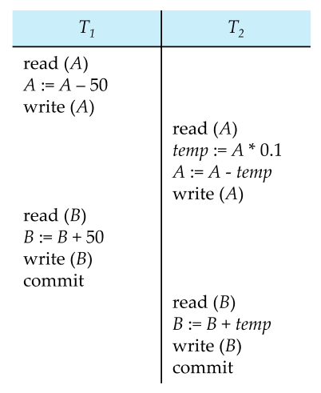

**分析**：

- 冲突操作：
    
    - T1 的 `write(A)` 和 T2 的 `read(A)`：冲突，因为 T1 先写 A，T2 后读 A，顺序不可交换。
    - T1 的 `write(B)` 和 T2 的 `read(B)`：冲突，T1 先写 B，T2 后读 B。

- 尝试交换非冲突指令：
    
    - 可以将 T2 的 `read(A), temp := A * 0.1, write(A)` 整体移到 T1 的 `write(A)` 之前，因为这些指令与 T1 的 `read(B), B := B + 50, write(B)` 不冲突（操作不同数据项 A 和 B）。
    - 类似地，T2 的 `read(B), B := B + temp, write(B)` 可移到 T1 的 `write(B)` 之前。

- **结果**：通过交换，Schedule 3 可转换为串行调度 T1 → T2：
    ```plaintext
    T1: read(A), A := A - 50, write(A), read(B), B := B + 50, write(B)
    T2: read(A), temp := A * 0.1, A := A - temp, write(A), read(B), B := B + temp, write(B)
    ```


- **结论**：Schedule 3 是冲突串行化的，等价于串行调度 T1 → T2。

#### 3.4.4 前趋图测试
- **前趋图**：用于测试冲突串行化。
    - 节点：每个事务（如 T1, T2）。
    - 边：若 T_i 的操作先于 T_j 的冲突操作**访问**同一数据项，则有边 T_i → T_j。
    - **无环**：调度是冲突串行化的。
    - **有环**：调度非冲突串行化。
- **示例前趋图**（基于 Schedule 3）：
    
    ```mermaid
    graph TD
        T1 --> T2
    ```

T1 的 `write(A)` 先于 T2 的 `read(A)`，T1 的 `write(B)` 先于 T2 的 `read(B)`，故 T1 → T2，无环，确认冲突串行化。

#### 3.4.5 图表示例

以下是一个更复杂的调度：

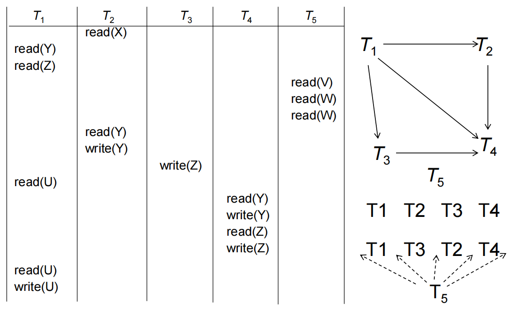

**结论**：有环，调度不是冲突串行化的。

### 3.5 视图串行化 (View Serializability)

#### 3.5.1 定义
- **视图串行化**：一个调度 S 是视图串行化的，如果它与某个串行调度 S' **视图等价**，即两者的执行结果在以下方面相同：
    1. **初始读**：每个数据项的**首次读取**来自同一事务。
    2. **读写依赖**：每个**读操作读取的写操作**来源相同。
    3. **最终写**：每个数据项的**最后写**操作由同一事务完成。
- **特点**：
    - 视图串行化比冲突串行化更宽松，包含所有冲突串行化调度。
    - 允许“盲写”（blind write），即事务不读取直接写入。


#### 3.5.2 视图等价示例
考虑以下调度：

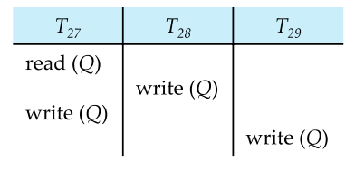

- 构建前趋图：
    - 若 \(T_i\) 的操作先于\(T_j\) 的冲突操作访问 Q，则有边 \(T_i\) → \(T_j\)。
    - `T27: read(Q)` → `T28: write(Q)`（T27 先读，T28 后写）。
    - `T28: write(Q)` → `T27: write(Q)`（T28 先写，T27 后写）。
    - `T27: write(Q)` → `T29: write(Q)`（T27 先写，T29 后写）。
- 前趋图：

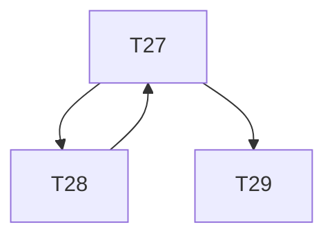

**结果**：存在环（T27 → T28 → T27），说明调度可能**非冲突串行化**。

#### 3.5.3 视图串行化的意义

- **优势**：允许更多并发调度，尤其是包含盲写的场景。
- **缺点**：测试视图串行化是 NP 完全问题，计算复杂，实际数据库中较少直接使用。
- **关系**：所有冲突串行化调度都是视图串行化的，但反之不一定。

## 四、测试串行化 (Testing for Serializability)

我们一般用前趋图来测试

### 4.2 冲突串行化测试

- **条件**：前趋图**无环**。
- **算法**：循环检测，复杂度 O(n²) 或 O(n+e)。
- **结果**：若无环，可通过拓扑排序得到串行顺序，如 T5 → T1 → T4。

### 4.3 视图串行化测试

- **复杂度**：NP 完全问题，无高效算法。
- **方法**：检查充分条件即可。

## 五、可恢复性 (Recoverability)

### 5.1 可恢复调度

**定义**：若 \(T_j\) 读取 \(T_i\) 写入的数据，则 \(T_i\) 须在 \(T_j\) 提交前提交。

**不可恢复示例**：

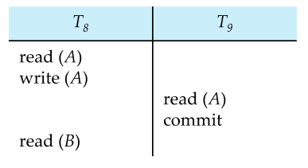

如果事务T8需要中止，即便 T8 回滚后，T9 已提交，无法恢复。

### 5.2 级联回滚 (Cascading Rollbacks)

#### 5.2.1 定义
- **级联回滚**是指当一个事务（例如 \(T_i\)）失败并回滚（abort）时，因其他事务（例如 \(T_j\)）读取了 \(T_i\) 的未提交数据（脏数据），这些依赖事务也必须回滚，形成连锁反应。
- **原因**：事务间未提交数据的依赖性破坏了数据库的一致性。
- **影响**：级联回滚可能导致大量事务回滚，增加系统开销并延长恢复时间。

#### 5.2.2 机制
- 当事务 \(T_i\) 回滚时，数据库系统需检查哪些事务读取了 \(T_i\) 的未提交写操作。
- 如果 \(T_j\) 读取了 \(T_i\) 的数据，且 \(T_i\) 回滚，\(T_j\) 的结果可能基于无效数据，因此 \(T_j\) 也需回滚。
- 该过程可能进一步触发更多事务的回滚，形成“级联”效应。

#### 5.2.3 示例分析
考虑以下调度：

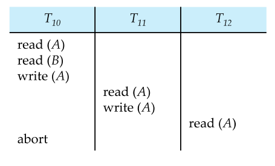

- **操作分析**：
    - T10：`read(A), write(A)`，将 A 的值写入（未提交）。
    - T11：`read(A)` 读取 T10 的未提交值，`write(A)` 基于此值更新 A。
    - T12：`read(A)` 读取 T11 的未提交值。
    - T10 发生 `abort`，因故障或错误回滚，A 的更改被撤销。
- **级联回滚过程**：
    - T10 回滚，A 恢复到 T10 读入前的值。
    - T11 读取了 T10 的未提交 `write(A)`，其结果无效，T11 必须回滚。
    - T12 读取了 T11 的未提交 `write(A)`，其结果也无效，T12 必须回滚。
- **结果**：T10、T11、T12 全部回滚，形成了级联回滚。
- **问题**：若 T11 和 T12 已执行大量操作，回滚成本高，影响系统性能。

#### 5.2.4 前趋图视角
- 构建依赖关系：
    - T10 → T11（T11 读 T10 的 A）。
    - T11 → T12（T12 读 T11 的 A）。
- 前趋图：
  
    ```mermaid
    graph TD
        T10 --> T11
        T11 --> T12
    ```

T10 的回滚触发 T11 和 T12 的依赖回滚，形成级联。

### 5.3 无级联调度 (Cascadeless Schedules)

#### 5.3.1 定义
- **无级联调度**是指事务 \(T_j\) 只能读取已由事务 \(T_i\) 提交（commit）的数据。
- **约束**：任何读操作（`read(Q)`）必须发生在写操作（`write(Q)`）的提交之后。
- **特点**：无级联调度天然避免级联回滚，且一定是可恢复的调度。

#### 5.3.2 可恢复性保证
- **可恢复调度**：如果 \(T_j\) 读取了 \(T_i\) 的数据，\(T_i\) 必须在 \(T_j\) 提交前提交。
- 无级联调度满足这一条件，因为 \(T_j\) 只读已提交数据，\(T_i\) 的回滚不会影响 \(T_j\)。
- **数学表示**：若 S 是一个无级联调度，则对所有 \(T_i\) 和 \(T_j\)，若 \(T_j\) 读 \(T_i\) 的 `write(Q)`，则 \(T_i\) 的 `commit` 必在 \(T_j\) 的 `read(Q)` 之前。

#### 5.3.3 示例分析
考虑以下无级联调度：
```plaintext
| T10     | T11     | T12     |
|---------|---------|---------|
| read(A) |         |         |
| write(A)|         |         |
| commit  |         |         |
|         | read(A) |         |
|         | write(A)|         |
|         | commit  |         |
|         |         | read(A) |
|         |         | write(A)|
|         |         | commit  |
```

- **操作分析**：
    - T10：`read(A), write(A), commit`，A 的更改已提交。
    - T11：`read(A)` 读取 T10 提交后的值，`write(A), commit`。
    - T12：`read(A)` 读取 T11 提交后的值，`write(A), commit`。
- **级联回滚检查**：
    - 若 T10 回滚，A 恢复到 T10 前的值，但 T11 和 T12 读取的是提交后的值，不受影响。
    - 无依赖于未提交数据，**无级联回滚**。
- **结果**：调度是可恢复的，且避免了级联回滚。

#### 5.3.4 对比级联调度
- **级联调度**（如 5.2 示例）：T10 回滚导致 T11 和 T12 回滚。
- **无级联调度**：T10 回滚仅影响 T10 本身，其他事务不受影响。
- **效率**：无级联调度减少了回滚开销，适合高并发场景。

#### 5.3.5 实现方法
- **锁定协议**：使用两阶段锁定（2PL），确保写操作提交前不释放锁，其他事务无法读未提交数据。
- **时间戳**：通过时间戳排序，确保读操作只访问已提交版本。
- **多版本控制**：维护数据多个版本，事务读取已提交的快照。

### 5.4 图表辅助理解

以下是一个时间线图，展示级联回滚与无级联调度的差异：

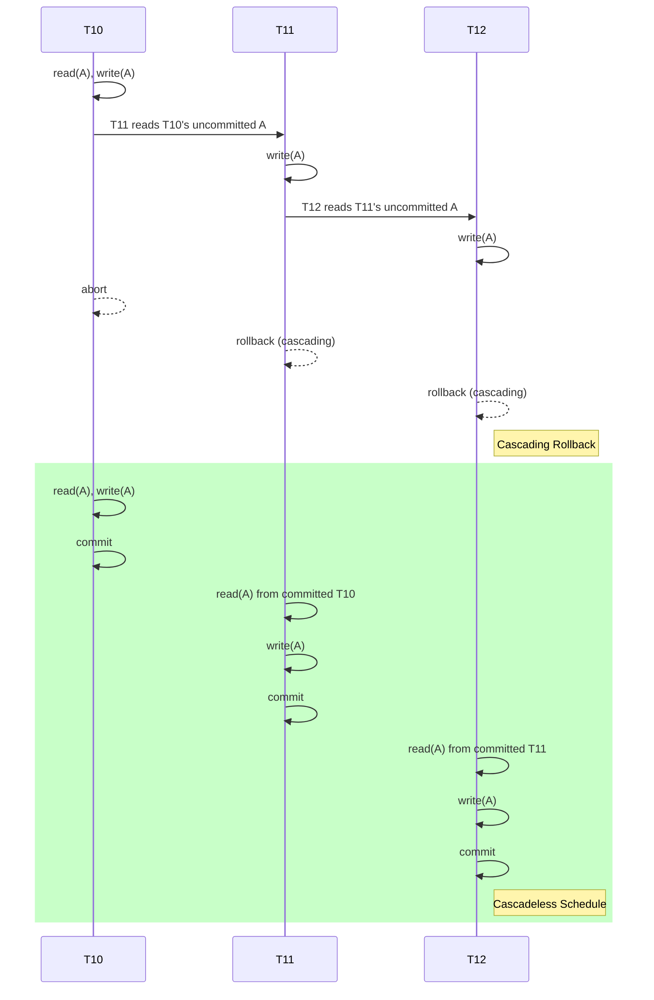

- **级联回滚**：T10 回滚触发 T11 和 T12 回滚。
- **无级联调度**：每个事务只读已提交数据，独立回滚。

## 六、隔离性实现 (Implementation of Isolation)

### 6.1 并发控制
- **目标**：确保调度是串行化的、可恢复的、最好无级联。
- **协议**：
    - **锁定 (Locking)**：
        - 共享锁 (Shared)：多事务可读。
        - 排他锁 (Exclusive)：单事务可写。
    - **时间戳 (Timestamps)**：
        - 事务开始时分配时间戳。
        - 数据项记录读写时间戳，检测顺序。
    - **多版本并发控制 (MVCC)**：
        - 维护数据多个版本，事务读取快照。

### 6.2 SQL 隔离级别
- **Serializable**：默认，最高隔离。
- **Repeatable Read**：重复读一致，但可能有幻读。
- **Read Committed**：仅读已提交数据。
- **Read Uncommitted**：可读未提交数据。
- **设置**：
    - SQL：`SET TRANSACTION ISOLATION LEVEL SERIALIZABLE`
    - JDBC：`connection.setTransactionIsolation(Connection.TRANSACTION_SERIALIZABLE)`

### 6.3 弱一致性
- **场景**：如统计查询可接受近似值。
- **优点**：提升性能。
- **注意**：某些系统默认非串行化（如 Oracle 的快照隔离）。

### 6.4 谓词锁 (Predicate Locks)

#### 6.4.1 问题背景：幻读与元组级锁的局限
- **幻读问题**：在并发执行中，一个事务 T1 执行查询（如 `SELECT`），另一个事务 T2 插入或删除匹配查询条件的数据，导致 T1 重复查询时看到不同结果（“幻影”记录）。
- **元组级锁的不足**：
    - 传统锁（如行级锁）只锁定具体的元组（行），无法锁定满足特定条件的记录集。
    - 示例：T1 锁定表 `instructor` 中 salary > 90000 的某些行，但 T2 插入新行（salary = 100000）时，未锁定，导致 T1 重复查询时发现“新记录”。
- **后果**：幻读违反了隔离性（Isolation），特别是 Serializable 隔离级别的要求。

#### 6.4.2 示例分析
考虑以下并发场景（基于课件中的示例）：
```sql
-- T1: 查询 salary > 90000 的记录
T1: SELECT * FROM instructor WHERE salary > 90000;
-- 假设返回 5 条记录

-- T2: 插入新记录
T2: INSERT INTO instructor ('11111', 'WenTY', 'IS', 100000);

-- T1: 再次查询
T1: SELECT * FROM instructor WHERE salary > 90000;
-- 现在返回 6 条记录（包括新插入的记录）
```

- **问题**：
    - T1 第一次查询时看到 5 条记录，第二次查询看到 6 条记录。
    - 即使 T1 对已查询的行加了锁，新插入的行（幻影）未被锁定，导致不一致。
- **元组级锁限制**：
    - T1 只能锁定现有行（如 salary = 95000 的行），但无法锁定“salary > 90000”这一条件下的潜在新行。
    - T2 的插入操作绕过了现有锁，引发幻读。

#### 6.4.3 谓词锁的定义
- **谓词锁**：一种高级锁机制，锁定满足特定条件的记录集（谓词），而不仅是具体的元组。
- **谓词**：查询条件（如 `WHERE salary > 90000`），表示一组可能满足条件的记录。
- **工作原理**：
    - 当 T1 执行查询并加谓词锁时，系统锁定所有当前和未来可能满足 `salary > 90000` 的记录。
    - T2 的插入操作若影响该谓词（例如插入 salary = 100000），将被阻塞，直到 T1 释放锁。