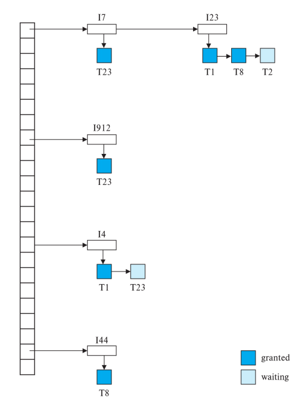
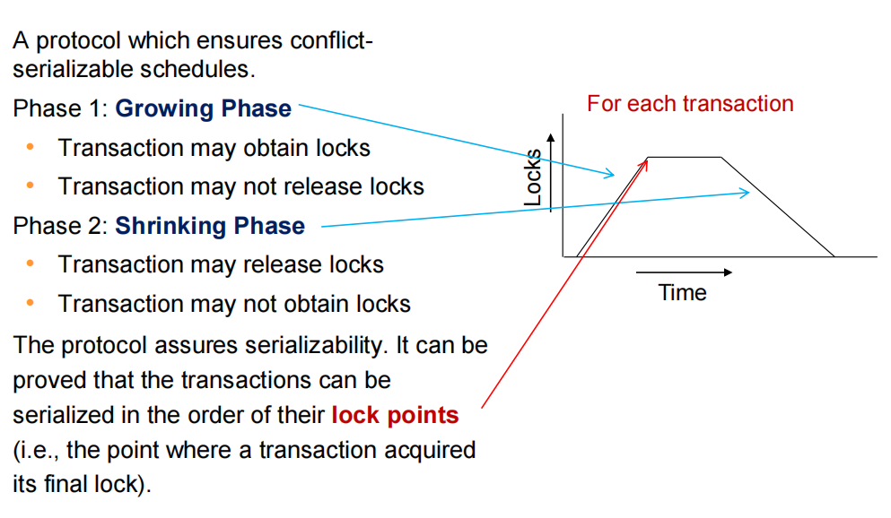
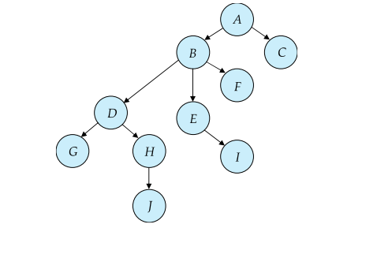
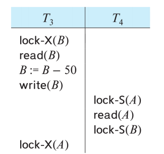
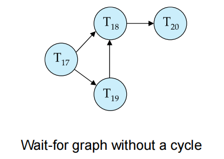
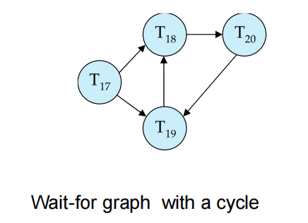
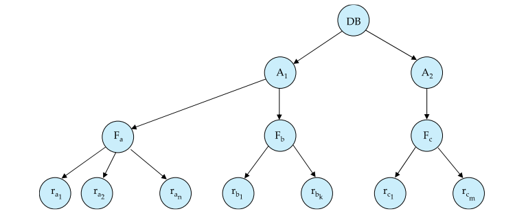
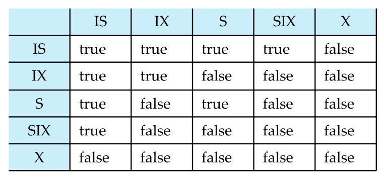

# Lecture14: Concurrency Control


## 一、并发控制概述

并发控制（Concurrency Control）确保多个事务并发执行时不会破坏数据的一致性或完整性。其目标是保证**可串行化（serializability）**，即并发事务的执行结果等价于某种串行执行顺序。

**主要内容：**

- 基于锁的协议（Lock-Based Protocols）
- 死锁处理（Deadlock Handling）
- 多粒度锁（Multiple Granularity Locking）
- 插入与删除操作及谓词读取（Insert and Delete Operations with Predicate Reads）

## 二、锁机制（Lock-Based Protocols）

### 1. 锁的基本概念

**锁（Lock）** 是一种控制并发访问数据项的机制，由**并发控制管理器（concurrency-control manager）**管理。事务通过请求和获取锁来控制对数据的访问。

#### 1.1 锁的两种模式

- **共享锁（S-lock）**：允许读取数据项，但禁止写入。通过 `lock-S` 指令请求。
- **排他锁（X-lock）**：允许读取和写入数据项。通过 `lock-X` 指令请求。

#### 1.2 锁兼容性矩阵

锁请求的兼容性由以下矩阵决定：

|       | S    | X    |
|-------|------|------|
| **S** | True | False |
| **X** | False | False |

- 多个事务可以同时持有同一数据项的 S-lock。
- 如果某个事务持有数据项的 X-lock，则其他事务无法持有该数据项的任何锁（S 或 X）。
- 事务只有在锁请求被授予后才能继续执行。

#### 1.3 锁的使用示例

考虑事务 \(T_2 \)：

```sql
lock-S(A);
read(A);
unlock(A);
lock-S(B);
read(B);
unlock(B);
display(A + B);
```

**注意**：上述锁的使用方式**不能保证可串行化**，因为调度可能允许产生非可串行化的交错执行。

#### 1.4 锁协议与调度

- **锁协议（Locking Protocol）**：事务在请求和释放锁时遵循的一组规则。
- 一个调度在锁协议下是**合法的（legal）**，如果它能由遵循该协议的事务生成。
- 如果协议下所有合法调度都是可串行化的，则该协议保证**可串行化**。

#### 1.5 锁表与锁管理器

- **锁管理器（Lock Manager）**：一个独立进程，通过发送锁授权消息来响应加锁请求（若发生死锁，则发送要求事务回滚的消息），它还维护了内存中的**锁表（Lock Table）**，记录：
    - 已授予的锁（图中用深色矩形表示）。
    - 等待中的锁请求（浅色矩形）。
    - 锁类型（S 或 X）。



- 新锁请求被添加到数据项请求队列末尾，若与现有锁兼容则授予。
- 解锁请求会删除相应锁，锁管理器检查等待请求是否可以授予。
- 若事务中止，其所有锁（已授予或等待中）都会被删除。

### 2. 两阶段锁协议（Two-Phase Locking Protocol, 2PL）

#### 2.1 定义

两阶段锁协议（2PL）确保**冲突可串行化调度（conflict-serializable schedules）**，包括两个阶段：

- **增长阶段（Growing Phase）**：事务可以获取锁，但不能释放锁。
- **收缩阶段（Shrinking Phase）**：事务可以释放锁，但不能获取新锁。



**锁点（Lock Point）**：事务获取最后一个锁的时刻。事务可以按锁点顺序串行化。

#### 2.2 变种

- **严格两阶段锁（Strict 2PL）**：
    - 所有排他锁（X-lock）必须持有到事务提交或中止。
    - 保证**可恢复性（recoverability）**并避免**级联回滚（cascading rollbacks）**。
- **强两阶段锁（Rigorous 2PL）**：
    - 所有锁（S 和 X）必须持有到事务提交或中止。
    - 确保事务按提交顺序串行化。
    - 大多数数据库使用此变种，统称为“两阶段锁”，两阶段锁定也并非可串行化的必要条件
- **支持锁转换（Lock Conversions）的2PL**：（该协议确保了可串行性）
    - **增长阶段**：可获取 S 或 X 锁，或将 S-lock 升级为 X-lock（升级）。
    - **收缩阶段**：可释放 S 或 X 锁，或将 X-lock 降级为 S-lock（降级）。

#### 2.3 自动锁获取

锁在事务发出读写操作时自动获取：

- **读操作（read(D)）**：
    
    ```pseudo
    if T_i has a lock on D
        read(D)
    else
        if necessary, wait until no other transaction has an X-lock on D
        grant T_i an S-lock on D
        read(D)
    ```

- **写操作（write(D)）**：
    
    ```pseudo
    if T_i has an X-lock on D
        write(D)
    else
        if necessary, wait until no other transaction has any lock on D
        if T_i has an S-lock on D
            upgrade lock to X-lock
        else
            grant T_i an X-lock on D
        write(D)
    ```

所有锁在事务提交或中止后释放。

#### 2.4 局限性

- 2PL 保证可串行化，但**不能防止死锁**。
- 2PL 不是可串行化的必要条件，某些可串行化调度在 2PL 下无法实现。

### 3. 基于图的协议（Graph-Based Protocols）

#### 3.1 定义

基于图的协议对数据项集 \(D = \{d_1, d_2, \ldots, d_h\} \)施加**偏序（partial ordering）**。若 \(d_i \rightarrow d_j \)，则事务必须先锁 \(d_i \)再锁 \(d_j \)。这形成一个**有向无环图（DAG）**，称为**数据库图（database graph）**。

> 偏序（Partially Ordered Set，简称 poset）是一个数学概念，主要应用于集合论、组合数学和计算机科学等领域。偏序描述了一种关系，这种关系在某些元素之间存在顺序，但并非所有元素都可以相互比较。

#### 3.2 树协议（Tree Protocol）

一种特定的基于图协议，规则如下：

- 仅允许**排他锁（X-lock）**。
- 第一个锁可以施加在任意数据项上。
- 后续锁施加在数据项 \(Q \)上需满足 \(Q \)的父节点已被锁。
- 数据项可随时解锁。
- 数据项只能被事务锁一次，解锁后不可重新锁定。



**优点**：

- 保证**冲突可串行化**且**无死锁**（等待图无环）。
- 相比 2PL 允许更早解锁，提高并发性。

**缺点**：

- 不保证**可恢复性**或**无级联回滚**（需引入提交依赖）。
- 事务可能锁定未访问的数据项，增加锁开销和等待时间。
- 2PL 和树协议下可实现的调度互不完全重叠。


## 三、死锁处理（Deadlock Handling）

### 1. 死锁定义

**死锁（Deadlock）** 发生在事务集形成循环等待，每个事务等待另一个事务持有的资源。例如：



\(T_3 \)等待 \(T_4 \)释放 A，\(T_4 \)等待 \(T_3 \)释放 B，形成死锁。

**解决方法**：回滚一个事务（例如 \(T_3 \)或 \(T_4 \)）并释放其锁。

### 2. 死锁预防

通过以下策略确保系统不进入死锁状态：

- **预声明（Pre-declaration）**：事务在开始前声明所有需要的锁。
- **偏序（Partial Ordering）**：使用基于图的协议（如树协议）强制锁顺序。
- **等待-死亡（Wait-Die Scheme，非抢占）**：
    - 较老的事务可以等待较年轻的事务释放锁。
    - 较年轻的事务请求较老事务持有的锁时被回滚。
    - 一个事务可能多次“死亡”才能获取锁。
- **伤害-等待（Wound-Wait Scheme，抢占）**：
    - 较老的事务“伤害”（强制回滚）持有锁的较年轻事务。
    - 较年轻的事务可以等待较老的事务。
    - 相比等待-死亡，回滚次数更少。

上述两种方案中，回滚的事务以原始时间戳重启，避免饥饿（starvation）。

- **基于超时的策略（Timeout-Based Schemes）**：
    - 事务等待锁的时间超过指定时限后回滚。
    - 实现简单，但可能在无死锁时不必要回滚。
    - 难以确定合适的超时时间。
    - 可能导致饥饿（事务反复回滚）。

### 3. 死锁检测与恢复

- **等待图（Wait-For Graph）**：
    - **顶点**表示**事务**。
    - 边 \(T_i \rightarrow T_j \)表示 \(T_i \)**等待** \(T_j \)**持有的冲突锁**。
    - 等待图中存在环即表示死锁。
    - 系统定期运行**死锁检测算法**检查环。





- **死锁恢复（Deadlock Recovery）**：
    - 选择一个**受害者（victim）**事务回滚以打破死锁环。
    - 选择标准：回滚成本最小（例如，进展最少或资源占用最少）。
    - **回滚选项**：
        - **完全回滚**：中止事务并重启。
        - **部分回滚**：仅回滚到释放所需锁的程度。
    - **饥饿风险**：**一个事务可能反复被选为受害者**。
    - **解决方法**：避免选择死锁集中最老的事务，确保公平性。

## 四、多粒度锁（Multiple Granularity Locking）

### 1. 概述

多粒度锁允许在不同粒度级别（例如数据库、区域、文件、记录）上锁定数据项，组织成**树形层次结构**(区别于树形锁定协议 tree-locking protocol )。当事务显式锁定树中的某个节点时，会隐式以相同模式锁定该节点的所有后代节点。

- **粒度级别**（从最粗到最细）：数据库 → 区域 → 文件 → 记录
- **权衡**：
    - **细粒度（较低层次）**：高并发性，高锁开销。
    - **粗粒度（较高层次）**：低锁开销，低并发性。



### 2. 意图锁模式

#### 2.1 更多的锁

除之前提到的 S 和 X 这两种锁外，引入三种意图锁模式：

- **意图共享锁（IS, Intention-Shared）**：表示在较低层次只使用共享锁。
- **意图排他锁（IX, Intention-Exclusive）**：表示在较低层次使用排他锁或共享锁。
- **共享与意图排他锁（SIX, Shared and Intention-Exclusive）**：子树以共享模式锁定，且较低层次有排他锁。

#### 2.2 兼容性矩阵



### 3. 多粒度锁协议

事务 \(T_i \)锁定节点 \(Q \)的规则：

1. 锁必须与现有锁兼容（参考兼容性矩阵）。
2. 必须先锁定树根（任意模式）。
3. 如果要锁定 \(Q \)为 S 或 IS 模式，需其父节点被 \(T_i \)以 IX 或 IS 模式锁定。
4. 如果要锁定 \(Q \)为 X、SIX 或 IX 模式，需其父节点被 \(T_i \)以 IX 或 SIX 模式锁定。
5. 锁遵循**两阶段锁协议**（获取所有锁前不可解锁）。
6. 仅当 \(Q \)的子节点未被 \(T_i \)锁定时，\(Q \)才可解锁。
7. 锁按**根到叶**顺序获取，按**叶到根**顺序释放。

**锁粒度升级（Lock Granularity Escalation）**：当某一级锁过多时，切换到更粗粒度的 S 或 X 锁以减少开销。

## 五、插入与删除操作

### 1. 基本锁规则

- **删除（Delete）**：需在被删除数据项上获取**排他锁（X-lock）**。
- **插入（Insert）**：插入事务自动为新元组获取**排他锁**。
    - 检测与删除操作冲突的读/写操作。
    - 防止其他事务在插入事务提交前访问新元组，或者说确保被插入的元组在插入事务提交前对其他事务不可见。

### 2. 幻影现象（Phantom Phenomenon）

**幻影现象**（幻读）指事务执行**谓词读取（predicate read）**（如范围查询）时，与插入、删除或更新操作发生冲突，即使未访问共同元组。

#### 2.1 示例

- **事务 \(T_1 \)**：执行谓词读取：
  ```sql
  SELECT count(*) FROM instructor WHERE dept_name = 'Physics';
  ```
- **事务 \(T_2 \)**：在 \(T_1 \)执行期间插入元组：
  ```sql
  INSERT INTO instructor VALUES ('11111', 'Feynman', 'Physics', 94000);
  ```

- **问题**：若仅使用元组级锁，\(T_1 \)可能漏掉新插入的元组，导致非可串行化调度。

- **另一示例**：\(T_1 \)和 \(T_2 \)并行查找最大 instructor ID，并插入 ID = 最大 ID + 1 的新 instructor。若无适当锁，两个事务可能插入相同 ID 的元组，违反可串行化。

| \(T_1 \)| \(T_2 \)|
|-----------|-----------|
| Read(instructor WHERE dept_name='Physics') | |
| | Insert Instructor in Physics |
| | Insert Instructor in Comp. Sci. |
| | Commit |
| Read(instructor WHERE dept_name='Comp. Sci.') | |

#### 2.2 解决幻影问题

- **基本方案**：
    - 为关系关联一个**数据项**，表示其包含的元组信息。
    - 谓词读取获取该数据项的**共享锁（S-lock）**。
    - 插入/删除/更新获取该数据项的**排他锁（X-lock）**。

> **缺点**：插入/删除操作并发性低，因锁粒度较粗。

- **索引锁协议（Index Locking Protocol）**：
    - 要求每个关系**至少有一个索引**。
    - 事务通过索引查找访问元组。
    - 谓词读取以**共享模式（S-mode）**锁定访问的索引叶节点（即使无匹配元组）。
    - 插入/更新/删除以**排他模式（X-mode）**锁定受影响的索引叶节点。
    - 遵循**两阶段锁(2PL)**。

> **优点**：通过检测冲突防止幻影现象。

- **下一键锁协议（Next-Key Locking Protocol）**：
    - 为满足索引查找的值（例如范围 \(7 \leq X \leq 16\)）加锁，**读取用 S-mode**，**插入/删除/更新用 X-mode**。
    - 同时锁定索引中的**下一键值（next key value）**，防止幻影。
    - **示例**（B+树叶节点：3, 5, 8, 11, 14, 18, 24, 38, 55）：
        - 查询：\(7 \leq X \leq 16 \)。那么接着就会以 S-mode 锁定键 8、11、14 及**下一键值 18**。
        - 插入 15：以 X-mode 锁定键 14、15 及**下一键值 18**。
        - 插入 7：以 X-mode 锁定键 5、7 及**下一键值 8**。

> **优点**：比索引锁协议并发性更高，仅锁定特定键而非整个叶节点。
