# Lecture 6: Database Design using the E-R Model

## 一、设计过程概述

### 阶段划分

- 初始阶段：明确数据库用户的数据需求。
- 第二阶段：选择数据模型，构建概念模式（Conceptual Schema）。
- 最终阶段：
    - 逻辑设计：定义数据库模式（Schema），解决属性分配和关系模式划分。
    - 物理设计：决定数据的物理存储布局。

### 设计原则

- 避免冗余：冗余可能导致数据不一致。
- 避免不完整性：设计需覆盖所有业务场景。
- 选择最佳设计：从多个合理设计中择优。

## 二、实体-联系模型(E-R Model)核心概念

### 1. 基本元素

| 概念        | 说明                                                                 | 示例                  |
|-------------|----------------------------------------------------------------------|-----------------------|
| **实体**    | 可区分的对象（如学生、课程）                                         | `学生(ID: 323114514)`       |
| **实体集**  | 同类实体的集合（如所有学生）                                         | `student` 表          |
| **属性**    | 描述实体的特征（如学生ID、姓名）                                     | `name VARCHAR(20)`    |
| **关系**    | 实体间的关联（如“学生选修课程”）                                     | `takes(ID, course_id)`|
| **关系集**  | 同类关系的集合                                                       | `advisor` 关系集      |

### 2. E-R图表示

以下面这个E-R模型为例：

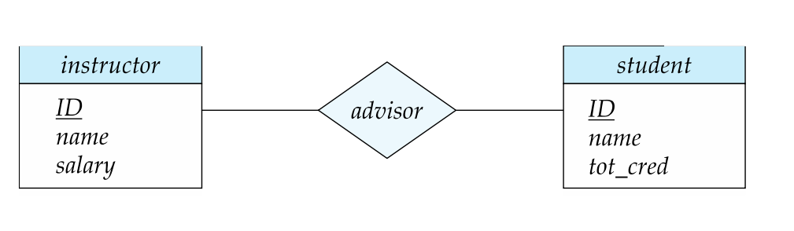

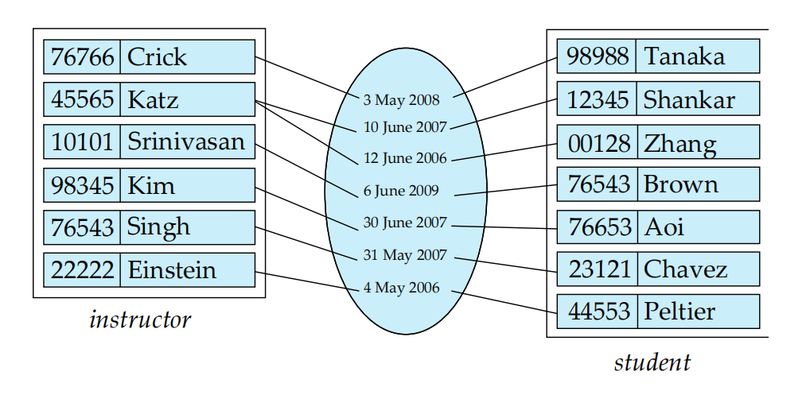

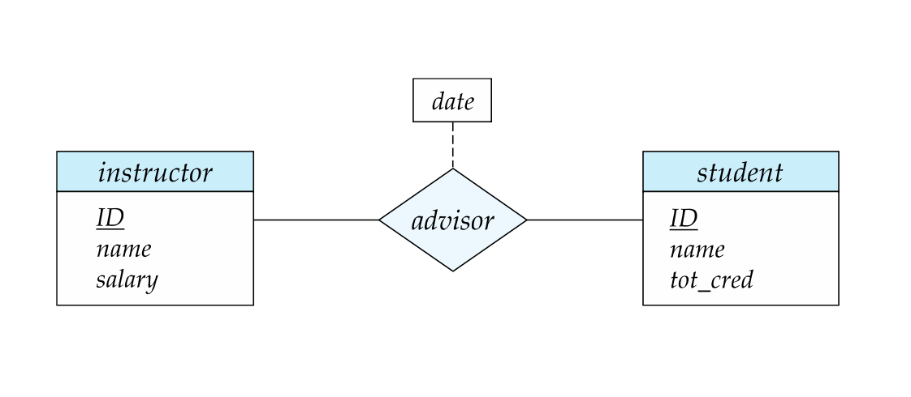

- **实体集**：矩形(rectangle)框。
- **关系集**：菱形(diamond)框，通过连线连接相关实体集。如果是**一对一**关系，则为**单菱形框**；如果是**一对多**关系，则为**双菱形框**。
- **属性**：看了些资料，可以用椭圆形，但是上课PPT里说明的是**属性列于框内，主键用下划线标出**。

详细讲解：

1. 实体集（Entity Sets）

    **instructor（教师实体集）**：

    - 属性：ID（主键）、name、salary
    - 作用：存储所有教师信息，每个教师通过唯一ID标识。

    **student（学生实体集）**：

    - 属性：ID（PK）、name、tot_cred
    - 作用：存储所有学生信息，每个学生通过唯一ID标识。

2. 关系集（Relationship Set）

    **advisor（指导关系）**：

    - 连接：通过ID的关系连接 instructor 和 student。
    - 含义：表示教师对学生的指导关系。例如，教师ID22222指导学生ID44553，我们可以写\((22222, 44553) \in advisor\)。

    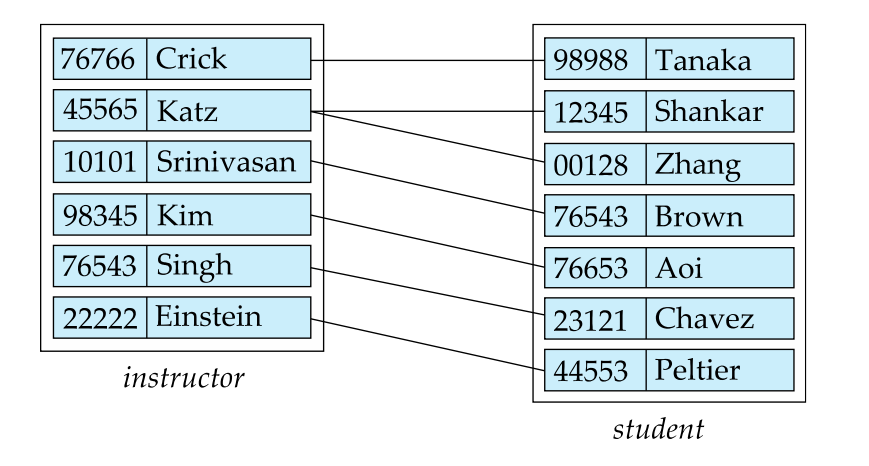

## 三、复杂属性(Complex Attributes)

| 类型        | 说明                     | E-R图表示             | 示例                  |
|-------------|--------------------------|-----------------------|-----------------------|
| 简单属性    | 不可再分                | 单行文本              | `age INT`             |
| 复合(composite)属性    | 可分解为子属性           | 树状结构              | `address(street, city)`|
| 多值(multivalued)属性    | 多个取值                 | 花括号 `{}`          | `{phone_number}`      |
| 派生(Derived)属性    | 由其他属性计算得到       | 括号 `()`             | `age()`               |

### 1. 简单属性（Simple Attribute）
- **定义**：不可再分的原子值，如整数、字符串等。
- **E-R图示例**：直接列在实体框内。
    ```plaintext
    +------------------+
    |    instructor    |
    |------------------|
    | ID               |
    | name             |
    | salary           |
    +------------------+
    ```
- **SQL实现示例**：使用基本数据类型（`INT`, `VARCHAR`, `DATE`等）。
    ```sql
    CREATE TABLE student (
      ID CHAR(5) PRIMARY KEY,
      birthdate DATE  -- 简单属性
    );
    ```

### 2. 复合属性（Composite Attribute）

- **定义**：由多个子属性组成的属性（如地址包含街道、城市、邮编）。
- **E-R图示例**：树状结构或嵌套表示（下图那种缩进）。
    ```plaintext
    +--------------+
    |  instructor  |
    |--------------|
    | ID (PK)      |
    | name         |
    |     first    |
    |     last     |
    | address      |
    |     street   |
    |     city     |
    +--------------+
    ```
- **SQL实现**：
    - **方案1**：拆分为独立字段（不赘述，懂的都懂）。
    - **方案2**：使用结构化类型。
        ```sql
        CREATE TYPE address_type AS (
            street VARCHAR(50),
            city VARCHAR(20)
        );
        
        CREATE TABLE instructor (
            ID CHAR(5) PRIMARY KEY,
            name_first VARCHAR(20),
            name_last VARCHAR(20),
            address address_type  -- 使用复合类型
        );
        ```

### 3. 多值属性（Multivalued Attribute）

- **定义**：一个属性可包含多个值（如用户有多个电话号码）。
- **E-R图示例**：用花括号 `{}` 标注。
    ```plaintext
    +--------------+
    |  instructor  |
    |--------------|
    | ID (PK)      |
    | phones { }   |
    +--------------+
    ```
- **SQL实现示例**：使用数组类型（仅限支持数组的数据库如PostgreSQL）。
    ```sql
    CREATE TABLE instructor (
        ID CHAR(5) PRIMARY KEY,
        phones VARCHAR(20)[]  -- 用数组存储，因为可能有多个电话号码
    );
    ```

### 4. 派生属性（Derived Attribute）

- **定义**：通过计算其他属性得到（如年龄 = 当前日期 - 出生日期）。
- **E-R图示例**：用括号 `()` 标注。
  ```plaintext
  +--------------+
  |  instructor  |
  |--------------|
  | ID           |
  | birthdate    |
  | age ()       |
  +--------------+
  ```
- **SQL实现**：
    - **方案1**：通过视图动态计算。
        ```sql
        CREATE VIEW instructor_age AS
        SELECT ID, birthdate, 
            EXTRACT(YEAR FROM CURRENT_DATE) - EXTRACT(YEAR FROM birthdate) AS age
        FROM instructor;
        ```
    - **方案2**：使用生成列（Generated Column）。
        ```sql
        CREATE TABLE instructor (
            ID CHAR(5) PRIMARY KEY,
            birthdate DATE,
            age INT GENERATED ALWAYS AS (EXTRACT(YEAR FROM CURRENT_DATE) - EXTRACT(YEAR FROM birthdate))
        );
        ```

## 四、映射基数约束

基数约束描述两个实体集通过关系集关联时，**每个实体可参与的关系数量限制**。

### 1. 四种基数类型

- 一对一（1:1）：一个实体关联至多一个另一实体。
    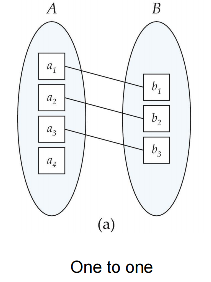
- 一对多（1:N）：一个实体关联多个另一实体。
    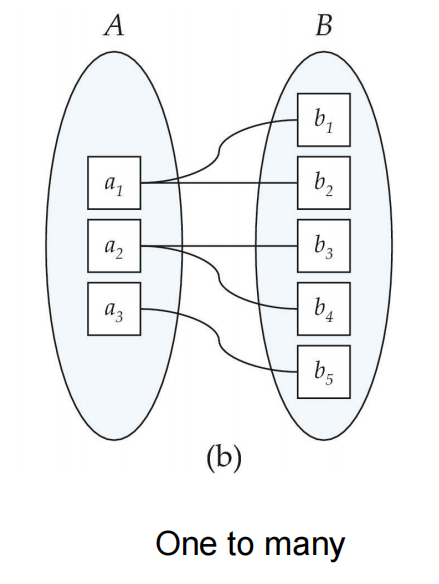
- 多对一（N:1）：多个实体关联至多一个另一实体。
    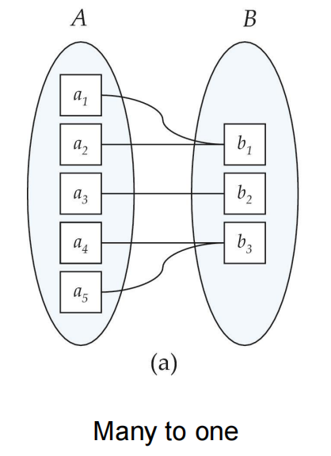
- 多对多（M:N）：多个实体互相关联。
    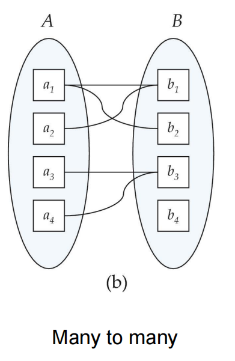

我们通过在关系集和实体集之间绘制有向线（\(\rightarrow\)或者\(\leftarrow\)）表示“一个”，绘制无向线（—）表示“多个”来表达基数约束。

!!! example "约束示例"
    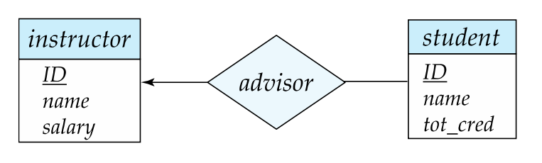
    如上图，这表示了**一个讲师可以和多个学生**有指导关系，而**一个学生只能选一个教师**作为指导关系。

### 2. 参与约束

- 全部参与（Total Participation）：双线(double line)表示（如学生必须有一个导师）。
- 部分参与（Partial Participation）：单线表示（如教师可能不担任导师）。

!!! example "参与约束示例"
    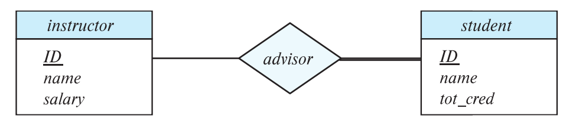
    如上图，这表示了**学生必须有指导关系的讲师**，而**讲师可能不在这个指导关系中**。

### 3. 更复杂的约束

用`l..h` 形式标注，用于定义**实体参与关系的数量范围**：

- **`l`（Minimum）**：实体必须参与的**最少关系数**。
- **`h`（Maximum）**：实体可以参与的**最多关系数**。

!!! example "`l..h`约束示例"
    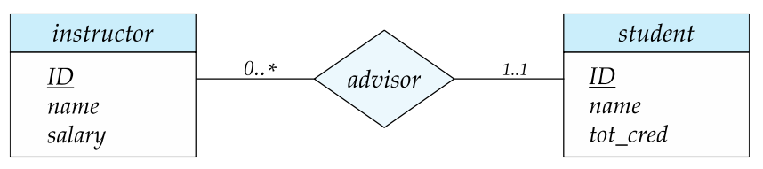
    （星号\*表示没有限制）如上图，这表示的是**一个讲师可以和多个学生**有指导关系（也可以一个关系都没有），而**一个学生有且仅有一个讲师**作为指导关系。


## 五、主键设计

| 关系类型    | 主键规则                                  | 示例                          |
|-------------|------------------------------------------|-------------------------------|
| 1:1         | 任一端主键                                | `employee(ID)` \(\leftrightarrow\) `office(ID)` |
| 1:N         | "多"端主键                                | `department(dept_id)` \(\rightarrow\) `employee(dept_id)`|
| M:N         | 联合两端主键                              | `advisor(instructor.ID, student.ID)` |


## 六、弱实体集

### 1. 标识实体 + 分辨符（Discriminator OR partial key）：

- **弱实体集**：依赖于其他实体集（用于标识实体）存在的实体，**无法独立标识**。
- **分辨符**：弱实体集内部唯一标识实体的属性。

!!! example "弱实体集示例"
    听起来很抽象，这里举个例子：
    ```sql
    CREATE TABLE section (
        course_id CHAR(5),  -- 标识实体的主键
        sec_id CHAR(5),     -- 分辨符（弱实体自身唯一标识）
        semester VARCHAR(10),
        PRIMARY KEY (course_id, sec_id),
        FOREIGN KEY (course_id) REFERENCES course
    );
    ```
    这里，`section` 表的主键是 `course_id` 和 `sec_id`。`course_id`是标识实体的主键，`sec_id`就是分辨符。

    这里也可以看到，因为`section`只有`sec_id`是建立不起来滴，它依赖于`course_id`外键，照应了前面所说的弱实体集的定义。

    唯一性保证：仅当`course_id` + `sec_id`组合时，才能唯一标识一个课程段（比如`CMU 15-445`和`Spring`共同组合唯一标识了这门课的一个课程段）。


### 2. 特点与E-R图表示

- 依赖强实体集：通过**双矩形框**表示。
- 分辨符：**虚线下划**标出。

比如在下面这个图例中，可以一眼盯真，很容易看懂。

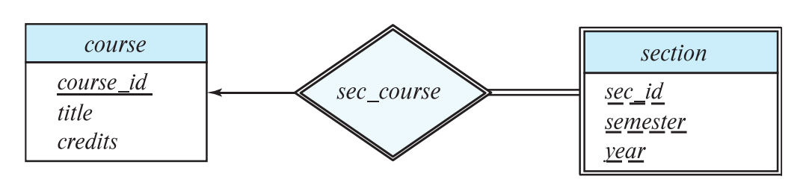

## 七、消除冗余属性

消除冗余属性并引入关系表，数据库设计就会更加规范化.

```sql
-- 错误：冗余存储 dept_name
CREATE TABLE student (
    ID CHAR(5) PRIMARY KEY,
    dept_name VARCHAR(20),  -- 冗余字段
    FOREIGN KEY (dept_name) REFERENCES department
);
```

```sql
-- 正确：通过关系表 stud_dept 关联学生与部门
CREATE TABLE student (
    ID CHAR(5) PRIMARY KEY,
    -- 不直接存储 dept_name
);

CREATE TABLE stud_dept (
    student_id CHAR(5),
    dept_name VARCHAR(20),
    PRIMARY KEY (student_id),
    FOREIGN KEY (student_id) REFERENCES student(ID),
    FOREIGN KEY (dept_name) REFERENCES department(dept_name)
);
```

## 八、E-R图与关系模式的转换

### 1. E-R图转关系模式

操作方法：

- 把每个矩形和菱形直接转化成关系模式，也就是说**各种属性先不管，先把关系模式的大致样子写出来**。
- 再根据通过菱形连接的两个矩形，比对菱形内含有的**共同的属性**，确认主键和外键。
- 有下划虚线的是分辨符和主键，下划实线的就是主键。

### 2. 关系模式转E-R图

根据**日常经验**，**关系模式的属性特征**等综合判断，将关系模式转换为E-R图。可能不太看得懂这句话，举个例子：

!!! example "例题"
    这道题来自mxy班的quiz-2第五题的一部分，考察的就是E-R图和关系模型这一块的知识，可以姑且参考这道题来“小牛试刀”。

    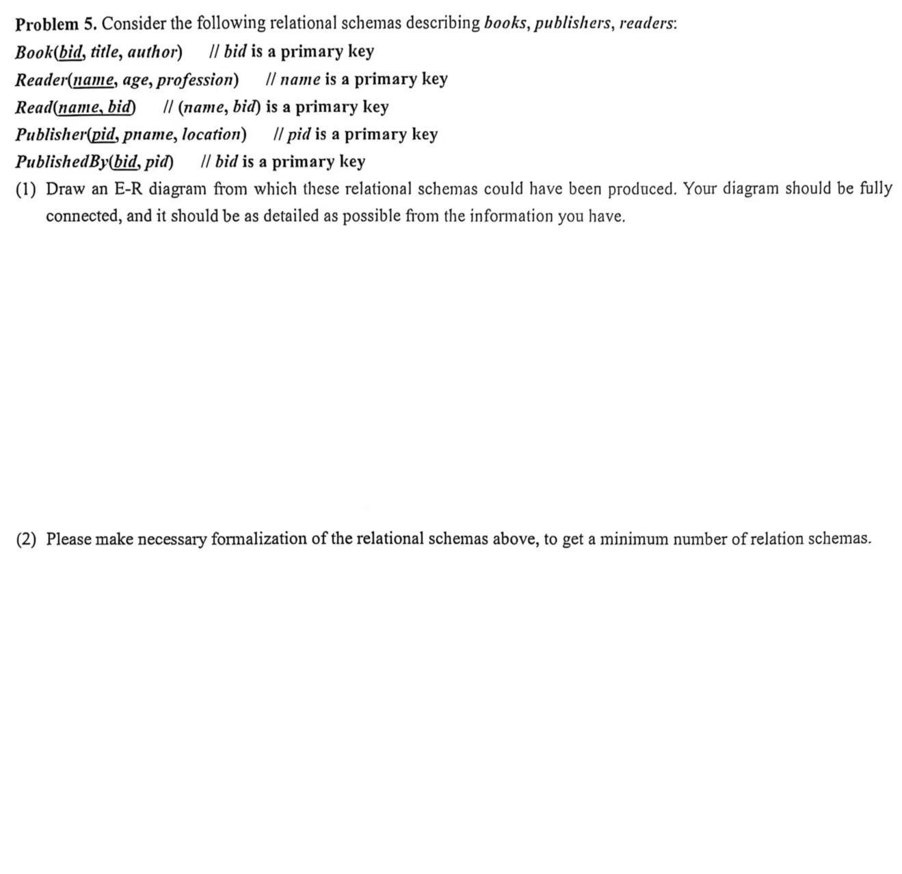

    (1) 这道题第一问比较简单。
    
    我们观察可以发现，表`Read`和`PublishedBy`都有个特点，即**其所有属性都包含于另外三个表中**。因此在E-R图中，它们可以作为关系集来连接另外三个表；同时根据经验判断，`Read`和`PublishedBy`这俩单词的含义分别是 **“读过的书”**和**“由谁出版的书”**，因此可以作为菱形关系。
    
    又按照经验，书不一定只有一个作者，一个作者不一定只有一本书，因此用**双菱形**表示；一个出版商不可能只出版一本书，但是一般一本书由一个出版商出版，因此可以用**单菱形**表示。
    
    综合前面笔记记录的细节，绘制图如下：（属性略，把上面的关系模型的属性连带下划线一排一排抄写上去即可）
    
    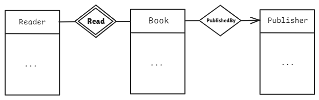

    (2) 第二个问还是需要一些烧烤时间的，不过这道题的难度也不是很大。

    通过规范化后，得到以下最少数量的关系模式：

    1. **Book(bid, title, author, pid)**  
           - 主键：`bid`  
           - 外键：`pid` 引用 `Publisher(pid)`  
           - 注：这个地方是合并原 `Book` 和 `PublishedBy` 表，消除冗余关系。

    2. **Publisher(pid, pname, location)**  
          - 主键：`pid`  

    3. **Reader(name, age, profession)**  
          - 主键：`name`  

    4. **Read(name, bid)**  
          - 主键：`(name, bid)`  
          - 外键：`name` 引用 `Reader(name)`，`bid` 引用 `Book(bid)`  

## 九、扩展E-R特性

### 1. 特化（Specialization）

定义：特化是将**实体划分为子实体**的过程。

特点：

- 自上而下设计：从一般实体集划分出更具体的子类。
- 继承属性：子类继承父类的所有属性和关系。
- 符号表示：使用空心箭头（和 `ISA` 标签），满足**子指向父**。

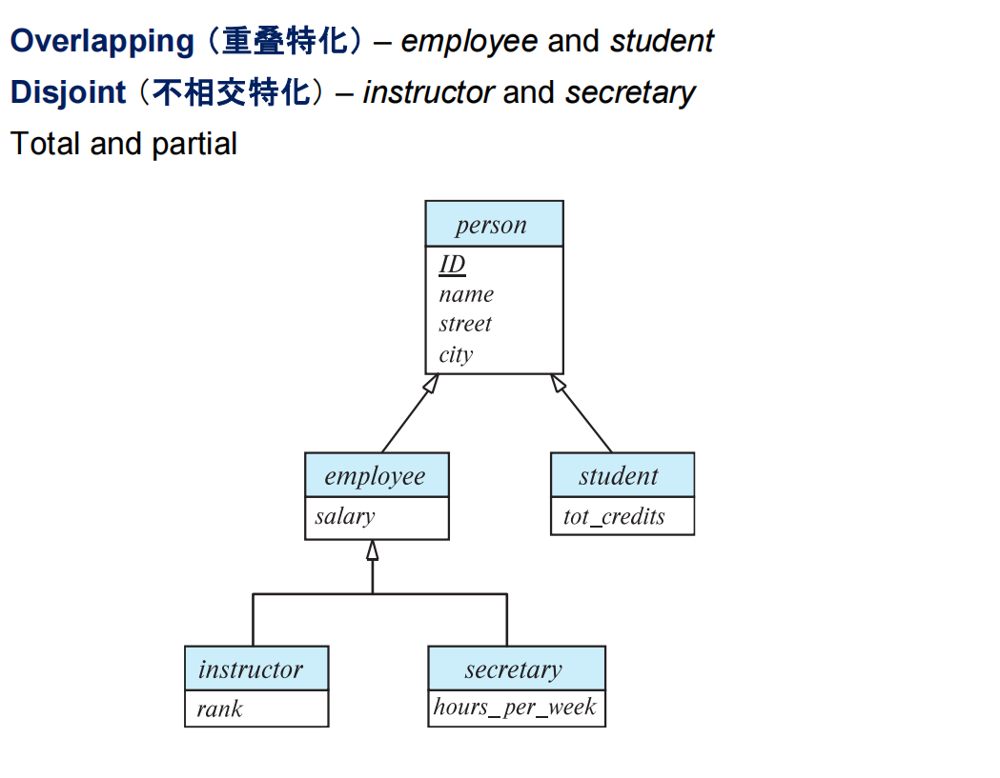

### 2. 概化（也称泛化）（Generalization）

定义：泛化是**多个实体的共同属性构成一个新实体的过程**。

备注：这里也可以看出，概化与特化是相对的**逆过程**。

特点：

- 自下而上设计：将多个实体集的共性抽象为父类
- 符号表示：使用实心箭头（和 `ISA` 标签），满足**子指向父**。（其实只需要记得**子指向父**就好）

### 3. 聚合（Aggregation）

定义：聚合是指**一个实体由多个实体组成**，或者说，因为单独的一个实体无法在关系中有意义，因此让**多个实体的关系**充当**一个实体**的过程。（而这个“大实体”我们用一个矩形框住，作为一个新实体）

这个看着比前两个还让人“迷糊”，举个例子很好说明。

譬如在评估系统中，学生、讲师、项目会受到有关的评价（通过`eval_for`连接）

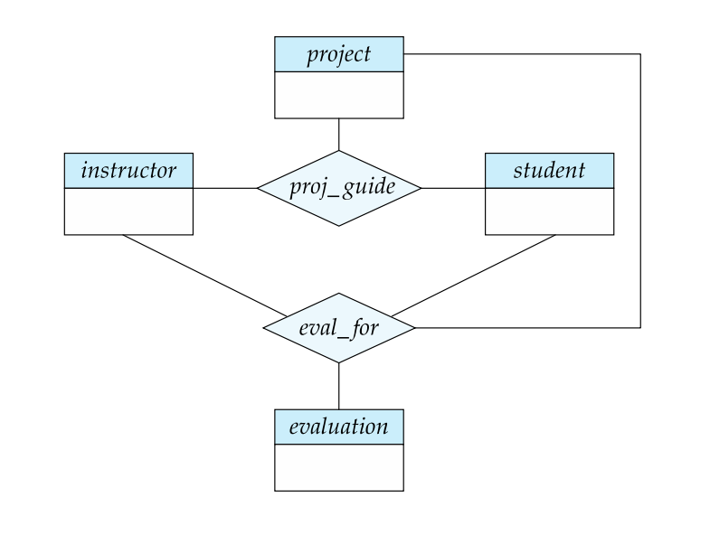

因此可以把这些评价的关系集和**学生、讲师、项目的关系集这一整个实体**联系起来，这就是聚合。

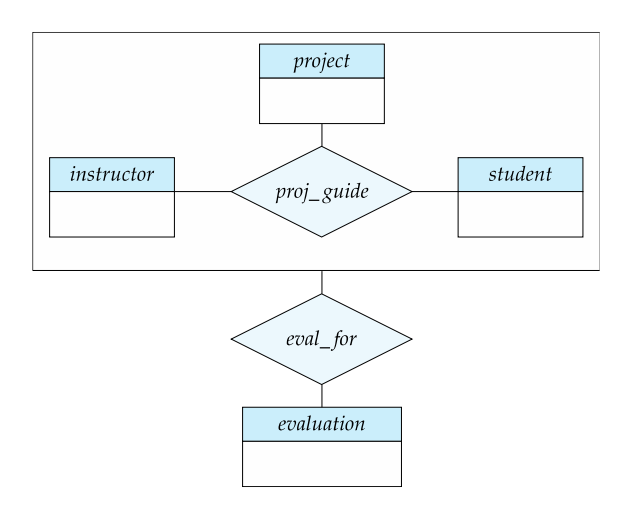

有一说一，我觉得这章挺水的，把基础概念过完就差不多能做题了。