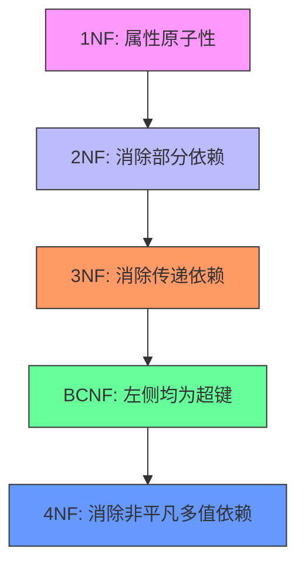

# Lecture 7: Normalization

## 一、规范化基础概念

### 1. 有损分解（Lossy Decomposition）与无损分解 (Lossless Decomposition)

#### 1.1 无损分解

如果我们将关系 \( R \) 分解为 \( R_1 \) 和 \( R_2 \)，那么当且仅当满足以下条件之一时，这个分解是无损的：

  - \( R_1 \cap R_2 \rightarrow R_1 \)
  - \( R_1 \cap R_2 \rightarrow R_2 \)

也就是说，当我们对分解后的两个关系进行自然连接时，结果应该等于原始关系 \( r \)。

#### 1.2 有损分解

举个例子吧，假设我们有一个关系 `employee`，包含以下属性：

- $\text{ID}$: 员工编号  
- $\text{name}$: 姓名  
- $\text{street}$: 街道地址  
- $\text{city}$: 城市  

原始关系 `employee` 的示例数据如下：

| ID  | name   | street       | city    |
|-----|--------|--------------|---------|
| 1   | Estruswent  | Maple St     | New York|
| 2   | Bob    | Oak Ave      | Boston  |
| 3   | Charlie| Pine Blvd    | Chicago |
| 4   | Estruswent  | Cedar Rd     | Seattle |

现在，我们将 `employee` 分解为两个关系：

1. $\text{employee1}(\text{ID}, \text{name})$  
2. $\text{employee2}(\text{name}, \text{street}, \text{city})$  

由此我们得到分解后的关系示例数据：

**`employee1`**:

| ID  | name   |
|-----|--------|
| 1   | Estruswent  |
| 2   | Bob         |
| 3   | Charlie     |
| 4   | Estruswent  |

**`employee2`**:

| name   | street       | city    |
|--------|--------------|---------|
| Estruswent  | Maple St     | New York|
| Bob         | Oak Ave      | Boston  |
| Charlie     | Pine Blvd    | Chicago |
| Estruswent  | Cedar Rd     | Seattle |

如果我们对这两个分解后的关系又**重新进行自然连接**（当然是基于 $\text{name}$ 列！），我们会得到以下结果：

```sql
SELECT e1.ID, e1.name, e2.street, e2.city
FROM employee1 e1
NATURAL JOIN employee2 e2;
```

由于 `employee1` 和 `employee2` 都有 `Estruswent` 这个名字，自然连接会生成所有可能的组合：

| ID  | name   | street       | city    |
|-----|--------|--------------|---------|
| 1   | Estruswent  | Maple St     | New York|
| 1   | Estruswent  | Cedar Rd     | Seattle |
| 4   | Estruswent  | Maple St     | New York|
| 4   | Estruswent  | Cedar Rd     | Seattle |

可以看到，原本只有一个 `Estruswent` 在 `New York` 和另一个 `Estruswent` 在 `Seattle`，但自然连接会产生额外的元组 `(1, Estruswent, Cedar Rd, Seattle)` 和 `(4, Estruswent, Maple St, New York)`，这并不是原始关系中的数据。

这个例子很好地展示了为什么这种分解是有损的。因为存在同名员工（即 $\text{name}$ 不唯一），自然连接会产生额外的元组，导致了不一致。

这种关系的分解就叫**有损分解**。

## 二、函数依赖理论

好了，大伙 ~~最喜欢~~ 的数学部分来了。

### 1. 函数依赖 (Functional Dependencies)

#### 1.1 函数依赖：

$\alpha \rightarrow \beta$：如果两个元组在属性集 $\alpha$ 上的值相同，那么它们在属性集 $\beta$ 上的值也必须相同。（简单地理解，就是“ $\alpha$ **决定了** $\beta$ ”，~~此事在你学过的离散数学里亦有记载~~）。

举个例子吧，假设有一个关系 `Employee`，包含以下属性：

- $\text{ID}$（员工编号）  
- $\text{Name}$（姓名）  
- $\text{Dept}$（部门）

如果我们明确了这样一个规则：每个员工的编号唯一地决定了他们的姓名和部门，那么我们可以说：

- $\text{ID} \rightarrow \text{Name}$  
- $\text{ID} \rightarrow \text{Dept}$  

这意味着，只要给定 $\text{ID}$，就能确定 $\text{Name}$ 和 $\text{Dept}$。

#### 1.2 键的表示：

- **超键（Super Key）**：能够唯一标识一个元组的属性集合。例如，在上面的例子中，$\{\text{ID}\}$ 是一个超键，因为它能唯一决定 `Employee` 中的所有属性。
- **候选键（Candidate Key）**：最小的超键，即**没有它的任何真子集**也能唯一决定所有属性。在上面的例子中，$\{\text{ID}\}$ 也是一个候选键，因为没有比它更小的集合能唯一决定 `Employee` 中的所有属性。

#### 1.3 平凡依赖：

如果 $\beta \subseteq \alpha$，那么 $\alpha \rightarrow \beta$ 总是成立。例如，$\text{ID}, \text{Name} \rightarrow \text{ID}$ 就是一个平凡依赖，因为它只是说“如果 $\text{ID}$ 和 $\text{Name}$ 相同，那么 $\text{ID}$ 也相同”，这是显而易见的。


### 2. 闭包计算 (Closure)

#### 2.1 定义：

闭包是用来**判断某个属性集能“决定”哪些其他属性的工具**。具体来说，给定一个属性集  \( \alpha \) 和一组函数依赖 \(F\)，求  \( \alpha \) 的闭包（记作  \( \alpha^{+} \)），即  \( \alpha \) 能决定的所有属性。

> Armstrong公理：
>
> 1. **自反律（Reflexivity）**：若  \( \beta \subseteq \alpha \)，则  \( \alpha \rightarrow \beta \)
> 2. **增补律（Augmentation）**：若  \( \alpha \rightarrow \beta \)，则  \( \gamma \alpha \rightarrow \gamma \beta \)
> 3. **传递律（Transitivity）**：若  \( \alpha \rightarrow \beta \) 且  \( \beta \rightarrow \gamma\)，则  \( \alpha \rightarrow \gamma \)

#### 2.2 属性闭包算法：
```python
def attribute_closure( α, F):
    result =  α  # 初始为α
    changes = True  # 标记是否有变化
    while changes:
        changes = False
        for each β→γ in F:
            if β ⊆ result:   # 如果 β 被当前 result 包含
                new_result = result ∪ γ
                if new_result != result:  # 如果有新属性加入
                    result = new_result
                    changes = True
    return result
```

!!! example "闭包计算实例"

    看着让人很头大，我们不妨举个简单例子：

    我们有一个关系$S(\text{ID}, \text{Name}, \text{Age}, \text{Salary})$

    函数依赖集为：$G = \{ \text{ID} \rightarrow \text{Name},\ \text{Name} \rightarrow \text{Age},\ \text{Age} \rightarrow \text{Salary} \}$。

    计算 $\text{ID}^+$ 的过程如下：

    1. 初始化：$\text{result} = \{ \text{ID} \}$。
    2. 应用自反律：$\text{ID} \rightarrow \text{ID}$，所以 $\text{result} = \{ \text{ID} \}$。
    3. 检查函数依赖：
        - $\text{ID} \rightarrow \text{Name}$：因为 $\text{ID} \subseteq \text{result}$，所以加入 $\text{Name}$，$\text{result} = \{ \text{ID}, \text{Name} \}$；
        - $\text{Name} \rightarrow \text{Age}$：因为 $\text{Name} \subseteq \text{result}$，故加入 $\text{Age}$，$\text{result} = \{ \text{ID}, \text{Name}, \text{Age} \}$；
        - $\text{Age} \rightarrow \text{Salary}$：因为 $\text{Age} \subseteq \text{result}$，同理，$\text{result} = \{ \text{ID}, \text{Name}, \text{Age}, \text{Salary} \}$。
    4. 再次检查，无更多依赖可应用，结束。

    最终结果是：$\text{ID}^+ = \{ \text{ID}, \text{Name}, \text{Age}, \text{Salary} \}$，说明 $\text{ID}$ 可以决定整个关系 $S$ 的所有属性，因此 $\text{ID}$ 是一个超键（也是候选键）。

    再举一个例子，函数依赖集\(F=\{\text{ID}\space \text{Name} \rightarrow \text{Age}\space \text{Salary}\}\)

    对于\((\text{ID}\space \text{Name})^+\)，我们显然有\(\text{result} = \{ \text{ID},\text{Name} \}\)，而\(F=\{\text{ID}\space \text{Name} \rightarrow \text{Age}\space \text{Salary}\}\)又能得到$\text{result} = \{ \text{ID}, \text{Name}, \text{Age}, \text{Salary} \}$，所以\(\text{ID}\space \text{Name}\)也是一个超键。

### 3. 正则覆盖 (Canonical Cover)

#### 3.1 目标：
**正则覆盖**的目的是简化函数依赖集合，消除冗余和无关属性，同时保持其等价性。这意味着，经过处理后的函数依赖集合与原始集合在逻辑上是等价的，但更加简洁和高效。

#### 3.2 算法步骤：

1. **合并相同左部的FD**：如果有多个函数依赖具有相同的左部，则将它们合并为一个。
2. **检测并删除无关属性**：
      - **左部属性A**：检查是否可以删去某个左部属性而不影响依赖成立。
      - **右部属性B**：检查是否可以删去某个右部属性而不影响依赖成立。
3. **重复上述过程直到无变化**：继续应用这些规则，直到不能再简化为止。

#### 3.3 示例讲解

!!! example 正则覆盖实例
    这个方法描述起来还是太抽象了，用个实例说明吧。假设我们有一个关系 $R(A, B, C, D)$ 和一组函数依赖 $F$：

    $$
    F = \{ A \rightarrow BC,\ B \rightarrow C,\ A \rightarrow B,\ AB \rightarrow C \}
    $$

    我们将逐步进行正则覆盖计算。

    ### 第一步：合并相同左部的函数依赖（FD）

    检查是否有相同的左部：$A \rightarrow BC$ 和 $A \rightarrow B$ 可以合并为 $A \rightarrow BC$，因为 $A \rightarrow B$ 已经包含在 $A \rightarrow BC$ 中。

    所以，现在我们有：

    $$
    F = \{ A \rightarrow BC,\ B \rightarrow C,\ AB \rightarrow C \}
    $$

    ### 第二步：检测并删除无关属性

    #### 删除右部中的无关属性：

    对于每个函数依赖 $\alpha \rightarrow \beta$，检查是否可以删除 $\beta$ 中的部分属性而不影响依赖成立。

    1. **检查 $A \rightarrow BC$**：
          - 删除 $C$：检查 $A \rightarrow B$ 是否成立？显然成立，因为 $A \rightarrow B$ 已在 $F$ 中。
          - 删除 $B$：检查 $A \rightarrow C$ 是否成立？根据 $AB \rightarrow C$ 和 $A \rightarrow B$（传递律），我们知道 $A \rightarrow C$ 成立。
          - 因此，我们可以简化为 $A \rightarrow BC$，但为了进一步简化，我们可以尝试去掉 $BC$ 中的一个属性。由于 $A \rightarrow B$ 和 $A \rightarrow C$ 都成立，我们可以保留其中一个依赖，例如 $A \rightarrow B$ 和 $A \rightarrow C$，但这会导致重复，所以我们暂时保留 $A \rightarrow BC$。
    2. **检查 $B \rightarrow C$**：
          - 删除$C$：检查$B \rightarrow$ 是否成立？不成立，因为没有其他依赖表明$B$ 决定了空集。
          - 所以$B \rightarrow C$ 不能简化。
    3. **检查$AB \rightarrow C$**：
          - 删除$C$：检查$AB \rightarrow$ 是否成立？不成立。
          - 删除$B$：检查$A \rightarrow C$ 是否成立？根据之前的分析，我们知道$A \rightarrow C$ 成立，因此$AB \rightarrow C$ 可以简化为$A \rightarrow C$。

    更新后的$F$：

    $$
    F = \{ A \rightarrow BC,\ B \rightarrow C,\ A \rightarrow C \}
    $$

    #### 删除左部中的无关属性：

    对于每个函数依赖$\alpha \rightarrow \beta$，检查是否可以删除$\alpha$ 中的部分属性而不影响依赖成立。检查$AB \rightarrow C$（已简化为$A \rightarrow C$），删除$B$：检查$A \rightarrow C$ （已经知道成立）。

    更新后的$F$：

    $$
    F = \{ A \rightarrow BC,\ B \rightarrow C,\ A \rightarrow C \}
    $$

    ### 第三步：合并和进一步简化

    我们发现$A \rightarrow BC$ 和$A \rightarrow C$ 是冗余的，因为$A \rightarrow BC$ 已经包含了$A \rightarrow C$。

    最终的正则覆盖$F_c$：

    $$
    F_c = \{ A \rightarrow BC,\ B \rightarrow C \}
    $$


## 三、范式理论

### 1. 范式简介

**范式（Normal Form）** 是对数据库表结构的一种规范化要求。

目的有两个：

1. **减少数据冗余**（节省存储、提高一致性）
2. **避免更新异常**（插入、删除、修改时出错）

这里主要是讲两个最经典的范式：**BCNF** 和 **3NF**。

### 2. BCNF 范式（Boyce-Codd Normal Form）

对于函数依赖集合 $F^+$ 中的每一个非平凡函数依赖 $\alpha \rightarrow \beta$，必须满足以下之一：

1. $\beta \subseteq \alpha$（平凡依赖）
2. $\alpha$ 是超键（可以决定整个关系）

换句话说：**所有非平凡依赖的左部都必须是候选键或超键。**

!!! waring "$A \rightarrow B$ 与 $A \supseteq B$"
    $A \rightarrow B$ 基本等同于“A决定了B”，比如说在`Book`这张表中，书的`ID`决定了它的`location`（图书馆里的对应的位置）

    $A \supseteq B$ 则代表“B包含于A”，比如说`Borrow`这张表中的`ID`包含于`Book`中的`ID`。（你借的某本书当然来自于所有的书的集合）

    这二者是不同的，在讨论时千万不要混淆。

我们可以用属性闭包来判断一个关系是否符合 BCNF：

```python
for each α→β in F:
    if β ⊄ α and α⁺ ≠ R:  # 如果不是平凡依赖，并且 α 不是超键
        这个关系不是 BCNF
```

!!! example "BCNF判断示例"

    假设我们有一个关系 $R(A, B, C)$，函数依赖为：

    $$
    F = \{ A \rightarrow B,\ B \rightarrow C \}
    $$

    - 步骤一：找候选键（这种一眼耵真就行）
        - 计算 $A^+$：A显然可以通过传递性和自反性决定所有的属性，所以$A$ 是候选键。
        - $B$ 不是候选键，因为 $B^+ = {B, C}$，不能决定 $A$。
        - $C$ 更不是候选键。
    - 步骤二：检查每个函数依赖
        1. $A \rightarrow B$：$A$是候选键，显然的
        2. $B \rightarrow C$：$B$不是候选键，因为没有$B \rightarrow A$

    **结论**：这个关系 **不满足BCNF**

    **补充**：如何变成BCNF呢？分解！（后续有提到哦）

    我们可以把 $R(A, B, C)$ 分解成两个关系：

    - $R_1(B, C)$，对应 $B \rightarrow C$
    - $R_2(A, B)$，对应 $A \rightarrow B$

    现在这两个子关系就都满足BCNF了。

### 3. 3NF 范式（Third Normal Form）

### 3.1 定义：

对于函数依赖集合 $F^+$ 中的每一个非平凡函数依赖 $\alpha \rightarrow \beta$，必须满足以下之一：

1. $\beta \subseteq \alpha$（平凡依赖）
2. $\alpha$ 是超键
3. $\beta - \alpha$ 中的每个属性都在某个候选键中（即这些属性属于候选键的一部分，这也是相比于BCNF更宽松的定义点）

### 3.2 与 BCNF 的简单对比：

| 特性             | BCNF                         | 3NF                           |
|------------------|------------------------------|-------------------------------|
| 是否允许某些非主属性依赖于非候选键 | ❌ 不允许                    | ✅ 允许（只要这些属性在候选键里） |
| 数据冗余         | 几乎没有                      | 可能存在                       |
| 是否保持依赖     | 不一定                        | 总是可以保持                   |
| 是否无损连接     | 可以做到                      | 可以做到                       |

!!! example "3NF判断示例"

    还是刚才的例子：

    $$
    R(A,B,C),\quad F = \{ A \rightarrow B,\ B \rightarrow C \}
    $$

    - 候选键是 $A$
    - $B$不是候选键
    - 但是$C$是不在候选键里的属性，所以也不满足 3NF 的第 3 条，所以也不是3NF

    但如果改成这样：

    $$
    F = \{ A \rightarrow B,\ B \rightarrow C,\ C \rightarrow A \}
    $$

    那么候选键包括 $A, B, C$，随便选一个出来都可以决定所有属性。

    此时 $B \rightarrow C$ 中的$C$在候选键中，满足 3NF。

    再举个复杂例子：$R(A, B, C, D),\ F = \{ AB \rightarrow CD,\ C \rightarrow A \}$。

    根据闭包算法，显然有\(AB^+\) = \(\{A,B,C,D\}\)（怎么来的看“闭包计算”一段的例子），所以$AB$是$F$的候选键。

    而对于$C \rightarrow A$呢？$C$肯定不是超键或者候选键，平凡依赖也谈不上，再看最后一个定义，我们有：

    $$
    A - C = \{A\}
    $$

    而$A\subseteq AB$，符合第3条，所以其实$R,F$就是3NF。

## 四、分解算法

在数据库设计中，如果一个关系模式不满足某个范式（如 BCNF 或 3NF），我们可以通过 **分解（Decomposition）** 把它拆分成多个更小的关系，使得每个子关系都满足目标范式的要求。其实分解刚才在某个例子里已经有初步体会了，而下面是对这一方法的详细讲解：

## 4.1 BCNF 分解算法（BCNF Decomposition Algorithm）

### 算法步骤：

```python
# 伪代码
result = {R}
while ∃ R_i in result not in BCNF:
    find α→β violating BCNF in R_i
    result = (result - R_i) ∪ (R_i - β) ∪ (α, β)
```

### 算法说明：

初始时只有一个关系 $R$，每次找到一个违反 BCNF 的函数依赖 $\alpha \rightarrow \beta$，将当前关系 $R_i$ 分解为两个新关系：

- $R_i - \beta$：去掉右边的属性
- $\alpha \beta$：保留左部和右部构成的新关系

接着循环直到所有子关系都满足 BCNF 即可。

!!! example "实例讲解：对 class 表分解"

    ### 原始关系$class$：

    $$
    \begin{array}{l}
        class( \\
        \quad course\_id, title, dept\_name, credits, \\
        \quad building, room\_number, capacity, \\
        \quad sec\_id, semester, year, time\_slot\_id \\
        )
    \end{array}
    $$

    ### 函数依赖集合 $F$：

    1. $course\_id \rightarrow title, dept\_name, credits$
    2. $building, room\_number \rightarrow capacity$
    3. $course\_id, sec\_id, semester, year \rightarrow building, room\_number, time\_slot\_id$

    ### 分解步骤：

    第一步：处理 $course\_id \rightarrow title, dept\_name, credits$

    - $course\_id$ 是左部，不是候选键（不能决定所有属性）。
    - 不满足 BCNF ，分解。

    新建关系：

    - $course(course\_id, title, dept\_name, credits)$
    - 剩下属性：$class - \{title, dept\_name, credits\}$

    第二步：处理 $building, room\_number \rightarrow capacity$

    - $building, room\_number$ 不是候选键。
    - 不满足 BCNF，分解。

    新建关系：

    - $classroom(building, room\_number, capacity)$
    - 剩下属性：去掉 $capacity$。

    第三步：剩下未被分解的部分：

    $$
    section(course\_id, sec\_id, semester, year, building, room\_number, time\_slot\_id)
    $$

    第三个关系目前没有违反 BCNF 的依赖（因为主依赖是 $course\_id, sec\_id, semester, year \rightarrow ...$，即**左部是候选键**）

    所以最终分解为三个表：

    1. $course(course\_id, title, dept\_name, credits)$
    2. $classroom(building, room\_number, capacity)$
    3. $section(course\_id, sec\_id, semester, year, building, room\_number, time\_slot\_id)$

    这三个对于$F$都满足 BCNF。

## 4.2 3NF 分解算法（3NF Decomposition Algorithm）

看了上面那个，这个就差不多了。

### 算法步骤：

```python
Fc = canonical_cover(F)
result = ∅
for each α→β in Fc:
    if no schema in result contains αβ:
        add schema (α, β)
if no schema contains candidate key:
    add schema with candidate key
remove redundant schemas
```

### 算法说明：

1. 先求出**正则覆盖** $F_c$（去除冗余属性和依赖）。
2. 对于每个 $\alpha \rightarrow \beta$：
      - 如果还没有一个关系包含 $\alpha\beta$，就新建一个关系。
      - 如果没有任何一个关系包含候选键，就单独加一个包含候选键的关系。
3. 删除重复或冗余的关系

!!! example "实例讲解1：对 enroll 表分解"

    ### enroll 关系：

    $$
    enroll(student\_id, name, course\_id, instructor, grade)
    $$

    ### 函数依赖集合 $F$：

    - $student\_id \rightarrow name$
    - $course\_id \rightarrow instructor$
    - $student\_id, course\_id \rightarrow grade$

    ### 步骤一：找候选键

    计算 $(student\_id, course\_id)^+$：

    - $student\_id \rightarrow name$
    - $student\_id \rightarrow grade$
    - $course\_id \rightarrow instructor$
    - 所以 $(student\_id, course\_id)^+ = enroll$

    $(student\_id, course\_id)$是候选键

    ### 步骤二：检查每个函数依赖是否满足 3NF

    1. $student\_id \rightarrow name$

        左部不是候选键不是平凡依赖,右边 `name`也不在候选键中，所以不是主属性，故**不满足 3NF**

    2. $course\_id \rightarrow instructor$

        同理，不是候选键，也不是平凡依赖，instructor 更不是主属性，所以**不满足 3NF**。

    3. $(student\_id, course\_id) \rightarrow grade$

        左部是候选键，**满足 3NF**。

    ### 步骤三：进行 3NF 分解

    #### 1. 求正则覆盖 $F_c$

    原始依赖已是最简形式，所以：

    $$
    F_c = \{ student\_id \rightarrow name,\ course\_id \rightarrow instructor,\ student\_id, course\_id \rightarrow grade \}
    $$

    #### 2. 对对应的依赖创建一个$\alpha \beta$关系：

    - $R_1(student\_id, name)$
    - $R_2(course\_id, instructor)$
    - $R_3(student\_id,course\_id, grade )$

    #### 3. 检查是否有关系包含候选键

    $R_3$其中显然包含了候选键。

    #### 4. 删除冗余关系（无）

    **最终分解结果**：

    1. $R_1 = Student(student\_id, name)$
    2. $R_2 = Course(course\_id, instructor)$
    3. $R_3 = Enroll(student\_id, course\_id, grade)$

!!! example "实例讲解2：对 employee 表分解"

    ### employee 关系：

    $$
    employee(emp\_id, name, dept\_id, dept\_name, manager\_id)
    $$

    ### 函数依赖集合 $F$：

    - $emp\_id \rightarrow name$
    - $emp\_id \rightarrow dept\_id$
    - $dept\_id \rightarrow dept\_name$
    - $dept\_id \rightarrow manager\_id$

    ### 步骤一：找候选键

    计算 $emp\_id^+$：

    - $emp\_id \rightarrow name$
    - $emp\_id \rightarrow dept\_id$
    - $dept\_id \rightarrow dept\_name$
    - $dept\_id \rightarrow manager\_id$

    所以 $emp\_id^+ = employee$，$emp\_id$ 是候选键

    ### 步骤二：检查每个函数依赖是否满足 3NF

    1. $emp\_id \rightarrow name$

        左部是候选键，**满足 3NF**。

    2. $emp\_id \rightarrow dept\_id$

        左部是候选键，**满足 3NF**。

    3. $dept\_id \rightarrow dept\_name$

        左部不是候选键，不是平凡依赖，$dept\_name$ 不在候选键中，因此不是主属性，故**不满足 3NF**。

    4. $dept\_id \rightarrow manager\_id$

        同理，$manager\_id$ 也不在候选键中，**不满足 3NF**

    ### 步骤三：进行 3NF 分解

    #### 1. 求正则覆盖 $F_c$

    原始依赖已是最简形式，所以：

    $$
    F_c = \{ emp\_id \rightarrow name,\ emp\_id \rightarrow dept\_id,\ dept\_id \rightarrow dept\_name,\ dept\_id \rightarrow manager\_id \}
    $$

    #### 2. 对每个依赖创建一个 $\alpha\beta$ 关系：

    - $R_1(emp\_id, name)$
    - $R_2(emp\_id, dept\_id)$
    - $R_3(dept\_id, dept\_name)$
    - $R_4(dept\_id, manager\_id)$

    #### 3. 检查是否有关系包含候选键

    - $R_1$和$R_2$ 都包含候选键 $emp\_id$。

    #### 4. 删除冗余关系（可合并 $R_1$ 和 $R_2$）

    可优化为：

    1. $Employee(emp\_id, name, dept\_id)$
    2. $Department(dept\_id, dept\_name, manager\_id)$

    **最终分解结果**：

    - $Employee(emp\_id, name, dept\_id)$
    - $Department(dept\_id, dept\_name, manager\_id)$

## 五、高级范式

### 5.1 多值依赖 (Multivalued Dependencies, MVD)

- **定义**： \( \alpha \)→→β表示对 \( \alpha \)的每个值，β的值独立于R- \( \alpha \)-β
- **示例**：比如对于\(\text{ID}\)为99999的家长，他有两个孩子和两个电话号码，那么就会产生下面这种情况。

  | ID   | child_name | phone       |
  |------|------------|-------------|
  | 99999| David      | 512-555-1234|
  | 99999| David      | 512-555-4321|
  | 99999| William    | 512-555-1234|
  | 99999| William    | 512-555-4321|

没错，这里就存在MVD：因为\(child\_name \space phone \)二者没有关系，所以直接存储会导致冗余，但是\(\text{ID}\)又确实决定了这两个属性。

而这种情况我们称为MVD，分别记作\(\text{ID}\rightarrow \rightarrow child\_name\) 和 \(\text{ID}\rightarrow \rightarrow phone\)。

### 5.2 4NF范式

- **定义**：对\( D^+ \)中所有 \( \alpha \rightarrow \rightarrow \beta \)，满足以下之一：
    1. \(\beta \subseteq \alpha \)或 \( \alpha \cup \beta = R \)（平凡MVD）
    2.  \( \alpha \)是超键
- **分解算法**：和BCNF分解非常相像，使用MVD替代FD

## 六、实际设计问题

### 1. 时态数据 (Temporal Data)

**定义**：现实中因为各种因素，导致表中数据会随之改变（比如某些课没有人报名，所以某门课程的教室变成了更小的教室），而这些可能改变的属性都叫时态数据。
**问题**：传统FD在时间维度失效（如地址随时间变化）。

举个例子，对于在同一个教室开的课（或者对于学生选课，我们不能让他在一个时间段上课），我们做一个**解决方案**：

```sql
CREATE TABLE course (
    course_id VARCHAR(7),
    title VARCHAR(50),
    start DATE,
    end DATE
);
```

那就是添加约束：同一课程的时间段不重叠，这样不就好了？

### 2. 反规范化 (Denormalization)

- **适用场景**：当数据库查询频繁需要连接多个表时，连接操作会带来性能开销。例如：查询学生信息 + 所属班级信息 + 教师信息，每次都要 `JOIN` 多张表，效率低下，这时候我们可以考虑反规范化（Denormalization）：牺牲一点范式要求，提高查询效率。
- **方案对比**：

  | 方法            | 优点          | 缺点          |
  |---------------|-------------|-------------|
  | 反规范化表         | **查询快**         | **更新存在冗余（变一个相关的都要变，且容易导致数据不一致）**        |
  | 物化视图          | 自动维护        | 额外存储空间     |
  | 应用程序管理        | 灵活性高        | 开发复杂度高   |

**最佳实践**：在数据仓库等读密集型系统中使用反规范化。

## 七、总结图解

