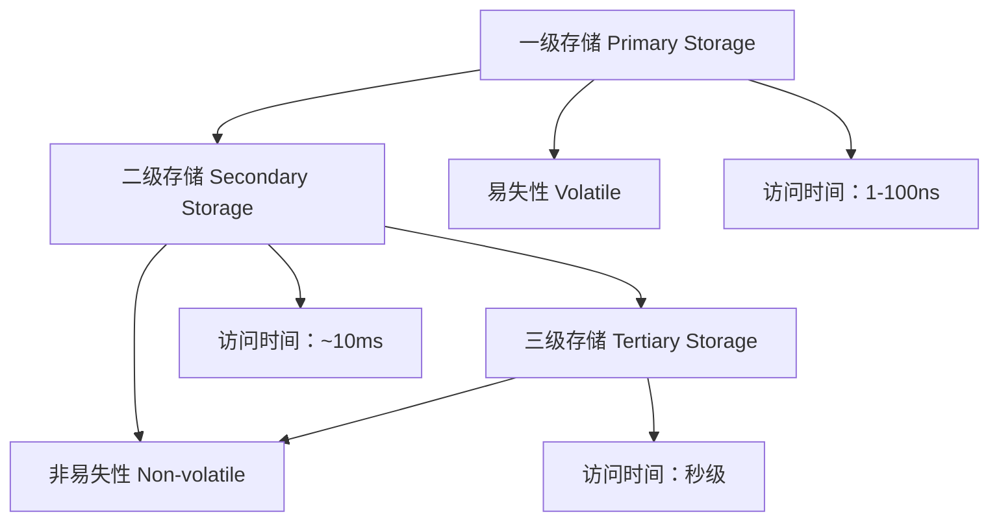
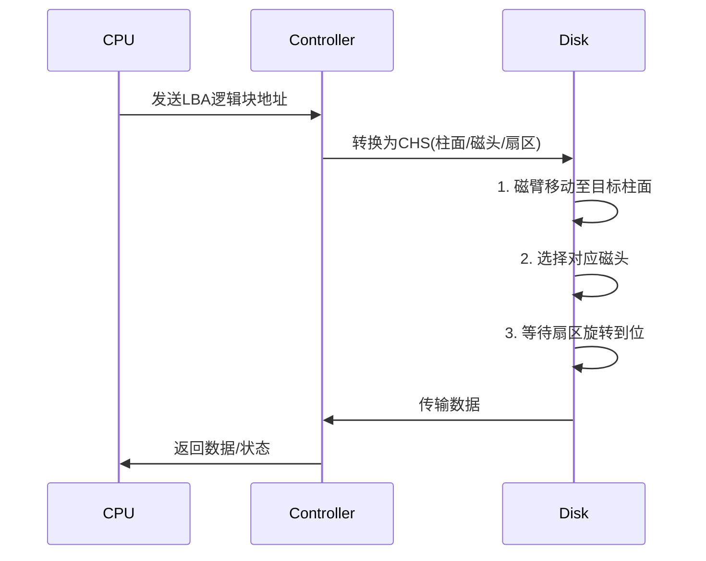
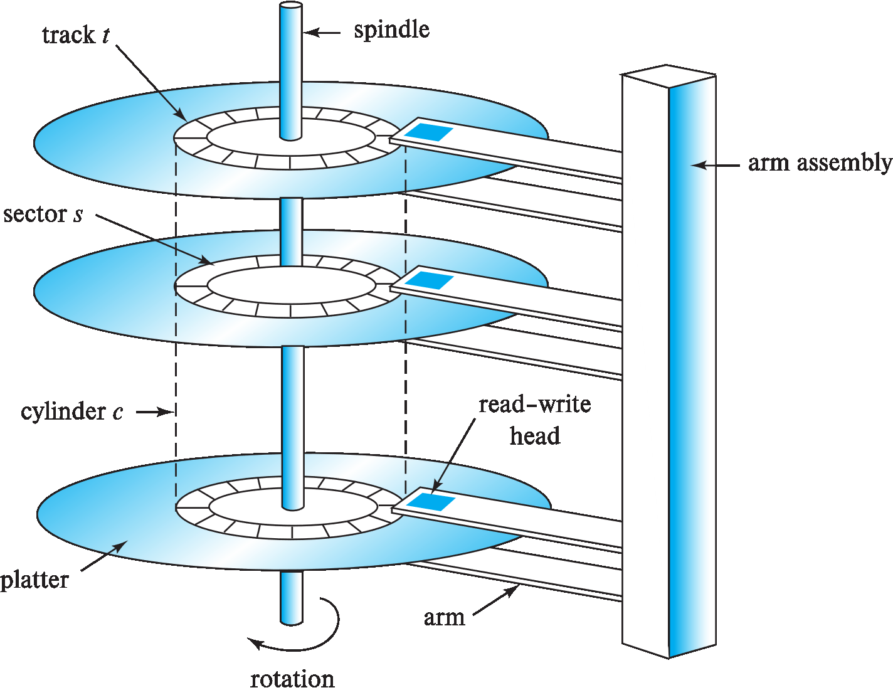
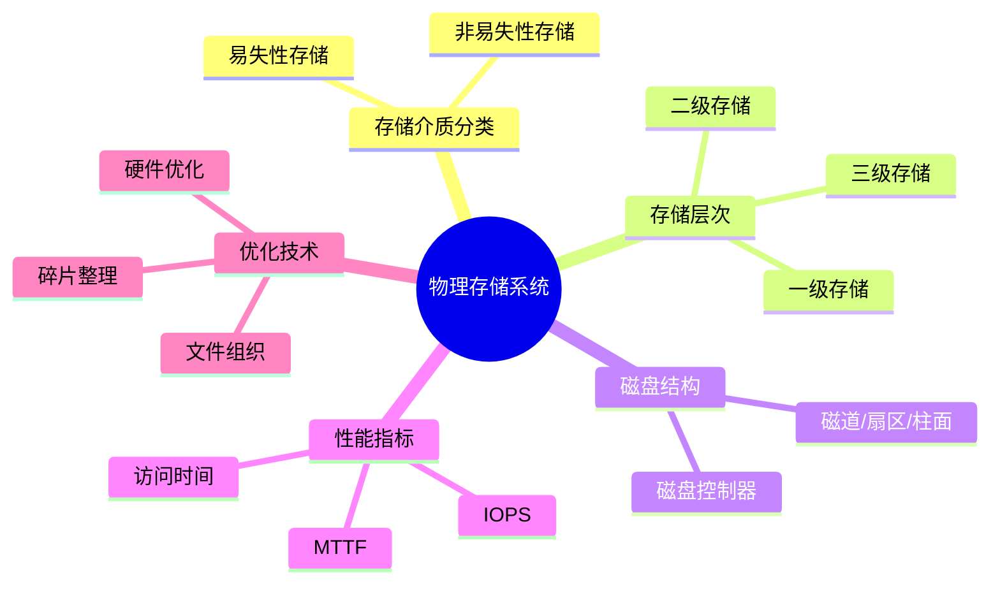

# Lecture 8: Physical Storage Systems

这一节其实和数据库关系不太大了（计组.jpg），走个过场即可。

## 一、物理存储介质分类 (Classification of Physical Storage Media)

### 1. 基本分类

- **易失性存储 (Volatile storage)**：
    - 断电后数据丢失
    - 例如：主存储器（main memory），高速缓存（cache）

- **非易失性存储 (Non-volatile storage)**：
    - 断电后数据持久保存
    - 包括二级存储（secondary storage）、三级存储（tertiary storage）和电池支持的主存

### 2. 存储介质选择因素
| 因素 | 说明 |
|------|------|
| 数据访问速度 | 不同介质访问时间差异巨大（ns~ms级） |
| 单位数据成本 | 高速存储成本 > 低速存储成本 |
| 可靠性 | 非易失性存储 > 易失性存储 |

## 二、存储层次结构 (Storage Hierarchy)

### 1. 三级存储体系


### 2. 各级存储特性
| 存储级别 | 别名 | 典型介质 | 访问时间 | 易失性 |
|----------|------|----------|----------|--------|
| **一级存储** | 主存 | 高速缓存(cache)<br>主存(main memory) | 1-100ns | 易失 |
| **二级存储** | 在线存储 | 闪存(flash)<br>磁盘(magnetic disk) | ~10ms | 非易失 |
| **三级存储** | 离线存储 | 磁带(magnetic tape)<br>光盘(optical disk) | 秒级 | 非易失 |

## 三、存储接口 (Storage Interfaces)

### 1. 磁盘接口标准
| 标准 | 速率 | 应用场景 |
|------|------|----------|
| **SATA** | 最高6Gb/s | 普通计算机 |
| **SAS** | 最高12Gb/s | 服务器 |
| **NVMe** | 最高24Gb/s | SSD固态硬盘 |

### 2. 存储架构类型

- **直连存储**：
    - 磁盘直接连接计算机系统
- **SAN(存储局域网)**：
    - 高速网络连接多服务器与磁盘阵列
    - 提供块级存储接口
- **NAS(附网存储)**：
    - 网络存储设备提供文件系统接口
    - 使用NFS/SMB等网络文件协议

## 四、磁盘机制 (Magnetic Disk Mechanism)

### 1. 磁盘物理结构




- **盘片(Platter)**：存储数据的圆形磁性介质
- **磁道(Track)**：盘片表面的同心圆（5万-10万条/盘片）
- **扇区(Sector)**：
    - 最小读写单元（通常512字节）
    - 每磁道500-2000个扇区（外圈>内圈，毕竟外面周长大一些）
- **柱面(Cylinder)**：所有盘片相同半径的磁道集合

### 2. 磁盘控制器功能

1. 接收高级读写命令
2. 移动磁臂到目标磁道
3. 计算并附加**校验和(checksum)** 
4. 写后验证机制
5. **坏扇区重映射(Remapping)**

## 五、磁盘性能指标 (Performance Measures)

### 1. 访问时间组成
| 指标 | 说明 | 典型值 |
|------|------|--------|
| **寻道时间(Seek time)** | 磁臂定位磁道时间 | 4-10ms |
| **旋转延迟(Rotational latency)** | 扇区转到磁头下时间 | 4-11ms |
| **数据传输率(Data-transfer rate)** | 数据从磁盘读取或写入磁盘的速度 | 25-200MB/s |

> \( \text{平均访问时间} = \text{平均寻道时间} + \text{平均旋转延迟} \approx \left(\frac{1}{2} \times \text{最大寻道时间}\right) + \left(\frac{1}{2} \times \text{旋转周期}\right) \)

### 2. 可靠性指标
我们用**MTTF(平均故障时间)**表示其可靠性：

  - 新磁盘：50万-120万小时
  - 举例：1000块MTTF 120万小时的磁盘，平均每1200小时故障1块
  - 随使用时间增加而降低

### 3. 访问模式性能
| 模式 | IOPS（Input/Output Operations Per Second，即每秒输入输出操作次数） | 特点 |
|------|------|------|
| **顺序访问** | 高 | 连续块请求，只需一次寻道 |
| **随机访问** | 较低 | 离散块请求，每次需寻道 |

## 六、磁盘访问优化 (Optimization Techniques)

### 1. 硬件级优化
| 技术 | 原理 | 效果 |
|------|------|------|
| **缓冲(Buffering)** | 内存缓存常用磁盘块 | 减少物理I/O |
| **预读(Read-ahead)** | 提前读取相邻扇区 | 利用局部性原理 |
| **磁盘臂调度** | 电梯算法重排请求顺序 | 减少磁臂移动 |

!!! note "电梯算法"

    ### 电梯算法（SCAN算法）详解

    #### 1. 基本概念
    电梯算法（又称SCAN算法）是磁盘臂调度的一种策略，其工作原理类似于电梯运行方式：

    - **单向移动**：磁头沿一个方向（如从外向内）持续移动
    - **途中服务**：处理经过磁道上的所有待处理请求
    - **到达端点后反向**：移动到最内/最外圈后改变方向

    电梯算法通过**减少磁头反向次数**，将随机I/O转化为近似顺序I/O，通常可降低平均访问时间。

    #### 2. 示例解析
    比如对于以下原始请求序列（按到达顺序）：

    ```
    R6(最内) → R3(中) → R1(最外) → R5(中) → R2(内) → R4(中)
    ```

    假设初始磁头位置在**中部**，移动方向为**向外**：

    ```mermaid
    graph TD
        subgraph 磁道位置
            A[最外 R1] --> B[中偏外 R3] --> C[中 R5/R4] --> D[中偏内 R2] --> E[最内 R6]
        end
        
        subgraph SCAN处理流程
            F[当前方向: 向外] --> G1[经过R3: 处理]
            G1 --> G2[到达R1: 处理]
            G2 --> H[反向: 向内]
            H --> I1[经过R5: 处理]
            I1 --> I2[经过R4: 处理]
            I2 --> I3[经过R2: 处理]
            I3 --> J[到达R6: 处理]
        end
    ```

    优化后的处理顺序：

    ```
    R1(最外) → R3(中偏外) → R5(中) → R4(中) → R2(中偏内) → R6(最内)
    ```

    #### 3. 与传统FIFO对比

    用FIFO方法在上述例子中经历了中→内(R6)→中(R3)→外(R1)→中(R5)→内(R2)→中(R4)的5次跨越 ，而SCAN只用了中→外→内2次跨越。

    #### 4. 算法变种

    - **LOOK算法**：提前反向（未到达物理端点时）
    - **C-SCAN**：单向循环（仅处理一个方向请求）
    - **F-SCAN**：冻结队列（移动期间新请求暂不处理）

### 2. 文件组织优化
- **连续分配**：文件块物理连续存储
- **区段分配(Extents)**：以连续块组为单位分配
- **碎片整理(Defragmentation)**：
    - 解决文件碎片化问题
    - 重组分散的文件块

### 3. 高级优化技术

- 非易失写缓冲区(Non-volatile write buffers)
- 高效查询处理算法
- SSD优化技术（针对闪存特性）

## 总结（Made By AI）
