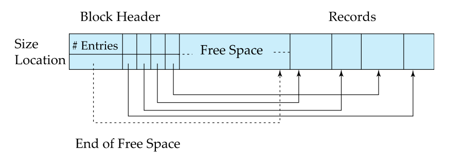
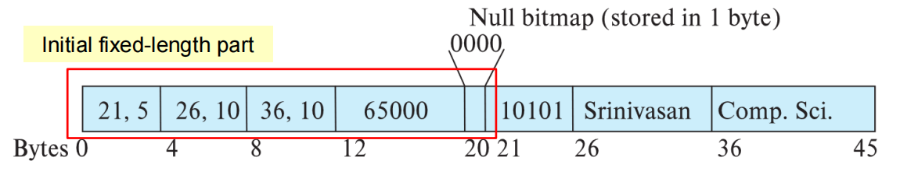
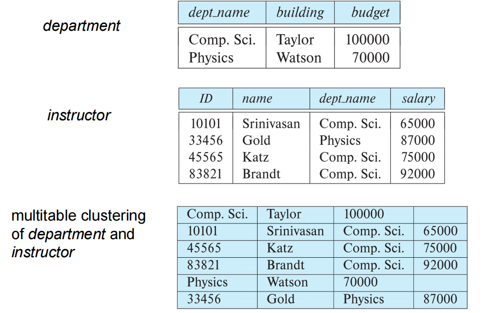
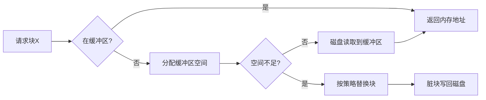
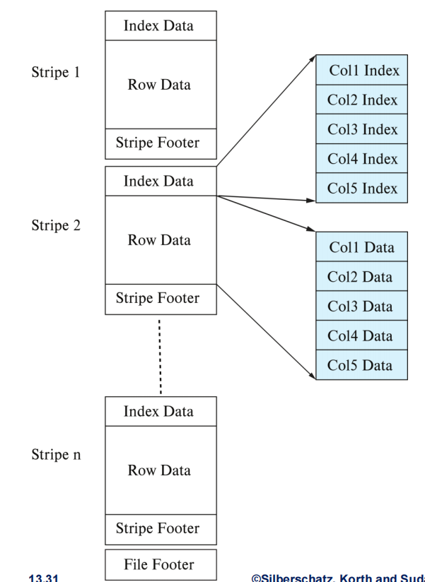
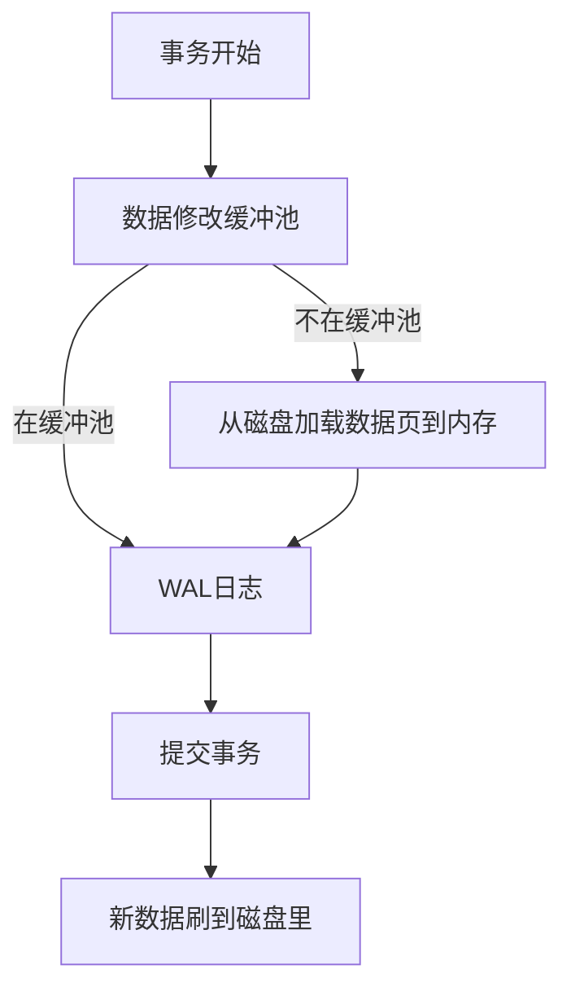

# Lecture 9: Data Storage Structure

## 1. 数据存储结构

### 1.1 文件组织基础

**文件结构层次**：数据库 → 文件集合 → 记录序列 → 字段序列

这表示数据在物理存储中的组织方式：数据库包含多个文件（文件集合），每个文件由多个记录组成，而每个记录又由多个字段组成。这是典型的**层次化数据**组织方式，便于管理和访问。

**固定长度记录**：

1. 存储位置计算：\( \text{ Record(i) } = n \cdot (i - 1) \)

      - `i` 是记录的编号（从1开始）
      - `n` 是每条记录所占的空间（字节数）

      举个栗子🌰：假设你有一个文件，里面有5条记录（record 1 到 record 5），每条记录占用10字节。

      那么这也就是说：

      - `n = 10`（每条记录长10字节）
      - `i = 1, 2, 3, 4, 5`（记录编号）

      那么我们可以算出每条记录的起始位置：

      | 记录编号 | 起始位置计算方式 | 起始位置 |
      |----------|------------------|----------|
      | record 1 | 10 × (1 - 1) = 10 × 0 | 0 字节 |
      | record 2 | 10 × (2 - 1) = 10 × 1 | 10 字节 |
      | record 3 | 10 × (3 - 1) = 10 × 2 | 20 字节 |
      | record 4 | 10 × (4 - 1) = 10 × 3 | 30 字节 |
      | record 5 | 10 × (5 - 1) = 10 × 4 | 40 字节 |

      因为每条记录长度是固定的（比如都是10字节），所以你可以通过简单的数学公式直接定位到任意一条记录的位置：比如你想访问第3条记录，你就知道它从第20字节开始读取，读到第29字节结束（共10字节）。

      这就像你在图书馆里找书：如果每本书都一样厚，排成一排，那你可以直接根据它的序号快速找到它的位置。

2. **删除处理策略**：

    当删除一条记录时，由于记录是**固定长度、顺序存储**的，不能简单留下空位，否则会影响后续查找效率。有三种常见策略：

    | 策略 | 操作 | 优缺点 |
    |---|---|----|
    | 顺序前移 | 移动`i+1`至末尾记录填补空缺 | 保持连续但是操作代价高（大量数据移动） |
    | 末尾填补 | 用最后一条记录覆盖被删记录 | 速度快但是会破坏顺序 |
    | 空闲链表（最佳方案） | 维护空闲记录链表 | 高效利用空间但是需要额外空间 |

    

    ```mermaid
    graph LR
    Record0[Record0: 占用] --> Record1
    Record1[Record1: 占用] --> Record3
    Record3[Record3: 空闲] --> Record4
    Record4[Record4: 占用] --> Record5
    Record5[Record5: 空闲]

    Header[Header：空闲列表头指针] --> record3[Record3: 空闲] --> record5[Record5: 空闲]
    
    style Record3 stroke:#333,stroke-dasharray: 5 5
    style Record5 stroke:#333,stroke-dasharray: 5 5
    style record3 stroke:#333,stroke-dasharray: 5 5
    style record5 stroke:#333,stroke-dasharray: 5 5
    ```

### 1.2 变长记录处理

**定义**：在实际数据库应用中，如果一直采用固定长度存储（如`CHAR(100)`），会浪费大量空间。有些字段的长度不是固定的，各种各样的情况导致了每条记录的实际长度不一样，即为**变长记录（Variable-length Records）**。

**出现场景**：

1. **VARCHAR字段**

      - 如 `name VARCHAR(100)`，实际名字可能是 "Tom" 或 "Christopher Columbus"。
      - 不固定长度，需要**动态管理**存储空间。

2. **多类型记录混合存储**

    同一张物理文件中存储多种结构的数据（比如一个员工表里混着老师、助教、行政人员等不同类型）。这通常出现在一些老式或优化性能的设计中。

3. **重复字段（旧数据模型）**

      - 在早期数据库设计中（如层次模型、网状模型），允许字段重复出现（如一个学生有多个电话号码）。
      - 相对的，现代数据库已较少使用这种方式，而是通过关联表实现。

**存储结构**：

```plaintext
[Null位图][固定长度属性][偏移量1,长度1][偏移量2,长度2]...[变长数据]
```



!!! example "小朋友点名册"

    想象一下你是某混沌邪恶的老师，每次上课都要统计班上学生的出勤情况。你设计了一个简单的表格：

    | 姓名 | 班级 | 缺勤原因（可空） |
    |------|------|------------------|
    |aa|bb|cc|

    其中：

    - **姓名**：字符串（`VARCHAR`）
    - **班级**：字符串（`VARCHAR`）
    - **缺勤原因**：可为空（`NULL`）

    有一天你记录了这样一条信息：

    ```plaintext
    (姓名: '文子衿', 班级: '二年级1班', 缺勤原因: NULL)
    ```

    你想把这条记录**存到计算机里**，而且想尽可能**节省空间**，同时还能**快速查找**字段内容。

    那么计算机是怎么存这条记录的？

    我们把上面这条记录转换成刚才提到的计算机底层存储的样子：

    ```
    [Null位图] [固定字段] [偏移量对] ... [变长数据]
    ```

    看不懂？不急，接着往下看。

    **步骤 1**：判断哪些是变长字段

    在我们的例子中：

    - `姓名`：变长（比如“文庭”和“文子衿”长度不同）。
    - `班级`：变长（比如“二年级1班” vs “三年级12班”）。
    - `缺勤原因`：可为 NULL，也是变长字符串。

    所以它们都属于**变长字段**。

    **步骤 2**：构造 Null 位图

    总共3个字段，而第三个字段“缺勤原因”是 NULL，所以 Null 位图是：`001`；

    > 有些系统会反过来，写成 `100`，具体取决于实现。

    我们就假设这里使用的是 `001` 表示第三个字段为NULL。

    **步骤 3**：计算偏移量

    先写下所有的字段内容：

    - 姓名：`文子衿` → 9个字节（这里假定用的是 UTF-8 标准，一个汉字3字节）
    - 班级：`二年级1班` → 13个字节
    - 缺勤原因：`NULL` → 不需要存储

    分解解释每一部分：

    | 部分         | 内容                         | 含义 |
    |--------------|------------------------------|----------|
    | Null位图     | `001`                        | 第三个字段“缺勤原因”为`NULL`，而其它都非空   |
    | 固定字段     | （没有）                     | 没有 INT、DATE 这类固定长度字段，略          |
    | 偏移量1      | `(10,9)`                     | 第一个变长字段从第10字节开始，占9字节        |
    | 偏移量2      | `(19,13)`                     | 第二个变长字段从第19字节开始，占13字节      |
    | 变长数据区   | `文子衿`, `二年级1班`    | 实际的字符串内容                             |


    需要注意的是，这里假定Null位图占1字节，偏移量1和偏移量2将要各占4字节，因此

    ```
    +--------+------------+--------------+--------------+-----------+--------------+
    | 001    | (无)       | (10,9)       | (19,13)      |    文子衿  |   二年级1班   |
    +--------+------------+--------------+--------------+-----------+--------------+
    ```

### 1.3 分槽页结构（Slotted Page）

**定义**：分槽页结构是一种将记录指针和记录内容分离的页面布局方式，它允许记录在页面内移动而不影响外部引用它们的指针。

**块结构**：

```plaintext
--------------------------------------------------------------------------------
| 记录数 | 空闲空间尾 | 记录1位置/大小 | ... | 记录N位置/大小 | 空闲空间 | 记录数据 |
--------------------------------------------------------------------------------
```

**关键特性**：

- 记录可在页内移动（保持紧凑）

    如果某条记录被删除了，后面的数据可以向前移动填补空缺，同时只更新“槽表”中的位置信息即可，不需要修改其他地方的指针。

- 指针指向**页头条目**而非直接指向记录

    外部引用（如索引）并不直接指向记录本身，而是指向“槽表”中的一个入口。即使记录内容在页面内移动了，只要更新槽表里的偏移量，所有引用依然有效。

- 空闲空间动态管理

    页面中间可能有空洞（比如删除了某些记录），插入新记录时**优先使用这些空洞**，如果没有足够空间，则从页面两端向中间扩展。

!!! example "学生档案"

    想象你有一个学生档案架（相当于数据库中的一个磁盘页），这个架子有以下特点：

    - 它有编号为 `0 ~ 99` 的位置（共100个字节）。
    - 每个学生的档案必须整本放入档案架，不能断开存放。
    - 你还有一个目录表（槽表），用来记录每本学生档案的位置和长度。
    - 插入新档案时优先使用空闲空间，而不是盲目前移或后移。

    而对于这个学生档案架：

    1. 初始状态：（空页面）

        | 字节位置 | 内容         |
        |----------|--------------|
        | 0 ~ 99  | 空闲空间     |

        槽表（Slot Table）为空：`[ ]`

    2. 步骤一：插入第一条记录

        ```sql
        INSERT INTO students VALUES (1, 'Alice', 'CS');
        ```

        我们假设这条记录大小是 20 字节，而其存放：

        - 起始位置 80（从后往前放）
        - 更新槽表：添加一条记录 `(pos=80, len=20)`

        | 字节位置 | 内容         |
        |----------|--------------|
        | 0 ~ 79   | 空闲空间     |
        | 80 ~ 99  | 记录1        |

        槽表：`[ (pos=80, len=20) ]`


    2. 步骤二：插入第二条记录

        ```sql
        INSERT INTO students VALUES (2, 'Bob', 'Math');
        ```

        我们假定这条记录大小是 15 字节，对于其存放：

        - 起始位置 65（继续从后往前放）
        - 更新槽表：添加一条记录 `(pos=65, len=15)`

        | 字节位置 | 内容         |
        |----------|--------------|
        | 0 ~ 64   | 空闲空间     |
        | 65 ~ 79  | 记录2        |
        | 80 ~ 99  | 记录1        |

        槽表：`[ (pos=80, len=20), (pos=65, len=15) ]`

        注意：槽表是按插入顺序排列的，不是物理顺序。（也就是说，**逻辑与物理分离**）

    3. 步骤三：删除第一条记录

        ```sql
        DELETE FROM students WHERE id = 1;
        ```

        现在记录1被删除了：

        - 删除后不立即移动其他记录
        - 在槽表中将记录1标记为“无效”或删除


        | 字节位置 | 内容         |
        |----------|--------------|
        | 0 ~ 64   | 空闲空间     |
        | 65 ~ 79  | 记录2        |
        | 80 ~ 99  | (已删除)空闲空间 |

        槽表：`[ (pos=65, len=15) ]`

        这时候页面中间出现了空洞（80~99 是空的，前面也有空闲空间）

    4. 步骤四：插入第三条记录（较大的记录）

        ```sql
        INSERT INTO students VALUES (3, 'Donald Trump', 'e-business');
        ```

        假设这条记录大小是70字节。

        - 当前空闲空间在前段（0~64）只有65字节可用
        - 后面有个空洞（80~99）也只有20字节

        不够单独放下70字节的记录，怎么办？**这时候就进行一次紧凑整理**：

        - 把记录2移到后面去（起始位置70）
        - 前面腾出连续空间（0~69）
        - 插入新记录到0 ~ 69（70字节）

        由于通常会从页面末尾向前**紧挨着放置记录**，所以记录2被移到了70~84，而非85~99。

        最终结果如下：

        | 字节位置 | 内容         |
        |----------|--------------|
        | 0 ~ 69   | 记录3        |
        | 70 ~ 84  | 记录2        |
        | 85 ~ 99  | 空闲空间     |

        槽表：`[ (pos=70, len=15), (pos=0, len=70) ]`

    注意：

    - 槽表仍然有**两个入口**
    - 记录2的位置变了，但**槽号不变**（外部引用依然有效）
    - 页面保持紧凑，没有碎片

## 2. 文件组织方式

在数据库系统中，文件组织方式（File Organization） 是指如何将表中的记录（即数据）**物理地存储**在磁盘上。不同的组织方式会影响查询效率、插入/更新/删除性能、空间利用率以及索引结构设计等属性。


### 2.1 主要组织方式对比

| 类型 | 存储特点 | 适用场景 | I/O效率 |
|------|----------|----------|---------|
| **堆文件** | 任意位置存放 | 通用 | 中等 |
| **顺序文件** | 按搜索键排序 | 全表扫描 | 顺序访问高效 |
| **聚簇文件** | 多关系同文件存储 | 关联查询 | 关联查询高效 |
| **B+树文件** | 树形结构有序存储 | 范围查询 | 高（动态平衡） |
| **哈希文件** | 哈希值定位块 | 点查询 | 极高（精确匹配） |

### 2.2 关键技术详解

#### 1. 堆文件组织（Heap File Organization）

**核心特点**：

- 记录可以存放文件的任何空闲位置。
- 记录一旦存放通常不会移动。
- 需要高效的空闲空间管理机制。

**空闲空间管理**：

- **一级位图**（Primary Bitmap）：**每个磁盘块**对应一个**位图项**，位图项的值表示这个块中**有多少空闲空间**（用 0~7 表示 \( \frac{1}{8} \sim \frac{7}{8} \) 的空闲比例），3位足够表示0到7的数值（正好覆盖 0% 到 100% 的空闲比例，步长为 12.5%）。

    !!! example
        
        在下面这个一级位图中，

        ```plaintext
        [4, 2, 1, 4, 7, 3, 6, 5, 1, 2, 0, 1, 1, 0, 5, 6]
        ```

        - 第0块：4/8 = 50% 空闲
        - 第1块：2/8 = 25% 空闲

            ......

        - 第4块：7/8 = 87.5% 空闲 （此块有很多空闲！）
  
    **优点**：
    
    - 精确度高：能知道每一块的具体空闲比例；
    - 插入记录时可以选择合适的位置。

    **缺点**：查找空闲块效率低，要遍历整个数组才能找到合适的块；

- **二级位图**（Secondary Bitmap）：为了提高查找效率，在一级位图的基础上建立“摘要层”，也就是记录**每组块的最大空闲值**。

    !!! example

        比如下面的示例中，每组分了4个块。

        ```plaintext
        一级位图：[4,2,1,4, 7,3,6,5, 1,2,0,1, 1,0,5,6]
        分组：    [0, 3]   [4, 7]   [8, 11]  [12, 15]
        二级位图：[4,        7,        2,        6]
        ```

        解释：

        - 第一组（块0~3）最大空闲比例是 4（即 50%）
        - 第二组（块4~7）最大是 7（即 87.5%）（所以说这组很适合插入）
        - 第三组最大是 2（25%）
        - 第四组最大是 6（75%）

    **优点**：把多个块分成一组，而每个组记录其中最大的空闲比例，就能实现先看“摘要”，再决定要不要深入查看一级位图。这么做能够**快速定位**“可能有空闲空间”的块组，也**减少扫描一级位图的次数**，进而**提升插入效率**。

    **缺点**：
    
    - 需要维护两层结构，增加复杂度；
    - 更新时需要同步更新一级和二级位图；

#### 2. 顺序文件组织（Sequential File Organization）

**定义**：在顺序文件中，数据是**按搜索键（如主键 ID）物理有序存储**的，插入新记录时，必须保证它放在正确的位置，保持整体有序，这种组织方式就叫做顺序文件组织。

**存储特点**：按照搜索键物理有序存储。

**插入处理**：

- 有空闲空间：直接插入适当位置
- 无空闲空间：使用溢出块

这概念不太好懂，请看下面：

**情况一**：有空闲空间，直接插入

假设你的磁盘块里有空位：

```
[10101] [12121] [____] [15151] [22222]
```

你想插入一条 `id=13456` 的记录：

它应该插在 `12121` 和 `15151` 之间，因为中间有一个空位，可以直接放进去，而它插入后仍保持物理有序：

```
[10101] [12121] [13456] [15151] [22222]
```

**情况二**：没有空闲空间，使用溢出块

如果当前磁盘块长下面这样（它已满了）：

```
[10101] [12121] [15151] [22222]
```

你现在想插入 `id=13456`，怎么办？

**没有空位，无法把所有记录往后移**（即便有，那样做的代价也太高），所以数据库引入了“溢出块”机制：

!!! note "溢出块"

    溢出块是一个额外的磁盘块，专门用来存放那些“插不进主区”的记录，这样主区保持原有顺序不变。

    而新记录放入溢出块，并用**指针连接到前后记录**。

对于主区（Main Block）：

```
[10101] → [12121] → [15151] → [22222]
```

而溢出区（Overflow Block）：

```
[13456]
```

通过指针链接成这样：

```
... → 12121 → 13456 → 15151 → ...
```

注意：

- 查询时要顺着链表查找；
- 这样虽然可以插入，但破坏了原本的“连续有序”结构；
- 随着时间推移，溢出链会越来越长，查询效率下降。

> 这种组织方式需要定期重组（Reorganization）以保持顺序。
> 
> **定期重组** 是指将主区与溢出块中的记录重新整理，恢复物理上的有序存储结构。
>
> 具体而言，当溢出链太长（影响查询性能）时或者系统维护期间就自动执行（当然可以手动）。
>
> 而定期重组主要做的是**把主区和溢出块中的所有记录合并**、**按照搜索键排序**、将空位**重新分配**到新的或清理后的主区中 以及 **删除原来的溢出链**。

#### 3. 多表聚簇文件组织（Multitable Clustering）

**定义**：多表聚簇文件组织是一种将**多个相关表的数据物理上存储在一起**的组织方式。

举个简单例子：



- 每个“部门 + 所属教师”作为一个整体存储；
- 这样在查询“某个系的所有老师”时，只需要一次 I/O 即可获取所有相关信息；

**优点**：

- 关联查询效率极高（减少I/O）。
- 局部性优化（相关数据集中存储）。

**缺点**：

- 单表查询效率降低。
- 产生变长记录。

#### 4. 分区（Partitioning）

**定义**：这个一看名字就懂了，按某种条件或者规则将表分割为多个物理部分，最终实现提升查询效率、优化存储等功能。


示例（按年份分区）：

```sql
transaction_2018(..., year=2018)
transaction_2019(..., year=2019)
```

**存储优化**：使用冷热数据分离。

| 数据类型 | 特点 | 存储建议 |
|----------|------|-----------|
| **热数据（Hot Data）** | 访问频繁、实时性强 | 存在 SSD 上，速度快 |
| **冷数据（Cold Data）** | 几乎不访问、历史数据 | 存在 HDD 或磁带上，成本低 |

- SSD（Solid State Drive，固态硬盘）：存放当前年度分区（高访问频率），这类数据对响应速度要求很高，SSD又快又好。
- HDD（Hard Disk Drive，硬盘驱动器）：存放历史年度分区（低访问频率），这类数据可以接受较慢的响应时间，因此可以存储在HDD上，以节省成本。

> B+树和哈希组织方式将在第14章(Lecture 10)详细讨论

## 3. 数据字典与缓冲区

### 3.1 数据字典（系统目录）

**定义**：数据字典是数据库用来存储“关于数据的数据”的地方。它记录了数据库中所有对象的元信息（Metadata），也就是描述数据库结构和行为的信息。

**存储内容**：

- 关系元数据（表名、属性名、类型、约束（如主键、外键））
- 物理存储信息（存储类型（堆文件、B+树等）、文件路径或页号）
- 用户权限与统计信息（哪些用户可以访问或修改哪些表、行数、索引分布等（用于查询优化器））

**关系表示例**：

```sql
CREATE TABLE metadata (
    relation_name VARCHAR(50),
    attribute_count INT,
    storage_type VARCHAR(20), -- heap/btree/hash
    location VARCHAR(100)
);
```

对于这样一张简化的数据字典表（实际可能更复杂）：

| 列名 | 类型 | 含义 |
|------|------|------|
| `relation_name` | `VARCHAR(50)` | 表名（即关系名） |
| `attribute_count` | `INT` | 属性数量（即字段数量） |
| `storage_type` | `VARCHAR(20)` | 存储方式，例如：堆文件（heap）、B+树、哈希等 |
| `location` | `VARCHAR(100)` | 物理存储位置（比如磁盘文件路径、页面编号等） |

由此你也可以看到，数据字典是数据库的核心组成部分，它存储了所有表的结构、存储方式、位置、权限和统计信息等信息，是数据库进行查询解析、执行、优化和管理的基础。

### 3.2 缓冲区管理

**缓冲区管理**：它是数据库系统中的一个组件，负责将**磁盘上的数据块缓存到内存**中，以提高访问效率。

> 磁盘 I/O 很慢，内存读写速度比磁盘快很多，所以数据库使用一块叫做 缓冲池（Buffer Pool） 的内存区域来缓存常用的数据块。
> 
> 这个过程就像操作系统用内存做文件缓存一样。

**缓冲池工作流程**：(一看就懂！)



**关键机制**：

- **PIN操作**：锁定块防止被替换。

    什么意思呢？就是说，当某个线程正在访问一个块时，存在并发访问，此时不允许其他线程将其替换或释放。
    
    `pin_count`是一个引用计数器，只有当所有持有 PIN 的线程都调用`unpin()`后，该块才可能被替换，有点类似于操作系统的“锁”机制：你可以把它理解成一种“临时锁定”，防止块在使用过程中被换出。

    ```c
    pin_count ++;  // 加锁
    read_data();  // 安全读写
    unpin();      // 解锁
    ```

- **替换策略**：

    | 策略 | 原理 | 适用场景 |
    |------|------|----------|
    | LRU | 替换最久未使用块 | 通用 |
    | MRU | 替换最近使用块 | 嵌套循环连接 |
    | Toss-immediate | 处理完立即释放 | 仅需单次扫描 |

    1. LRU（最久未使用）
    
        维护一个使用时间队列，**最近使用**的放在**队尾**，**最久未使用**的在**队头**，满时替换队头块（容易受到“一次性扫描”干扰）。

    2. MRU（最近使用）
    
        替换最近刚使用的块（看起来奇怪？但在某些特殊查询（如嵌套循环）中很有用）**防止重复加载**同一块多次。

    3. Toss-immediate（即用即弃）
    
        数据块只使用一次，使用后立即释放，**避免污染缓冲池**（适用于全表扫描等单次操作）。

## 4. 存储

### 4.1 列存储 vs 行存储

- **列存储**：列存储是将每一列的数据单独存储，而不是按行存储。
- **行存储**：行存储是将整行记录连续地存储在一起。

| 特性 | 行存储 | 列存储 |
|------|--------|--------|
| **存储结构** | 行数据连续存储 | 列数据连续存储 |
| **I/O效率** | 读整行即使只需部分列 | 仅读取所需列 |
| **压缩率** | 低（异构数据） | 高（同质数据） |
| **适用场景** | OLTP事务处理 | OLAP分析查询 |
| **更新代价** | 低 | 高 |

!!! example "列存储与行存储"

    假设你有如下一张表 `instructor`：

    | ID     | name         | dept_name   | salary |
    |--------|--------------|-------------|--------|
    | 10101  | Srinivasan   | Comp.Sci.   | 65000  |
    | 12121  | Wu           | Finance     | 90000  |
    | 15151  | Mozart       | Music       | 40000  |

    在磁盘上，行存储会这样保存：

    ```
    [10101, 'Srinivasan', 'Comp.Sci.', 65000]
    [12121, 'Wu', 'Finance', 90000]
    [15151, 'Mozart', 'Music', 40000]
    ```

    每个记录作为一个整体存储。

    同样的 `instructor` 表，在列存储中是这样组织的：

    ```plaintext
    ID列:    [10101, 12121, 15151]
    name列:  ['Srinivasan', 'Wu', 'Mozart']
    dept列:  ['Comp.Sci.', 'Finance', 'Music']
    salary列:[65000, 90000, 40000]
    ```

    每一列单独存储在一个文件或块中。

用哪一个具体取决于你的**使用场景**：

- 场景一：OLTP（联机事务处理）。银行系统、电商订单系统，更适合用 **行存储**，因为它支持快速插入/更新一行，也能一次性读取完整信息；

- 场景二：OLAP（联机分析处理）。报表系统、数据分析平台（它们需要查询大量数据并且只关心某些列；它们很少更新，主要用于聚合统计），更适合用 **列存储**，因为它能高效读取特定列，数据压缩率高节省空间，更适合向量化执行引擎加速计算。

### 4.2 混合存储格式(ORC（Optimized Row Columnar）/Parquet)

混合存储，顾名思义，它不是纯粹的行存储，也不是纯粹的列存储，而是结合了两者的优点的一种结构化数据存储方式。

- **ORC文件结构**：

<!DOCTYPE html>
<html lang="zh-CN">
<head>
  <meta charset="UTF-8">
  <title>ORC 文件结构</title>
  <style>
    table {
      border-collapse: collapse;
      width: 100%;
      font-family: Arial, sans-serif;
    }
    th, td {
      border: 1px solid #333;
      padding: 10px;
      text-align: center;
    }
    .sub-item {
      font-size: 0.9em;
      color: #555;
      text-align: left;
    }
  </style>
</head>
<body>

<h2>ORC 文件结构示意图</h2>

<table>
  <tr>
    <th colspan="4">文件头（File Header）</th>
  </tr>
  <tr>
    <td><strong>Stripe 1</strong><br><span class="sub-item">・ 索引数据<br>・ 行数据<br>・ Footer</span></td>
    <td><strong>Stripe 2</strong><br><span class="sub-item">・ 索引数据<br>・ 行数据<br>・ Footer</span></td>
    <td><strong>Stripe 3</strong><br><span class="sub-item">・ 索引数据<br>・ 行数据<br>・ Footer</span></td>
    <td>...</td>
  </tr>
</table>

</body>
</html>



1. 文件头（File Header）

      - 标识这是一个 ORC 文件；
      - 包含文件的基本信息（如版本号、压缩算法等）；

2. Stripe

    - 这是 ORC 文件的核心单位；
    - 一个 Stripe 相当于一个小的列式存储单元，通常大小为 **256MB ~ 1GB**，可配置；
    - 每个 Stripe 包含：

        - **列数据（Column Data）**
        - **索引信息（Index Data）**
        - **元数据（Footer）**

3. 列数据（Column Data）

      - 数据按列存储；
      - 每列数据单独存放；
      - 支持高效压缩（如字典编码等）；

4. 索引信息（Index Data）

      - 可以加速谓词下推（Predicate Pushdown）；
      - 比如 `WHERE salary > 100000`，可以直接跳过不满足条件的 Stripe；
      - 包括每列的统计信息（如最小值、最大值、空值数量等）；

5. Footer 元数据

      - 描述该 Stripe 中各列的位置、长度、类型等；
      - 用于快速定位和解析列数据；

## 5. SQL与存储层关联

### 5.1 索引的物理实现

譬如在下面这个语句中，

```sql
CREATE INDEX idx_name ON student(name);
```

我们在数据库表`student`上创建名为`idx_name`的索引的SQL语句，该索引基于列`name`。这意味着对于`student`表中的每一个`name`值，都会在索引`idx_name`中有一个对应的入口。

而其对应的**物理表现**：
  
- B+树或哈希结构：B+允许快速查找、顺序访问、插入及删除操作；而哈希索引则提供了一种更直接的方法来进行查找，但不支持范围查询。
- 叶子节点存储记录物理位置指针：非叶子节点存储键值以及指向子节点的指针，而所有叶子节点都在同一层，并包含实际的数据行的物理地址（指针），这使得对数据行的访问非常高效。
- 缓冲池缓存热点索引页：这个老生常谈，主要是减少直接访问磁盘读取数据的需求。

### 5.2 连接操作的IO优化

在下面的这个SQL语句中，

```sql
SELECT name
FROM orders NATURAL JOIN customers
```

这是一个看起来很简单的`JOIN`操作，但这个查询在底层执行时，如果数据量大、设计不合理，会导致大量磁盘 I/O，影响性能。

于是数据库系统会通过一些**物理存储和访问策略**来优化这种连接操作的 I/O 效率。

**底层优化**：

- 聚簇文件减少关联I/O：把多个相关表的数据**物理存储在一起**，形成一种结构化的组织方式。
- 缓冲池保留被多次访问的维度表：在连接中，**维度表（Dimension Table）** 是较小且被频繁访问的表；而**事实表（Fact Table）**，相对地，数据量大。
- 列存储优化投影属性访问：“投影属性”就是 SELECT 中指定的字段，比如上面的查询，我们就只关心`name`列，所以查询时只需读取它即可，节省 I/O；

### 5.3 事务与存储协同

**ACID实现**：



- **日志先行**（WAL）：先记录操作到日志上，日志在合适的时机将操作传回磁盘。也就是说，当事务提交时，必须将日志写入磁盘（fsync），才算“真正提交”。这样就通过日志磁盘保证**持久性**（Durability）。

    如果不日志先行，比如说，你修改了一半数据页，突然就断电了，那数据不一致，也无法恢复中间状态；而现实是修改一半断电会直接回到事务前，这就是undo log（WAL的一种）。

- **非易失缓冲**：使用一种掉电不丢失的内存（Non-Volatile RAM / NV-RAM） 来加速日志写入和事务提交。

    为什么可以加速呢？将日志先写入NV-RAM，因为它是“非易失”的，即使断电也不会丢数据，所以可以认为写入 NV-RAM 就等同于“落盘”，这样就不需要等待真正的磁盘 I/O，事务提交速度大大加快。

## 附录：存储参数优化建议

| 参数 | 推荐值 | 影响 |
|------|--------|------|
| 块大小 | 8KB-32KB | I/O效率 |
| 缓冲池大小 | 总内存70-80% | 缓存命中率 |
| 预读窗口 | 4-16块 | 顺序扫描速度 |
| 检查点间隔 | 5-15分钟 | 恢复速度与运行时开销 |