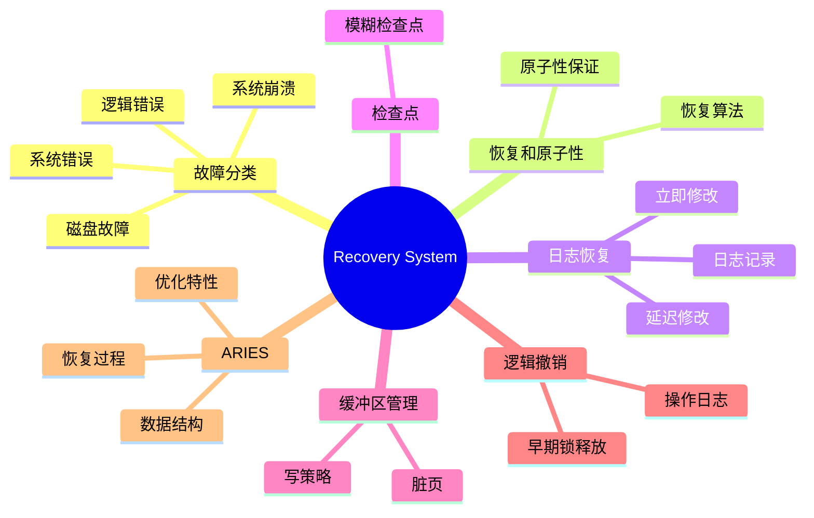

# Lecture 15: Recovery System Notes

## 一、故障分类 (Failure Classification)

### 1. 故障类型

- **逻辑错误 (Logical Errors)**  
  - 原因：事务因内部错误条件（如应用程序bug或数据不一致）无法完成。
  - 示例：输入数据违反约束条件。

- **系统错误 (System Errors)**  
  - 原因：数据库系统因错误状态（如死锁）终止活动事务。
  - 示例：两个事务互相等待资源导致死锁。

- **系统崩溃 (System Crash)**  
  - 原因：电源故障、硬件或软件失败导致系统崩溃。
  - 假设：故障停止假说（Fail-stop assumption），即非易失性存储内容不会因崩溃而损坏。
  - 保护措施：数据库系统有多个完整性检查防止磁盘数据损坏。

- **磁盘故障 (Disk Failure)**  
  - 原因：磁头碰撞或其他磁盘故障破坏全部或部分磁盘存储。
  - 检测：磁盘驱动器使用校验和（checksums）检测故障。

### 2. 故障影响

| 故障类型       | 影响                   | 恢复措施         |
|----------------|------------------------|------------------|
| 事务失败       | 事务未完成需回滚       | 使用日志撤销     |
| 系统崩溃       | 数据库需恢复一致状态   | 日志重做和撤销   |
| 磁盘故障       | 数据丢失需从备份恢复   | 备份+日志恢复   |

---

## 二、恢复和原子性 (Recovery and Atomicity)

### 1. 恢复算法的核心

恢复算法分为两部分：

- **正常事务处理期间的动作**  
  - 记录足够信息（如日志），确保故障后可恢复。
  - 示例：写日志记录到稳定存储。

- **故障后的恢复动作**  
  - 将数据库恢复到一致状态，保证原子性、一致性和持久性。
  - 示例：撤销未提交事务，重做已提交事务。

### 2. 原子性保证

- **问题**：事务中途失败可能导致数据库不一致。
  - 示例：事务 \( T_i \) 从账户 A 转 50 美元到 B，若 A 已扣款但 B 未加款时崩溃。
- **解决方案**：先将修改信息输出到稳定存储（如日志），再更新数据库。
- **替代方案**：影子复制（Shadow-copy）和影子分页（Shadow-paging），书中简述，不常用。

---

## 三、基于日志的恢复 (Log-Based Recovery)

### 1. 日志基础

- **日志 (Log)**  
  - 定义：记录数据库更新活动的序列，存储在稳定存储上。
  - 特点：通过多份非易失性介质副本近似实现故障耐受。

- **日志记录类型**  
  - `<T_i start>`：事务 \( T_i \) 开始。
  - `<T_i, X, V_1, V_2>`：事务 \( T_i \) 将数据项 \( X \) 从旧值 \( V_1 \) 更新为新值 \( V_2 \)。
  - `<T_i commit>`：事务 \( T_i \) 提交。
  - `<T_i abort>`：事务 \( T_i \) 中止。

### 2. 立即数据库修改 (Immediate Database Modification)

- **特点**  
  - 未提交事务的更新可写入缓冲区或磁盘。
  - **写前日志 (Write-Ahead Logging, WAL)**：更新数据库前必须先写日志到稳定存储。
- **提交**  
  - 当 `<T_i commit>` 记录写入稳定存储时，事务提交。
  - 更新块可在此前后写入磁盘，顺序灵活。
- **示例**  
  ```
  Log: <T_0 start>, <T_0, A, 1000, 950>, <T_0, B, 2000, 2050>, <T_0 commit>
  Write: A=950, B=2050
  Output: B_B, B_A (顺序随意)
  ```

### 3. 延迟数据库修改 (Deferred Database Modification)

- **特点**  
  - 仅在事务提交时更新缓冲区/磁盘。
  - 优点：简化恢复。
  - 缺点：需存储事务本地副本，增加开销。

### 4. 并发控制与恢复

- **共享资源**：并发事务共享磁盘缓冲区和日志。
- **锁机制**：  
  - 若 \( T_i \) 修改数据项，其他事务在 \( T_i \) 提交或中止前不可修改。
  - 使用严格两阶段锁（Strict 2PL）确保更新不可见。
- **日志交错**：不同事务的日志记录可能交错存储。

### 5. 撤销与重做

- **撤销 (Undo)**  
  - 操作：将数据项恢复到旧值 \( V_1 \)。
  - 日志：记录补偿日志 `<T_i, X, V_1>`。
  - 完成：写 `<T_i abort>`。
- **重做 (Redo)**  
  - 操作：将数据项设置为新值 \( V_2 \)。
  - 无需额外日志。

### 6. 故障恢复规则

| 日志状态                     | 动作       |
|------------------------------|------------|
| 有 `<T_i start>` 无 `<T_i commit>` 或 `<T_i abort>` | 撤销 \( T_i \) |
| 有 `<T_i start>` 和 `<T_i commit>` 或 `<T_i abort>` | 重做 \( T_i \) |

- **重复历史 (Repeating History)**  
  - 重做包括恢复旧值的步骤，简化恢复但略显冗余。

---

## 四、检查点 (Checkpoints)

### 1. 检查点作用

- **减少恢复时间**：无需从日志开头扫描。
- **定期记录**：将缓冲区状态写入稳定存储。

### 2. 检查点过程

- **模糊检查点 (Fuzzy Checkpoint)**  
  - 不强制脏页立即写入磁盘。
  - 记录脏页表和活动事务列表。
- **ARIES 优化**：后续详述。

---

## 五、缓冲区管理 (Buffer Management)

### 1. 缓冲区概念

- **脏页 (Dirty Page)**：缓冲区中被修改但未写入磁盘的页面。
- **固定 (Pin)**：锁定页面防止换出。
- **解除固定 (Unpin)**：允许页面换出。

### 2. 写策略

| 策略     | 定义                                   | 影响             |
|----------|----------------------------------------|------------------|
| **强制写 (Force)** | 提交时强制所有更新写入磁盘             | 保证持久性但慢   |
| **偷写 (Steal)**   | 允许未提交更新写入磁盘                 | 需撤销支持       |

---

## 六、早期锁释放和逻辑撤销操作 (Early Lock Release and Logical Undo Operations)

### 1. 早期锁释放

- **场景**：如 B+ 树插入/删除，锁提前释放。
- **问题**：物理撤销不可行，因其他事务可能已更新。

### 2. 逻辑撤销

- **逻辑撤销日志 (Logical Undo Logging)**  
  - 记录撤销操作而非旧值。
  - 示例：插入撤销为删除操作。

- **操作日志 (Operation Logging)**  
  - 开始：`<T_j, O_j, operation-begin>`。
  - 执行：记录物理重做和撤销信息。
  - 结束：`<T_j, O_j, operation-end, U>`，\( U \) 为逻辑撤销信息。
  - 示例：插入 `(K5, RID7)` 到索引 I9：
    ```
    <T1, O1, operation-begin>
    <T1, X, 10, K5>
    <T1, Y, 45, RID7>
    <T1, O1, operation-end, (delete I9, K5, RID7)>
    ```

- **恢复逻辑**  
  - 未完成：使用物理撤销。
  - 已完成：使用 \( U \) 逻辑撤销，忽略物理撤销。

### 3. 事务回滚

- **回滚步骤**  
  1. 逆向扫描日志。
  2. 物理撤销：`<T_i, X, V_1, V_2>` -> `<T_i, X, V_1>`。
  3. 逻辑撤销：`<T_i, O_j, operation-end, U>` -> 执行 \( U \)，记录 `<T_i, O_j, operation-abort>`。
  4. 跳过已撤销操作。
  5. 结束：`<T_i, abort>`。

---

## 七、ARIES 恢复算法 (ARIES Recovery Algorithm)

### 1. ARIES 概述

- **特点**：先进的恢复方法，优化正常处理和恢复。
- **关键技术**  
  - **日志序列号 (LSN)**：标识日志记录。
  - **页面 LSN (PageLSN)**：记录页面上最后应用的 LSN。
  - **生理重做 (Physiological Redo)**：页面物理标识，操作逻辑记录，减少日志开销。

### 2. ARIES 数据结构

- **脏页表 (Dirty Page Table)**  
  - 记录缓冲区中被修改的页面。
  - 字段：PageLSN（最后更新LSN），RecLSN（磁盘版本已应用的LSN）。
- **检查点日志**  
  - 包含：脏页表、活动事务列表、每个事务的 LastLSN。
  - 特点：不强制写脏页，低开销。

- **日志记录**  
  - 结构：`LSN | TransID | PrevLSN | RedoInfo | UndoInfo`。
  - **补偿日志记录 (CLR)**：记录恢复动作，无需撤销，含 UndoNextLSN。

### 3. ARIES 恢复过程

- **三个阶段**  
  1. **分析阶段 (Analysis Pass)**  
     - 从最后检查点开始。
     - 确定：需撤销的事务、脏页、RedoLSN（重做起点）。
  2. **重做阶段 (Redo Pass)**  
     - 从 RedoLSN 开始重复历史。
     - 条件：若页面不在脏页表或 LSN < RecLSN，跳过；否则重做。
  3. **撤销阶段 (Undo Pass)**  
     - 逆向回滚未完成事务。
     - 优化：跳过已撤销记录，使用 UndoNextLSN。

### 4. 其他特性

- **页面独立恢复**：部分页面可单独从备份恢复。
- **保存点 (Savepoints)**：支持部分回滚，如死锁处理。
- **细粒度锁**：支持元组级索引锁，需逻辑撤销。

---

## 八、主存数据库恢复 (Recovery in Main Memory Databases)

- **优化**  
  - 无需索引重做日志：内存重建快。
  - 无需撤销日志：仅提交数据写磁盘。
  - 并行恢复：快速加载和恢复。

---

## 总结图解

