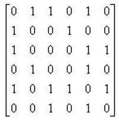

# 图：深度优先搜索（Depth-First Search, DFS）

## 一、DFS基本概念与模板

### 1. DFS简介

深度优先搜索（Depth-First Search, DFS）是一种图遍历算法，从一个顶点开始，沿着路径尽可能深入探索，直到无路可走时回溯。可以看作是树的前序遍历在图上的扩展。

### 2. DFS基本模板

以下是使用邻接表实现的DFS模板：

```c
void DFS(Vertex V) {
    visited[V] = true;  // 标记当前顶点，避免重复访问
    for (each W adjacent to V) {
        if (!visited[W]) {
            DFS(W);  // 递归访问未访问的邻接顶点
        }
    }
}
```

- **时间复杂度**：O(|E| + |V|)，其中 |E| 是边的数量，|V| 是顶点的数量（适用于邻接表表示的图）。
- **关键点**：使用 `visited` 数组防止在有环的图中陷入循环。

!!! example "DFS查找邻接表例题"
    
    （**FDS HW11**）Given the adjacency matrix of a graph as shown by the figure. Then starting from V5, an impossible DFS sequence is:
    
    

    A. V5, V6, V3, V1, V2, V4  
    
    B. V5, V1, V2, V4, V3, V6  
    
    C. V5, V1, V3, V6, V4, V2  
    
    D. V5, V3, V1, V2, V4, V6

    注意到\((V6, V4)\)不可能连通，所以选C。

## 二、DFS在无向图中的应用：连通分量

### 1. 连通分量定义

前面图论部分的笔记已经讲过，不再赘述。

### 2. 使用DFS寻找连通分量

通过对图中每个未访问的顶点调用DFS，可以找到所有连通分量：

```c
void ListComponents(Graph G) {
    for (each V in G) {
        if (!visited[V]) {
            DFS(V);  // 遍历一个连通分量
            printf("\n");  // 分隔不同连通分量
        }
    }
}
```

### 3. 示例

对于一个包含顶点 0 到 8 的无向图：

- DFS从顶点 0 开始，访问顺序可能是：0 → 1 → 4 → 6 → 5 → 2 → 3
- 然后从顶点 7 开始，访问 7 → 8
- 输出结果：

    ```
    0 1 4 6 5 2 3
    7 8
    ```

    表示图中有两个连通分量。

## 三、DFS在双连通性中的应用

### 1. 双连通性相关定义

- **关节点（Articulation Point）**：移除该顶点及其相关边后，图的连通分量数增加。
- **双连通图（Biconnected Graph）**：连通且无关节点的图。
- **双连通分量（Biconnected Component）**：图中最大的双连通子图。
- **注意**：双连通分量之间没有共享边，边的集合被双连通分量划分。

### 2. 使用DFS寻找双连通分量

#### 2.1 DFS生成树

DFS遍历图时，生成一棵深度优先生成树：

- **树边**：生成树中的边。
- **回边（Back Edge）**：连接顶点到其祖先的非树边。

#### 2.2 关节点的判定

- **根节点**：如果根节点至少有两个子节点，则为关节点。
- **非根节点 u**：如果 u 有子节点 w，且 w 及其后代无法通过回边到达 u 的祖先，则 u 是关节点。

#### 2.3 Num 和 Low 数组

- **Num[u]**：顶点 u 在DFS中的访问序号。
- **Low[u]**：u 及其后代通过回边能到达的最小 Num 值。
- **计算公式**：

    \[
    \text{Low}[u] = \min \left\{ \text{Num}[u], \min_{\text{w is child of u}} \text{Low}[w], \min_{\text{(u,v) is back edge}} \text{Num}[v] \right\}
    \]

#### 2.4 关节点的判定条件

- **根节点**：至少有两个子节点。
- **非根节点 u**：存在子节点 w，使得

    \[
    \text{Low}[w] \geq \text{Num}[u]
    \]

### 3. 示例

对于一个包含顶点 0 到 9 的图：

- DFS 从顶点 3 开始，生成树和回边如下：
- Num 和 Low 值计算：

    | Vertex | Num | Low |
    |--------|-----|-----|
    | 0      | 4   | 0   |
    | 1      | 3   | 1   |
    | 2      | 2   | 2   |
    | 3      | 0   | 0   |
    | 4      | 1   | 1   |
    | 5      | 5   | 5   |
    | 6      | 6   | 5   |
    | 7      | 7   | 7   |
    | 8      | 9   | 8   |
    | 9      | 8   | 8   |

- 关节点分析：顶点 0 和 5 是关节点（Low 值满足条件）。

## 四、欧拉回路(Eulerian circuit)与欧拉路径(Eulerian path)

### 1. 定义
**欧拉回路**/**欧拉环**：在一个图中，如果存在一条路径，它恰好**经过每条边一次**，并且起点和终点是**同一个**顶点，那么这条路径称为欧拉回路。（闭合环）

**欧拉路径**/**欧拉通路**：在一个图中，如果存在一条路径，它恰好经过每条边一次，但起点和终点是**不相同**的两个顶点，那么这条路径称为欧拉路径。（非闭合路径）

**欧拉图**：含有欧拉回路的图是欧拉图。


### 2. 判定
 
有向图存在欧拉路径与欧拉回路的**充要条件**分别是：  

- 欧拉路径：

    - 存在一点出度比入度大1（起点），一点入度比出度大1（终点），其他点的入度均等于出度。
    - 图连通，且恰好有两个顶点的度数为奇数，路径从一个奇度顶点开始，到另一个结束。

- 欧拉回路：
    
    - 图连通，且所有点的入度等于出度。
    - 图连通，且每个顶点的度数为偶数。

无向图存在欧拉路径和欧拉回路的**充要条件**分别为：

- 欧拉路径：图连通，且恰好有两个点度是奇数，其它顶点的度都是偶数。

- 欧拉回路：图连通，每个顶点的度都是偶数。

!!! example "欧拉路径与欧拉环判定问题"

    （**FDS HW11**）For a graph, if each vertex has an even degree or only two vertexes have odd degree, we can find a cycle that visits every edge exactly once.

    **答案：**命题是部分正确的，因为结论是说“循环（或者翻译成圈）”，这显然不对，欧拉路径可以满足“only two vertexes have odd degree”，但是它是非闭合路径。

### 3. 使用DFS求解欧拉回路

- 从一个顶点开始，DFS遍历所有未访问的边。
- **实现要点**：

    - 用链表记录路径。
    - 每个邻接表维护一个指针，指向最后访问的边。

### 4. 时间复杂度

- O(|E| + |V|)：与边的数量和顶点数量线性相关。

### 5. 示例

对于一个包含顶点 1 到 12 的图, DFS可以找到一个欧拉回路，访问每条边恰好一次。