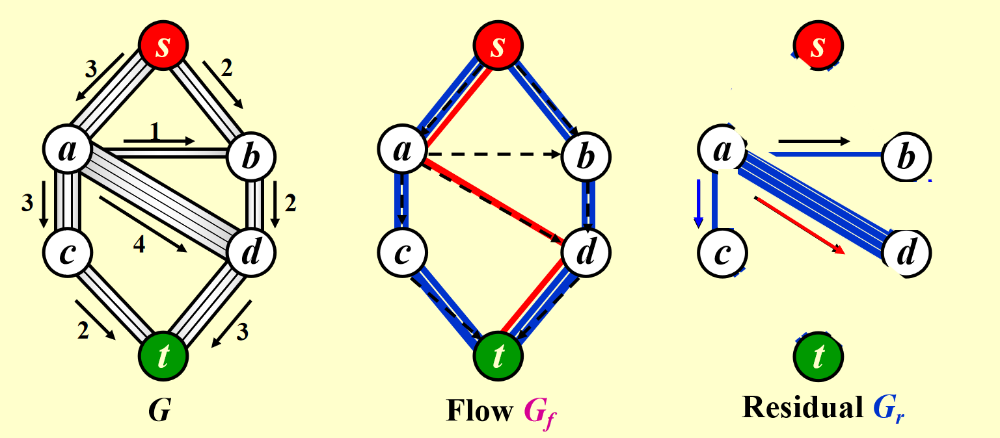
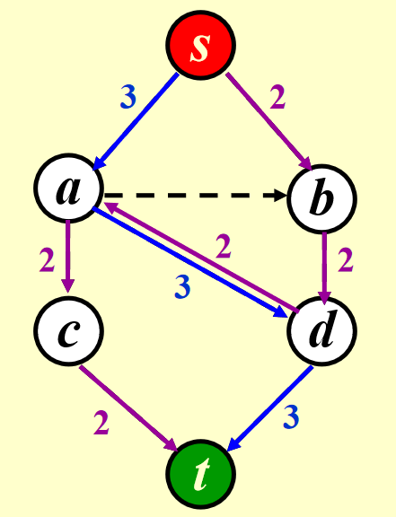
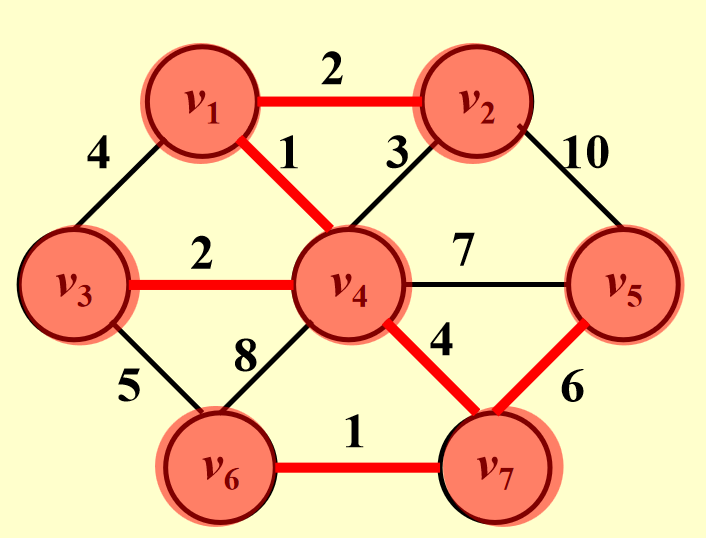
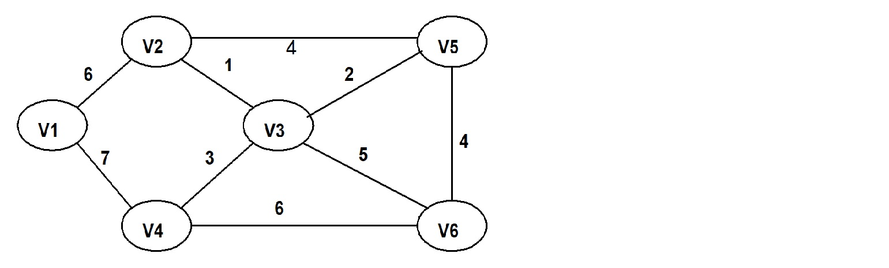

# 图：网络流与最小生成树（MST）

## 一、网络流问题

### 1. 简介

网络流问题研究如何在网络中从起点（源点， \( s \) ）到终点（汇点， \( t \) ）传输最大量的“东西”（如水、数据或流量）。网络中的每条边都有一个**容量**，限制了可以通过的流量大小。可以想象成一个水管系统，不同水管有不同的宽度，我们的目标是最大化从源点到汇点的总流量。

**示例**：考虑一个管道网络：

- 源点 ( \( s \) )：水流的起点。
- 汇点 ( \( t \) )：水流的终点。
- 管道：带有容量的边（例如容量为3、2、1单位）。

网络流示例：



任务：**确定从 \( s \) 到 \( t \) 的最大流量**。

**关键规则**：对于除 \( s \) 和 \( t \) 外的任意节点 \( v \) ，流入的流量等于流出的流量（流量守恒）：

\[
\sum_{\text{流入}} f(u, v) = \sum_{\text{流出}} f(v, w)
\]

### 2. 基本概念

- 容量 ( \( c(u, v) \) )：边能承受的最大流量。
- 流量 ( \( f(u, v) \) )：边上的实际流量，满足 \( 0 \leq f(u, v) \leq c(u, v) \) 。
- 残余网络 ( \( G_r \) )：显示分配流量后剩余的容量。对于边 \( (u, v) \) ，残余容量为 \( c(u, v) - f(u, v) \) 。
- 增广路径：在残余网络 \( G_r \) 中从 \( s \) 到 \( t \) 的一条路径，路径上有剩余容量可用来增加流量。

### 3. 方案：允许撤销决策

为了解决这个问题，算法通过在残余网络中添加反向边来“撤销”流量：

- 对于流量网络 \( G_f \) 中每条边 \( (v, w) \) 的流量 \( f(v, w) \) ，在残余网络 \( G_r \) 中添加反向边 \( (w, v) \) ，容量为 \( f(v, w) \) 。
- 这允许我们重新分配流量，避免陷入死胡同。

**命题**：如果所有容量是有理数，这个算法总能找到最大流量（即使网络有环）。

**示例**：

- 在通过 \( s \to a \to d \to t \) 发送2单位流量后：

    - \( G_r \) 中添加 \( d \to a (2) \) .
    - 之后，可以用 \( d \to a \) 重新引导流量。



### 4. 算法分析

假设容量为整数：

- 基础复杂度：用BFS找增广路径需要 \( O(|E|) \) ，可能需要最多 \( f \) 次迭代（ \( f \) 是最大流量）。总时间：

    \[
    O(|E| \cdot f)
    \]

- 改进1：选择流量增量最大的路径（修改Dijkstra算法）。时间为：

    \[
    O(|E|^2 \log |V|)
    \]

    当容量较小时适用。

- 改进2：选择边数最少的路径（用BFS）。时间为：

    \[
    O(|E|^2 |V|)
    \]

- 特殊情况：如果除 \( s \) 和 \( t \) 外的每个节点只有一个容量为1的入边或出边，时间降为：

    \[
    O(|E| |V|^{1/2})
    \]

**最小费用流**：在所有最大流中，找到总费用最低的流（每条边有单位流量的费用），这是后续的扩展内容！

## 二、最小生成树（MST, minimum spanning tree）

### 1. 简介

最小生成树（MST）是在一个**加权无向图**中，连接所有节点且总边权最小的树形结构。

从一个顶点出发，在保证不形成回路的前提下，每找到并添加一条最短的边，就把当前形成的连通分量当做一个整体或者一个点看待，然后重复“**从已知顶点找最短的边并添加**”的操作。

一个图可能有**多种生成树**，我们要找总权值最小的那个。

> 当然，最小生成树不一定唯一，也可能不存在。具体地说，最小生成树**在连通图中必然存在**，但在**非连通图中不存在**。

### 2. 基本概念

- 生成树：包含所有顶点 ( \( |V| \) )，有 \( |V| - 1 \) 条边，无环。
- 最小生成树（MST）：边权总和最小的生成树。
- 关键属性：

    - 仅当图连通时存在MST。
    - 有 \( |V| - 1 \) 条边。
    - 添加非树边会形成环。

### 3. 贪心算法

有两种贪心算法来求MST：Prim算法和Kruskal算法。

#### 3.1 Prim算法

**思路**：从一个起始节点开始，逐步扩展MST，每次添加最便宜的边。

**步骤**：（very similar to Dijkstra's algorithm）

- 从任意顶点开始（例如 \( v_1 \) ）。
- 选择连接当前树和新顶点的最小权边。
- 将该边和新顶点加入树。
- 重复直到包含所有顶点。

!!! example "**Prim 算法**示例"

    

    | 步骤 | 已选顶点集合               | 候选边（连接已选和未选）                                                                 | 选择的最小边   | 新加入顶点 |
    |------|----------------------------|------------------------------------------------------------------------------------------|----------------|------------|
    |    1    | \(\{v_1\}\)                | \(v_1v_4(1)\), \(v_1v_2(2)\), \(v_1v_3(4)\)                                            | \(v_1v_4(1)\)  | \(v_4\)    |
    |    2    | \(\{v_1, v_4\}\)           | \(v_1v_2(2)\), \(v_1v_3(4)\), \(v_4v_3(2)\), \(v_4v_5(2)\), \(v_4v_6(8)\), \(v_4v_7(4)\) | \(v_4v_3(2)\)  | \(v_3\)    |
    |    3    | \(\{v_1, v_4, v_3\}\)      | \(v_1v_2(2)\), \(v_4v_5(2)\), \(v_4v_6(8)\), \(v_4v_7(4)\), \(v_3v_6(5)\)               | \(v_1v_2(2)\)  | \(v_2\)    |
    |    4    | \(\{v_1, v_4, v_3, v_2\}\) | \(v_4v_5(2)\), \(v_4v_6(8)\), \(v_4v_7(4)\), \(v_3v_6(5)\), \(v_2v_5(10)\)              | \(v_4v_5(2)\)  | \(v_5\)    |
    |    5    | \(\{v_1, v_4, v_3, v_2, v_5\}\) | \(v_4v_6(8)\), \(v_4v_7(4)\), \(v_3v_6(5)\), \(v_5v_7(6)\)                              | \(v_4v_7(4)\)  | \(v_7\)    |
    |    6    | \(\{v_1, v_4, v_3, v_2, v_5, v_7\}\) | \(v_4v_6(8)\), \(v_3v_6(5)\), \(v_7v_6(1)\)                                              | \(v_7v_6(1)\)  | \(v_6\)    |

    最终的最小生成树的边为\(\{v_1v_4, v_4v_3, v_1v_2, v_4v_5, v_4v_7, v_7v_6\}\)。

#### 3.2 Kruskal算法

**思路**：优先选择权值最小的边，跳过会形成环的边。

**步骤**：

- 按权值对所有边排序。
- 从空树 \( T \) 开始。
- 添加不形成环的最小权边。
- 重复直到 \( T \) 有 \( |V| - 1 \) 条边。

**伪代码**：

```c
void Kruskal(Graph G) {
    T = {};
    while (T 中边数 < |V| - 1 且 E 不为空) {
        从 E 中选择最小权边 (v, w);
        从 E 中移除 (v, w);
        if ((v, w) 不形成环)
            将 (v, w) 加入 T;
        else
            丢弃 (v, w);
    }
    if (T 中边数 < |V| - 1)
        报错("无生成树");
}
```

**时间复杂度**：使用排序和并查集，复杂度为：

\[
O(|E| \log |E|)
\]


!!! example "**Kruskal算法**示例"

    1. 所有边按权重排序：首先将给定的边按权重升序排列：

        | 边      | 权重 |
        |---------|------|
        | \( v_1v_4 \) | 1    |
        | \( v_7v_6 \) | 1    |
        | \( v_1v_2 \) | 2    |
        | \( v_4v_3 \) | 2    |
        | \( v_4v_5 \) | 2    |
        | \( v_2v_4 \) | 3    |
        | \( v_3v_1 \) | 4    |
        | \( v_4v_7 \) | 4    |
        | \( v_3v_6 \) | 5    |
        | \( v_5v_7 \) | 6    |
        | \( v_4v_6 \) | 8    |
        | \( v_2v_5 \) | 10   |

    2. 初始化并查集（每个顶点自成一个集合）
        
        一般情况下，我们的初始连通分量： \( \{v_1\}, \{v_2\}, \{v_3\}, \{v_4\}, \{v_5\}, \{v_6\}, \{v_7\} \) 。

    3. 逐步选边并检查环

        | 步骤 | 选择的边   | 权重 | 是否加入MST | 理由（是否连通）               | 更新后的连通分量                          |
        |------|------------|------|-------------|--------------------------------|------------------------------------------|
        | 1    | \( v_1v_4 \) | 1    | Y          | \( v_1 \) 和 \( v_4 \) 不连通  | \( \{v_1, v_4\}, \{v_2\}, \{v_3\}, \{v_5\}, \{v_6\}, \{v_7\} \) |
        | 2    | \( v_7v_6 \) | 1    | Y          | \( v_7 \) 和 \( v_6 \) 不连通  | \( \{v_1, v_4\}, \{v_2\}, \{v_3\}, \{v_5\}, \{v_6, v_7\} \) |
        | 3    | \( v_1v_2 \) | 2    | Y          | \( v_1 \) 和 \( v_2 \) 不连通  | \( \{v_1, v_2, v_4\}, \{v_3\}, \{v_5\}, \{v_6, v_7\} \) |
        | 4    | \( v_4v_3 \) | 2    | Y          | \( v_4 \) 和 \( v_3 \) 不连通  | \( \{v_1, v_2, v_3, v_4\}, \{v_5\}, \{v_6, v_7\} \) |
        | 5    | \( v_4v_5 \) | 2    | Y          | \( v_4 \) 和 \( v_5 \) 不连通  | \( \{v_1, v_2, v_3, v_4, v_5\}, \{v_6, v_7\} \) |
        | 6    | \( v_2v_4 \) | 3    | N          | \( v_2 \) 和 \( v_4 \) 已连通  | （跳过，避免环）                          |
        | 7    | \( v_3v_1 \) | 4    | N          | \( v_3 \) 和 \( v_1 \) 已连通  | （跳过，避免环）                          |
        | 8    | \( v_4v_7 \) | 4    | Y          | \( v_4 \) 和 \( v_7 \) 不连通  | \( \{v_1, v_2, v_3, v_4, v_5, v_6, v_7\} \) |

    4. 终止条件

    已选边数 = 顶点数 \( 7 - 1 = 6 \) 条，算法结束。

    **总权重**：\( 1 + 1 + 2 + 2 + 2 + 4 = 12 \)

!!! example "例题"

    （**FDS HW10**）To find the minimum spanning tree with Kruskal's algorithm for the following graph. Which edge will be added in the final step?

    

    答案：$(v_1,v_2)$。

    具体不多分析，很容易看出来。

### 4. 比较

- Prim算法：适合稠密图（类似Dijkstra算法）。
- Kruskal算法：适合稀疏图（关注边）。

