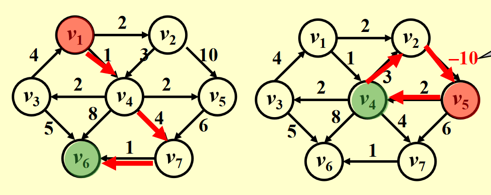
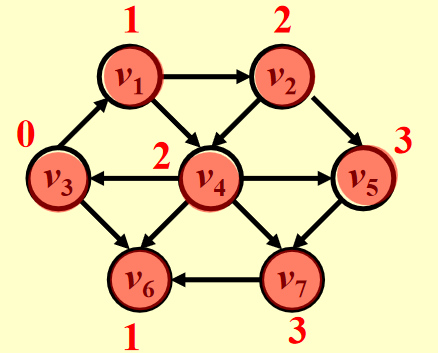
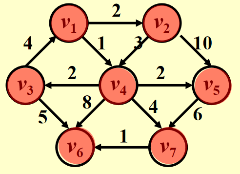
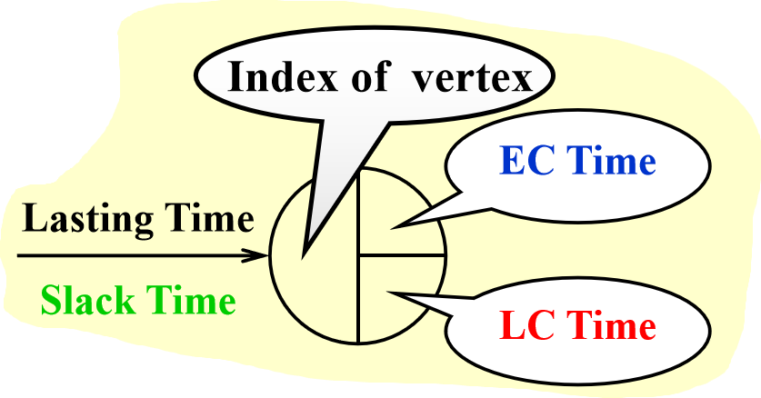
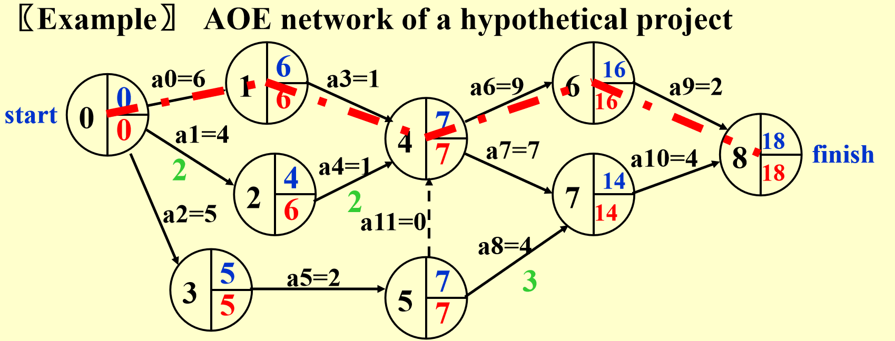

# 图：最短路径算法（Shortest Path Algorithms）

## 一、单源最短路径问题 (Single-Source Shortest-Path Problem)

### 1. 问题定义
给定一个加权有向图 \( G = (V, E) \)，其中：

- \( V \) 是顶点集
- \( E \) 是边集
- 每条边 \( e \in E \) 有一个权重（成本）函数 \( c(e) \)
- 指定一个起点顶点 \( s \)

**目标**：找到从 \( s \) 到图中每个其他顶点的最短加权路径。

**路径长度**：对于从起点到终点的路径 \( P \)，其长度定义为路径上所有边的权重之和：

\[
\text{Length}(P) = \sum_{e \in P} c(e)
\]

**注意**：

- 如果图中存在 **负权环**（negative-cost cycle），最短路径可能不存在（因为可以无限循环降低路径成本）。
- 若无负权环，从 \( s \) 到自身的路径长度定义为 0。
- 在带权图中，对于任意三个顶点 \( u \)、\( v \)、\( w \)，最短路径满足：  
   
    \[
    \text{dist}(u, w) \leq \text{dist}(u, v) + \text{dist}(v, w)
    \]  
   
其中 \( \text{dist}(x, y) \) 表示 \( x \) 到 \( y \) 的最短路径长度。

### 2. 示例图
PPT 中给出了两个示例有向图，展示正权和负权边的情况：



**负权边示例**：边 \( v2 \to v5 \) 的权重从 10 变为 -10，可能影响最短路径计算。


## 二、无权最短路径算法 (Unweighted Shortest Paths)

### 1. 核心思想
无权图中，边的权重均视为 1，因此最短路径等价于 **最少边数** 的路径。采用 **广度优先搜索 (BFS)** 的思想，按距离递增的顺序探索顶点。

### 2. 数据结构
使用一个表`Table[i]`存储每个顶点 \( v_i \) 的信息：

- **Dist**：从起点 \( s \) 到 \( v_i \) 的距离（初始为 \( \infty \)，起点为 0）
- **Known**：是否已确定最短路径（1 为已确定，0 为未确定）
- **Path**：记录路径上的前驱顶点（初始为 0）

### 3. 基本算法
以下是无权最短路径的伪代码实现：

```C
void Unweighted(Table T) {
    int CurrDist;
    Vertex V, W;
    for (CurrDist = 0; CurrDist < NumVertex; CurrDist++) {
        for (each vertex V) {
            if (!T[V].Known && T[V].Dist == CurrDist) {
                T[V].Known = true;
                for (each W adjacent to V) {
                    if (T[W].Dist == Infinity) {
                        T[W].Dist = CurrDist + 1;
                        T[W].Path = V;
                    }
                }
            }
        }
    }
}
```

**算法步骤**：

- 从距离 0 开始（即起点 \( s \)），逐层处理距离为 \( CurrDist \) 的顶点。
- 对于每个未处理（Known = 0）且距离为 \( CurrDist \) 的顶点 \( V \)：
    - 标记为已处理（Known = true）。
    - 检查 \( V \) 的所有邻接顶点 \( W \)，若 \( W \) 的距离为 \( \infty \)，更新为 \( CurrDist + 1 \)，并记录前驱为 \( V \)。

**时间复杂度**：

- 最坏情况：\( O(|V|^2) \)，因为需要扫描所有顶点多次。
- 适合稠密图。

### 4. 改进版算法（基于队列）
通过使用队列优化，减少不必要的扫描：

```C
void Unweighted(Table T) {
    Queue Q;
    Vertex V, W;
    Q = CreateQueue(NumVertex);
    MakeEmpty(Q);
    Enqueue(S, Q); /* Enqueue the source vertex */
    while (!IsEmpty(Q)) {
        V = Dequeue(Q);
        T[V].Known = true; /* optional */
        for (each W adjacent to V) {
            if (T[W].Dist == Infinity) {
                T[W].Dist = T[V].Dist + 1;// 加1是因为无权，边都视为1
                T[W].Path = V;
                Enqueue(W, Q);
            }
        }
    }
    DisposeQueue(Q);
}
```

**改进点**：

- 使用队列 \( Q \) 存储待处理的顶点，从起点 \( s \) 开始。
- 出队顶点 \( V \)，处理其邻接顶点 \( W \)，若 \( W \) 未访问（Dist = \( \infty \)），更新距离并入队。

**时间复杂度**：

- \( O(|V| + |E|) \)，因为每个顶点入队一次，每条边处理一次。
- 适合稀疏图。

!!! example "示例运行"

    

    以起点 \( v3 \) 为例，改进版算法的执行过程如下：

    | 步骤 | 队列 Q    | Dist 更新       | Path 更新     |
    |------|-----------|-----------------|---------------|
    | 0    | v3        | v3: 0          | v3: 0         |
    | 1    | v1, v6    | v1: 1, v6: 1   | v1: v3, v6: v3 |
    | 2    | v6, v2, v4| v2: 2, v4: 2   | v2: v1, v4: v1 |
    | 3    | v2, v4    | -              | -             |
    | 4    | v4, v5    | v5: 3          | v5: v2        |
    | 5    | v5, v7    | v7: 3          | v7: v4        |
    | 6    | v7        | -              | -             |

    最终结果：

    | 顶点 | Dist | Path |
    |------|------|------|
    | v1   | 1    | v3   |
    | v2   | 2    | v1   |
    | v3   | 0    | 0    |
    | v4   | 2    | v1   |
    | v5   | 3    | v2   |
    | v6   | 1    | v3   |
    | v7   | 3    | v4   |


## 三、Dijkstra 算法 (Weighted Shortest Paths)

### 1. 核心思想
Dijkstra 算法用于 **非负权边** 的加权图，采用 **贪心策略**，每次选择距离起点最近的未处理顶点，更新其邻接顶点的距离。

**关键概念**：

- \( S \): 已找到最短路径的顶点集合（初始为 \( \{s\} \)）。
- \( distance[u] \): 从 \( s \) 到 \( u \) 的最短路径长度（仅通过 \( S \) 中的顶点）。

    \[
    distance'[u_2] = distance[u_1] + c(u_1, u_2)
    \]

**更新规则**：若发现通过新加入的顶点 \( u_1 \) 到 \( u_2 \) 的路径更短，则更新。

### 2. 伪代码实现

```C
#define inf 999999
#define MAX 100007
bool visited[MAX] = {false};
//源顶点S
int s;
void Dijkstra(Graph *G,int s){
	//创建优先队列
	Queue *q;
	//初始化队列
	InitQueue( q );
	int distance[MAX], i;
	//for(i = 0;i <= MAX;i ++){
		if(i != s){
			//如果不是源顶点，就赋值为“无穷大”，
			distance[i] = inf;
		}else{
			distance[i] = 0;
			visited[i] = true;
		}
	//}
	//w就是新邻居捏
	int w, new_distance;

	//s入队列
	EnQueue(q, s);
	visited[s] = true;
	//IsEmpty判断队列是否为空
	while( !IsEmpty(q) ){
		v = DeQueue(q);
		//FirstNeighbor(G, v):求图G中顶点v的第一个邻接点，
		//若有则返回顶点号，否则返回-1。
		//NextNeighbor(G, v, w):假设图G中顶点w是顶点v的一个邻接点，返回除w和已访问外的顶点v
		for(w = FirstNeighbor(G, v);w >= 0;w = NextNeighbor(G, v, w)){
			//calculate_distance实现两顶点间权的读取
			new_distance = calculate_distance(v, w) + distance[v];
			if(new_distance <= distance[w]){
				distance[w] = new_distance;
			}
			if(visited[w] == false) {
				visited[w] = true;
				EnQueue(w);
			}
		}
	}
}
```

**算法步骤**：由于是单源，所以记源顶点为S。

1. **初始化**  
      - 创建一个集合`visited`，这个是记录已经找到最短路径的节点。开始时，初始化为空的就好。  
      - 创建一个优先队列（如最小堆），将源节点加入队列。  
      -  创建一个数组`distance[i]`，用于存储从源节点到其他节点的当前已知最短距离。将`distance[S]`初始化为0；将**优先队列中的顶点对应的距离**，设置为**源到该顶点的权重**；而**除优先队列以外的其他所有节点的距离初始化为无穷大**。  
  
2. **从优先队列中取出相邻距离最小的节点**  
      - 从优先队列中取出相邻距离最小的节点`u`。（如果队列为空，则算法结束。）  
      - 将节点`u`标记为已访问（将其添加到`visited`集合中）。  
  
3. **更新未访问邻居的距离**：遍历节点`u`的所有邻居`v`，如果`distance[v]`是无穷大或其他值，则有： 
    - 计算通过节点`u`到达节点`v`的距离，即`new_distance = distance[u] + weight(u, v)`。 
    - 如果`new_distance`小于当前已知的`distance[v]`，则更新`distance[v]`为`new_distance`。  
    - 如果节点`v`尚未在优先队列中，或者其当前优先级高于新计算的距离，则将节点`v`（及其新距离）加入优先队列。  
  
4. **重复**：重复步骤2和3，直到优先队列为空，即所有节点都已从队列中取出并被标记为已访问。  
  
1. **结果**：`distance[]`数组现在得到了从源节点到图中所有其他节点的最短距离。 

**限制**：不适用于负权边（可能导致错误结果）。

### 3. 时间复杂度
- **实现 1**：每次扫描表选择最小距离顶点，复杂度 \( O(|V|) \)。（适合稠密图）
    - **初始化**：设置 \( V \) 个顶点的距离，时间复杂度为 \( O(V) \)。
    - **选择最小距离顶点**：每次需要扫描所有未处理顶点，初始时有 \( V \) 个顶点，之后逐个减少。总共执行 \( V \) 次选择，第一次扫描 \( V \) 个元素，第二次扫描 \( V-1 \) 个，……，最后一次扫描 1 个。总扫描次数为：
        
        \[
        \sum_{i=1}^{V} i = \frac{V (V + 1)}{2} = O(V^2)
        \]
    
    - **更新距离**：每次处理一个顶点 \( u \) 时，检查其所有邻接顶点。每个顶点最多被处理一次，边数为 \( E \)，因此总更新操作的次数为 \( O(E) \)。每次更新是 \( O(1) \) 的，因此总时间为 \( O(E) \)。
    - **总时间复杂度**：\( O(V^2 + E) \)。在稀疏图中（\( E \) 远小于 \( V^2 \)），主项为 \( O(V^2) \)；在稠密图中（\( E \approx V^2 \)），复杂度仍为 \( O(V^2) \)。

- **实现 2**：使用优先队列（如最小堆）。（适合稀疏图）
    - **初始化**：将所有 \( V \) 个顶点插入优先队列，时间复杂度为 \( O(V) \)。
    - **提取最小元素**：每次从二叉堆中提取最小元素，操作时间复杂度为 \( O(\log V) \)。总共执行 \( V \) 次，时间复杂度为 \( O(V \log V) \)。
    - **减少键值（更新距离）**：每次处理一个顶点时，可能需要更新其所有邻接顶点的距离。每个顶点最多被处理一次，边数为 \( E \)，因此减少键值操作的总次数不超过 \( E \)。在二叉堆中，减少键值的时间复杂度为 \( O(\log V) \)，总时间复杂度为 \( O(E \log V) \)。
    - **总时间复杂度**：\( O((V + E) \log V) \)，其中 \( V \) 是顶点数，\( E \) 是边数。

- **实现 3**：使用斐波那契堆。（适合稠密图）
    - **初始化**：将 \( V \) 个顶点插入斐波那契堆，时间复杂度为 \( O(V) \)。
    - **提取最小元素**：每次提取最小元素，均摊时间复杂度为 \( O(\log V) \)。总共执行 \( V \) 次，时间复杂度为 \( O(V \log V) \)。
    - **减少键值（更新距离）**：斐波那契堆的减少键值操作的均摊时间复杂度为 \( O(1) \)。由于每个顶点可能触发最多 \( E \) 次减少键值操作（对应图中的边），总时间复杂度为 \( O(E) \)。
    - **总时间复杂度**：\( O(V \log V + E) \)，其中均摊分析确保了减少键值的 \( O(1) \) 优势。

| 数据结构     | 提取最小元素 | 减少键值   | 总时间复杂度      | 适用场景                          |
|--------------|--------------|------------|-------------------|-----------------------------------|
| **二叉堆**   | \( O(\log V) \) | \( O(\log V) \) | \( O((V + E) \log V) \) | 简单实现，中小规模图，通用场景     |
| **斐波那契堆** | \( O(\log V) \) | \( O(1) \)    | \( O(V \log V + E) \)   | 大规模图，频繁更新距离，优化场景   |
| **线性扫描** | \( O(V) \)    | \( O(1) \)    | \( O(V^2 + E) \)       | 顶点数少、图稠密、简单实现场景     |


!!! example " Dijkstra 算法示例"

    还是以这个图为例，不过我们这次从\(v_1\)出发。

    

    | 步骤 | 队列/当前顶点 | Dist 更新                     | Path 更新                        | Visited 更新         |
    |------|---------------|--------------------------------|----------------------------------|----------------------|
    | 0    | \( v_1 \)     | \( v_1: 0 \)                 | \( v_1: -1 \)                   | \( v_1: 1 \)         |
    | 1    | \( v_4 \)     | \( v_4: 1, v_2: 2 \)         | \( v_4: v_1, v_2: v_1 \)        | \( v_4: 1 \)         |
    | 2    | \( v_2 \)     | \( v_3: 3, v_5: 3, v_6: 9, v_7: 5 \) | \( v_3: v_4, v_5: v_4, v_6: v_4, v_7: v_4 \) | \( v_2: 1 \)     |
    | 3    | \( v_3 \)     | -                            | -                               | \( v_3: 1 \)         |
    | 4    | \( v_5 \)     | -                            | -                               | \( v_5: 1 \)         |
    | 5    | \( v_7 \)     | \( v_6: 6 \)                 | \( v_6: v_7 \)                  | \( v_7: 1 \)         |
    | 6    | \( v_6 \)     | -                            | -                               | \( v_6: 1 \)         |

    最终结果：

    | 顶点 | Dist | Path |
    |------|------|------|
    | v1   | 0    | 0    |
    | v2   | 2    | v1   |
    | v3   | 3    | v7   |
    | v4   | 1    | v2   |
    | v5   | 3    | v3   |
    | v6   | 6    | v4   |
    | v7   | 5    | v6   |


## 四、负权边处理 (Graphs with Negative Edge Costs)

### 1. 简单想法的失败

- **错误方案**：将所有边权重加上一个常数 \( \Delta \) 以消除负权边。
- **问题**：改变路径权重比例（比如有的最短路径要走3条边，而有的只走2条，每条边加一个常数显然是不对的），可能导致最短路径变化。

!!! example "最短路径性质例题"
    
    **（FDS HW9）**Let P be the shortest path from S to T. If the weight of every edge in the graph is incremented by 2, P will still be the shortest path from S to T. (T / F)

    **答案：**  
    
    不一定。路径P可能不再保持最短路径的性质。

    **解析：**  
    
    1. **原最短路径的特性**  
       
        在原图中，P的路径总权重是所有S到T路径中最小的。

    2. **权重增加后的影响**  
          
          - 设P包含k条边，则P的新权重 = 原权重 + 2k
          - 其他路径Q包含m条边，新权重 = 原权重 + 2m
          - 如果原图中P比Q短很多（原权重差>2(m-k)），P仍保持最短
          - 但如果存在另一条路径Q，在原图中稍长于P但边数少很多（m<<k），增加权重后Q可能变得更优

    3. **反例说明**  
        
        - 路径P：2条边，每边权重1 → 总权重2
        - 路径Q：1条边，权重3 → 总权重3
        
        原本P是最短路径，但是增加2后：
        
        - P：2×(1+2)=6
        - Q：3+2=5
        
        此时Q成为新的最短路径。


### 2. 负权边算法
```C
void WeightedNegative(Table T) {
    Vertex V, W;                // V 和 W分别表示当前处理的顶点和其邻接顶点
    Queue Q = CreateQueue(NumVertex); // 创建一个队列 Q
    MakeEmpty(Q);               // 清空队列 Q，准备使用
    Enqueue(S, Q);              // 将源点 S 入队，作为起点开始松弛
    while (!IsEmpty(Q)) {       // 当队列非空时，持续执行松弛操作
        V = Dequeue(Q);         // 从队列头部取出当前处理的顶点 V
        for (each W adjacent to V) { // 遍历 V 的所有邻接顶点 W
            if (T[V].Dist + Cvw < T[W].Dist) { // 如果通过 V 到 W 的距离小于当前 T[W].Dist
                T[W].Dist = T[V].Dist + Cvw; // 更新 W 的距离为 V 的距离加上边权重 Cvw
                T[W].Path = V;         // 更新 W 的前驱为 V
                if (W is not already in Q) // 如果 W 不在队列中
                    Enqueue(W, Q);      // 将 W 入队，以便后续松弛其邻接顶点
            }
        }
    }
    DisposeQueue(Q);            // 释放队列 Q 的内存
}
```

**时间复杂度**：\( O(|V| \cdot |E|) \)，适合稀疏图。

!!! example "负权边例子"

    假设图为：
    
    - \( S \to A: 4 \)
    - \( S \to B: 2 \)
    - \( A \to B: -2.5 \)
    - \( B \to C: 3 \)

    初始化：
    
    - \( T[S].Dist = 0, T[A].Dist = \infty, T[B].Dist = \infty, T[C].Dist = \infty \)
    - 入队 \( S \)。

    步骤：
    
    1. 处理 \( S \): 更新 \( A: 4 \), \( B: 2 \)，入队 \( A, B \)。
    2. 处理 \( B \): 更新 \( C: 5 \)，入队 \( C \)。
    3. 处理 \( A \): 更新 \( B: 1.5 \) (更好)，入队 \( B \)。
    4. 处理 \( B \): 更新 \( C: 4.5 \)。
    5. 处理 \( C \): 无更新。
    
    结果：\( S: 0, A: 4, B: 1.5, C: 4.5 \)。

## 五、无环图最短路径 (Acyclic Graphs)

若图是 **无环图**（DAG），可按 **拓扑排序** 顺序处理顶点。

!!! example "AOE网络"

    

    

    1. 早期完成时间 (EC)
          - **公式**：\( EC[w] = \max_{(v,w) \in E} \{ EC[v] + C_{v,w} \} \)
          - 从起点 \( v_0 \) 开始，\( EC[v_0] = 0 \)；对于任意节点 \( w \)，其早期完成时间是所有前驱 \( v \) 的 \( EC[v] + C_{v,w} \) 中的最大值。
          - **意义**：表示在不延误项目的前提下，事件 \( w \) 最早可能完成的时间。

    2. 晚期完成时间 (LC)
          - **公式**：\( LC[v] = \min_{(v,w) \in E} \{ LC[w] - C_{v,w} \} \)
          - 从终点 \( v_8 \) 开始，\( LC[v_8] \) 通常设为 \( EC[v_8] \)（项目截止时间）；对于任意节点 \( v \)，其晚期完成时间是所有后继 \( w \) 的 \( LC[w] - C_{v,w} \) 中的最小值。
          - **意义**：表示事件 \( v \) 最晚完成的时间，而不延误整个项目。

    3. Slack Time (松弛时间)
          - **公式**：\( \text{Slack Time of } <v,w> = LC[w] - EC[v] - C_{v,w} \)
          - 表示活动 \( <v,w> \) 的浮动时间，即在不影响项目进度的前提下，该活动可以推迟的时间。
          - **零松弛边**：\( \text{Slack Time} = 0 \) 的边属于关键路径。

    4. 关键路径 (Critical Path)
          - **定义**：由全部零松弛边的路径组成，确定项目的最短完成时间。
          - **重要性**：关键路径上的活动若延误，将直接延长项目总工期。

**时间复杂度**：\( O(|V| + |E|) \)。

## 六、全对最短路径问题 (All-Pairs Shortest Path Problem)

- **方法 1**：对每个顶点运行单源最短路径算法。
    - 时间复杂度：\( O(|V|^3) - \text{works fast on sparse graph} \)。
- **方法 2**：Floyd-Warshall 算法。
    - 时间复杂度：\( O(|V|^3) \)。
