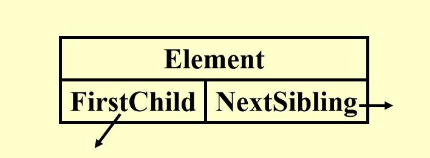
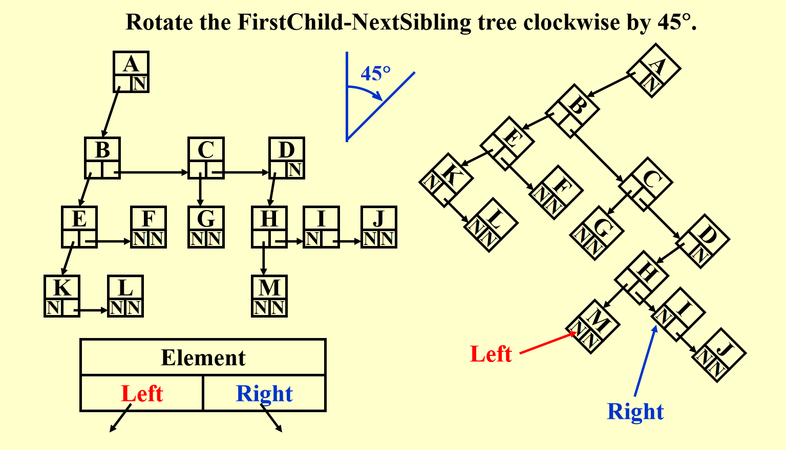
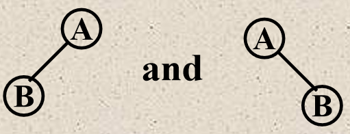
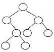
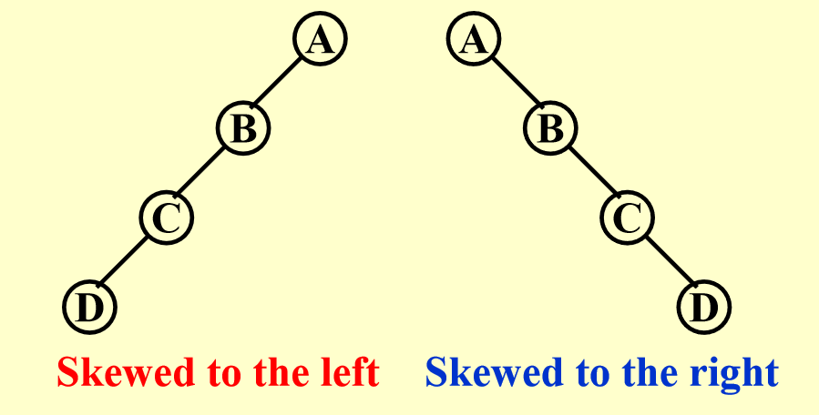
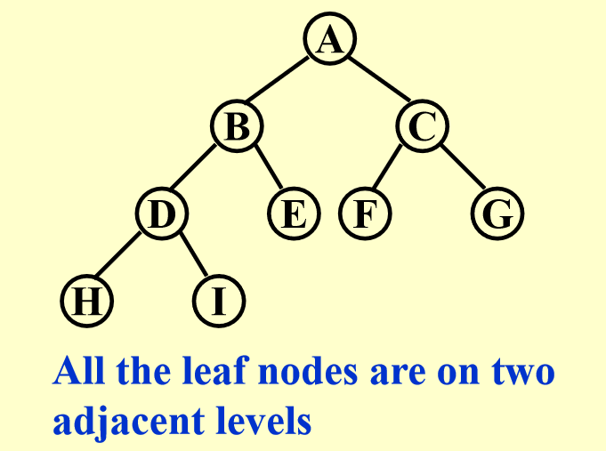
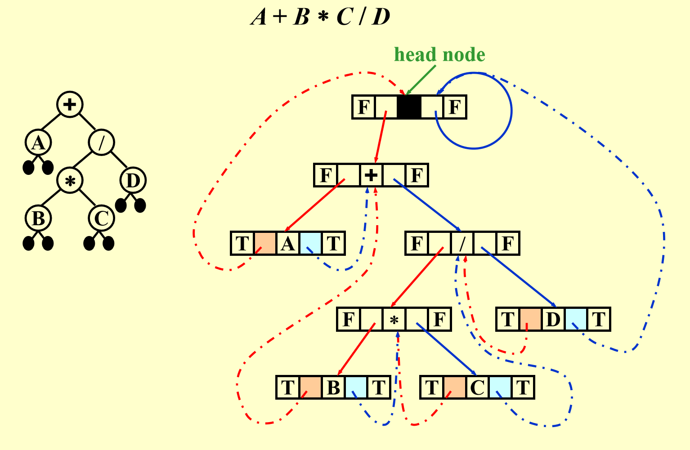
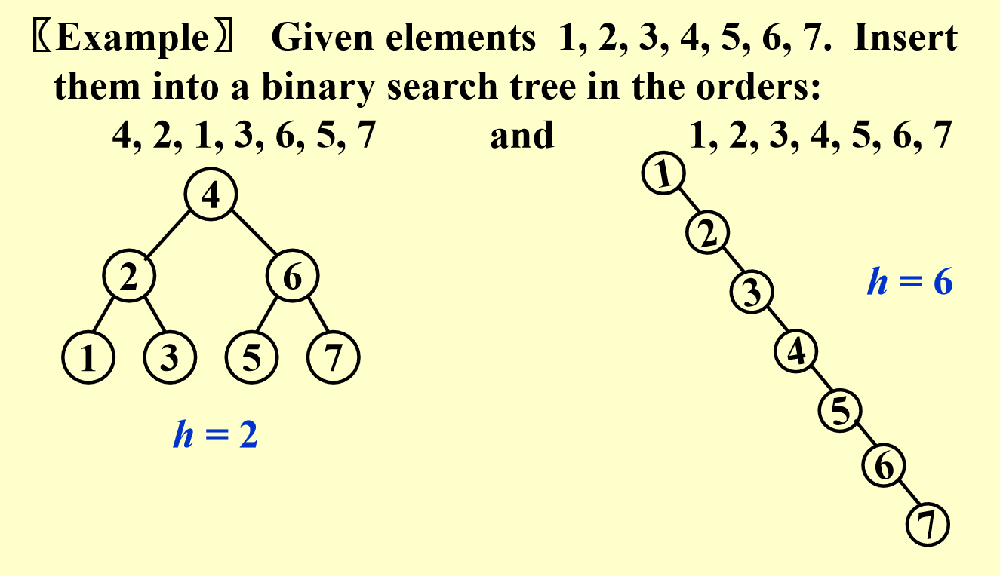

# 树、二叉树

## 一、基本の术语

- 树：节点的集合，包含一个根节点和若干子树。
- 根节点 (Root)：树的唯一起始节点。
- 叶子节点 (Leaf)：度为0的节点（无子节点）。
- 父节点 (Parent)：拥有子树的节点。
- 子节点 (Children)：父节点的直接下级节点。
- 兄弟节点 (Siblings)：同一父节点的子节点。
- 深度 (Depth)：从根到该节点的唯一路径长度（根深度为0）。
- 高度 (Height)：从节点到最深叶子的最长路径长度（叶子高度为0）。
- 路径：节点序列，每个节点是下一节点的父节点。
- 度(degree)：节点的度表示拥有的子树数目；树的度是所有节点的度的最大值。

##  二、树的表达方式

- 列表表示：用嵌套括号表示层次结构（如 `A(B(C), D)`）。
- FirstChild-Sibling表示法：每个节点记录第一个子节点和下一个兄弟节点，通过旋转45°可转换为二叉树结构。





## 三、二叉树（ Binary Tree ）

### 1. 定义

每个节点最多有两个子节点（称为左子节点和右子节点）的树。  

!!! note
    In a tree, the order of children does not matter.  But in a binary tree, left child and right child are different.

    

    The binary trees above are different.

### 2. 遍历方式

我们假定树结构体定义如下：

```cpp
struct TreeNode {
    int Element;
    TreeNode* left;
    TreeNode* right;
    TreeNode(int val) : Element(val), left(nullptr), right(nullptr) {}
};
```

前序遍历：根 → 左子树 → 右子树  

```cpp
/* 递归实现 */
void preorderTraversal(TreeNode* root) {
    if (root == nullptr) return;// 空树
    cout << root->val << " ";
    preorderTraversal(root->left);
    preorderTraversal(root->right);
}
```

```cpp
/* 迭代实现 */
void preorderTraversal(TreeNode* root) {
    if (root == nullptr) return;
    stack<TreeNode*> s;// 辅助栈
    s.push(root);
    while (!s.empty()) {
        TreeNode* node = s.top();
        s.pop();
        cout << node->val << " ";
        if (node->right) s.push(node->right);
        if (node->left) s.push(node->left);
    }
}
```

中序遍历：左子树 → 根 → 右子树

```cpp
/* 递归实现 */
void inorderTraversal(TreeNode* root) {
    if (root == nullptr) return;// 空树
    inorderTraversal(root->left);
    cout << root->val << " ";
    inorderTraversal(root->right);
}
```

```cpp
/* 迭代实现 */
void inorderTraversal(TreeNode* root) {
    stack<TreeNode*> s;// 辅助栈
    TreeNode* current = root;
    while (current != nullptr || !s.empty()) {
        while (current != nullptr) {
            s.push(current);
            current = current->left;// 一直向左遍历，直到空
        }
        current = s.top();
        s.pop();
        cout << current->val << " ";
        current = current->right;// 最后再转回右节点
    }
}
```

后序遍历：左子树 → 右子树 → 根

```cpp
/* 递归实现 */
void postorderTraversal(TreeNode* root) {
    if (root == nullptr) return;
    postorderTraversal(root->left);
    postorderTraversal(root->right);
    cout << root->val << " ";
}
```

```cpp
/* 迭代实现 */
void postorderTraversal(TreeNode* root) {
    if (root == nullptr) return;
    stack<TreeNode*> s;
    TreeNode* lastVisited = nullptr;
    while (!s.empty() || root != nullptr) {
        if (root != nullptr) {
            s.push(root);
            root = root->left;
        } else {
            TreeNode* peekNode = s.top();
            if (peekNode->right != nullptr && lastVisited != peekNode->right) {
                root = peekNode->right;
            } else {
                cout << peekNode->val << " ";
                lastVisited = s.pop();
            }
        }
    }
}
```

层序遍历：按一层一层的顺序遍历树的节点。

```cpp
void levelorderTraversal(TreeNode* root) {
    if (root == nullptr) return;
    queue<TreeNode*> q;
    q.push(root);// 根入队
    while (!q.empty()) {
        TreeNode* node = q.front();// 获得队首元素
        q.pop();// 队首元素出队
        cout << node->val << " ";
        if (node->left) q.push(node->left);// 左子树入队
        if (node->right) q.push(node->right);// 右子树入队
    }
}
```

### 3. 表达式与树的互相转换

#### 3.1 表达式转化为树

| 表达式类型 | 遍历方式       |树构建方法               |
|------------|----------------|--------------------------|
| **中缀**   | 中序遍历       |根节点可以通过左右个数判断，左边为根节点的左子树，右边为根节点的右子树 |
| **后缀**   | 后序遍历       |根节点为最后一个，从左到右构建子树，一步一步拼接        |
| **前缀**   | 前序遍历       |根节点为第一个，从左到右构建子树，一步一步拼接        |

!!! example

    **(FDS HW4)** 例题：Given the shape of a binary tree shown by the figure below. If its **inorder** traversal sequence is { E, A, D, B, F, H, C, G }, then the node on the same level of C must be:

    

    显而易见，F为根节点，左侧为{E, A, D, B}，右侧为{H, C, G}，所以E为C的兄弟节点。

    **(FDS HW4 Derivative)** 例题：Given the shape of a binary tree shown by the figure which has been mentioned in the previous question. If its **preorder** traversal sequence is { E, A, D, B, F, H, C, G }, then the node on the same level of C must be:

    显而易见，E为根节点，左侧为{A, D, B, F}，右侧为{H, C, G}，所以D和G为C的兄弟节点。

#### 3.2 树转化为表达式

按照对应的遍历读树，写成表达式即可。

例题：某表达式的前序遍历树如下，求前序表达式。

```
  +
 / \
A   *
   / \
  B   C
```

前序表达式为 `+A*BC`。

### 4. 两类特别的二叉树

#### 4.1 斜二叉树（ Skewed Binary Trees ）



- 左斜二叉树：所有节点只有左子树的二叉树。
- 右斜二叉树：所有节点只有右子树的二叉树。

#### 4.2 完全二叉树（ Complete Binary Tree ）  



$$
\textbf{完全二叉树}
\begin{cases}
 & 所有叶子节点均位于相邻的两层 \\
 & 除最后一层，其他层节点数达到最大  
\end{cases}
$$

### 5. 二叉树的节点计算性质

1. **每层最大节点数**  
   第 $i$ 层的最大节点数为 $2^{i-1}$（$i \geq 1$）。
2. **总节点数**  
   深度为 $k$ 的二叉树最多有 $2^k - 1$ 个节点（$k \geq 1$）。
3. **叶子节点与度为2节点的关系**  
   对于非空二叉树，叶子节点数 $n_0 = n_2 + 1$（$n_x$ 代表度为\(x\; (x = 0, 1, 2)\)的节点的个数）。

!!! note
    **证明思路：**  
    总节点数 $n = n_0 + n_1 + n_2$。  

    分支数 $B = n_1 + 2n_2$（每个度为1的节点贡献1个分支，度为2的贡献2个分支）。  

    总节点数 $n = B + 1$（根节点无父分支）。  

    联立方程可得 $n_0 = n_2 + 1$。

## 四、线索二叉树

### 1. 作用

普通二叉树有 `n+1` 个空指针，浪费空间，而线索化利用空指针指向节点的前驱或后继，加速遍历。

### 2. 规则

1. 若左子为空，指向中序前驱。
2. 若右子为空，指向中序后继。
3. 必须包含（**没有就自己添加**）头节点，左指针指向树的根节点。

### 3. 示例

表达式树 `A + B * C / D` 的线索化。



比如对于`B`而言，其中序表达式（或者说中序遍历）的两侧正好是+号和*号。

## 五、二叉搜索树（ Binary Search Tree, BST ）

### 1. 定义及特点  

1. 二叉树，可以为空。
2. 非空时满足以下条件：
    - 每个节点有唯一**整数值**。
    - 左子树所有节点的键**小于**根节点的值。
    - 右子树所有节点的键**大于**根节点的值。
    - 左、右子树也是二叉搜索树。
    - 同一深度下的节点值按大小**有序排列**。

!!! example
    **(FDS HW5)** 判断题：In a binary search tree, the keys on the same level from left to right must be in sorted (non-decreasing) order.

    答案为True。对于同一个父母节点，其一定满足左<右；而又跟据左子树所有节点的键**小于**根节点的值，右子树所有节点的键**大于**根节点的值显然可以得到这一结论。

### 2. ADT 操作

此处声明`using SearchTree = TreeNode*;`

#### 2.1 `MakeEmpty(T)`：清空树。

```cpp

// 清空树并释放内存
SearchTree MakeEmpty(SearchTree T) {
    if (T != nullptr) {
        MakeEmpty(T->Left);
        MakeEmpty(T->Right);
        delete T;
    }
    return nullptr;
}
```

#### 2.2 `Find(X, T)`：查找键为 `X` 的节点。

```cpp
// 查找节点（用递归实现）
TreeNode* Find(int X, SearchTree T) {
    if (T == nullptr) return nullptr;
    if (X < T->Element)
        return Find(X, T->Left);
    else if (X > T->Element)
        return Find(X, T->Right);
    else
        return T;
}
```

#### 2.3 `FindMin(T)`/`FindMax(T)`：查找最小/最大键节点。

```cpp
// 查找最小值节点（递归）
TreeNode* FindMin(SearchTree T) {
    if (T == nullptr) return nullptr;
    return (T->Left == nullptr) ? T : FindMin(T->Left);
}

// 查找最大值节点（迭代）
TreeNode* FindMax(SearchTree T) {
    if (T != nullptr)
        while (T->Right != nullptr)
            T = T->Right;
    return T;
}
```

#### 2.4 `Insert(X, T)`：插入键 `X`。

```cpp
// 插入节点（递归）
SearchTree Insert(int X, SearchTree T) {
    if (T == nullptr) {
        T = new TreeNode(X); // 创建新节点
    } else if (X < T->Element) {
        T->Left = Insert(X, T->Left);
    } else if (X > T->Element) {
        T->Right = Insert(X, T->Right);
    }
    // 若X已存在，忽略插入
    return T;
}

// 插入节点（迭代版本）
SearchTree Insert_Iterative(int X, SearchTree T) {
    TreeNode** curr = &T; // 使用二级指针来直接操作树（太复杂所以还是递归好啊）
    while (*curr != nullptr) {
        if (X < (*curr)->Element) {
            curr = &((*curr)->Left); // 向左子树移动
        } else if (X > (*curr)->Element) {
            curr = &((*curr)->Right); // 向右子树移动
        } else {
            return T; // 重复键，直接返回原树
        }
    }
    *curr = new TreeNode(X); // 在空位置创建新节点
    return T;
}
```

#### 2.5 `Delete(X, T)`：删除键 `X`。

!!! note
    If there are not many deletions, then **lazy deletion** may be employed: **add a flag field to each node, to mark if a node is active or is deleted**.  Therefore we can delete a node without actually freeing the space of that node.  If a deleted key is reinserted, we won’t have to call malloc again.(But too many deletions may cause waste of the memory)


```cpp
SearchTree Delete(int X, SearchTree T) {
    if (T == nullptr) {
        throw std::runtime_error("Element not found");
    } else if (X < T->Element) {
        T->Left = Delete(X, T->Left);
    } else if (X > T->Element) {
        T->Right = Delete(X, T->Right);
    } else {
        // 找到要删除的节点
        if (T->Left && T->Right) { // 双子节点
            SearchTree tmp = FindMin( T->Right ); // 右子树最小值替换
            T->Element = tmp->Element;
            T->Right = Delete(T->Element, T->Right); // 递归删除被替换节点
        } else { // 单子或叶子节点
            SearchTree tmp = T;
            T = (T->Left != nullptr) ? T->Left : T->Right;
            delete tmp;
        }
    }
    return T;
}
```

!!! example
    **(FDS HW5)** 例题：Given a binary search tree with its preorder traversal sequence { 8, 2, 15, 10, 12, 21 }.  If 8 is deleted from the tree, which one of the following statements is FALSE?

    A.One possible preprder traversal sequence of the resulting tree may be { 2, 15, 10, 12, 21 }

    B.One possible preprder traversal sequence of the resulting tree may be { 10, 2, 15, 12, 21 }

    C.One possible preprder traversal sequence of the resulting tree may be { 15, 10, 2, 12, 21 }

    D.It is possible that the new root may have 2 children

    根据前面对于前序的讲解，这棵二叉搜索树的结构可以很轻易得到：
    ```
       8
      / \
     2   15
         / \
       10  21
         \
         12
    ```
    而在二叉搜索树中，删除节点后，通常由该节点的**中序后继（即右子树中的最小节点）**或**中序前驱（即左子树中的最大节点）**来替代。（在这里就是2或者10）因此，答案一👁盯真，就是C了。


`Retrieve(P)`：获取节点 `P` 的值。

```cpp
// 获取节点的值
int Retrieve(TreeNode* P) {
    if (P == nullptr)
        throw std::runtime_error("Null node exception");
    return P->Element;
}
```

### 3. 二叉搜索树的构建

树高与**插入顺序**相关：

- 最优情况：平衡插入（如中位数优先），树高为 $O(\log n)$。
- 最差情况：顺序插入（如升序或降序），树高为 $O(n)$。



- 插入序列 `4, 2, 1, 3, 6, 5, 7` 生成平衡树（高度为2）。
- 插入序列 `1, 2, 3, 4, 5, 6, 7` 生成右斜树（高度为6）。