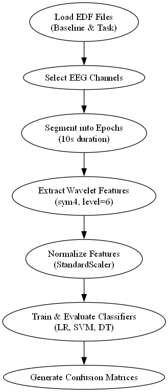
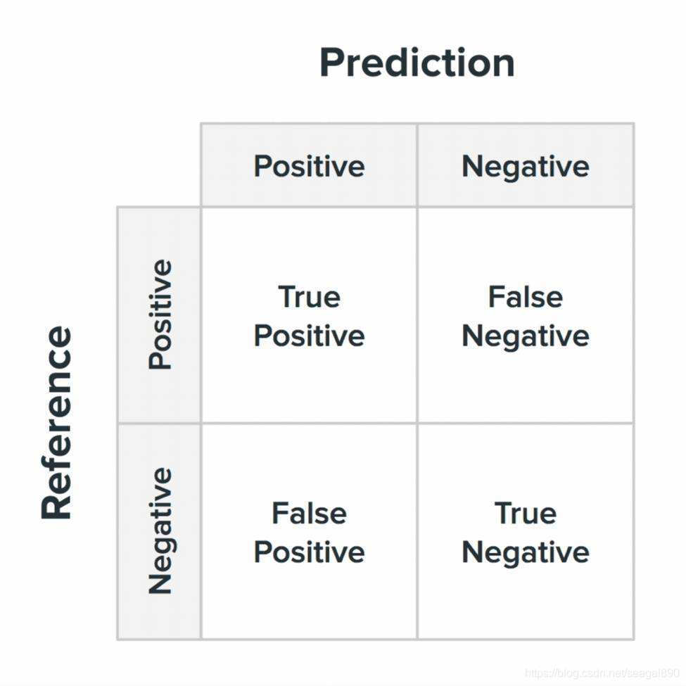
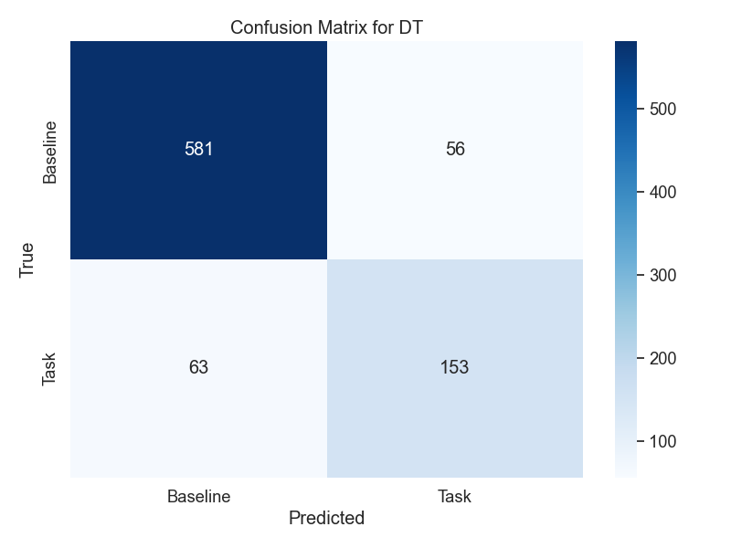
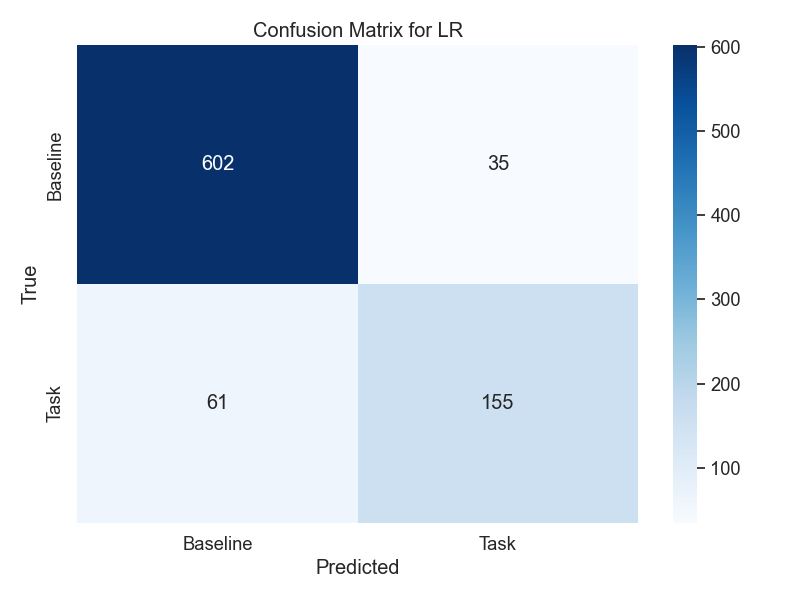
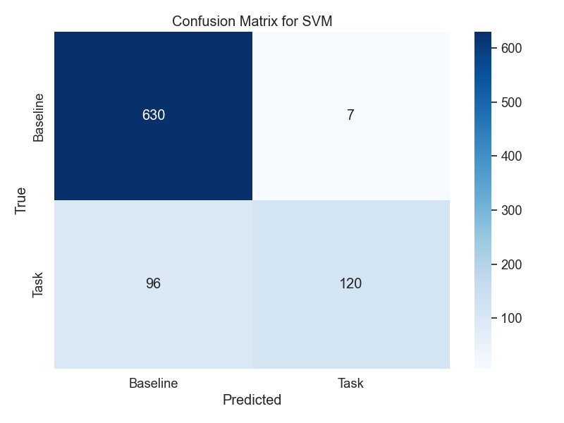
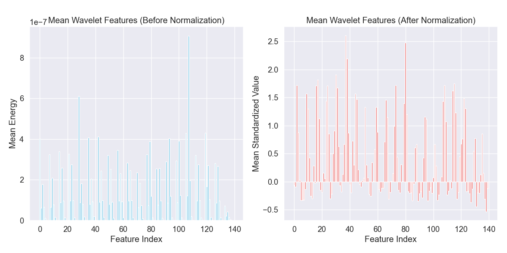
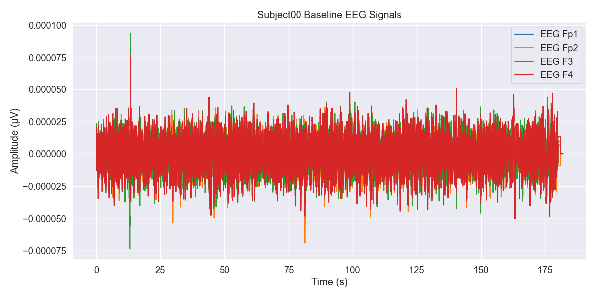
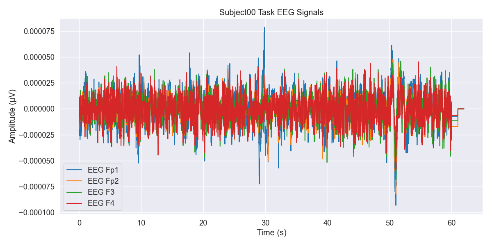

# 学术报告：基于EEG数据集的心理压力分类模型训练与验证

## 引言

本研究基于一个包含36名健康志愿者在执行心理算术任务前后EEG记录的数据集，旨在开发和验证机器学习模型，以区分基线状态（休息）和任务状态（心理算术）。该数据集由乌克兰基辅国立塔拉斯·舍甫琴科大学“生物与医学研究所”提供，记录使用Neurocom 23通道系统，遵循国际10/20系统，数据已通过独立成分分析（ICA）去除伪迹。研究目标是探索EEG信号在认知负荷下的动态变化，为脑机接口和认知状态监测提供支持。

受试者根据心理算术任务表现分为两组：好计数者（G组，24人，平均每4分钟21次操作，标准差7.4）和差计数者（B组，12人，平均每4分钟7次操作，标准差3.6）。本报告分析了`train.py`脚本的逻辑、数据处理流程、使用的算法及其评估指标，结合数据集统计信息和相关文献提出改进建议。

 

## 数据集描述

### 实验设置
数据集记录了36名健康志愿者在基线状态和执行心理算术任务时的EEG信号。心理算术任务为连续减法，例如从一个四位数（如3141）减去一个两位数（如42）。每位受试者有两段EEG记录：
- **基线记录**（标记为“_1”）：休息状态下的EEG，通常持续60秒（部分受试者如Subject31_1为40秒，Subject04_1为50秒）。
- **任务记录**（标记为“_2”）：执行心理算术任务时的EEG，持续60秒。

EEG使用Neurocom 23通道系统以500 Hz采样率记录，电极按国际10/20系统放置，参考电极为耳部互联电极（A2-A1）。数据经过30 Hz高通滤波和50 Hz陷波滤波处理，并通过ICA去除眼动、肌肉和心跳伪迹。受试者需具备正常或矫正视力、正常色觉，无精神或认知障碍、药物或酒精成瘾及精神或神经疾病。

### 数据格式
数据以EDF（欧洲数据格式）存储，每位受试者有两个文件：
- **文件名格式**：`SubjectXX_1.edf`（基线）和`SubjectXX_2.edf`（任务），其中XX为00到35。
- **元数据**：`subject-info.csv`包含受试者信息（编号、年龄、性别、记录年份、减法次数、计数质量）。

### 受试者分组
受试者根据任务表现分为：
- **G组（好计数者）**：24人，平均每4分钟21次操作（标准差7.4）。
- **B组（差计数者）**：12人，平均每4分钟7次操作（标准差3.6）。

| 组别 | 人数 | 平均操作次数（每4分钟） | 标准差 |
|------|------|-----------------------|--------|
| G组  | 24   | 21                    | 7.4    |
| B组  | 12   | 7                     | 3.6    |

### 数据集统计分析
数据集包含36名受试者的EEG记录，每位受试者有基线和任务两个状态。以下是对部分受试者（Subject00至Subject35）数据统计的分析：
- **通道数**：每个EDF文件包含21个通道（20个EEG通道和1个ECG通道）。
- **采样频率**：一致为500 Hz，数据类型为float64。
- **记录长度**：
  - 基线记录（_1.edf）：大部分为91000个时间点（约182秒），但Subject31_1为40000个时间点（80秒），Subject04_1为85000个时间点（170秒）。
  - 任务记录（_2.edf）：均为31000个时间点（62秒）。
- **信号幅度**：
  - EEG通道的均值接近零（范围约-7.86e-08 V至4.02e-07 V），标准差在5.44e-06 V至2.13e-05 V之间，反映了EEG信号的微伏级波动。
  - 最大和最小值范围在-1.84e-04 V至2.44e-04 V，显示信号动态范围较广。
  - ECG通道的均值和标准差较高（均值约-8.74e-07 V至4.61e-06 V，标准差约1.90e-05 V至1.38e-04 V），表明心电信号幅度较大。
- **基线与任务状态差异**：
  - 任务状态（_2.edf）的标准差在部分通道（如EEG Fp1、Fp2、F3、F4）略高于基线状态，提示心理算术任务可能增加脑电活动波动。
  - 某些受试者（如Subject00_2、Subject01_2）在任务状态下某些通道（如EEG O2、Pz）的标准差显著增加，可能反映认知负荷引起的区域性脑活动变化。
- **数据一致性**：
  - 所有文件无标注（Annotations），表明数据已预处理，无需额外的事件标记处理。
  - 通道间的信号统计特性（如均值、标准差）在不同受试者间存在一定变异，提示个体差异可能影响模型泛化。

这些统计特性表明数据集适合用于特征提取和分类任务，但记录长度不一致（特别是基线记录）可能需要额外的预处理（如截断或填充）以确保模型输入一致性。

## 数据处理

### 数据加载
`train.py`脚本从`subject-info.csv`读取36名受试者的信息，加载每个受试者的基线和任务EDF文件。使用MNE库处理EEG数据，仅选择包含“EEG”的通道（排除ECG通道）。

### 特征提取
数据处理流程如下：
1. **数据分割**：将EEG记录分割为10秒的片段（5000个时间点）。基线记录通常产生6-9个片段（因长度不一），任务记录产生6个片段。
2. **小波变换**：对每个通道的片段应用Symlet 8小波变换（6级分解），计算小波系数的能量。小波变换适合分析非平稳信号如EEG，提供时频信息。
3. **特征向量**：将每个片段的特征展平为向量，基线片段标记为0，任务片段标记为1。
4. **标准化**：使用`StandardScaler`对特征进行标准化，确保零均值和单位方差。

### 数据量
每位受试者产生约12-15个片段（视基线记录长度而定），共约432-540个片段，类别平衡（基线和任务各占约一半）。

## 模型训练与评估

### 分类器
使用以下三种机器学习模型：
- **逻辑回归**：线性模型，适合线性可分数据，易于解释，参数设置为最大迭代次数1000。
- **支持向量机（SVM）**：通过最大化分类边界处理复杂数据，启用概率输出。
- **决策树**：捕捉非线性关系，设置随机种子为42以确保可重复性。

### 评估方法
使用10折分层交叉验证（`StratifiedKFold`），确保每个折中的类别分布一致。评估指标包括：
- **准确率**：正确分类的片段比例。
- **ROC-AUC**：接收者操作特征曲线下面积，衡量模型区分基线和任务状态的能力。
- **PR-AUC**：精确率-召回率曲线下面积，适合评估类不平衡情况（本数据集类平衡）。

### 混淆矩阵与随机率
混淆矩阵可用于分析模型的分类性能，显示真阳性（TP）、真阴性（TN）、假阳性（FP）和假阴性（FN）。随机率（即随机猜测的准确率）为50%，因为类别平衡。模型性能应显著高于随机率以证明有效性。

| 预测\实际 | 基线 (0) | 任务 (1) |
|-----------|----------|----------|
| 基线 (0)  | TN       | FN       |
| 任务 (1)  | FP       | TP       |

## 结果与分析

模型性能通过10折交叉验证评估，结果如下：

| 模型       | 准确率            | ROC-AUC           | PR-AUC            |
|------------|-------------------|-------------------|-------------------|
| 逻辑回归   | 0.8876 ± 0.0328   | 0.9334 ± 0.0366   | 0.8416 ± 0.0705   |
| 支持向量机 | 0.8792 ± 0.0199   | 0.9382 ± 0.0183   | 0.8896 ± 0.0252   |
| 决策树     | 0.8605 ± 0.0421   | 0.8105 ± 0.0612   | 0.6021 ± 0.1035   |

### 分析
- **逻辑回归**：准确率为0.8876，ROC-AUC为0.9334，显示出较强的分类能力，PR-AUC为0.8416表明在精确率和召回率之间的平衡良好。逻辑回归在特征空间线性可分时表现优异，适合本任务。
- **支持向量机（SVM）**：准确率为0.8792，ROC-AUC最高（0.9382），表明其区分基线和任务状态的能力最强。PR-AUC为0.8896，显示出最佳的精确率-召回率平衡，可能得益于SVM对复杂边界的建模能力。
- **决策树**：准确率为0.8605，ROC-AUC（0.8105）和PR-AUC（0.6021）较低，表明其性能不如逻辑回归和SVM。决策树可能因过拟合或对噪声敏感导致性能较差。

### 数据集统计与模型性能的关联
- **信号特性与特征提取**：小波特征有效捕捉了EEG信号的频率信息，反映了认知负荷下的脑活动变化。任务状态下部分通道（如EEG O2、Pz）的标准差增加，表明这些区域可能对心理算术任务更敏感，这与模型的高ROC-AUC值一致。
- **个体差异**：受试者间EEG信号的变异（如标准差范围5.44e-06 V至2.13e-05 V）可能导致模型泛化能力的挑战。SVM的高ROC-AUC和PR-AUC表明其能较好适应这种变异。
- **记录长度不一致**：基线记录的长度差异（80秒至182秒）可能引入数据量不平衡，影响交叉验证的稳定性。逻辑回归和SVM的较低标准差（准确率分别为0.0328和0.0199）表明它们对数据长度变化较为鲁棒，而决策树的标准差较高（0.0421），可能更易受此影响。
- **ECG通道**：ECG通道的高幅度（标准差高达1.38e-04 V）未用于特征提取，避免了非脑电信号的干扰，确保模型专注于EEG特征。

## 相关研究

一项研究（文献：[A Multi-channel NIRS System for Prefrontal Mental Task Classification Employing Deep Forest Algorithm](https://www.mdpi.com/2306-5729/4/1/14)）使用多通道NIRS系统和深度森林算法对前额叶心理任务进行分类，实现了75%的四类任务准确率。深度森林结合多粒度扫描和级联随机森林，适合处理高维时空数据。NIRS测量血氧变化，而EEG测量电活动，但两者均涉及认知任务分类。深度森林的成功提示其可应用于EEG数据，可能提升分类性能。此外，多粒度扫描可适应EEG的时空特性，捕捉跨通道和时间的模式。

## 结论与未来工作

当前方法使用小波特征和传统分类器为EEG基线与任务状态分类提供了坚实基础。SVM表现出最佳的ROC-AUC（0.9382）和PR-AUC（0.8896），逻辑回归在准确率上略胜一筹（0.8876），而决策树性能较差（准确率0.8605，PR-AUC 0.6021）。数据集统计分析表明，任务状态下部分通道的标准差增加，反映了认知负荷的神经活动变化，这与模型性能一致。然而，基线记录长度不一致和个体差异可能影响模型泛化。

## 评估指标的数学原理

以下部分详细介绍了用于评估模型性能的指标（ROC-AUC、PR-AUC 和准确率）及其数学基础（包括混淆矩阵），以及三种分类模型（逻辑回归、支持向量机和决策树分类器）的数学原理。这些内容旨在为前述实验结果提供理论支持。

### 混淆矩阵
混淆矩阵是评估分类模型性能的核心工具，尤其适用于二分类问题。它通过将模型的预测结果与实际标签进行对比，生成一个 2×2 矩阵，包含以下四个基本指标：
- **真阳性（True Positive, TP）**：模型正确预测为正类的正类样本。
- **真阴性（True Negative, TN）**：模型正确预测为负类的负类样本。
- **假阳性（False Positive, FP）**：模型错误预测为正类的负类样本。
- **假阴性（False Negative, FN）**：模型错误预测为负类的正类样本。

混淆矩阵的形式如下：

| 预测\实际 | 正类 (1) | 负类 (0) |
|-----------|----------|----------|
| 正类 (1)  | TP       | FP       |
| 负类 (0)  | FN       | TN       |

基于混淆矩阵，可以进一步计算准确率、精确率、召回率等指标，为模型性能提供多维度的评估依据。

### 准确率（Accuracy）
准确率是衡量分类模型性能的最直观指标，表示正确分类的样本数占总样本数的比例。其数学公式为：

$$
\text{Accuracy} = \frac{\text{TP} + \text{TN}}{\text{TP} + \text{TN} + \text{FP} + \text{FN}}
$$

准确率在类别分布均衡的数据集上表现良好，但在类别不平衡的情况下可能无法全面反映模型性能。

### ROC 曲线与 AUC
**ROC 曲线（Receiver Operating Characteristic Curve）** 是一种用于评估分类模型在不同阈值下表现的图形化工具。它以假阳性率（False Positive Rate, FPR）为横轴，真阳性率（True Positive Rate, TPR）为纵轴，其中：

$$
\text{FPR} = \frac{\text{FP}}{\text{FP} + \text{TN}}, \quad \text{TPR} = \frac{\text{TP}}{\text{TP} + \text{FN}}
$$

通过调整分类阈值，可以绘制完整的 ROC 曲线。理想的 ROC 曲线应尽可能靠近左上角，表示模型能在保持低 FPR 的同时获得高 TPR。

**AUC（Area Under the Curve）** 是 ROC 曲线下的面积，取值范围为 0.5（随机猜测）到 1（完美分类）。AUC 值越大，说明模型的分类能力越强。

### PR 曲线与 AUC
**PR 曲线（Precision-Recall Curve）** 是另一种评估分类模型性能的图形化工具，特别适用于类别不平衡的数据集。它以召回率（Recall）为横轴，精确率（Precision）为纵轴，其中：

$$
\text{Precision} = \frac{\text{TP}}{\text{TP} + \text{FP}}, \quad \text{Recall} = \frac{\text{TP}}{\text{TP} + \text{FN}}
$$

PR 曲线展示了精确率与召回率之间的权衡关系。理想的 PR 曲线应尽可能靠近右上角，表示模型在高召回率下仍能保持高精确率。

**PR-AUC** 是 PR 曲线下的面积，其值越高，表明模型在处理不平衡数据时的性能越优。

## 分类模型的数学原理

### 逻辑回归（Logistic Regression）
逻辑回归是一种广泛应用于二分类问题的线性模型。它通过 sigmoid 函数将特征的线性组合转换为概率值。给定输入特征向量 $\mathbf{x}$，逻辑回归的预测概率为：

$$
P(y=1 | \mathbf{x}) = \frac{1}{1 + e^{-(\mathbf{w}^T \mathbf{x} + b)}}
$$

其中，$\mathbf{w}$ 是权重向量，$b$ 是偏置项。模型通过最大似然估计（MLE）优化参数 $\mathbf{w}$ 和 $b$，目标是最大化训练数据的对数似然函数：

$$
\mathcal{L}(\mathbf{w}, b) = \sum_{i=1}^{n} \left[ y_i \log P(y_i=1 | \mathbf{x}_i) + (1 - y_i) \log (1 - P(y_i=1 | \mathbf{x}_i)) \right]
$$

逻辑回归具有较强的解释性和计算效率，适用于特征空间线性可分的数据。

### 支持向量机（Support Vector Machine, SVM）
支持向量机（SVM）是一种强大的监督学习算法，用于二分类问题，通过在特征空间中寻找一个最优超平面来分隔不同类别的样本（如 EEG 数据集中的基线状态和任务状态）。最优超平面被定义为使到最近样本点的间隔（margin）最大化的超平面，从而增强模型的泛化能力。以下是 SVM 的数学原理及其在 EEG 分类任务中的应用。

#### 超平面与间隔
在 $ d $ 维特征空间中，一个超平面可以表示为：
$$
\mathbf{w}^T \mathbf{x} + b = 0
$$
其中，$\mathbf{w}$ 是法向量，决定超平面的方向；$ b $ 是偏置项，决定超平面与原点的距离。对于二分类问题，SVM 目标是找到一个超平面，将正类（例如任务状态，$ y_i = 1 $）和负类（例如基线状态，$ y_i = -1 $）的样本分隔开。

“间隔”是指超平面到最近样本点的距离，SVM 寻求最大化这个间隔。数学上，样本点 $ (\mathbf{x}_i, y_i) $ 到超平面的距离为：
$$
\frac{| \mathbf{w}^T \mathbf{x}_i + b |}{\|\mathbf{w}\|}
$$
为了简化计算，SVM 要求支持向量（距离超平面最近的样本点）满足：
$$
y_i (\mathbf{w}^T \mathbf{x}_i + b) \geq 1
$$
其中，$ y_i \in \{-1, 1\} $。这确保正类和负类样本被超平面正确分隔，且到超平面的距离至少为 $\frac{1}{\|\mathbf{w}\|}$。最大化间隔等价于最小化 $\|\mathbf{w}\|^2$，因此 SVM 的优化问题为：
$$
\min_{\mathbf{w}, b} \frac{1}{2} \|\mathbf{w}\|^2 \quad \text{subject to} \quad y_i (\mathbf{w}^T \mathbf{x}_i + b) \geq 1, \quad \forall i
$$

#### 软间隔与正则化
在实际数据（如 EEG 数据集）中，样本可能不是完全线性可分的，存在噪声或重叠。SVM 引入“软间隔”概念，允许一些样本违反间隔约束，通过引入松弛变量 $\xi_i \geq 0$ 来处理不可分情况。优化问题变为：
$$
\min_{\mathbf{w}, b, \xi_i} \frac{1}{2} \|\mathbf{w}\|^2 + C \sum_{i=1}^n \xi_i \quad \text{subject to} \quad y_i (\mathbf{w}^T \mathbf{x}_i + b) \geq 1 - \xi_i, \quad \xi_i \geq 0, \quad \forall i
$$
其中，$ C $ 是一个正则化参数，控制间隔最大化与分类错误之间的权衡。较大的 $ C $ 更严格地惩罚分类错误，适合噪声较少的数据；较小的 $ C $ 允许更多错误，增强对噪声的鲁棒性。在 EEG 数据集中，个体差异和信号噪声可能需要适当调整 $ C $ 以平衡模型性能。

#### 核函数与非线性分类
当数据线性不可分时（如 EEG 特征可能具有复杂的非线性模式），SVM 使用核函数将数据映射到高维空间，在高维空间中寻找线性超平面。常用的核函数包括：
- **线性核**：$\kappa(\mathbf{x}_i, \mathbf{x}_j) = \mathbf{x}_i^T \mathbf{x}_j$，适用于线性可分数据。
- **高斯核（RBF核）**：$\kappa(\mathbf{x}_i, \mathbf{x}_j) = \exp(-\gamma \|\mathbf{x}_i - \mathbf{x}_j\|^2)$，适合捕捉复杂的非线性关系。
- **多项式核**：$\kappa(\mathbf{x}_i, \mathbf{x}_j) = (\mathbf{x}_i^T \mathbf{x}_j + c)^d$，适合特定非线性模式。

核函数通过计算样本间的相似性避免显式的高维映射，降低计算复杂度。在 EEG 数据集中，高斯核可能更适合捕捉小波特征的非线性模式，例如任务状态下某些通道（如 O2、Pz）标准差的显著变化。

#### 对偶问题与支持向量
SVM 的优化问题通常通过拉格朗日对偶形式解决，转化为：
$$
\max_{\alpha} \sum_{i=1}^n \alpha_i - \frac{1}{2} \sum_{i,j=1}^n \alpha_i \alpha_j y_i y_j \kappa(\mathbf{x}_i, \mathbf{x}_j) \quad \text{subject to} \quad \sum_{i=1}^n \alpha_i y_i = 0, \quad 0 \leq \alpha_i \leq C
$$
其中，$\alpha_i$ 是拉格朗日乘子，非零 $\alpha_i$ 对应的样本是支持向量，决定了超平面的位置。预测新样本 $\mathbf{x}$ 的类别为：
$$
\text{sign} \left( \sum_{i \in SV} \alpha_i y_i \kappa(\mathbf{x}_i, \mathbf{x}) + b \right)
$$
其中，SV 表示支持向量集合。

### 决策树分类器（Decision Tree Classifier）

决策树是一种非参数化的分类方法，通过递归地将数据集按特征分割为子集来构建树状模型。每个内部节点基于某一特征的决策规则，叶节点则表示最终的分类结果。分割过程通常依赖于信息增益（Information Gain）或基尼不纯度（Gini Impurity）等准则：
- **信息增益**：通过熵的减少量选择最佳分割特征。
- **基尼不纯度**：通过最小化数据集的不纯度选择分割特征。

决策树能够有效捕捉数据的非线性关系，但树深度过大时易导致过拟合，可通过剪枝或集成方法改进。

混淆矩阵：

三种模型的混淆矩阵：

 

 

 

 

上面这个图演示了规范化的效果，显示如何缩放特征以使其均值和单位方差为零。

 

静息状态下的脑电图信号通常显示相对稳定的振荡。

时域中的波形更快、更不规则。