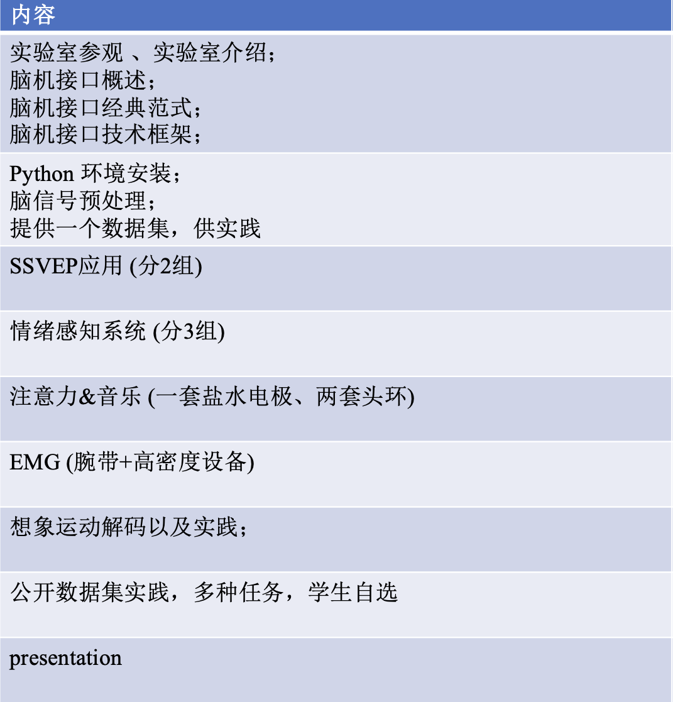
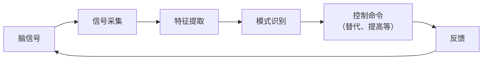

# Lecture 0: Introduction

## 课程简介

本门课主要围绕非侵入式脑机展开。

## 脑机接口的定义和分类

脑机智能：模拟人脑，借助脑机接口。

脑机接口：大脑与外部设备建立直接通路，脑际混合智能，实现人工智能的新途径。

流程：思维意图\(\rightarrow\)神经活动\(\rightarrow\)神经信号\(\rightarrow\)思维形态

基本框架：

按照交互方式分类：

- 主动式BCI：主动控制
- 反应式BCI：外部刺激引发
- 被动式BCI：不以控制为目的

按照生理信号类型分类：

- 侵入式
- 非侵入式：无创、方便；信噪比低，部份依赖外部刺激，主动式需训练，只能完成简单任务

## 其它补充

大脑皮层：平均厚度2-3毫米，具有分析和综合能力。

EEG脑电图：脑部生物电活动的波形图，有四个波段：

- Delta波（深度睡眠）
- Theta波（困倦失望）
- Alpha波（清醒安静闭目）
- Beta波（兴奋）