# Lecture1: Python脑电信号预处理实践

## 一、Python环境搭建

### Anaconda

Anaconda是一个集成了Python、环境管理工具和科学计算包的发行版。它**提供了Conda包管理器**，便于安装和管理库；它支持**多环境隔离**，避免项目冲突。

> **Miniconda**：Anaconda的轻量级替代，仅包含Python和Conda。

### Conda基本命令

- **常用命令**：  
    - 查看Conda版本：`conda -v`  
    - 列出已有环境：`conda env list`  
    - 创建新环境：`conda create -n [环境名称] python=[版本号]`   
    - 激活环境：`conda activate [环境名称]`  
    - 退出环境：`conda deactivate`  
    - 删除环境：`conda remove --name [环境名称] --all`

- **导出/导入环境**：  
    - 导出：`conda env export --name [环境名称] > env.yml`  
    - 导入：`conda env create -f env.yml`

### 包管理

- **Conda包管理**：  
    - 列出已安装包：`conda list`  
    - 安装包：`conda install [包名称]`（可选：`=版本号`）  
    - 更新包：`conda update [包名称]`  
    - 删除包：`conda uninstall [包名称]`

- **Pip包管理**：  
    - 列出已安装包：`pip list`  
    - 安装包：`pip install [包名称]`（可选：`==版本号`）  
    - 更新包：`pip install --upgrade [包名称]`  
    - 删除包：`pip uninstall [包名称]`

- **导出/导入Pip环境**：  
    - 导出：`pip freeze > requirements.txt`  
    - 导入：`pip install -r requirements.txt`

> 事实上，在激活某一环境后，用conda和pip下载的包差距不大，前者的包对于版本转换等问题适配更好，而后者涉及更多新包的资源。

## 三、一些可以用到的算法库

本次实验会用到以下第三方库，需提前安装：

- numpy
- pandas
- matplotlib
- scipy
- mne
- mne_icalabel

这里对课上的一些语法做了补充，它属于基础部分，略过即可。

### 3.1 Numpy

- **用途**：NumPy广泛用于科学计算和数据处理。

- **核心功能**：

    - **创建数组**：  
        
        使用 `np.array()` 创建一维或多维数组，支持多种数据类型。  
        
        ```python
        import numpy as np
        arr = np.array([1, 2, 3])  # 一维数组
        arr_2d = np.array([[1, 2], [3, 4]])  # 二维数组
        print(arr)  # 输出：[1 2 3]
        print(arr_2d)  # 输出：[[1 2] [3 4]]
        ```

    - **数组切片**：  
        
        支持灵活的索引和切片操作，访问数组的子集。  
        
        ```python
        arr = np.array([0, 1, 2, 3, 4])
        print(arr[1:4])  # 输出：[1 2 3]
        print(arr_2d[0, :])  # 输出第一行：[1 2]
        ```

    - **广播机制**：  
        
        允许对数组进行元素级运算，无需显式循环。  
        
        ```python
        arr = np.array([1, 2, 3])
        print(arr + 2)  # 输出：[3 4 5]
        print(arr * 2)  # 输出：[2 4 6]
        ```

    - **数组操作**：  
        
        - **统计计算**：`np.mean()`, `np.sum()`等。  
            
            ```python
            arr = np.array([1, 2, 3, 4])
            print(np.mean(arr))  # 平均数，输出：2.5
            print(np.sum(arr))   # 加和，输出：10
            ```
        
        - **重排数组**：`arr.shape` 返回数组维度。

            ```python
            arr = np.random.randn(60, 2500) # 生成随机数组
            print(arr.shape)                # 输出：(60, 2500)
            arr0 = rearrange(arr, 'c b d -> b c d') # 使用einops重排数组
            print(arr0.shape)               # 输出：(5, 60, 500)
            ```

    - **生成特殊数组**：  
        
        - `np.zeros(shape)`：全零数组。  
        - `np.ones(shape)`：全一数组。  
        - `np.arange(start, stop, step)`：生成等差序列。  
            
            ```python
            print(np.zeros((2, 3)))  # 输出：[[0. 0. 0.] [0. 0. 0.]]
            print(np.arange(10)) # 生成从0到9的数组
            print(np.arange(1, 10)) # 生成从1到9的数组
            print(np.arange(1, 10, 2)) # 生成从1到9的数组，步长为2
            ```

### 3.2 Matplotlib

Matplotlib 是Python最常用的数据可视化库

- 可以生成折线图、柱状图、散点图、饼图、直方图等各种图形
- 常配合 NumPy 和 Pandas 使用，用于分析结果展示与图表绘制

```python
import matplotlib.pyplot as plt
plt.plot(np.arange(0, 2, 0.004), array[0, 0, :], label='0')
plt.plot(np.arange(0, 2, 0.004), array[0, 1, :], label='1')
plt.legend()
plt.show()
```

> 不多赘述，大物实验报告没少用。

### 3.3 Pandas

Pandas 是 Python 中专门用于数据处理与分析的强大库，提供了两种核心数据结构：

1. eries：一维标签数组（类似一列）
2. DataFrame：二维表格型数据（类似Excel或数据库表）

> 很多表格等结构化数据就用到了这个。

- **用途**：适合处理表格数据、数据清洗和分析。
- **核心功能**：

    - **创建DataFrame和Series**：  
        
        从字典、CSV 文件等创建表格数据。  
        
        ```python
        # Series(一维)
        s = pd.Series([10, 20, 30], index=["a", "b", "c"])
        print(s["b"])

        # DataFrame(二维)
        data = {
            "name": ["Alice", "Bob", "Charlie"],
            "age": [25, 30, 22]
        }
        df = pd.DataFrame(data)
        print(df)
        ```

        输出结果：

        ```
        20
              name  age
        0    Alice   25
        1      Bob   30
        2  Charlie   22
        ```

    - **读取数据**：  
        
        支持多种格式，如 CSV、Excel 等。  
        
        ```python
        df = pd.read_csv("data.csv")  # 读取 CSV 文件
        print(df.head())  # 查看前 5 行
        ```

        输出结果：

        ```
              name  age  score
        0    Alice   25     88
        1      Bob   30     92
        2  Charlie   22     95
        ```

    - **数据过滤**：  
        
        使用条件筛选数据。  
        
        ```python
        # 筛选出年龄大于 23 的人
        print(df[df["age"] > 23])
        ```

    - **数据清洗**：  
        
        处理缺失值或重复值。  
        
        ```python
        df = pd.DataFrame({"value": [0.1, None, 0.3, 0.1]})
        df_cleaned = df.dropna()  # 删除含 NaN 的行
        print(df_cleaned)
        df_unique = df.drop_duplicates()  # 删除重复行
        print(df_unique)
        ```

    - **统计分析**：  
        
        计算描述性统计信息，如均值、标准差等。  
        
        ```python
        print(df["value"].mean())  # 输出均值
        print(df["value"].std())   # 输出标准差
        ```

    - **保存为CSV文件**：

        ```python
        df = pd.DataFrame({
            "name": ["Alice", "Bob", "Charlie"],
            "age": [25, 30, 22],
            "score": [88, 92, 95]
        })

        df.to_csv("data.csv", index=False)  # 保存，不带索引列
        ```

## 四、EEG预处理技术

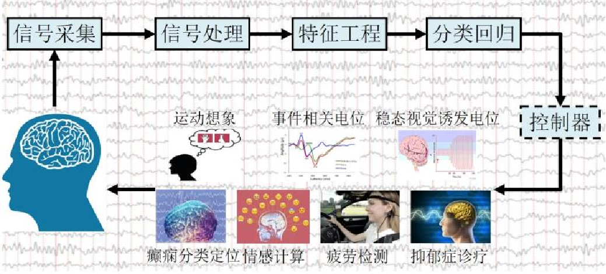

### 4.1 EEG简介

- **EEG**：记录大脑皮层电活动。
- **EEG数据格式**：EEG数据有多种文件格式，包括fif、edf和cnt三种格式。
- **EEG数据内容**：

    - 元数据：通道数量、通道名称、通道类型、坏通道、采样频率、高通滤波、低通滤波等信息。
    - 脑电数据：一个二维数组，形状为(通道数, 采样点数)

必须注意的是，实际的实验中存在各种干扰，这会致波形受到影响，以下是一些常见的因素：

??? example "干扰因素"

    === "眨眼伪迹"
        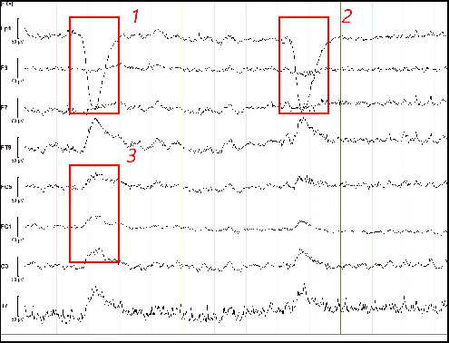
    === "眼动伪迹"
        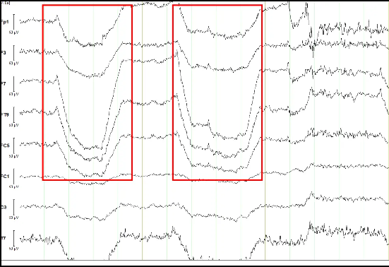
    === "肌电污染"
        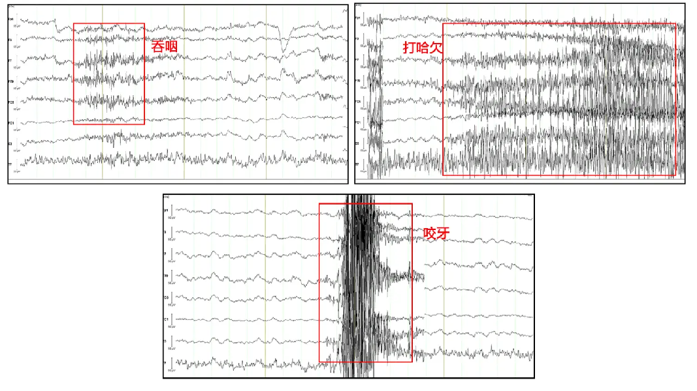
    === "心电干扰"
        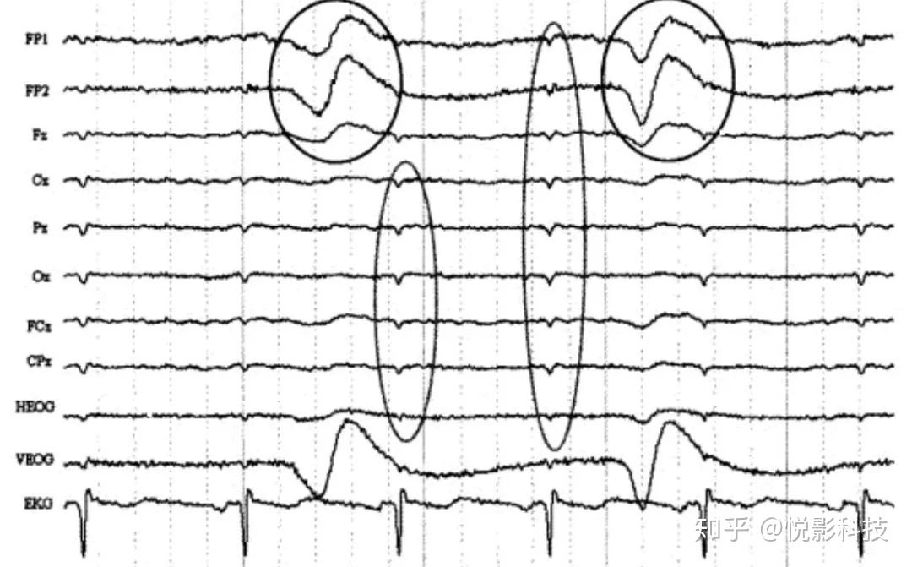
    === "工频干扰"
        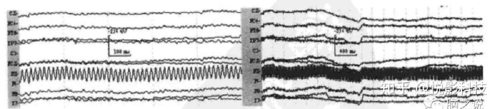
    === "alpha波形"
        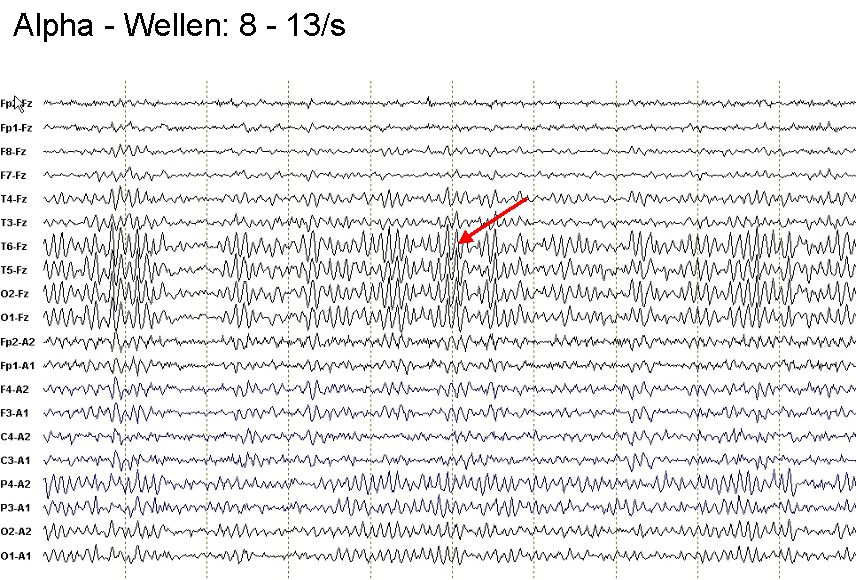


### 4.2 EEG预处理流程

- 导入数据
- 加载电极
- 滤波
- 分段
- 重采样
- 插值坏导
- 剔除坏段

#### 1. 导入数据

EEG文件需用特定函数加载。

|格式|函数|
|---|---|
|fif|`mne.io.read_raw_fif`|
|edf|`mne.io.read_raw_edf`|
|cnt|`mne.io.read_raw_cnt`|

??? example "读取.edf文件"  

    ```python
    # 用 mne.io.read_raw_edf 读取 MDD S19 EO.edf
    raw = mne.io.read_raw_edf('MDD S19 EO.edf', preload=True)
    # 输出信息（<Info ... >）
    print(raw.info)
    # 输出形状（(20, 76288)）
    print(raw.get_data().shape)
    ```

    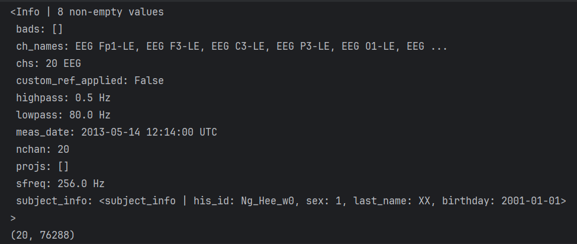

#### 2. 加载电极

1. 根据通道名称设置通道类型
2. 根据通道类型筛选通道
3. 通道重命名
4. 设置电极布局

??? example "加载电极"

    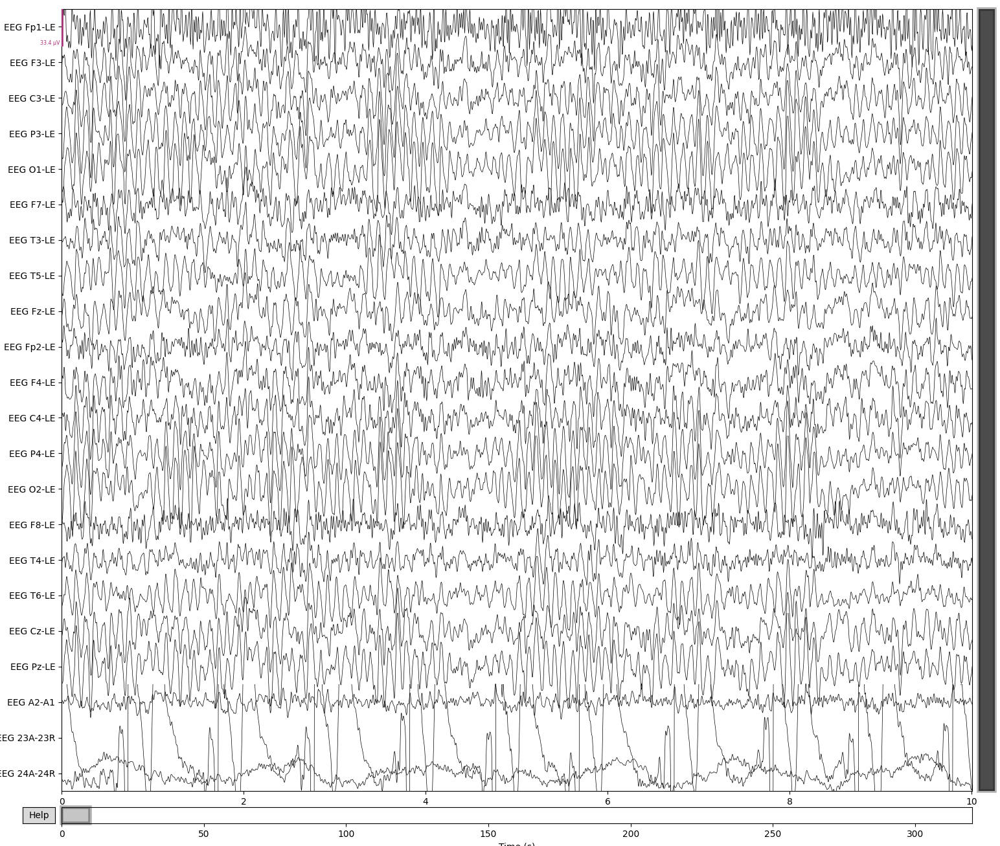

    在这个图里面，A2-A1、23A-23R、24A-24R不是需要的通道，所以需要删除。

    ```python
    # 需要删除的通道
    not_channels = ['EEG A2-A1','EEG 23A-23R', 'EEG 24A-24R']
    map = {
        "EEG Fp1-LE": "Fp1",
        "EEG F3-LE": "F3",
        "EEG C3-LE": "C3",
        "EEG P3-LE": "P3",
        "EEG O1-LE": "O1",
        "EEG F7-LE": "F7",
        "EEG T3-LE": "T3",
        "EEG T5-LE": "T5",
        "EEG Fz-LE": "Fz",
        "EEG Fp2-LE": "Fp2",
        "EEG F4-LE": "F4",
        "EEG C4-LE": "C4",
        "EEG P4-LE": "P4",
        "EEG O2-LE": "O2",
        "EEG F8-LE": "F8",
        "EEG T4-LE": "T4",
        "EEG T6-LE": "T6",
        "EEG Cz-LE": "Cz",
        "EEG Pz-LE": "Pz",
    }
    # 丢弃不需要的
    raw.drop_channels(not_channels)
    # 用map字典重命名
    raw.rename_channels(map)
    # 设置电极布局
    raw.set_montage('standard_1005')
    raw.plot_sensors(show_names=True) # EEG通道可视化
    ```

    这个就是`raw.plot_sensors(show_names=True)`得到的电极布局图：（从上方俯视脑袋，黑点就是贴的电极）

    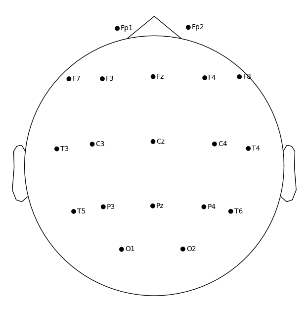

#### 3. 滤波

分两类：

1. 带通滤波：`raw.filter(x, y)`，保留信号中x（低频截止频率）和y（高频截止频率）之间的特定频率范围。
2. 陷波滤波：`raw.notch_filter(z)`，去除信号中特定频率z。

#### 4. 重采样

调整采样频率（降采样/升采样）：`raw.resample(a)`（降到 a Hz）。

#### 5. 插值坏导和剔除坏段

有一部分因为损坏等原因，需要我们基于周围正常通道的空间信息，通过插值方法重建被标记为"坏"的通道数据。

??? example "插值坏导"

    在刚才的示例中，其实我们可以发现`Fz`这个通道与周围的波形格格不入，可以大致推测它是坏值，因此我们把它加入`bad_channels`，然后用`raw.info['bads']`去标注坏值。

    ```python
    # 坏值
    bad_channels = ['Fz']
    raw.info['bads'] = bad_channels
    # 重建被标记为"坏"的通道
    raw.interpolate_bads()
    ```

    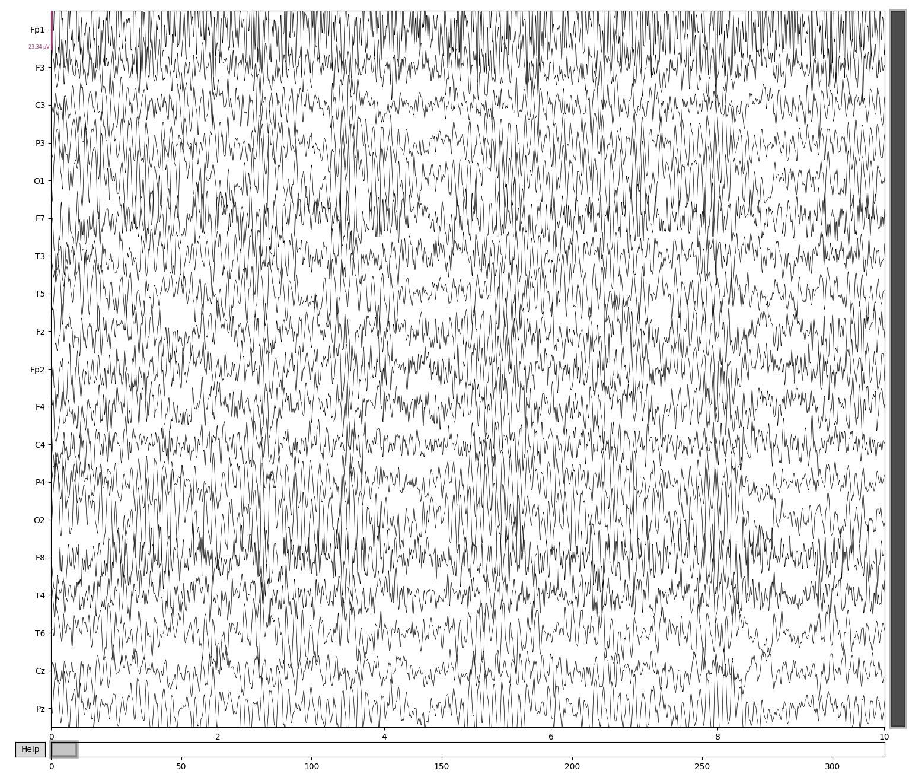

> 处理时我们剔除坏值和滤波都要做，但一般来说顺序不重要

#### 6. 重参考

1. 共平均参考：`raw.set_eeg_reference('average', projection=True)`
2. 双侧乳突参考：指定左右乳突电极`M1`和`M2`，使用`raw.set_eeg_reference(['M1', 'M2'])`
3. REST重参考

#### 7. 独立成分分析

它主要用于之前提到的分离混合信号中的独立源成分，除去眼动等伪迹，提高信号质量。

ICA假设这些信号是线性混合的独立源，通过统计方法（如最大化非高斯性）将混合信号分解为独立成分。分解后，我们可以手动或自动（通过`mne_icalabel`）标记哪些成分是伪迹并移除。

??? example "独立成分分析"

    方才例子中的EEG信号包含伪迹。我们用ICA将这些混合信号分解为独立的成分（independent components, ICs），便于识别和去除伪迹；不过我们也要通过识别与大脑活动相关的成分，保留这些信号。

    ```python
    raw_ica = raw.copy() # 创建raw的副本，这里主要保证不动原始数据
    n_components = 15    # 设置 ICA 分解的独立成分数量
    ica = ICA(n_components=n_components, method='infomax', fit_params=dict(extended=True), random_state=42)
    ica.fit(raw_ica)     # 对 EEG 数据执行 ICA 分解

    # 创建MNE的 ICA 对象，配置ICA参数
    ic_labels = label_components(raw_ica, ica, method='iclabel')
    labels = ic_labels["labels"]       # 提取成分标签
    probs = ic_labels["y_pred_proba"]  # 提取标签的置信度

    iclabel_dict = {
        'labels': labels,
        'probs': probs,
    }

    # 筛选出需要移除的“坏”成分（伪迹），存储其索引到 bad 列表
    # 逻辑：使用列表推导式，遍历 labels 和 probs，排除“brain”或“other”的成分，仅选择置信度 ≥ 0.7 的成分
    bad = [i for i, (label, prob) in enumerate(zip(labels, probs)) if label not in ['brain', 'other'] and prob >= 0.7]
    ica.exclude = bad
    ica.apply(ica, exclude=ica.exclude) # 应用 ICA，移除伪迹成分
    ```

    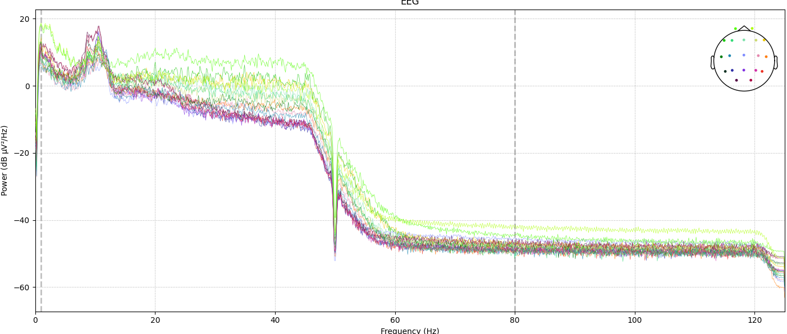

## 五、脑电信号预处理实践数据集

### 5.1 数据集

- **来源**：MDD抑郁症公开数据集（EDF格式）
- **链接**：[EEG_Data_New](https://figshare.com/articles/dataset/EEG_Data_New/4244171)

### 5.2 注意事项

- EDF文件需用`mne.io.read_raw_edf()`方法读取。

- 清理通道名称（还有删除`A2-A1`、`23A-23R`、`24A-24R`）。

- 使用共平均参考：`raw.set_eeg_reference(ref_channels="average")`。
