# Lecture 2: SSVEP

## 一、SSVEP范式

### 1. SSVEP范式简介

如下图，每经过0.5s的black时间进行一个特定频率的刺激，而在脑内又经过\(\tau\)时间后，形成特定频率数据，我们对其进行与模板频率波的相关性分析，这就是SSVEP的大致思路。

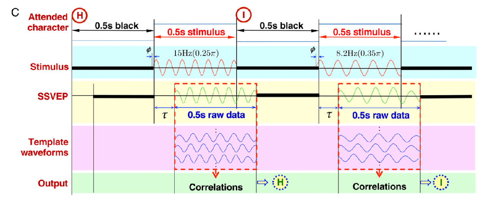

在SSVEP范式的实验中，我们一般采集如下点位：

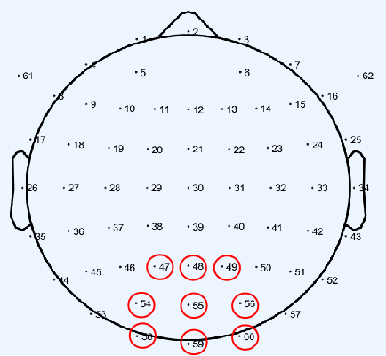

在下方图中我们可以观察到在 \( n \cdot z \space \text{Hz} \) 处有相应突起。

???+ example "不同频率下的SSVEP信号分析"

    === "8Hz"
        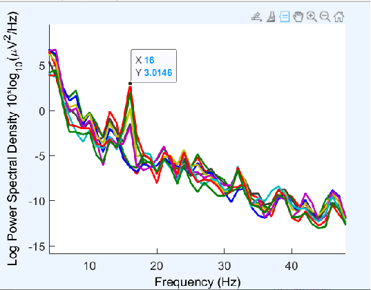
    === "10Hz"
        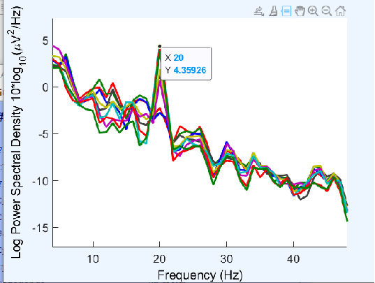
    === "12Hz"
        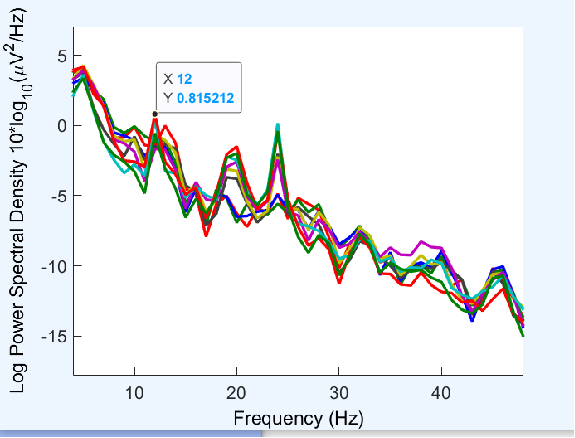
    === "14Hz"
        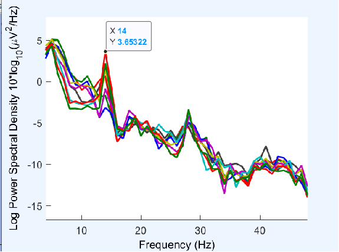

    为什么在 \( n \cdot z \space \text{Hz} \) 处有突起？简单地说，这是因为对于频率成整倍数关系的波，它们会有共同的波峰。

### 2. 典型相关分析

**CCA**（典型相关分析）：一种多元统计方法，为了使两组之间的相关程度最大，通过寻找两组变量的线性组合最大化它们之间的相关性。在SSVEP中，CCA用于关联EEG信号与参考信号（刺激频率的正弦波），以确定用户注视的频率。具体操作为：

1. 首先在每组变量中找出变量的线性组合使得两组的线性组合之间具有最大的相关系数。

2. 然后选取和最初挑选的这对线性组合不相关的线性组合，使其配对，并选取相关系数最大的一对，如此继续下去，直到两组变量之间的相关性被提取完毕为此。

3. 被选出的线性组合配对称为典型变量，它们的相关系数称为典型相关系数。**典型相关系数**度量了这两组变量之间联系的强度。

- 目的：
    - 通过最大化EEG信号与参考信号的相关性，识别目标刺激频率。
    - 从噪声EEG信号中提取有意义的特征。

- 核心概念：对于两组变量 \( X \)（EEG信号）和 \( Y \)（参考信号），CCA 寻找线性组合 \( U = XW_x \) 和 \( V = YW_y \)，使 \( U \) 和 \( V \) 的相关性最大。

> 这么说会很抽象，下方对其进一步说明。

- 问题设定：
    - 设 \( X \in \mathbb{R}^{m \times T} \) 表示EEG信号（m个通道，T个时间点）。
    - 设 \( Y \in \mathbb{R}^{k \times T} \) 表示参考信号（k个刺激频率的正弦波，T个时间点）。
    - 目标：找到权重向量 \( W_x \) 和 \( W_y \)，使 \( U = X^T W_x \) 和 \( V = Y^T W_y \) 的相关性最大。

> \( W_x \in \mathbb{R}^{m \times 1} \)，其中 \( m \) 是EEG通道数。
>
> \( W_y \in \mathbb{R}^{k \times 1} \)，其中 \( k \) 是参考信号的维度。

- 优化目标：

    \[
    \rho(U, V) = \frac{\text{cov}(U, V)}{\sqrt{\text{var}(U) \cdot \text{var}(V)}}
    \]

    代入 \( U = X^T W_x \) 和 \( V = Y^T W_y \)：

    \[
    \rho(W_x, W_y) = \frac{W_x^T C_{xy} W_y}{\sqrt{(W_x^T C_{xx} W_x)(W_y^T C_{yy} W_y)}}
    \]

    其中：
    
    - \( C_{xy} = \text{cov}(X, Y) \)：交叉协方差矩阵。
    - \( C_{xx} = \text{cov}(X, X) \)：\( X \) 的协方差矩阵。
    - \( C_{yy} = \text{cov}(Y, Y) \)：\( Y \) 的协方差矩阵。

- 约束条件：
    - 为避免平凡解，约束 \( W_x^T C_{xx} W_x = 1 \) 和 \( W_y^T C_{yy} W_y = 1 \)。
    - 优化问题为：

        \[
        \max_{W_x, W_y} W_x^T C_{xy} W_y \quad \text{subject to} \quad W_x^T C_{xx} W_x = 1, \quad W_y^T C_{yy} W_y = 1
        \]

- SVD求解：
    - 通过 **奇异值分解（SVD）** 解决优化问题。
    - 定义矩阵：

        \[
        K = C_{xx}^{-1/2} C_{xy} C_{yy}^{-1/2}
        \]

    - 对 \( K \) 进行SVD分解：

        \[
        K = U \Sigma V^T
        \]

        其中，\( \Sigma \) 包含奇异值（典型相关系数），\( U, V \) 为左右奇异向量。
    
    - 权重向量为：

        \[
        W_x = C_{xx}^{-1/2} U, \quad W_y = C_{yy}^{-1/2} V
        \]

    - **最大奇异值**对应**最大相关系数**，指示目标刺激频率。

        \[
        \Sigma = \begin{bmatrix}
        \sigma_1 & 0 & \cdots & 0 \\
        0 & \sigma_2 & \cdots & 0 \\
        \vdots & \vdots & \ddots & \vdots \\
        0 & 0 & \cdots & \sigma_r
        \end{bmatrix}
        \]
        
        其中，\( \sigma_1 \geq \sigma_2 \geq \cdots \geq \sigma_r \geq 0 \) 是奇异值。

- 迭代过程：
    - 找到第一对典型变量后，CCA继续选择与前面对不相关的其他线性组合对，提取所有相关性。
    - **典型相关系数**衡量EEG与参考信号之间的关系强度。

- 实际实现：
    - CCA将EEG信号与每个刺激频率（例如8 Hz、10 Hz、12 Hz、14 Hz）的参考信号进行比较。
    - 选择相关系数最高的频率作为用户的目标。

> [典型关联分析](https://www.cnblogs.com/pinard/p/6288716.html)
>
> 可以看一看这位的博客，讲解很清晰。

最终步骤就变成如下：

- 准备EEG数据：收集多通道、时间点的EEG信号。
- 生成参考信号：创建对应刺激频率的正弦波（如8 Hz、10 Hz）。
- 计算协方差矩阵：计算 \( C_{xx} \) 、 \( C_{xy} \) 和 \( C_{yy} \) 。
- 执行SVD：分解 \( K \) 以获得 \( W_x \) 、 \( W_y \) 和相关系数。
- 选择目标频率：通过最大奇异值选择相关系数最高的频率。

## 二、打字机

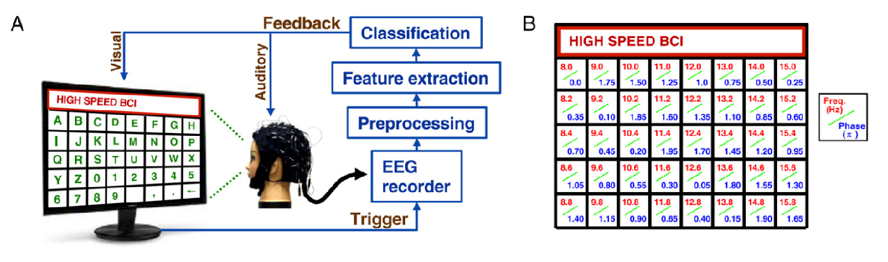

### 1. 组成

- 模块：UI模块、信号采集模块、解码模块。
- 阶段：校准阶段、反馈阶段。
- 涉及的三方库：Pyqt、Pylsl、Sklearn等。

### 2. 工程架构

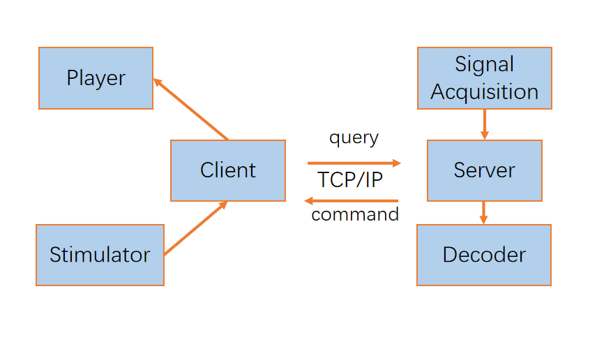

## 三、小车控制

### 1. 组成

- 模块：UI模块、信号采集模块、解码模块。
- 阶段：反馈阶段。
- 涉及的三方库：Pyqt、Pylsl、Sklearn、Robomaster等。

### 2. 工程架构

client.py 会根据具体的行为去调用 RobotController.py 的模块，比如`rotate_anticlockwise(self)`就是逆时针旋转。 

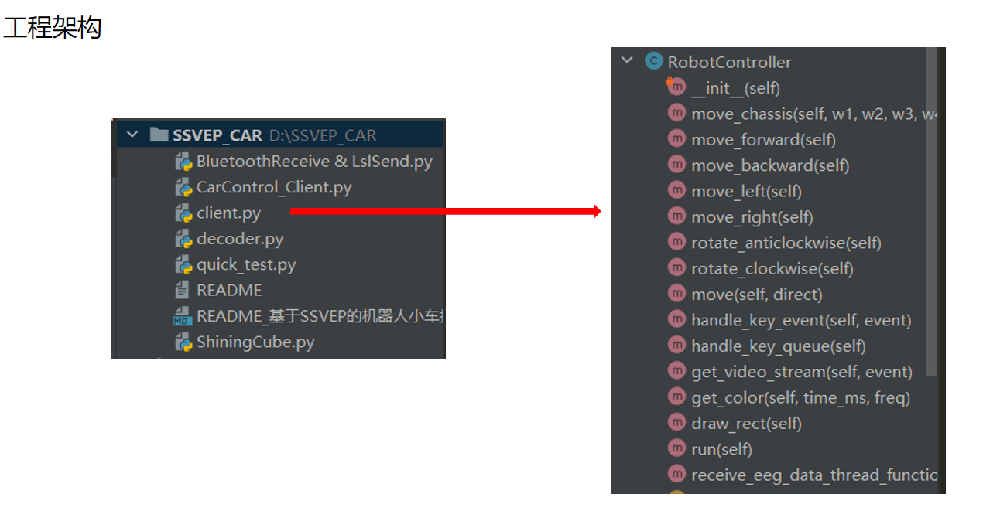

### 3. 运行流程

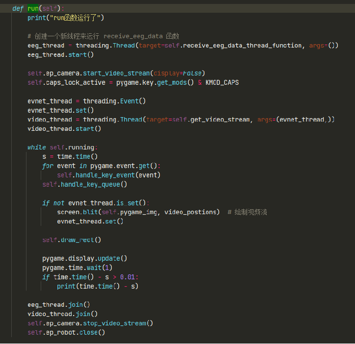

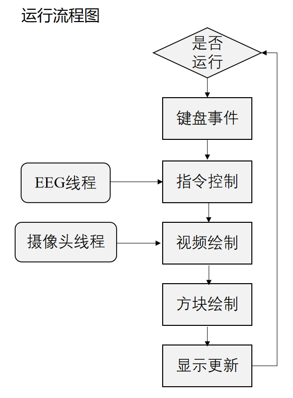

> 另外还有`Decoder`模块、控制运动的函数模块、`EEG`模块等。

这节课我有幸体验了打字机和小车控制两个实验。我认为老师的侧重点在于数学和实践的考察；或许是工程代码比较复杂难懂，明晰思路在目前阶段更重要。