# Lecture3: VR-EEG情绪感知系统实践

## 一、EEG情绪识别简述

### 1. 情绪识别的重要性

情绪识别是人机交互、心理健康监测和娱乐体验的核心技术。通过EEG（脑电图）信号，我们可以非侵入性地捕捉大脑活动，实时分析用户的情绪状态。

### 2. 情绪的二维模型

情绪的二维模型基于两个维度来描述情绪：

- **Arousal（唤醒度）**：表示情绪的活跃程度。
    - 低唤醒度：平静、放松
    - 高唤醒度：兴奋、紧张
- **Valence（效价）**：表示情绪的正负倾向。
    - 正效价：愉快、积极
    - 负效价：愤怒、悲伤

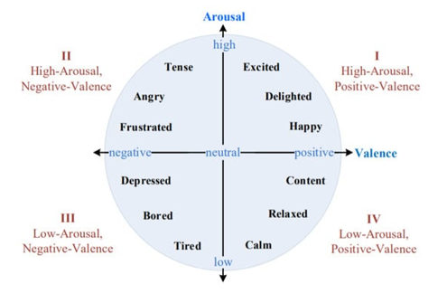

这个模型将复杂的情绪简化为二维坐标，便于分类和分析。

## 二、情绪识别系统实践

### 1. 系统概览

基于DEAP数据集的情感识别工作流包括以下步骤：

- 脑电采集：记录EEG信号。
- 数据处理：清洗和预处理数据。
- 特征提取：提取情绪相关特征。
- 分类识别：使用算法识别情绪。
- 情感反馈：将结果反馈给用户。

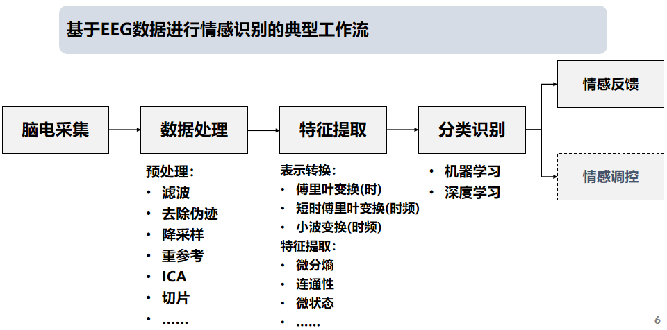

而中间部分就是用代码（Python）解决问题的。

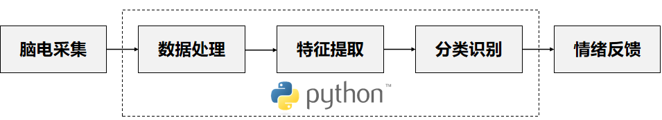

> 事实上，后面的大作业差不多也是这个流程。

### 2. 典型工作流细节

#### 2.1 脑电采集

使用设备（如BMI VR一体机）采集EEG信号，通常从**前额区域**（FP1、FP2位点）获取。

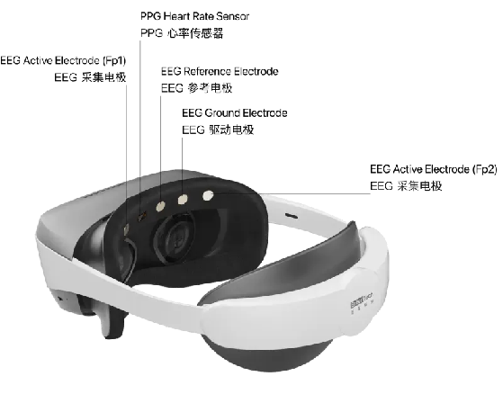

??? note "关于 BMI VR 一体机的补充"

    基础规格：
    
    - 生理传感器：前额双通道脑电 (位点：FP1、FP2，采集频率250Hz) 、前额PPG心率
    - 重量：620g，手柄108g
    
    显示光学
    
    - 屏幕：2.89寸Fast-LCD X2
    - 分辨率：4320*2160
    - 刷新率：90Hz
    - 近视：支持佩戴眼镜
    
    定位与交互：手柄交互，双6Dof红外光学手柄


### 2.2 前端界面

主要包含这俩模块：

- 情感信息模块：实时展示情绪状态（愤怒、恐惧、悲伤、平静、愉快）
- 生物数据模块：显示EEG波形、心率等数据

#### 情感信息模块

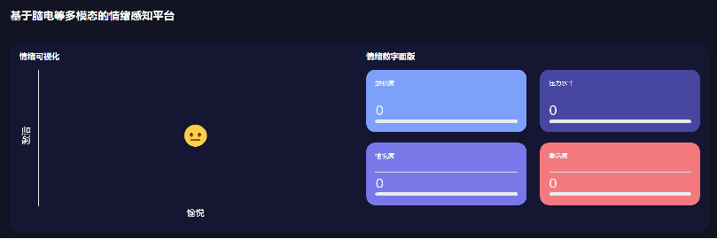

??? note "情感示例"
    
    以下是前端界面的情感信息模块实时展示的用户情感信息示例。

    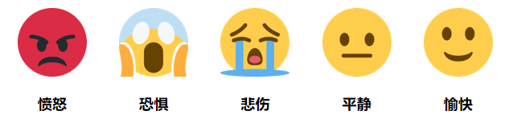

前端界面的情感信息模块实时展示用户情感等信息。

#### 生物数据模块

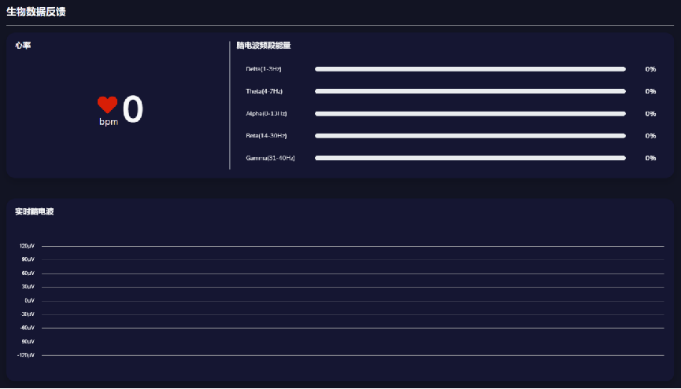

前端界面生物数据模块实时展示采集到的生物数据。

## 三、课堂任务概览

课堂上老师为我们设计了三个实践任务，帮助我们动手实现情绪感知系统：

- 任务一：连接VR设备，解析多模态数据
- 任务二：基于情绪识别范式采集和分析数据
- 任务三：实现完整的实时情绪感知系统

### 任务一：连接设备，获得采集数据

#### 任务目标

修改`simple.py`，完成：

- 连接VR设备
- 打印情感云服务器返回的数据报文
- 解析报文
- 保存数据

??? note "多线程并发"

    1. 为什么用多线程？

        - 并行性：多个任务同时执行，提高效率
        - 避免阻塞：I/O操作（如数据接收）不会中断主程序
        - 数据共享：线程间共享内存，便于处理

    2. 代码示例:

        ```python
        import threading

        def run(n):
            print("current task：", n)

        if __name__ == "__main__":
            t1 = threading.Thread(target=run, args=("thread 1",))
            t2 = threading.Thread(target=run, args=("thread 2",))
            t1.start()
            t2.start()
        ```

1. 数据采集架构

    VR设备通过蓝牙连接脑机接口模块，采集生物信号后发送至云端分析，云端通过算法分析后返回结果。

    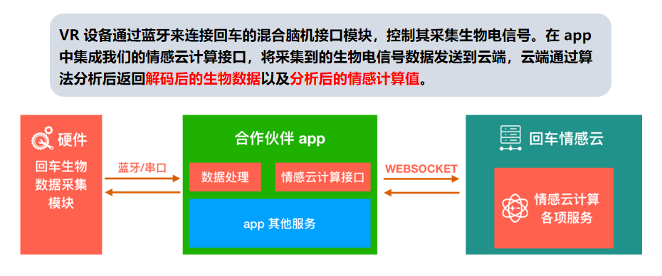

2. 多线程实现

    - 线程0：收集实时数据
    - 线程1：持续采集并编号
    - 线程2：创建文件夹并保存数据
    - 时间戳对齐：采集完成后逆推对齐

```python
if __name__ == '__main__':
    folder_path = create_new_folder()
    print("Starting the collecting server...")
    t = threading.Thread(target=collect_data)
    t2 = threading.Thread(target=put_eeg_result_forever)
    t3 = threading.Thread(target=save_array_to_npy, args=(folder_path,))
    t.start()
    t2.start()
    t3.start()
```

#### 生物数据报文

报文结构：

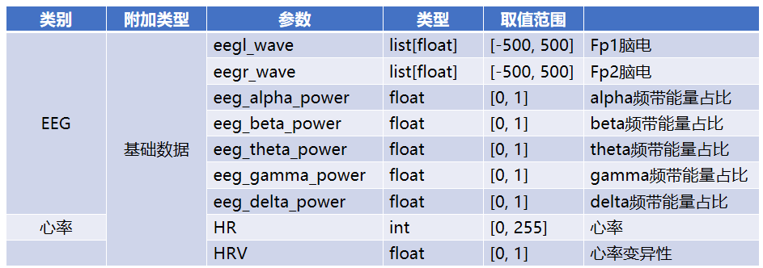

??? example "报文实例"

    以下是一个完整的报文。

    ```python
    < [code: 0] [msg: None] [biodata:subscribe] >>> {'hr-v2': {'hr': 0, 'hrv': 0.0}}
    
    < [code: 0] [msg: None] [biodata:subscribe] >>> {'eeg': 
        {'eegl_wave': [-72.44, -21.98, -20.91, -55.1, ... , 13.93, -0.03, -20.84], 
        'eeg_alpha_power': 0.2228, 
        'eeg_beta_power': 0.3645, 
        'eeg_theta_power': 0.1757, 
        'eeg_delta_power': 0.0938, 
        'eeg_gamma_power': 0.1432, 
        'eeg_quality': 2}
    }
    ```

    数据包由两条单独的消息组成，每条消息都带有元数据前缀，指示数据的状态和类型：

    ```python hl_lines="4"
    # [code: 0] 表示数据传输成功（无误）
    # [msg: None] 表示没有额外的消息或错误描述
    # [biodata:subscribe] 表示这是一个“订阅式”数据流 系统持续从设备接收生物数据
    < [code: 0] [msg: None] [biodata:subscribe] >>> {...}
    ```

    `>>>` 后面是类似 JSON 的结构，它就包含了这些生物数据。
    
    比如在第一个包是心率数据，其中：

    ```python hl_lines="2"
    # hrv 表示心率变异性，测量心跳之间的时间变化
    'hr-v2': {'hr': 0, 'hrv': 0.0}
    ```

    而第二个数据则是 EEG 数据，其对应的参数在上面的表格中已经提到了。

    ```python
    {'eeg': 
        {'eegl_wave': [-72.44, -21.98, -20.91, -55.1, ... , 13.93, -0.03, -20.84], 
        'eeg_alpha_power': 0.2228, 
        'eeg_beta_power': 0.3645, 
        'eeg_theta_power': 0.1757, 
        'eeg_delta_power': 0.0938, 
        'eeg_gamma_power': 0.1432, 
        'eeg_quality': 2}
    }
    ```

### 任务二：基于情绪识别范式的数据采集与分析

此部分主要包括：

- 经典范式介绍
- 数据采集与保存
- 数据的预处理与可视化

情感脑机接口实验通常在受控环境中进行，使用刺激材料（如电影、图片、音乐）诱发特定情绪。

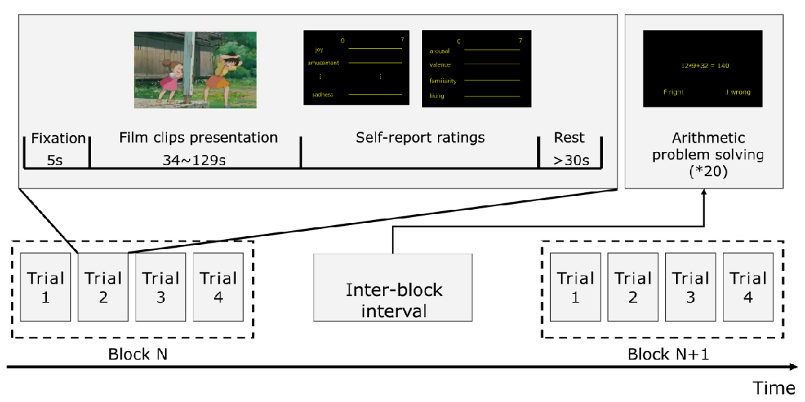

??? example "SEED数据集"

    这是别人已经做好的数据集。

    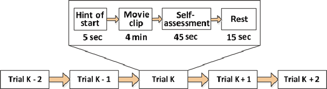

    - 全称：SJTU Emotion EEG Dataset
    - 来源：上海交通大学吕宝粮团队
    - 用途：公开的情感EEG数据集，用于研究情绪识别
    - 链接：[SEED数据集](https://bcmi.sjtu.edu.cn/~seed/seed.html)

VR-情绪EEG数据采集：

- 环境：YVR影院
- 任务：观看情绪视频（happy、neutral、sad，每段6分钟），同步采集EEG
- 流程：按顺序观看，中间可休息

???+ question "任务"

    把采集到的EEG数据分成5个波段，并可视化。

    ```
    # 将EEG数据分成5个波段
    from EEG_feature_extactor.DE import bandpass_filter

    freq_bands = [
            [1, 4],  # delta
            [4, 8],  # theta
            [8, 14],  # alpha
            [14, 31],  # beta
            [31, 49]  # gamma
        ]

    band_names = ['Delta band (0.5–4 Hz)', 'Theta band (4–8 Hz)', 'Alpha band (8–13 Hz)',
                'Beta band (13–30 Hz)', 'Gamma band (30–45 Hz)']

    # ==== 选一个通道进行可视化 ====
    channel_idx = 0

    # ==== 设置时间范围（秒） ====
    t_start = 10  # seconds
    t_end = 12    # seconds
    start_idx = int(t_start * sampling_rate)
    end_idx = int(t_end * sampling_rate)

    raw_signal = EEG_data[channel_idx][start_idx:end_idx]
    print(raw_signal.shape)
    ```

    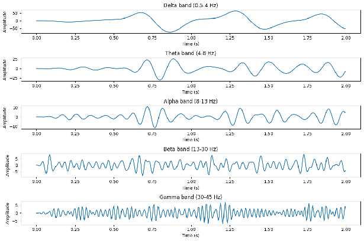

### 任务三：实现完整的实时情绪感知系统

#### EEG微分熵特征提取

定义：微分熵（Differential Entropy, DE）是香农信息熵的连续形式，用于量化EEG信号的复杂性和不确定性。

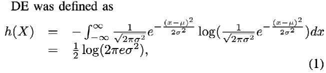

> 参考文献：Duan, R.-N., Zhu, J.-Y., & Lu, B.-L. (2013). *Differential Entropy Feature for EEG-based Emotion Classification*.(NER).

???+ question "任务"

    提取5个波段的微分熵特征，作为情绪分类的输入。

    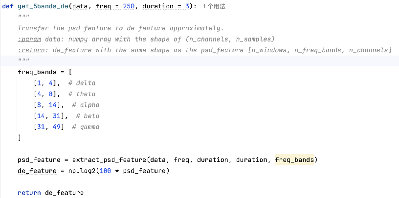

#### 基于SVM的EEG情绪分类

- 方法：使用支持向量机（SVM）进行分类，**最大化不同类别之间的间隔**，找到最佳超平面分离不同情绪。
- 评估指标：
    - 准确率（Accuracy）
    - 精确率（Precision）
    - 召回率（Recall）
    - F1分数
    - 混淆矩阵

#### SVM模型部署

将训练好的SVM模型集成到`app.py`，实现实时情绪感知。

```python hl_lines="6 10 13"
def reasoning(model, eeg_data):
    # eeg_data: shape (2, 3*250) -> 特征提取后变成 1D 向量
    # model: 训练好的模型
    # return: 预测结果 0-positive, 1-neutral, 2-negative
    # Extract differential entropy (DE) features for 5 frequency bands
    de_features = get_5bands_de(eeg_data)  
    # Assuming this returns a 1D vector (e.g., 10 features: 5 bands × 2 channels)
    
    # Ensure features are in the correct shape for SVM (2D array: [1, n_features])
    de_features = de_features.reshape(1, -1)
    
    # Perform prediction using the pre-trained SVM model
    prediction = model.predict(de_features)
    
    # Return the predicted emotion class (0, 1, or 2)
    return int(prediction[0])
```