# Lecture 4: Attention Detection and Music Emotion Recognition

## 1. 多模态生理信号介绍

### 1.1 脑电信号 (EEG)

> 我们之前已经大致了解这是个什么概念了。

- **频段与特征**：

    | 频段         | 范围 (Hz) | 特征脑区                     | 与注意力的关系                          | 与情绪的关系                             |
    |--------------|-----------|-----------------------------|-----------------------------------------|-----------------------------------------|
    | δ (Delta)    | 0.5–4     | 额叶、中央、睡眠相关区       | 睡眠时最强；清醒时过高→注意力低         | 抑郁、慢性疲劳、脑损伤时增强             |
    | θ (Theta)    | 4–8       | 额叶、颞叶、边缘系统         | 微觉醒、沉思、分心或疲劳时增强          | 情绪加工、悲伤、焦虑、创伤回忆等         |
    | α (Alpha)    | 8–13      | 枕叶、顶叶、中后部           | 放松但警觉状态，注意力内向              | α 左右不对称与情绪调节、自我调控相关     |
    | β (Beta)     | 13–30     | 顶中央、额叶                 | 集中注意、主动任务执行时增强            | β 过高可能关联焦虑、紧张                 |
    | γ (Gamma)    | 30–100    | 额叶、联合区                 | 高级认知、集中注意、感知整合            | 情绪体验、意识整合、正念冥想相关         |

- 最常用特征：频域特征（Power Spectral Density, PSD），通过原始数据（Raw data）计算功率（Power）。（Raw data -> PSD -> Power）

### 1.2 功能性近红外光谱成像 (fNIRS)

- **定义**：非侵入式脑功能成像技术，利用 700–900nm **近红外光监测大脑皮层血氧浓度变化**，间接反映神经活动。
- **工作原理**：活跃神经元消耗更多氧气，导致局部血氧浓度变化（神经血管耦合），**测量氧合血红蛋白（HbO）、脱氧血红蛋白（HbR）和总血红蛋白（HBT）浓度变化**，来估计神经活动。

## 2. 采集设备介绍

### 2.1 全脑脑电帽 - GREENTEK

- **型号**：Gelfree S3 Cap
- **特点**：使用** NaCl 电解质溶液**代替传统导电膏，减少准备时间和不适感。

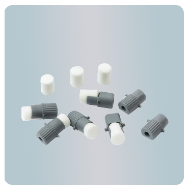

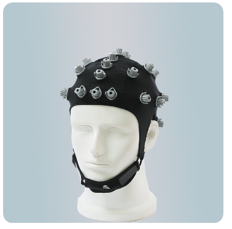

### 2.2 生物放大器 - OpenBCI

- **型号**：Cyton + Daisy Biosensing Boards
- **参数**：16 通道，采样率 200 Hz。
- **数据平台**：OpenBCI GUI

??? example "实例图"

    看着挺大，我印象中其实不到一个巴掌大。

    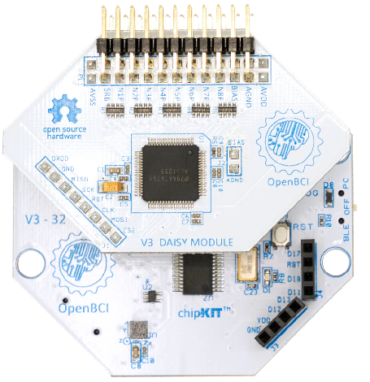

    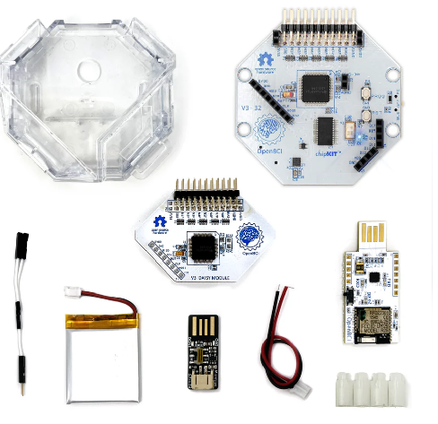

> 文档：https://docs.openbci.com/Software/OpenBCISoftware/GUIDocs/

### 2.3 便携式设备

- **EEG 参数**：

    - 通道：FP1，FP2
    - 参考电极：左耳垂（A1）
    - 采样率：250 Hz

- **fNIRS 参数**：

    - 光源：2 个（735 nm，850 nm）
    - 探测器：8 个（8 通道数据）
    - 采样率：25 Hz

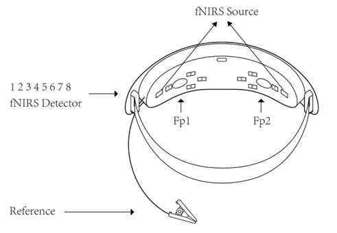

> 实际体验：喷点酒精在额头上，接着一个头环戴上去，最后一个架子夹住左耳垂。

## 3. 实验环节：基于脑信号的注意力监测

### 3.1 注意力概述

作为**核心认知功能**，影响很大。

### 3.2 实验范式

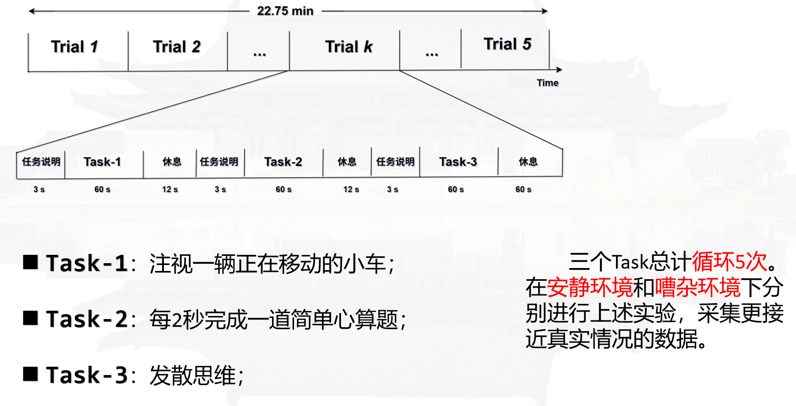

三个Task总计循环5次。在安静环境和嘈杂环境下分别进行上述实验，采集更接近真实情况的数据。

### 3.3 实时注意力监测框架

- **EEG**：高时间分辨率，捕捉快速电信号变化，反映注意力转移。
- **fNIRS**：检测皮层血氧变化，定位大脑激活区域。

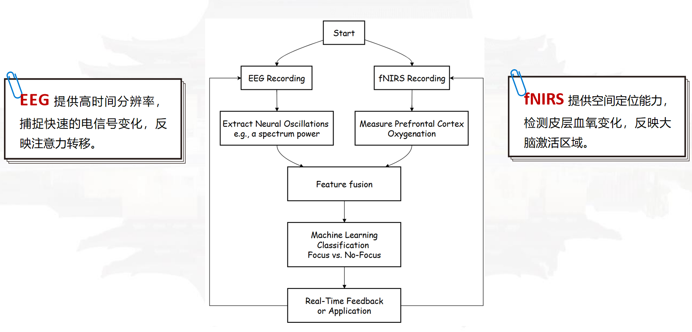

### 3.4 特征分析

下面这张图展示了不同注意力状态下，EEG 五个频段（δ、θ、α、β、γ）的功率分布头图（topomap）变化情况，横向表示频段，纵向表示注意力状态，颜色表示归一化后的功率强度（0~1）。

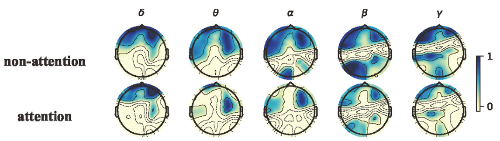

> alpha波: 与注意“抑制”相关，注意力集中时\(\alpha\)波被抑制，是**最经典特征**。

## 4. 基于脑信号的情绪识别

### 4.1 情绪概述

- **定义**：情绪是由神经生理变化引起的精神状态，与思想、感觉、行为及快乐/不快乐程度相关。
- **情绪建模**：

    - **维度模型**：如詹姆斯·罗素的环形情感分类模型（Arousal-Valence）。
    - **离散模型**：保罗·埃克曼的七类基本情绪（快乐、悲伤、愤怒、厌恶、惊讶、恐惧、蔑视）。

??? example "情绪模型实例"
    
    === "维度模型示例"
        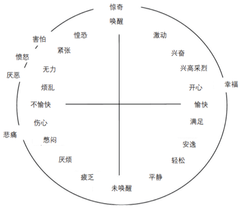
    === "离散模型示例"
        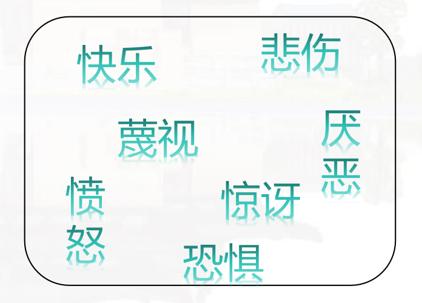

### 4.2 情绪解码流程

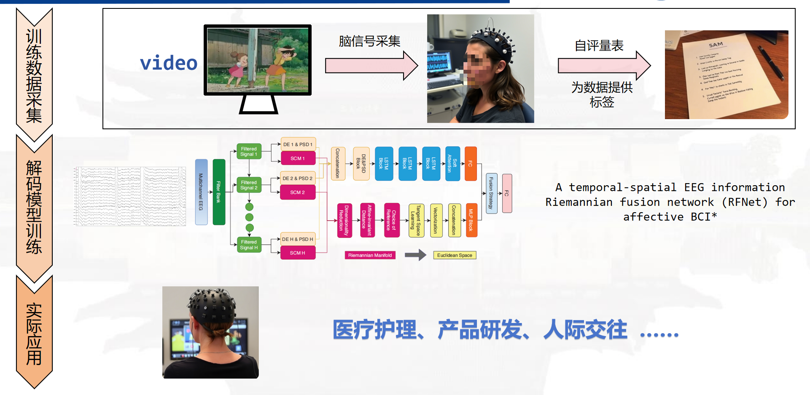

> 参考文献：Guangyi Zhang and Ali Etemad. Rfnet: Riemannian fusion network for eeg-based brain-computer interfaces. arXiv preprint arXiv:2008.08633, 2020

### 4.3 数据采集范式

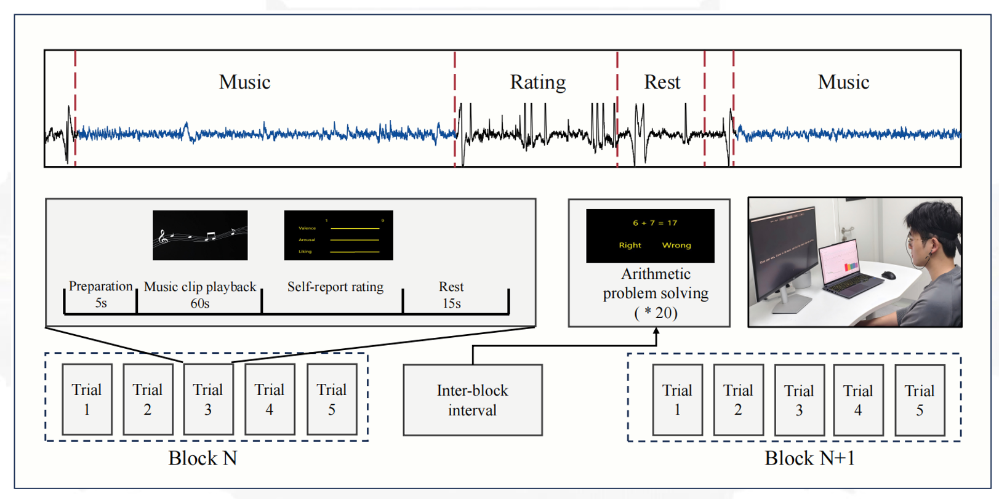

### 4.4 特征分析

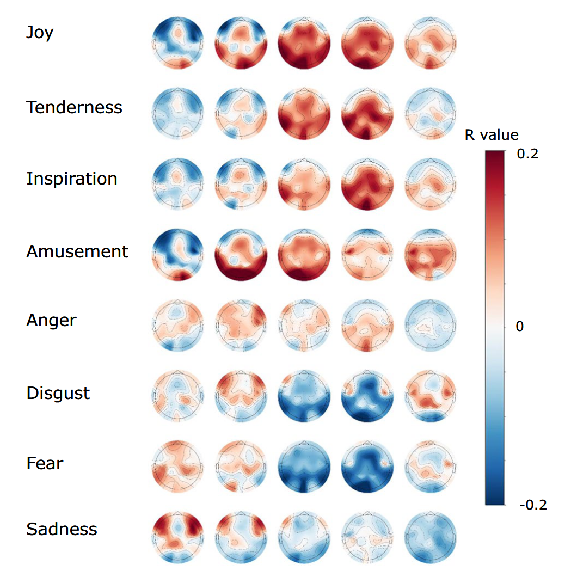

使用 topomap 热力图分析情绪与 EEG 频段能量的相关性：

- 纵轴：情绪类别。
- 横轴：EEG 频段（δ、θ、α、β、γ）。
- 颜色：表示皮层每个电极位点的相关系数（R value），红色为正相关，蓝色为负相关，颜色越深表示相关越强。

我们可以看到，情绪识别模型中，可以使用**频段能量作为情绪状态的关键特征**；负性情绪（如 Fear）特征更稳定，常**与 gamma/beta 波负相关**。

> 参考文献：Chen, Jingjing, et al. "A large finer-grained affective computing EEG dataset." *Scientific Data* 10.1 (2023): 740.


## 5. 课堂实践任务

### 5.1 目标

- 体验 EEG 采集过程（设备穿戴、范式设计）。
- 掌握 Python 基础语法及相关库（numpy, pylsl, mne）。
- 熟悉 EEG 信号预处理流程。
- 掌握 EEG 五个频带能量特征的计算。

### 5.2 实践内容

- 选择采集设备，体验注意力监测/情绪识别数据采集。
- 使用 **pylsl** 获取实时 EEG/fNIRS 数据（在线）。
- 对实时数据进行预处理和可视化（在线）。
- 提取 EEG 五个频带（δ、θ、α、β、γ）的能量特征并分析（离线）。

### 5.3 软件环境

- **数据平台**：

    - 全脑设备：OpenBCI GUI
    - 便携式设备：BioMultiLite

- **Python 环境**：

- pylsl 1.17.6 
- numpy 2.2.6
- pandas 2.3.0
- matplotlib 3.10.3
- scipy 1.15.3
- pyqt5 5.15.11
- mne 1.9.0

??? note " pylsl 库"

    - **功能**：LabStreamingLayer 的 Python 接口，用于实时传输生理数据流（EEG、fNIRS 等）。

        - 发送数据：`Outlet`
        - 接收数据：`Inlet`
        - 流发现：`resolve_stream()` 或 `resolve_byprop()`
        - 时间同步：自动校准系统时间。

    - **参考资料**：

        - 文档：https://labstreaminglayer.readthedocs.io/info/getting_started.html
        - 代码仓库：https://github.com/sccn/labstreaminglayer
        - 示例：https://github.com/labstreaminglayer/pylsl/tree/main/src/pylsl/examples


### 5.4 实践任务

#### 5.4.1 **任务一：received_data.py**

- **目标**：使用 `pylsl.StreamInlet.pull_chunk()` 接收 EEG 数据，获取数据和时间戳，或使用 `dest_obj` 存入缓冲区。
- **重采样**：使用 `scipy.signal.resample()` 调整数据至 250 Hz。
- **输出**：打印 EEG 数据大小或未获取数据的提示。
- **工具**：

    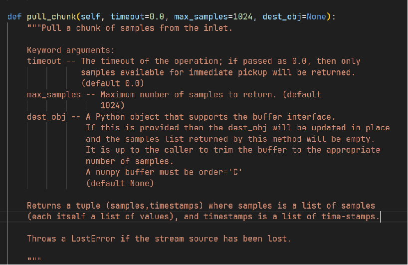

    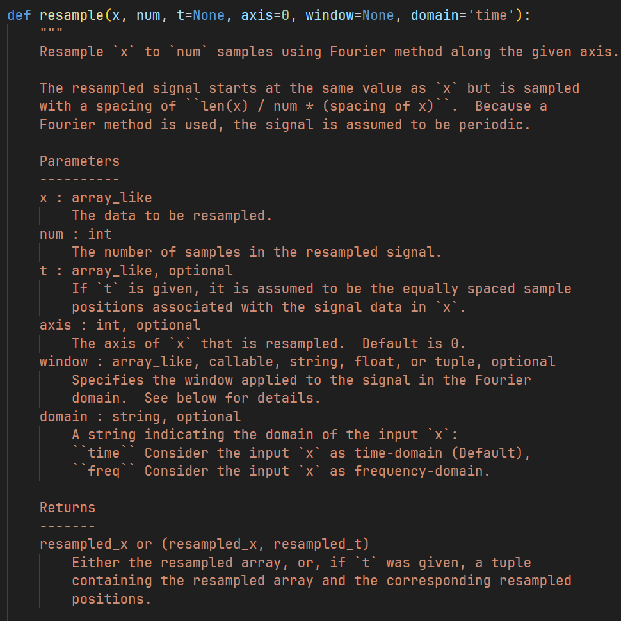

    - `pylsl.StreamInlet.pull_chunk()`
    - `scipy.signal.resample()`

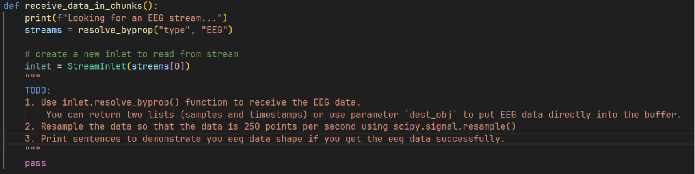

这里给出我写的一个参考。

```python hl_lines="25 41"
def receive_data_in_chunks():
    print(f"Looking for an EEG stream...")
    streams = resolve_byprop("type", "EEG")

    # create a new inlet to read from stream
    inlet = StreamInlet(streams[0])
    """
    TODO:
    1. Use inlet.pull_chunk() function to receive the EEG data. 
        You can return two lists (samples and timestamps) or use parameter `dest_obj` to put EEG data directly into the buffer.
    2. Resample the data so that the data is 250 points per second using scipy.signal.resample()
    3. Print sentences to demonstrate you eeg data shape if you get the eeg data successfully.
    """
    # Get stream info to determine sampling rate and number of channels
    info = inlet.info()
    original_fs = info.nominal_srate()  # Original sampling rate
    n_channels = info.channel_count()  # Number of EEG channels
    target_fs = 250  # Target sampling rate (Hz)

    # Initialize lists to store samples and timestamps
    samples = []
    timestamps = []

    # Pull chunk of EEG data
    chunk, ts = inlet.pull_chunk(timeout=1.0, max_samples=1024)

    if chunk:
        # Convert chunk to numpy array
        samples = np.array(chunk)
        timestamps = np.array(ts)

        # Check if data was received
        if samples.size > 0:
            print(f"Received EEG data with shape: {samples.shape}")

            # Calculate number of samples for resampling
            duration = len(timestamps) / original_fs
            n_samples_new = int(duration * target_fs)

            # Resample the data to 250 Hz
            resampled_data = resample(samples, n_samples_new, axis=0)

            print(f"Resampled EEG data to 250 Hz, new shape: {resampled_data.shape}")

            return resampled_data, timestamps
        else:
            print("No EEG data received in the chunk.")
            return None, None
    else:
        print("Failed to pull EEG data chunk.")
        return None, None

    pass
```

#### 5.4.2 **任务二：realtime_plot.py**

- **目标**：实现 EEG 数据预处理和实时可视化。
- **预处理**：

    - 使用 `self.bandpass_filter()` 进行**带通滤波**（1–45 Hz，去除低频漂移和高频噪声）。

        ```python
        # data：输入数据
        # sfreq：采样频率（每秒样本数，单位：Hz）
        # l_freq=1.0：带通滤波器的低频截止频率（默认1.0 Hz），保留高于此频率的信号
        # h_freq=45.0：带通滤波器的高频截止频率（默认45.0 Hz），保留低于此频率的信号
        # order=4：滤波器的阶数（默认4），阶数越高，滤波器的过渡带越陡峭，但计算复杂度也越高
        @staticmethod
        def bandpass_filter(data, sfreq, l_freq=1.0, h_freq=45.0, order=4):
            # 计算奈奎斯特频率（Nyquist frequency）
            nyq = 0.5 * sfreq    
            # 将低频和高频截止频率归一化到奈奎斯特频率的范围
            low = l_freq / nyq
            high = h_freq / nyq
            # 巴特沃斯（Butterworth）带通滤波器：
            # btype='band'：指定滤波器类型为带通（bandpass）
            b, a = butter(order, [low, high], btype='band')
            return filtfilt(b, a, data, axis=0)
        ```

    - 使用 `self.sliding_demean_fast()` **消除基线偏移**。

        ```python
        @staticmethod
        # window_sec=0.5：滑动窗口的时长（默认0.5秒），用于计算局部均值
        def sliding_demean_fast(data, sfreq=250, window_sec=0.5):
            # 将时间窗口（秒）转换为样本数。
            # 例如，若sfreq=250 Hz，window_sec=0.5秒，则：
            # window_size = 250 * 0.5 = 125 个样本。
            window_size = int(sfreq * window_sec)
            # mode='nearest'：边界处理模式，边界处使用最近的有效值填充，以避免边缘效应
            baseline = uniform_filter1d(data, size=window_size, axis=0, mode='nearest')
            # 从原始数据data中减去计算得到的基线baseline，实现去均值处理
            # 结果是移除低频基线漂移后的信号，保留信号的高频变化
            return data - baseline
        ```

        > `scipy.ndimage.uniform_filter1d()`可以高效的计算滑动窗口内的均值作为基线。

实时拉取和绘制数据的函数`pull_and_plot`:从输入流（`inlet`）中获取数据，处理后绘制到图表上。

```python hl_lines="12 13"
def pull_and_plot(self, plot_time, plt):
    # pull the data
    _, ts = self.inlet.pull_chunk(
        timeout=0.0, max_samples=self.buffer.shape[0], dest_obj=self.buffer
    )
    # ts will be empty if no samples were pulled, a list of timestamps otherwise
    if ts:
        ts = np.asarray(ts)
        # y的形状是(样本数, 通道数)，表示多通道信号数据
        y = self.buffer[0 : ts.size, :]

        y = self.bandpass_filter(y, sfreq=250, l_freq=1.0, h_freq=45.0)
        y = self.sliding_demean_fast(y)

        # this_x：用于存储合并后的时间戳（稍后计算）。
        # old_offset和new_offset：用于确定旧数据和新数据的裁剪位置。
        this_x = None
        old_offset = 0
        new_offset = 0
        # 遍历所有通道（self.channel_count表示通道数量）
        for ch_ix in range(self.channel_count):
            # we don't pull an entire screen's worth of data, so we have to
            # trim the old data and append the new data to it
            old_x, old_y = self.curves[ch_ix].getData()
            # the timestamps are identical for all channels, so we need to do
            # this calculation only once
        if ch_ix == 0:
                # find the index of the first sample that's still visible,
                # i.e. newer than the left border of the plot
                old_offset = old_x.searchsorted(plot_time)
                # same for the new data, in case we pulled more data than
                # can be shown at once
                new_offset = ts.searchsorted(plot_time)
                # append new timestamps to the trimmed old timestamps
                this_x = np.hstack((old_x[old_offset:], ts[new_offset:]))
            # append new data to the trimmed old data
            this_y = np.hstack((old_y[old_offset:], y[new_offset:, ch_ix] - ch_ix))
            # replace the old data
            self.curves[ch_ix].setData(this_x, this_y)
```

- **基线**：信号中**慢变、背景成分**，不包含神经活动。

#### 5.4.3 任务三：calc_band_power.py

**目标**：从全脑数据（test.npy）中提取五个频带（\(\alpha ,\beta ,\gamma ,\delta ,\theta \)）的能量特征，保存到字典。

> 这个是可以不用什么设备离线做的，就是个数据处理的步骤。

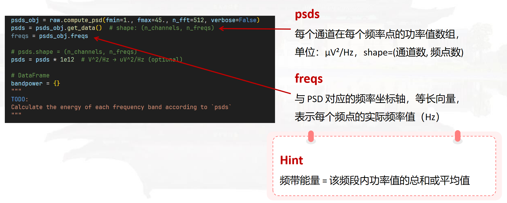

结果代码（仅包含有`TODO`标签的代码）如下：

```python
def calc_bandpower(raw: mne.io.RawArray, bands=None):
    """
    Calculate the power of each channel in each frequency band
    :param raw: mne.io.RawArrray
    :param bands: Band definition dictionary, e.g. {'alpha': (8, 13), ...}
    :return: pandas.DataFrame, each row is a channel and each column is a frequency band
    """
    if bands is None:
        bands = {
            'delta': (1, 4),
            'theta': (4, 8),
            'alpha': (8, 13),
            'beta':  (13, 30),
            'gamma': (30, 45)
        }

    # compute psd
    psds_obj = raw.compute_psd(fmin=1., fmax=45., n_fft=512, verbose=False)
    psds_obj.plot(show=True)
    plt.show()
    psds = psds_obj.get_data()  # shape: (n_channels, n_freqs)
    freqs = psds_obj.freqs

    # psds.shape = (n_channels, n_freqs)
    psds = psds * 1e12  # V^2/Hz → uV^2/Hz (optional)

    """
    TODO
    """
    # DataFrame
    bandpower = {}
    for band, (fmin, fmax) in bands.items():
        freq_mask = (freqs >= fmin) & (freqs <= fmax)
        bp = psds[:, freq_mask].sum(axis=1)
        bandpower[band] = bp

    df = pd.DataFrame(bandpower, index=raw.ch_names)

    return df.round(2)
```


