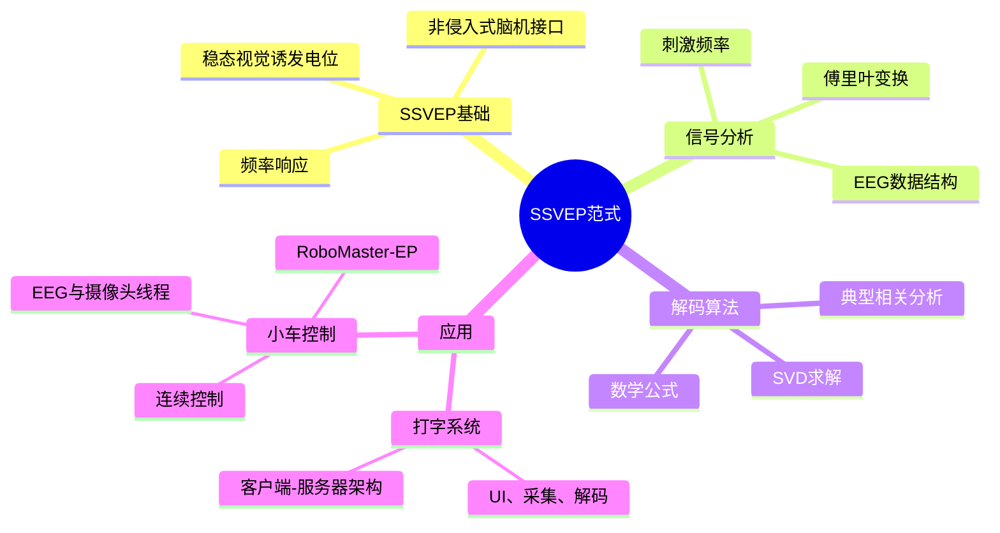

# 第二讲：Python脑电信号预处理实践

## 课程提纲

- Python环境搭建
- Python基本使用
- 常用算法库
- EEG预处理技术
- 脑电信号预处理实践

---

## 一、Python环境搭建

### 1.1 Python简介

- **什么是Python？**  
  Python是一种解释型、面向对象、动态数据类型的高级编程语言。

- **为什么选择Python？**  
    - 语法简单，易于学习，可读性强。
    - 强大的库生态，适合构建一体化的应用。
    - 拥有活跃的社区支持。

### 1.2 Anaconda简介

- **什么是Anaconda？**  
  Anaconda是一个集成了Python、环境管理工具和科学计算包的发行版。

- **为什么选择Anaconda？**  
    - 提供Conda包管理器，便于安装和管理库。
    - 支持多环境隔离，避免项目冲突。

- **Miniconda**：Anaconda的轻量级替代，仅包含Python和Conda。

### 1.3 Miniconda安装

- **下载途径**：  
    - 官方网站：[https://www.anaconda.com/download](https://www.anaconda.com/download)  
    - 清华镜像站（国内更快）：[https://mirrors.tuna.tsinghua.edu.cn/anaconda/miniconda](https://mirrors.tuna.tsinghua.edu.cn/anaconda/miniconda)

- **安装步骤**：  
    - 下载安装程序。  
    - 运行安装程序，选择安装路径（如`C:\Miniconda3`）。  
    - 将Conda添加到系统环境变量，以便命令行访问。

### 1.4 Miniconda配置

- **更换镜像源**：  
  编辑`.condarc`文件，使用更快的镜像源：  
    - Linux/macOS：`~/.condarc`  
    - Windows：`C:\Users\<YourUserName>\.condarc`  

  示例配置：  
  ```yaml
  channels:
    - defaults
  show_channel_urls: true
  default_channels:
    - https://mirrors.tuna.tsinghua.edu.cn/anaconda/pkgs/main
    - https://mirrors.tuna.tsinghua.edu.cn/anaconda/pkgs/free
  ```

- **验证环境变量**：确保终端中可运行`conda`命令。

### 1.5 Conda环境管理

- **常用命令**：  
    - 查看Conda版本：`conda -v`  
    - 列出已有环境：`conda env list`  
    - 创建新环境：`conda create -n [环境名称] python=[版本号]`  
      示例：`conda create -n bci python=3.12`  
    - 激活环境：`conda activate [环境名称]`  
    - 退出环境：`conda deactivate`  
    - 删除环境：`conda remove --name [环境名称] --all`

- **导出/导入环境**：  
    - 导出：`conda env export --name [环境名称] > env.yml`  
    - 导入：`conda env create -f env.yml`

### 1.6 包管理

- **Conda包管理**：  
    - 列出已安装包：`conda list`  
    - 安装包：`conda install [包名称]`（可选：`=版本号`）  
    - 更新包：`conda update [包名称]`  
    - 删除包：`conda uninstall [包名称]`

- **Pip包管理**：  
    - 列出已安装包：`pip list`  
    - 安装包：`pip install [包名称]`（可选：`==版本号`）  
    - 更新包：`pip install --upgrade [包名称]`  
    - 删除包：`pip uninstall [包名称]`

- **导出/导入Pip环境**：  
    - 导出：`pip freeze > requirements.txt`  
    - 导入：`pip install -r requirements.txt`

### 1.7 任务一

- **目标**：搭建用于脑电信号处理的Python环境。

- **步骤**：  
    - 安装Miniconda。  
    - 创建名为`bci`的环境，Python版本为3.12：  
      ```bash
      conda create -n bci python=3.12
      ```  
    - 激活环境：`conda activate bci`  
    - 安装第三方库：  
      ```bash
      conda install numpy pandas matplotlib scipy mne mne_icalabel torch
      ```

---

## 二、Python基本使用

### 2.1 基础语法

- **打印输出**：`print("Hello, EEG!")`

- **字符串操作**：  
    - `str.upper()`：转为大写。  
    - `str.lower()`：转为小写。  
    - `str.split()`：分割为列表。

- **容器**：  
    - **List**：有序、可变：`[1, 2, 3]`  
    - **Set**：无序、唯一：`{1, 2, 3}`  
    - **Dict**：键值对：`{"channel": "Fz"}`

- **条件语句**：`if`、`elif`、`else`

- **循环**：`for item in list:`、`while condition:`

- **函数**：  

  ```python
  def preprocess_data(data):
      return data * 2
  ```

---

## 三、常用算法库

### 3.1 Numpy

- **用途**：数组数值计算。

- **示例**：  
    - 创建数组：`np.array([1, 2, 3])`  
    - 切片：`arr[1:]`  
    - 广播：`arr + 2`

### 3.2 Matplotlib

- **用途**：数据可视化。

- **示例**：  
    - 折线图：`plt.plot(x, y)`  
    - 散点图：`plt.scatter(x, y)`  
    - 直方图：`plt.hist(data)`

### 3.3 Pandas

- **用途**：数据分析和处理（DataFrame）。

- **示例**：  
    - 读取CSV：`pd.read_csv("data.csv")`  
    - 过滤：`df[df["value"] > 0]`  
    - 清理：`df.dropna()`

---

## 四、EEG预处理技术

### 4.1 EEG简介

- **什么是EEG？** 记录大脑皮层电活动。

- **伪迹类型**：  
    - 眨眼伪迹  
    - 眼动伪迹  
    - 肌电污染  
    - 心电干扰  
    - 工频干扰  
    - Alpha波形

### 4.2 EEG预处理流程

- 导入数据
- 加载电极
- 滤波
- 分段
- 降采样
- 插值坏导
- 剔除坏段

### 4.3 EEG数据读取

- EEG文件格式多样（如`.cnt`、`.edf`），需用特定函数（如MNE的`read_raw_edf()`）加载。

### 4.4 EEG数据结构

- **元数据**：通道数量、名称、类型、坏通道、采样频率等。

- **脑电数据**：二维数组（通道数 × 采样点数）。

- **查看形状**：`raw.get_data().shape`

### 4.5 EEG数据可视化

- **波形图**：展示信号随时间变化。

- **功率谱密度图（PSD）**：显示频率成分。

- **通道布局图**：展示电极位置。

### 4.6 导入电极

- 根据通道名称设置类型（如EEG、EOG）。
- 按类型筛选通道。
- 重命名通道（若需要）。
- 设置电极布局（如10-20系统）。

### 4.7 设置坏通道

- **手动**：`raw.info["bads"] = ["Fz"]`

- **交互式**：在波形图中点击标记坏通道。

### 4.8 重采样

- 调整采样频率：`raw.resample(256)`（如降到256 Hz）。

### 4.9 滤波

- **带通滤波**：保留特定频率范围（如1-40 Hz）。

- **陷波滤波**：去除特定频率（如50 Hz工频噪声）。

### 4.10 EEG重参考

- **共平均参考**：减去所有通道均值。

- **双侧乳突参考**：使用耳部电极（如A1、A2）。

- **REST参考**：参考电极标准化技术。

### 4.11 插值坏导

- 利用周围正常通道的空间信息重建坏通道数据。

### 4.12 独立成分分析（ICA）

- **用途**：分离混合信号，去除伪迹（如眨眼、心跳）。

- **常见成分**：眨眼、眼动、头动、心电、工频干扰。

---

## 五、脑电信号预处理实践

### 5.1 数据集

- **来源**：MDD抑郁症公开数据集（EDF格式）

- **链接**：[https://figshare.com/articles/dataset/EEG_Data_New/4244171](https://figshare.com/articles/dataset/EEG_Data_New/4244171)

### 5.2 注意事项

- EDF文件需用特定方法读取（如`mne.io.read_raw_edf()`）。

- 清理通道名称（删除`A2-A1`、`23A-23R`、`24A-24R`）。

- 使用共平均参考：`raw.set_eeg_reference(ref_channels="average")`。

### 5.3 实践步骤

- 导入数据：使用MNE加载EDF文件。
- 清理通道名称：删除不需要的后缀。
- 设置电极类型与布局：匹配10-20系统。
- 滤波：应用带通滤波（1-40 Hz）和陷波滤波（50 Hz）。
- 重参考：使用共平均参考。
- 检测与插值坏通道：标记并修复坏通道。
- ICA：运行ICA去除伪迹。
- 分段与剔除坏段：分割数据并移除噪声片段。

export: `conda env export > environment.yml`

安装第三方库：

- numpy
- pandas
- matplotlib
- scipy
- mne
- mne_icalabel

存在各种干扰

fif mne.io.read_raw_fif


脑电数据：一个二维数组，形状为（通道数，采样点数）。

plot绘制可视化
compute_psd()功率谱密度图
plot_sensors()

设置坏通道raw_info['bads']
重采样resample()改变采样频率

带通滤波filter()
陷波滤波notch_filter()

处理时都要做，但顺序不重要

重参考：

共平均参考

双侧乳突参考

REST重参考


插值坏导：基于周围正常的信息，通过插值修复“坏”的数据。

ICA：分离混合信号中的独立源成分，除去伪迹。


感谢你提供的Markdown语法标准！以下是对之前笔记的修改版本，确保符合你列出的列表语法规则，包括：

1. 列表下的子列表使用四格缩进。
2. 列表下的行间数学公式使用四格缩进，并与前后列表保持空行。
3. 列表与前后文字之间添加空行。

以下是修改后的Markdown笔记，内容保持不变，仅调整格式以符合要求。所有子列表、数学公式和列表间距已按标准修正。

# 第三讲：SSVEP范式及其应用

## 一、概述

本讲由浙江大学脑机智能全国重点实验室的汪佳衡主讲，聚焦于**稳态视觉诱发电位（SSVEP）**范式及其在脑机接口（BCI）中的应用。讲座分为三个主要部分：

- SSVEP范式：介绍SSVEP、信号分析及解码算法（CCA）。
- 打字机：基于SSVEP的打字系统的架构与实现。
- 小车控制：SSVEP在机器人小车控制中的应用。

**参考文献**：Chen, Xiaogang et al. “High-speed spelling with a noninvasive brain–computer interface.” *Proceedings of the National Academy of Sciences* 112 (2015): E6058–E6067.


## 二、SSVEP范式

### 1. SSVEP简介

**稳态视觉诱发电位（SSVEP）**是一种由特定频率闪烁的视觉刺激引发的脑电信号。当用户注视某一频率的刺激（如8 Hz闪烁光），大脑会在相同频率产生电反应，可通过脑电图（EEG）检测。这使得SSVEP成为脑机接口的可靠方法，适用于高速打字和设备控制等场景。

- 主要特点：
    - 非侵入式：使用头皮电极测量脑电活动。
    - 高信噪比：频率特异性响应易于检测。
    - 应用领域：打字系统、机器人控制等。

### 2. SSVEP信号分析

SSVEP信号通常在频域上分析，使用**傅里叶变换**识别与视觉刺激对应的主频率。

- 数据结构：
    - EEG数据表示为三维矩阵：**通道 × 时间点 × 试次**。
    - 每个试次对应用户注视特定频率刺激（如8 Hz、10 Hz、12 Hz或14 Hz）。

- 频率分析：
    - 通过**傅里叶变换**将时域EEG信号转换为频域，显示刺激频率的峰值（如8 Hz、10 Hz）。
    - 示例：用户注视8 Hz刺激时，EEG频谱中出现明显的8 Hz成分。

- 视觉刺激：
    - 常用频率：8 Hz、10 Hz、12 Hz、14 Hz。
    - 每个频率对应脑机接口系统中的特定命令或输入。

### 3. SSVEP解码算法

主要解码方法为**典型相关分析（CCA）**，广泛用于识别SSVEP系统中用户注视的目标刺激频率。

#### 3.1 CCA简介

**典型相关分析（CCA）**是一种多元统计方法，通过寻找两组变量的线性组合，最大化它们之间的相关性。在SSVEP中，CCA用于关联EEG信号与参考信号（刺激频率的正弦波），以确定用户注视的频率。

- 目的：
    - 通过最大化EEG信号与参考信号的相关性，识别目标刺激频率。
    - 从噪声EEG信号中提取有意义的特征。

- 核心概念：
    - 对于两组变量 \( X \)（EEG信号）和 \( Y \)（参考信号），CCA寻找线性组合 \( U = XW_x \) 和 \( V = YW_y \)，使 \( U \) 和 \( V \) 的相关性最大。
    - 产生的**典型变量**总结了EEG与刺激频率之间的关系。

- 参考资料：
    - 算法代码：[MetaBCI GitHub](https://github.com/TBC-TJU/MetaBCI)。
    - CCA理论：[Pinard的博客](https://www.cnblogs.com/pinard/p/6288716.html)。
    - 课件：赵春晖，《实用多元统计分析》。

#### 3.2 CCA数学推导

CCA的数学基础在于优化两组变量之间的相关性。以下是CCA过程的详细数学推导。

- 问题设定：
    - 设 \( X \in \mathbb{R}^{m \times T} \) 表示EEG信号（m个通道，T个时间点）。
    - 设 \( Y \in \mathbb{R}^{k \times T} \) 表示参考信号（k个刺激频率的正弦波，T个时间点）。
    - 目标：找到权重向量 \( W_x \) 和 \( W_y \)，使 \( U = X^T W_x \) 和 \( V = Y^T W_y \) 的相关性最大。

- 优化目标：

    \[
    \rho(U, V) = \frac{\text{cov}(U, V)}{\sqrt{\text{var}(U) \cdot \text{var}(V)}}
    \]

    代入 \( U = X^T W_x \) 和 \( V = Y^T W_y \)：

    \[
    \rho(W_x, W_y) = \frac{W_x^T C_{xy} W_y}{\sqrt{(W_x^T C_{xx} W_x)(W_y^T C_{yy} W_y)}}
    \]

    其中：
    - \( C_{xy} = \text{cov}(X, Y) \)：交叉协方差矩阵。
    - \( C_{xx} = \text{cov}(X, X) \)：\( X \) 的协方差矩阵。
    - \( C_{yy} = \text{cov}(Y, Y) \)：\( Y \) 的协方差矩阵。

- 约束条件：
    - 为避免平凡解，约束 \( W_x^T C_{xx} W_x = 1 \) 和 \( W_y^T C_{yy} W_y = 1 \)。
    - 优化问题为：

        \[
        \max_{W_x, W_y} W_x^T C_{xy} W_y \quad \text{subject to} \quad W_x^T C_{xx} W_x = 1, \quad W_y^T C_{yy} W_y = 1
        \]

- SVD求解：
    - 通过**奇异值分解（SVD）**解决优化问题。
    - 定义矩阵：

        \[
        K = C_{xx}^{-1/2} C_{xy} C_{yy}^{-1/2}
        \]

    - 对 \( K \) 进行SVD分解：

        \[
        K = U \Sigma V^T
        \]

        其中，\( \Sigma \) 包含奇异值（典型相关系数），\( U, V \) 为左右奇异向量。
    - 权重向量为：

        \[
        W_x = C_{xx}^{-1/2} U, \quad W_y = C_{yy}^{-1/2} V
        \]

    - 最大奇异值对应最大相关系数，指示目标刺激频率。

- 迭代过程：
    - 找到第一对典型变量后，CCA继续选择与前面对不相关的其他线性组合对，提取所有相关性。
    - **典型相关系数**衡量EEG与参考信号之间的关系强度。

- 实际实现：
    - CCA将EEG信号与每个刺激频率（例如8 Hz、10 Hz、12 Hz、14 Hz）的参考信号进行比较。
    - 选择相关系数最高的频率作为用户的目标。

#### 3.3 CCA算法步骤

- 准备EEG数据：收集多通道、时间点的EEG信号。
- 生成参考信号：创建对应刺激频率的正弦波（如8 Hz、10 Hz）。
- 计算协方差矩阵：计算 \( C_{xx} \)、\( C_{xy} \) 和 \( C_{yy} \)。
- 执行SVD：分解 \( K \) 以获得 \( W_x \)、\( W_y \) 和相关系数。
- 选择目标频率：选择相关系数最高的频率。

#### 3.4 问答

- 常见问题包括CCA在噪声EEG环境中的鲁棒性以及与PSDA（功率谱密度分析）等方法的计算效率比较。

### 4. 打字机

#### 4.1 工程准备

打字机是一个基于SSVEP的高速打字脑机接口应用，包含以下模块：

- UI模块：显示不同频率闪烁的字母刺激。
- 信号采集模块：使用LSL（实验室流层协议）采集EEG数据。
- 解码模块：使用CCA处理EEG数据，识别目标字母。
- 校准阶段：训练系统识别用户特有的EEG模式。
- 反馈阶段：为用户提供实时反馈。

- 第三方库：
    - PyQt：用于GUI开发。
    - Pylsl：用于EEG数据流传输。
    - Scipy、Sklearn、Numpy：用于信号处理和CCA实现。

#### 4.2 工程架构

系统采用模块化架构，包含以下组件：

- 播放器（Player）：管理用户界面和刺激呈现。
- 刺激器（Stimulator）：生成特定频率的闪烁刺激。
- 客户端（Client）：处理用户输入并与服务器通信。
- 服务器（Server）：处理EEG数据并发送命令。
- 信号采集（Signal Acquisition）：通过硬件采集EEG信号。
- 解码器（Decoder）：应用CCA解码目标频率。

- 通信：
    - 使用TCP/IP进行客户端-服务器通信。
    - 数据格式：包头（4字节，存储包体长度）+ 包体（JSON字符串）。
    - 示例JSON：`{ "type": 1, "pred": { "type": 1, "value": 0.8 }, "state": 12 }`。
    - 字段：
        - `state`：系统阶段（整数）。
        - `type`：命令类型（整数）。
        - `pred.value`：置信度（0-1浮点数）。
        - `pred.type`：解码类别（整数）。

#### 4.3 模块分析

- 刺激器模块：生成不同频率的视觉刺激。
- 播放器模块：控制刺激显示和用户交互。
- 客户端模块：管理UI与服务器的通信。
- 解码器模块：实现CCA以解码EEG信号。
- 复合输入模块（CompositeInlet）：整合多数据流（如EEG和时间戳）。
- 服务器模块：协调信号采集和解码，发出命令。

#### 4.4 问答

- 关键问题包括系统延迟、用户训练需求和扩展到更复杂输入的可行性 Departments。

### 5. 小车控制

#### 5.1 小车简介

小车控制应用使用SSVEP控制机器人小车，具体为**大疆RoboMaster-EP**，一个教育机器人平台。

- 参考资料：[RoboMaster SDK](https://github.com/dji-sdk/RoboMaster-SDK)。

#### 5.2 工程准备

- UI模块：显示控制刺激（如方向命令）。
- 控制模块：将解码的EEG信号转换为小车运动。
- 采集模块：采集EEG数据。
- 第三方库：
    - Pygame：用于UI和控制逻辑。
    - Robomaster：用于与机器人交互。
    - Pylsl、Sklearn：用于EEG采集和解码。
- 反馈阶段：提供小车运动的实时反馈。

#### 5.3 工程架构

- 关键挑战：实现小车的连续控制（如距离、速度）。
- 组件：
    - 客户端模块：向小车发送用户命令。
    - EEG模块：处理EEG信号以进行解码。
    - 控制函数：将解码频率映射到小车运动。
    - 解码器模块：使用CCA解读EEG数据。

#### 5.4 运行流程图

- 键盘事件：模拟用户输入以进行测试。
- 指令控制：发出运动命令（如前进、转弯）。
- 视频绘制：显示实时小车反馈。
- 方块绘制：可视化刺激。
- 显示更新：刷新用户界面。
- EEG线程：处理实时EEG数据。
- 摄像头线程：处理摄像头反馈。
- 运行状态：检查系统是否活跃。

#### 5.5 问答

- 问题聚焦于控制精度、实时性能和用户疲劳。

#### 5.6 人车合一

- 演示：展示基于SSVEP的实时EEG解码和小车运动执行。

### 6. 总结图解




```

是的，在SSVEP范式的典型相关分析（CCA）中，\( W_x \) 和 \( W_y \) 分别表示EEG信号和参考信号的权重向量，它们的维度确实是 \( m \times 1 \) 和 \( k \times 1 \)。以下是详细说明：

### 1. 背景
在CCA的数学推导中：
- \( X \in \mathbb{R}^{m \times T} \) 表示EEG信号，其中 \( m \) 是通道数，\( T \) 是时间点数。
- \( Y \in \mathbb{R}^{k \times T} \) 表示参考信号（如正弦波），其中 \( k \) 是参考信号的维度（通常与刺激频率的数量或正弦/余弦分量相关），\( T \) 是时间点数。

CCA的目标是找到权重向量 \( W_x \) 和 \( W_y \)，使得线性组合 \( U = X^T W_x \) 和 \( V = Y^T W_y \) 的相关性最大化。

### 2. 权重向量的维度
- **\( W_x \)**：
  - \( X^T \) 的维度是 \( T \times m \)，因此 \( X^T W_x \) 需要输出一个标量（或单维向量），以表示线性组合 \( U \)。
  - 为使 \( X^T W_x \) 成立，\( W_x \) 必须是一个 \( m \times 1 \) 的列向量。
  - 因此，\( W_x \in \mathbb{R}^{m \times 1} \)，其中 \( m \) 是EEG通道数。

- **\( W_y \)**：
  - 类似地，\( Y^T \) 的维度是 \( T \times k \)，因此 \( Y^T W_y \) 也需要输出一个标量（或单维向量），表示线性组合 \( V \)。
  - 为使 \( Y^T W_y \) 成立，\( W_y \) 必须是一个 \( k \times 1 \) 的列向量。
  - 因此，\( W_y \in \mathbb{R}^{k \times 1} \)，其中 \( k \) 是参考信号的维度。

### 3. 验证
在CCA的优化问题中，权重向量 \( W_x \) 和 \( W_y \) 用于线性组合：
- \( U = X^T W_x \)，其中 \( X^T \in \mathbb{R}^{T \times m} \)，\( W_x \in \mathbb{R}^{m \times 1} \)，结果 \( U \in \mathbb{R}^{T \times 1} \)。
- \( V = Y^T W_y \)，其中 \( Y^T \in \mathbb{R}^{T \times k} \)，\( W_y \in \mathbb{R}^{k \times 1} \)，结果 \( V \in \mathbb{R}^{T \times 1} \)。

这些线性组合 \( U \) 和 \( V \) 是时间序列，用于计算相关系数。因此，\( W_x \) 和 \( W_y \) 的维度必须分别为 \( m \times 1 \) 和 \( k \times 1 \)，以满足矩阵运算的要求。

### 4. 实际意义
- \( W_x \)：表示EEG通道的权重，决定每个通道对最终线性组合的贡献。
- \( W_y \)：表示参考信号的权重，决定每个正弦/余弦分量对线性组合的贡献。
- 在SVD求解中，\( W_x = C_{xx}^{-1/2} U \) 和 \( W_y = C_{yy}^{-1/2} V \)，其中 \( U \) 和 \( V \) 是奇异向量，维度分别为 \( m \times 1 \) 和 \( k \times 1 \)，进一步确认了 \( W_x \) 和 \( W_y \) 的维度。

### 5. 总结
你的理解是正确的：
- \( W_x \in \mathbb{R}^{m \times 1} \)，其中 \( m \) 是EEG通道数。
- \( W_y \in \mathbb{R}^{k \times 1} \)，其中 \( k \) 是参考信号的维度。

在SSVEP范式的典型相关分析（CCA）中，最大奇异值对应最大相关系数，这一相关系数来源于对矩阵 \( K \) 的奇异值分解（SVD）。具体来说，最大奇异值出现在矩阵 \( \Sigma \) 的对角线上，它是矩阵 \( K \) 的SVD分解结果的一部分。以下是详细解释，结合笔记中的内容，明确最大奇异值对应的矩阵部分。

### 1. 笔记中的相关内容
在笔记的“3.2 CCA数学推导”部分，CCA的优化问题通过SVD求解，涉及以下关键步骤：

- 定义矩阵：
  \[
  K = C_{xx}^{-1/2} C_{xy} C_{yy}^{-1/2}
  \]
- 对 \( K \) 进行SVD分解：
  \[
  K = U \Sigma V^T
  \]
  其中：
  - \( \Sigma \) 是一个对角矩阵，包含奇异值（singular values），这些奇异值就是**典型相关系数**。
  - \( U \) 和 \( V \) 分别是左奇异向量和右奇异向量。
  - 权重向量为：
    \[
    W_x = C_{xx}^{-1/2} U, \quad W_y = C_{yy}^{-1/2} V
    \]
- 笔记明确指出：“最大奇异值对应最大相关系数，指示目标刺激频率。”

因此，最大奇异值位于矩阵 \( \Sigma \) 的对角线上，通常是 \( \Sigma \) 的第一个对角元素（奇异值按降序排列）。

### 2. 最大奇异值对应的矩阵部分
- **矩阵 \( \Sigma \)**：
  - 在SVD分解 \( K = U \Sigma V^T \) 中，\( \Sigma \) 是一个对角矩阵，形如：
    \[
    \Sigma = \begin{bmatrix}
    \sigma_1 & 0 & \cdots & 0 \\
    0 & \sigma_2 & \cdots & 0 \\
    \vdots & \vdots & \ddots & \vdots \\
    0 & 0 & \cdots & \sigma_r
    \end{bmatrix}
    \]
    其中，\( \sigma_1 \geq \sigma_2 \geq \cdots \geq \sigma_r \geq 0 \) 是奇异值，\( r = \min(m, k) \)，\( m \) 是EEG通道数，\( k \) 是参考信号维度。
  - **最大奇异值** \( \sigma_1 \) 是 \( \Sigma \) 的第一个对角元素，表示最大的典型相关系数。它对应于第一对典型变量（即 \( U \) 和 \( V \) 的第一列生成的 \( W_x \) 和 \( W_y \)），用于识别用户注视的目标刺激频率。

- **矩阵 \( K \)**：
  - \( K = C_{xx}^{-1/2} C_{xy} C_{yy}^{-1/2} \) 是SVD分解的对象，其奇异值反映了EEG信号 \( X \) 和参考信号 \( Y \) 之间的相关性。
  - 最大奇异值 \( \sigma_1 \) 是通过对 \( K \) 进行SVD得到的，直接存储在 \( \Sigma \) 的对角线上。

### 3. 最大奇异值的意义
- **最大相关系数**：在CCA中，\( \Sigma \) 的对角元素（奇异值）是典型相关系数，最大奇异值 \( \sigma_1 \) 表示EEG信号与某个参考信号（对应特定刺激频率，如8 Hz或10 Hz）之间的最强相关性。
- **目标频率识别**：通过比较不同刺激频率的参考信号与EEG信号的相关系数（即 \( \Sigma \) 的对角元素），选择最大值对应的频率作为用户注视的目标。

### 4. 结合笔记的具体位置
在笔记的“3.2 CCA数学推导”中，明确提到：
> “对 \( K \) 进行SVD分解：\( K = U \Sigma V^T \)，其中，\( \Sigma \) 包含奇异值（典型相关系数）……最大奇异值对应最大相关系数，指示目标刺激频率。”

因此，最大奇异值具体对应于：
- **矩阵 \( \Sigma \)** 的第一个对角元素 \( \sigma_1 \)。
- 它是SVD分解中矩阵 \( K \) 的分解结果的一部分，用于量化EEG信号与参考信号之间的最大相关性。

### 5. 补充说明
- **维度**：假设 \( m \) 是EEG通道数，\( k \) 是参考信号维度，\( K \in \mathbb{R}^{m \times k} \)，则 \( \Sigma \in \mathbb{R}^{r \times r} \)，其中 \( r = \min(m, k) \)。最大奇异值 \( \sigma_1 \) 总是位于 \( \Sigma \) 的 (1,1) 位置。
- **实际应用**：在SSVEP系统中，系统会为每个刺激频率（如8 Hz、10 Hz等）生成一个参考信号矩阵 \( Y \)，分别计算 \( K \) 和其SVD分解，比较所有频率的 \( \sigma_1 \)，选择最大值对应的频率。

### 6. 总结
最大奇异值对应于矩阵 \( \Sigma \) 的第一个对角元素 \( \sigma_1 \)，它是SVD分解 \( K = U \Sigma V^T \) 的结果，反映了EEG信号与参考信号之间的最大相关系数。这一内容在笔记的“3.2 CCA数学推导”部分明确描述，位于SVD分解的公式中。

如果你有进一步的问题或需要更详细的数学推导，请随时告诉我！