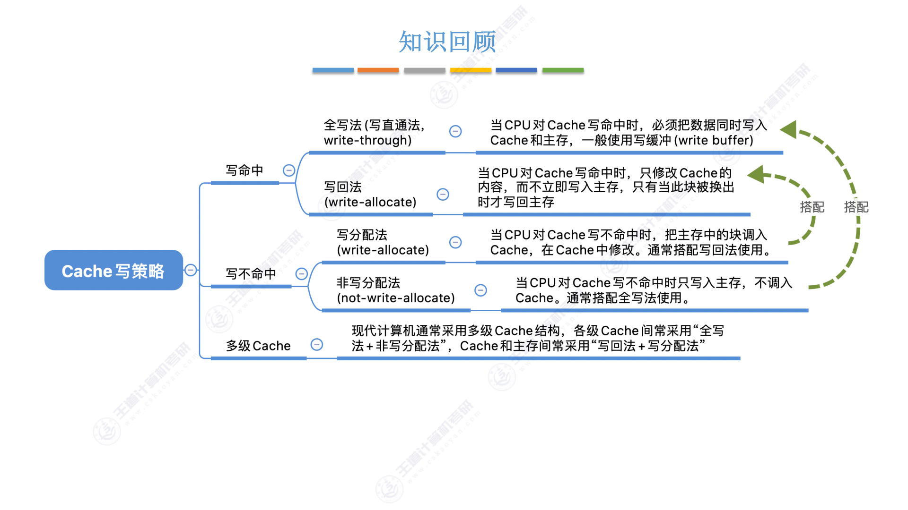
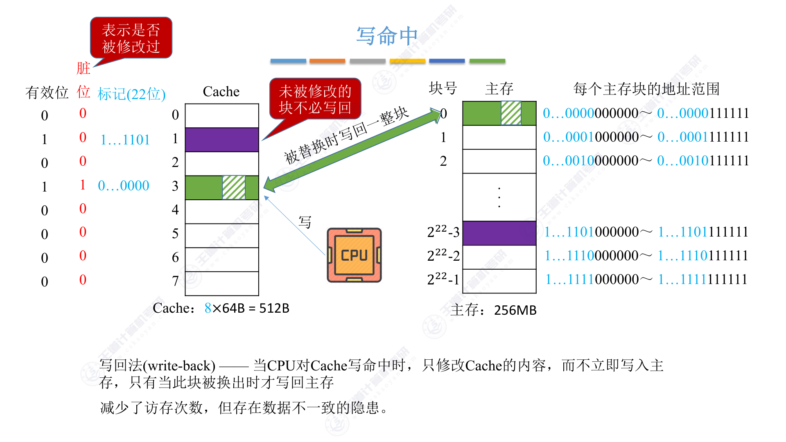
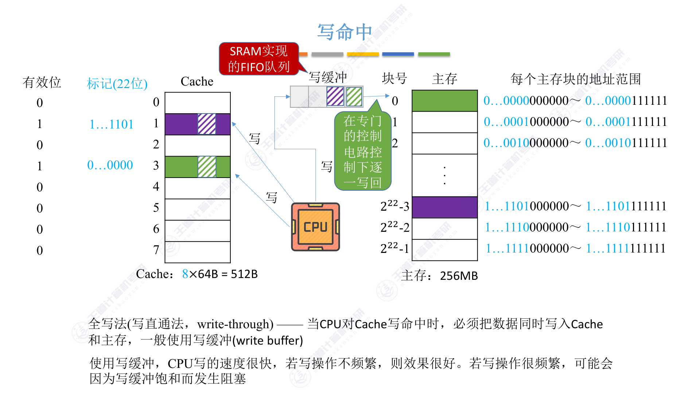
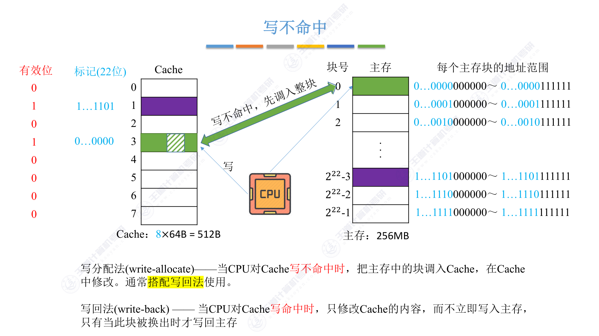
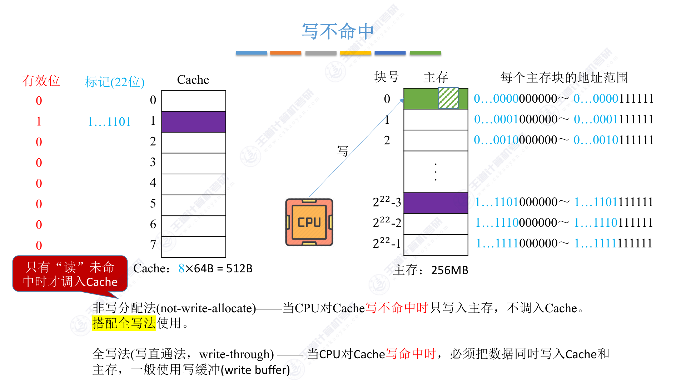
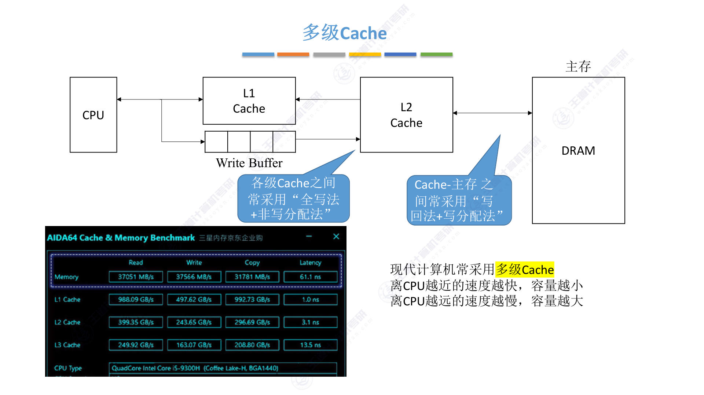

# 3.5.5 Cache写策略

## 思维导图

---

## 一、为什么需要讨论写策略？

前面讨论的映射方式和替换算法都是针对**读操作**的。但CPU除了读数据，还会**写数据**。

读操作不会导致Cache和主存的数据不一致——读的时候只是把数据从主存调入Cache，两边的数据始终是相同的。但写操作就不一样了：CPU修改了Cache中的数据，主存中的那份副本还改不改？什么时候改？这就是写策略要解决的问题。

写策略分为两个维度来讨论：**写命中**时怎么办，**写不命中**时怎么办。

---

## 二、写命中：全写法 vs 写回法

### 1. 写回法（write-back）

> 当CPU对Cache写命中时，只修改Cache的内容，而不立即写入主存，只有当此块被换出时才写回主存。

写回法的关键思想是"偷懒"——既然CPU经常写数据，每次都写回主存太慢了，不如先只改Cache，等这个块被替换出去的时候再写回主存。

为了实现写回法，每个Cache块需要增加一个**脏位**（dirty bit），用来标记这个块是否被修改过。被替换时，如果脏位=1，说明修改过，需要写回主存；如果脏位=0，说明没改过，直接替换就行，不用写回。

写回法的优点是减少了访存次数，速度更快。但缺点是存在数据不一致的隐患——如果在块被替换之前发生断电或故障，修改过的数据就丢了。

### 2. 全写法（写直通法，write-through）

> 当CPU对Cache写命中时，必须把数据同时写入Cache和主存，一般使用写缓冲（write buffer）。

全写法的做法是"老实人"——改了Cache就立刻改主存，保证两边数据时刻一致。

但问题来了：CPU写Cache很快（SRAM），写主存很慢（DRAM），每次写都要等主存写完，CPU就被拖慢了。为了解决这个问题，全写法引入了**写缓冲**（write buffer）。

写缓冲是一个SRAM实现的FIFO队列。CPU写数据时，先把数据写入写缓冲，然后就可以继续执行了，写缓冲会在专门的控制电路控制下逐一写回主存。

使用写缓冲后，CPU写的速度很快。但如果写操作太频繁，写缓冲可能会饱和，导致CPU阻塞等待。

### 3. 两种写命中策略对比

写回法减少了访存次数，速度快，但有数据不一致的风险。全写法保证了数据一致性，但访存次数多，速度慢。

---

## 三、写不命中：写分配法 vs 非写分配法

### 1. 写分配法（write-allocate）

> 当CPU对Cache写不命中时，把主存中的块调入Cache，在Cache中修改。通常搭配写回法使用。

写分配法的思路是：既然要写，那就先把这块调入Cache，然后在Cache里改。这样做的好处是，如果接下来还要访问这块的数据，就可以直接从Cache读取，利用了局部性原理。

写分配法通常搭配写回法使用——先调入Cache，在Cache里改，被替换时再写回主存。

### 2. 非写分配法（not-write-allocate）

> 当CPU对Cache写不命中时只写入主存，不调入Cache。搭配全写法使用。

非写分配法的思路是：写不命中就算了，直接写主存，不折腾Cache。反正Cache里没有这块，没必要调进来。

非写分配法通常搭配全写法使用——写不命中时直接写主存，写命中时同时写Cache和主存。

### 3. 搭配关系

这两种写不命中策略不是随便搭配的，有固定的组合：

- **写回法 + 写分配法**：写回法追求速度，写不命中时调入Cache可以利用局部性
- **全写法 + 非写分配法**：全写法追求一致性，写不命中时直接写主存更简单

---

## 四、多级Cache

现代计算机通常采用多级Cache结构（L1 Cache、L2 Cache、L3 Cache），离CPU越近的速度越快、容量越小，离CPU越远的速度越慢、容量越大。

在多级Cache中，各级Cache之间常采用"全写法+非写分配法"，Cache和主存之间常采用"写回法+写分配法"。

这样设计的原因是：L1 Cache离CPU最近，速度要快，用全写法可以简化设计；而L2/L3 Cache离主存近，用写回法可以减少对主存的访问次数。

---

## 五、考点总结

### 考点1：写命中策略

**写回法**：只改Cache，不立即写主存，换出时才写回。需要脏位标记。速度快但有数据不一致风险。

**全写法**：同时写Cache和主存，一般用写缓冲。数据一致但速度慢。

### 考点2：写不命中策略

**写分配法**：先调入Cache再修改。搭配写回法使用。

**非写分配法**：直接写主存，不调入Cache。搭配全写法使用。

### 考点3：搭配关系

- 写回法 + 写分配法
- 全写法 + 非写分配法

这个搭配关系是固定的选择题考点。

### 考点4：写缓冲的作用

全写法中使用写缓冲（SRAM实现的FIFO队列），可以让CPU写完写缓冲就返回，不用等待慢速的主存写入。但如果写操作太频繁，写缓冲饱和会导致CPU阻塞。

### 考点5：脏位的作用

写回法中，每个Cache块需要一个脏位（dirty bit）来标记是否被修改过。被替换时，脏位=1需要写回主存，脏位=0直接替换即可。

---

## 六、本节小结

Cache写策略解决的是"写数据时如何保证Cache和主存一致性"的问题。写命中有两种策略（写回法、全写法），写不命中也有两种策略（写分配法、非写分配法），它们之间有固定的搭配关系。理解每种策略的优缺点和适用场景，是应对选择题和简答题的关键。
