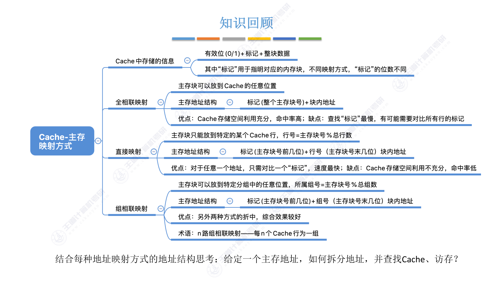
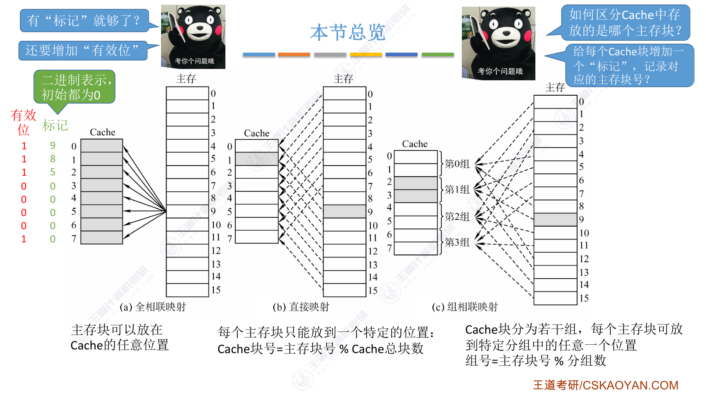
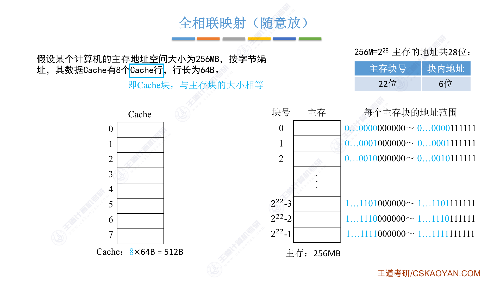
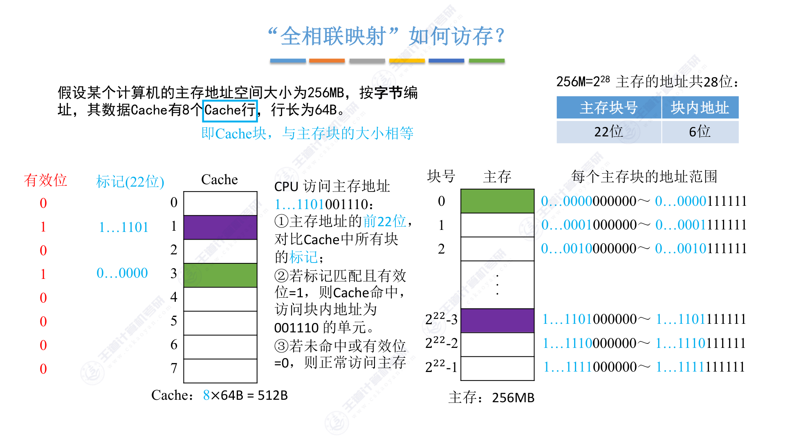
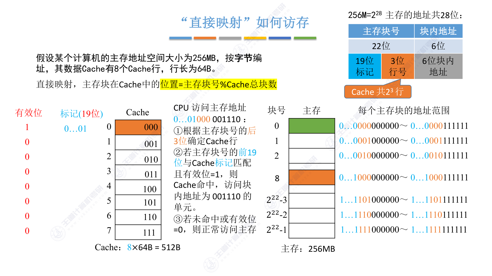
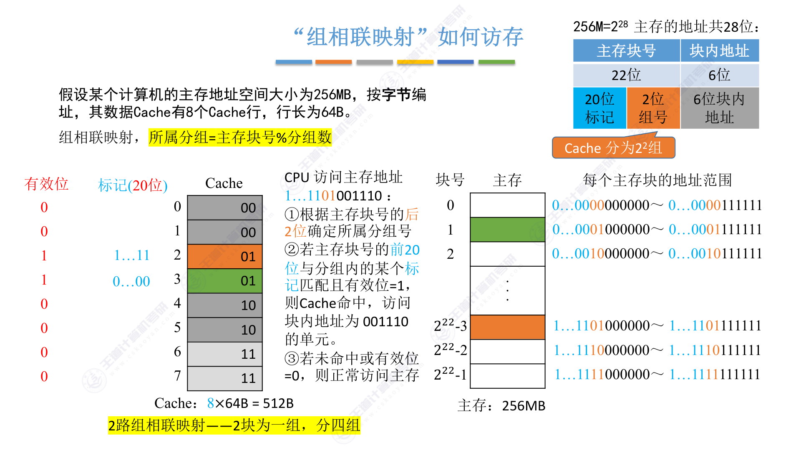

# 3.5.3 Cache和主存的映射方式

## 思维导图

---

## 一、Cache中存储的信息

每个Cache行（块）需要存储三部分信息：

| 组成部分 | 说明 |
|---------|------|
| **有效位**（1位） | 0/1，表示该Cache行是否有效，初始为0 |
| **标记**（Tag） | 用于指明对应的内存块，不同映射方式标记位数不同 |
| **整块数据** | 从主存调入的数据块 |

!!! note "为什么要有效位？"
    Cache刚启动时所有内容都是空的，有效位初始为0。只有当某个主存块被调入Cache后，对应行的有效位才置为1。这样CPU访问时可以先检查有效位，避免读取到无效数据。

## 二、本节总览：三种映射方式

三种映射方式的核心区别在于**主存块可以放到Cache的哪个位置**：

| 映射方式 | 主存块放置位置 | 特点 |
|---------|--------------|------|
| **全相联映射** | Cache的任意位置 | 灵活但查找慢 |
| **直接映射** | 固定的某个位置 | 快但不灵活 |
| **组相联映射** | 特定分组中的任意位置 | 折中方案 |

## 三、全相联映射（随意放）

### 1. 基本原理

> **主存块可以放到Cache的任意位置**

全相联映射是最灵活的方式，主存中的任意一块可以放到Cache中的任意一行。

### 2. 地址结构

**主存地址 = 标记（整个主存块号）+ 块内地址**

!!! example "全相联映射示例"
    **题目条件：**

    - 主存地址空间大小：256MB = \(2^{28}\) 字节
    - Cache行数：8行
    - 行长（块大小）：64B = \(2^6\) 字节

    **地址划分：**

    - 主存地址共 **28位**
    - 块内地址：\(log_2(64) = 6\) 位
    - 主存块号（标记）：\(28 - 6 = 22\) 位
    - 主存共有 \(2^{22} = 4M\) 个块

### 3. Cache行结构

每个Cache行包含：

- **有效位**：1位
- **标记**：22位（整个主存块号）
- **数据**：64B

### 4. 访存过程

CPU访问主存地址的步骤：

1. 取出主存地址的前22位作为**标记**
2. 将该标记与Cache中**所有行**的标记进行对比
3. 若某行的标记匹配且**有效位=1**，则Cache命中，访问块内地址对应的单元
4. 若未命中或有效位=0，则正常访问主存

!!! warning "全相联映射的缺点"
    查找标记时需要**遍历所有Cache行**进行对比，硬件实现成本高，速度慢。当Cache容量较大时，这个问题更加明显。

### 5. 优缺点总结

| 优点 | 缺点 |
|------|------|
| Cache存储空间利用充分 | 查找"标记"最慢 |
| 命中率高 | 需要对比所有行的标记 |
| 主存块放置灵活 | 硬件实现成本高 |

## 四、直接映射（只能放固定位置）

### 1. 基本原理

> **每个主存块只能放到一个特定的位置：Cache块号 = 主存块号 % Cache总块数**

直接映射规定了每个主存块在Cache中的唯一位置，不允许放到其他位置。

### 2. 地址结构

**主存地址 = 标记（主存块号前几位）+ 行号（主存块号末几位）+ 块内地址**

!!! example "直接映射示例"
    **题目条件：**（同全相联映射）

    - 主存地址空间大小：256MB = \(2^{28}\) 字节
    - Cache行数：8行 = \(2^3\) 行
    - 行长：64B = \(2^6\) 字节

    **地址划分：**

    - 主存地址共 **28位**
    - 块内地址：**6位**
    - 行号：\(log_2(8) = 3\) 位（主存块号的末3位）
    - 标记：\(22 - 3 = 19\) 位（主存块号的前19位）

### 3. 为什么行号可以用主存块号末几位？

因为 \(主存块号 \% 8 = 主存块号 \% 2^3\)，相当于取主存块号的**最后3位二进制数**。

例如：主存块号为8（二进制 \(1000\)），\(8 \% 8 = 0\)，所以放到Cache第0行。

### 4. 访存过程

CPU访问主存地址的步骤：

1. 取主存块号的**后3位**确定Cache行号
2. 取主存块号的**前19位**作为标记
3. 将该标记与对应Cache行的标记对比
4. 若标记匹配且**有效位=1**，则Cache命中
5. 若未命中或有效位=0，则正常访问主存

!!! warning "直接映射的缺点"
    主存块只能放到固定位置，即使其他Cache行空闲也无法使用。例如主存块8只能放到Cache第0行，如果第0行已被占用，即使第1~7行都空闲，主存块8也无法调入。

### 5. 优缺点总结

| 优点 | 缺点 |
|------|------|
| 只需对比一个"标记"，速度最快 | Cache存储空间利用不充分 |
| 硬件实现简单 | 命中率低 |
| | 主存块位置固定，灵活性差 |

## 五、组相联映射（可放到特定分组）

### 1. 基本原理

> **主存块可以放到特定分组中的任意位置：所属分组 = 主存块号 % 分组数**

组相联映射是全相联映射和直接映射的折中方案。它将Cache分为若干组，每个主存块可以放到**特定分组内的任意位置**。

### 2. 术语：n路组相联

> **n路组相联映射**：每n个Cache行为一组

例如：8行Cache分为4组，每组2行，称为**2路组相联映射**。

### 3. 地址结构

**主存地址 = 标记（主存块号前几位）+ 组号（主存块号末几位）+ 块内地址**

!!! example "组相联映射示例"
    **题目条件：**（同前）

    - 主存地址空间大小：256MB = \(2^{28}\) 字节
    - Cache行数：8行，分为4组（2路组相联）
    - 行长：64B = \(2^6\) 字节

    **地址划分：**

    - 主存地址共 **28位**
    - 块内地址：**6位**
    - 组号：\(log_2(4) = 2\) 位（主存块号的末2位）
    - 标记：\(22 - 2 = 20\) 位（主存块号的前20位）

### 4. 访存过程

CPU访问主存地址的步骤：

1. 取主存块号的**后2位**确定所属分组号
2. 取主存块号的**前20位**作为标记
3. 将该标记与**分组内所有行**的标记进行对比
4. 若某行的标记匹配且**有效位=1**，则Cache命中
5. 若未命中或有效位=0，则正常访问主存

### 5. 优缺点总结

| 优点 | 缺点 |
|------|------|
| 另外两种方式的折中 | 硬件复杂度介于两者之间 |
| 综合效果较好 | 需要对比组内所有行的标记 |
| 灵活性和速度兼顾 | |

## 六、三种映射方式对比

| 比较项 | 全相联映射 | 直接映射 | 组相联映射 |
|--------|----------|---------|----------|
| **主存块放置位置** | Cache任意位置 | 固定位置 | 特定分组内任意位置 |
| **位置计算** | 无 | 行号 = 主存块号 % 总行数 | 组号 = 主存块号 % 分组数 |
| **标记位数** | 整个主存块号 | 主存块号前几位 | 主存块号前几位 |
| **需要对比的行数** | 所有行 | 仅1行 | 分组内所有行 |
| **速度** | 最慢 | 最快 | 中等 |
| **Cache利用率** | 最高 | 最低 | 中等 |
| **命中率** | 最高 | 最低 | 中等 |
| **硬件成本** | 最高 | 最低 | 中等 |

## 七、考点总结

### 核心概念

1. **Cache行结构**：有效位 + 标记 + 数据
2. **三种映射方式**：全相联、直接、组相联
3. **地址划分**：不同映射方式的地址结构不同

### 常见考点

#### 考点1：地址位数计算

!!! example "典型计算题"
    **题目**：某计算机主存容量为512MB，Cache容量为64KB，块大小为16B，采用4路组相联映射。求主存地址各位的划分。

    **解答：**

    - 主存容量 \( 512MB = 2^{29} \) 字节，主存地址共 **29位**
    - 块大小 \( 16B = 2^4 \) 字节，块内地址 **4位**
    - Cache行数：\( 64KB / 16B = 4096 = 2^{12} \) 行
    - 分组数：\( 4096 / 4 = 1024 = 2^{10} \) 组
    - 组号：**10位**
    - 标记：\( 29 - 4 - 10 = 15 \) 位

#### 考点2：全相联映射访存

- 标记位数 = 整个主存块号位数
- 需要与**所有Cache行**的标记对比
- 硬件成本高但命中率高

#### 考点3：直接映射访存

- 行号 = 主存块号 % Cache总行数
- 若Cache行数为 \(2^n\)，则行号取主存块号的**末n位**
- 标记 = 主存块号的其余位
- 只需对比**1行**的标记

#### 考点4：组相联映射访存

- 组号 = 主存块号 % 分组数
- 若分组数为 \(2^m\)，则组号取主存块号的**末m位**
- 标记 = 主存块号的其余位
- 需要对比**组内所有行**的标记

#### 考点5：n路组相联的含义

- **n路组相联**：每n个Cache行为一组
- 8行Cache分4组 = 2路组相联
- 8行Cache分2组 = 4路组相联
- 8行Cache分8组 = 1路组相联（即直接映射）
- 8行Cache分1组 = 8路组相联（即全相联映射）

### 易错点

!!! warning "常见错误"
    1. **混淆行号和组号**：直接映射用"行号"，组相联映射用"组号"
    2. **标记位数计算错误**：标记位数 = 主存块号总位数 - 行号/组号位数
    3. **分组数计算错误**：分组数 = Cache总行数 / 每组行数（n路）
    4. **访存对比范围**：全相联对比所有行，直接映射对比1行，组相联对比组内所有行
