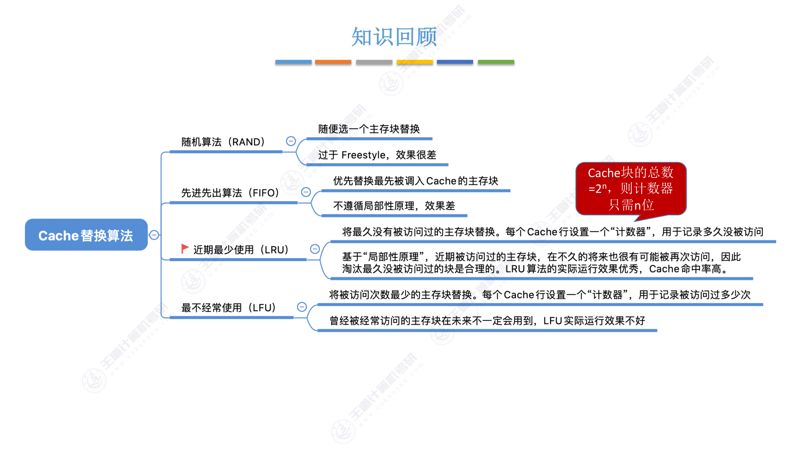
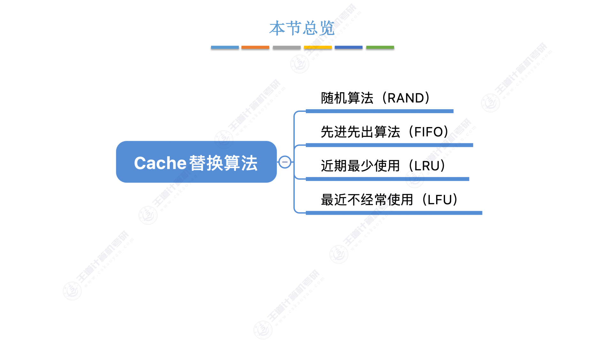
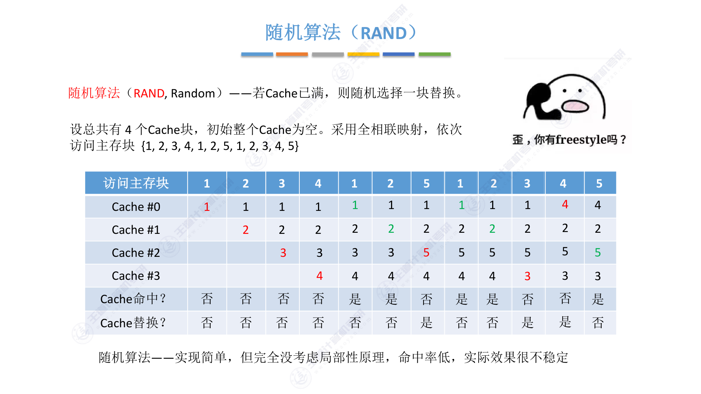
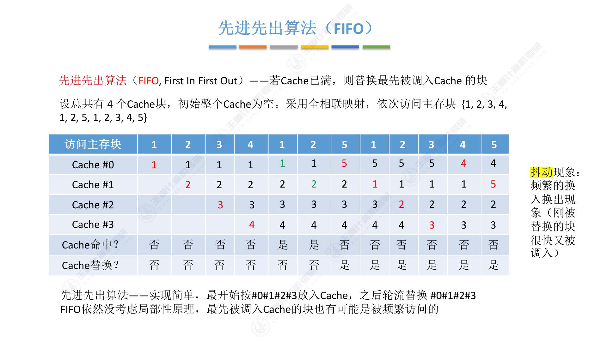
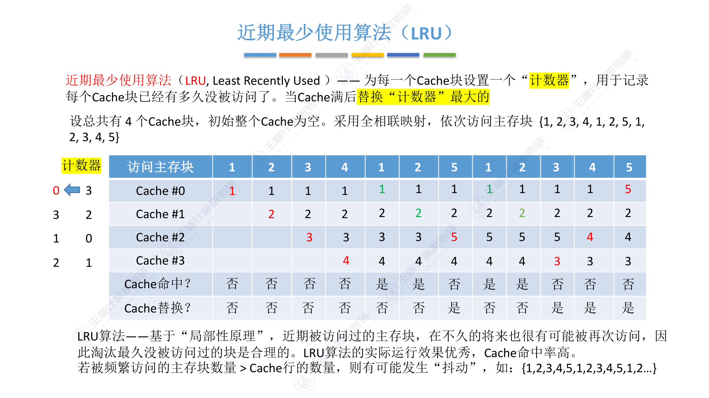
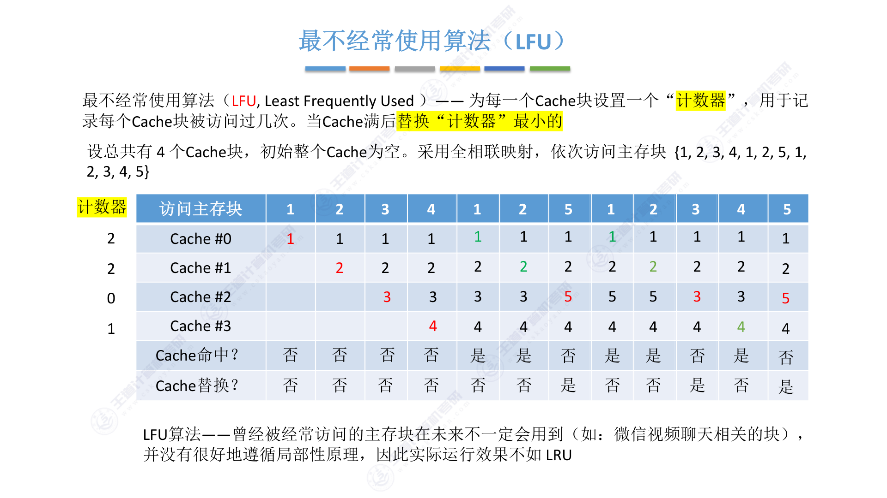

# 3.5.4 Cache替换算法

## 思维导图

---

## 一、为什么需要替换算法？

前面讲过，当Cache满了之后，如果需要调入新的主存块，就必须选择Cache中的某一块替换出去。不同的替换策略会直接影响Cache的命中率。

具体来说，替换算法要解决的问题是：**Cache已满时，选择哪一块替换？**

不同的映射方式对替换的要求也不同：

- **直接映射**：不需要选择，主存块只能放到固定位置，直接替换即可
- **全相联映射**：Cache满了需要在所有行中选择一块替换
- **组相联映射**：Cache满了需要在对应分组内选择一块替换

---

## 二、本节总览

本节介绍四种替换算法：随机算法（RAND）、先进先出算法（FIFO）、近期最少使用算法（LRU）、最不经常使用算法（LFU）。

---

## 三、随机算法（RAND）

**随机算法**：若Cache已满，则随机选择一块替换。

实现非常简单，随便选一个就行。但问题也很明显——完全没考虑局部性原理，命中率低，实际效果很不稳定。

用PDF里的例子来说，4个Cache块，访问序列{1,2,3,4,1,2,5,1,2,3,4,5}，随机算法的命中率只有5/12，而且哪几次命中完全看运气。

---

## 四、先进先出算法（FIFO）

**先进先出算法**：若Cache已满，则替换最先被调入Cache的块。

FIFO的实现也不复杂，最开始按#0→#1→#2→#3的顺序放入Cache，之后满了就轮流替换#0→#1→#2→#3。

但FIFO有一个严重的问题——**抖动现象**。就是刚被替换出去的块，很快又被调入，然后又被替换，来回折腾。这说明FIFO依然没考虑局部性原理，最先被调入Cache的块也有可能是被频繁访问的。

用同样的例子，FIFO的命中率只有2/12，比随机算法还差。

---

## 五、近期最少使用算法（LRU）★

**近期最少使用算法**：为每一个Cache块设置一个"计数器"，用于记录每个Cache块已经有多久没被访问了。当Cache满后替换"计数器"最大的。

LRU是这一节最重要的算法，考研常考。它的核心思想基于**局部性原理**——近期被访问过的主存块，在不久的将来也很有可能被再次访问，因此淘汰最久没被访问过的块是合理的。

### LRU的计数器规则

每个Cache块的计数器初始为0，规则如下：

**情况一：命中时**

所命中的行的计数器清零，比其低的计数器加1，其余不变。

**情况二：未命中且还有空闲行时**

新装入的行的计数器置0，其余非空闲行全加1。

**情况三：未命中且无空闲行时**

计数值最大的行的信息块被淘汰，新装行的块的计数器置0，其余全加1。

### 一个重要的结论

> Cache块的总数 = \(2^n\)，则计数器只需n位。且Cache装满后所有计数器的值一定不重复。

这个结论在选择题中经常出现。比如4个Cache块，计数器只需要2位，取值范围0~3，装满后四个计数器的值恰好是0、1、2、3各一个。

### LRU的优缺点

LRU算法的实际运行效果优秀，Cache命中率高。但它也有局限性：若被频繁访问的主存块数量 > Cache行的数量，则有可能发生"抖动"，比如访问序列{1,2,3,4,5,1,2,3,4,5,1,2...}。

---

## 六、最不经常使用算法（LFU）

**最不经常使用算法**：为每一个Cache块设置一个"计数器"，用于记录每个Cache块被访问过几次。当Cache满后替换"计数器"最小的。

LFU的思路是统计每个块被访问的总次数，替换访问次数最少的那个。新调入的块计数器=0，之后每被访问一次计数器+1。

如果有多个计数器最小的行，可按行号递增、或FIFO策略进行选择。

但LFU的问题在于：**曾经被经常访问的主存块在未来不一定会用到**。比如微信视频聊天相关的块，在视频聊天时被频繁访问，但关闭视频后就再也不会用到了，LFU还是会保留它。因此LFU并没有很好地遵循局部性原理，实际运行效果不如LRU。

---

## 七、四种算法对比

**从命中率角度看**：LRU > LFU > FIFO ≈ RAND

**从实现复杂度角度看**：RAND < FIFO < LFU < LRU

LRU虽然实现最复杂，但命中率最高，是实际应用中最常用的替换算法。

---

## 八、考点总结

### 考点1：LRU的计数器规则

这是本节最核心的考点。要能手动模拟LRU的替换过程，关键是记住三条规则：

- 命中时：命中的行清零，比它低的加1，其余不变
- 未命中有空闲：新装入的行置0，其余非空闲行加1
- 未命中无空闲：计数器最大的淘汰，新装入的行置0，其余加1

### 考点2：计数器位数

Cache块的总数 = \(2^n\)，则计数器只需n位。且Cache装满后所有计数器的值一定不重复。

### 考点3：各算法的特点

- **RAND**：实现简单，命中率低，效果不稳定
- **FIFO**：实现简单，可能出现抖动，命中率低
- **LRU**：基于局部性原理，命中率高，是最常用的算法
- **LFU**：基于访问频率，但不如LRU，因为过去频繁不代表将来频繁

### 考点4：抖动现象

FIFO和LRU都可能出现抖动。FIFO的抖动是因为没考虑局部性；LRU的抖动是因为被频繁访问的块数量超过了Cache容量。

---

## 九、本节小结

Cache替换算法解决的是"Cache满了怎么办"的问题。四种算法中，LRU是重点，要掌握其计数器规则和手动模拟方法。记住LRU基于局部性原理，实际效果最好；LFU虽然也考虑了访问历史，但效果不如LRU。
