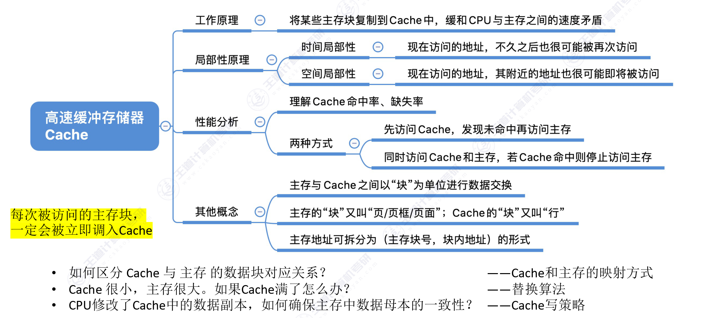
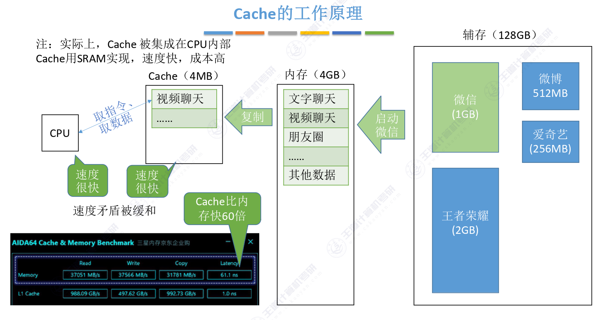
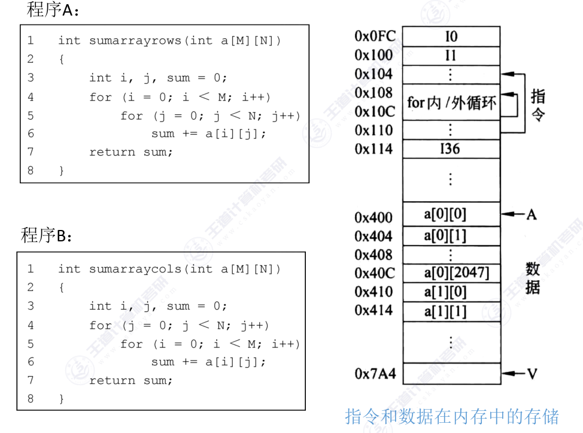
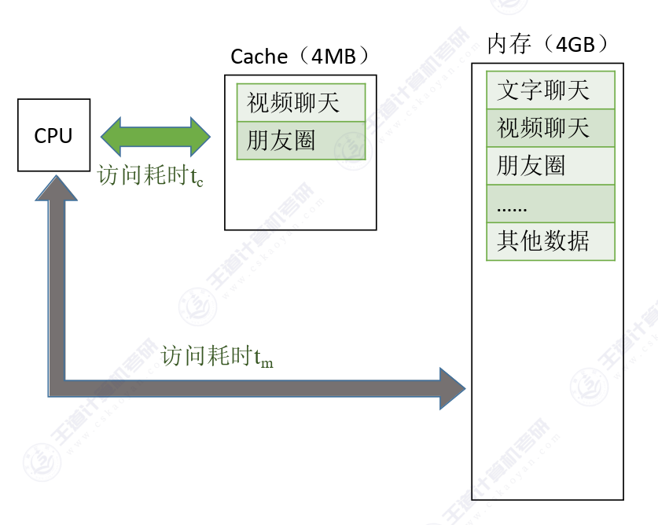
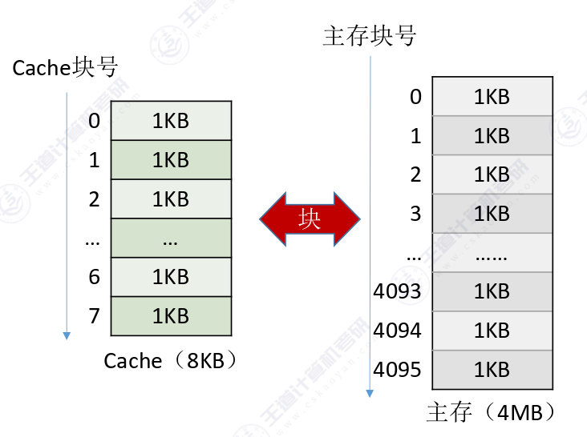
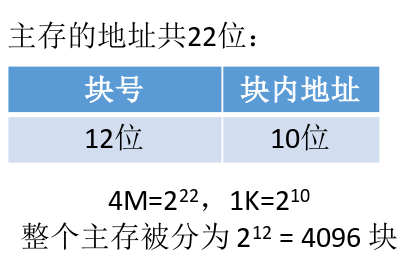

# 3.5.1 + 3.5.2 Cache的基本原理

## 思维导图

---

## 一、Cache的工作原理

Cache（高速缓冲存储器）是一种位于CPU和主存之间的高速存储器，其核心思想是：

> **将某些主存块复制到Cache中，缓和CPU与主存之间的速度矛盾**

### 1.1 为什么需要Cache？

现代计算机系统中，CPU的速度远快于主存的速度。如果CPU每次访问都直接从主存读取数据，会导致CPU长时间等待，严重降低系统效率。

以日常生活为例：假设你在用电脑进行视频聊天，CPU大概率只会用到与"视频聊天"相关的指令代码，而微信、朋友圈、爱奇艺等其他应用的数据则暂时不需要。

### 1.2 Cache如何解决速度矛盾？

Cache利用**局部性原理**，将CPU当前访问地址"周围"的部分数据预先存放在高速存储器中。当CPU需要访问数据时，首先检查Cache中是否有该数据：

- 若**Cache命中**（Hit）：直接从Cache读取，速度快
- 若**Cache未命中**（Miss）：从主存读取，同时将该块数据放入Cache供后续使用

!!! note "Cache的实现方式"
    Cache通常用**SRAM**（静态随机存取存储器）实现，速度快但成本高，因此容量较小（通常为几MB）。而主存用**DRAM**实现，容量大但速度慢。Cache被集成在CPU内部，Cache比内存快约**60倍**。

## 二、局部性原理

局部性原理是Cache能够有效工作的理论基础，分为两种类型：

### 1. 时间局部性（Temporal Locality）

> **在最近的未来要用到的信息，很可能是现在正在使用的信息**

**典型应用场景：**

- 循环结构中的指令代码（如 `for` 循环体）
- 短时间内被反复访问的变量

### 2. 空间局部性（Spatial Locality）

> **在最近的未来要用到的信息，很可能与现在正在使用的信息在存储空间上是邻近的**

**典型应用场景：**

- 数组元素的顺序访问
- 顺序执行的指令代码

!!! example "空间局部性的差异"

    

    假设有两个程序访问同一个二维数组：

    - **程序A**：按"行优先"顺序访问，空间局部性好
    - **程序B**：按"列优先"顺序访问，空间局部性差

    因此，即使两个程序访问相同的数据，由于局部性不同，Cache的命中率也会有显著差异。

!!! note "局部性原理的应用"

    基于局部性原理，我们可以把CPU目前访问的地址"周围"的部分数据放到Cache中。具体考题来说：

    - **时间局部性** → 被访问过的数据可能再次被访问，保留在Cache中
    - **空间局部性** → 一次传输一个数据块（包含相邻数据），而不仅仅是单个数据

## 三、性能分析

### 1. 命中率与缺失率

设 \( t_c \) 为访问一次Cache所需时间，\( t_m \) 为访问一次主存所需时间。

**命中率 \( H \)**：CPU欲访问的信息已在Cache中的比率

**缺失率（未命中率）\( M \)**：\( M = 1 - H \)

### 2. 平均访问时间

Cache—主存系统的平均访问时间 \( t \) 有两种计算方式：

#### 方式一：先访问Cache，未命中再访问主存

\[
t = H \times t_c + (1 - H) \times (t_c + t_m)
\]

#### 方式二：同时访问Cache和主存

\[
t = H \times t_c + (1 - H) \times t_m
\]

### 3. 典型例题

!!! example "例3-2：Cache性能提升计算"

    **题目**：假设Cache的速度是主存的5倍，且Cache的命中率为95%，则采用Cache后，存储器性能提高多少？

    **已知条件：**

    - Cache存取周期为 \( t \)，则主存存取周期为 \( 5t \)
    - 命中率 \( H = 0.95 \)

    **解法一：同时访问（Cache和主存同时被访问，若Cache命中则中断访问主存）**

    - 命中时访问时间为 \( t \)
    - 未命中时访问时间为 \( 5t \)
    - 平均访问时间：\( 0.95 \times t + 0.05 \times 5t = 1.2t \)
    - 性能提升：\( \frac{5t}{1.2t} \approx 4.17 \) 倍

    **解法二：先访问Cache再访问主存**

    - 命中时访问时间为 \( t \)
    - 未命中时访问时间为 \( t + 5t \)
    - 平均访问时间：\( T_a = 0.95 \times t + 0.05 \times 6t = 1.25t \)
    - 性能提升：\( \frac{5t}{1.25t} = 4 \) 倍

!!! warning "注意区分两种访问方式"

    两种访问方式的平均访问时间公式不同，考试时要根据题目描述判断使用哪种方式。关键区别在于**未命中时的处理**：

    - **同时访问**：未命中时只需等待主存时间 \( t_m \)
    - **顺序访问**：未命中时需要先等Cache时间 \( t_c \) 再等主存时间 \( t_m \)

## 四、主存与Cache的数据交换

### 1. 块的概念

基于局部性原理，可以将主存的存储空间"**分块**"，如每1KB为一块。主存与Cache之间以"**块**"为单位进行数据交换。

!!! note "块的不同称呼"

    - 主存中的"块"通常也称为"**页/页面/页框**"
    - Cache中的"块"也称为"**行**"

### 2. 主存地址结构

主存地址可拆分为（**主存块号**，**块内地址**）的形式。

以上述结构为例

!!! example "地址位数计算"

    **题目**：主存容量为4MB，Cache容量为8KB，块大小为1KB，求主存地址各位的划分。

    **解答：**

    - 主存容量 \( 4MB = 2^{22} \) 字节，因此主存地址共 **22位**
    - 块大小 \( 1KB = 2^{10} \) 字节，因此块内地址需要 **10位**
    - 主存块号位数：\( 22 - 10 = 12 \) 位
    - 整个主存被分为 \( 2^{12} = 4096 \) 块

!!! note "重要性质"

    每次被访问的主存块，**一定会被立即调入Cache**。这是Cache工作的基本保证。

### 3. 待解决的问题

Cache机制引入后，还需要解决以下三个关键问题：

1. **Cache和主存的映射方式**：如何区分Cache与主存的数据块对应关系？
2. **替换算法**：Cache很小，主存很大，如果Cache满了怎么办？
3. **Cache写策略**：CPU修改了Cache中的数据副本，如何确保主存中数据母本的一致性？

这三个问题将在后续章节中详细讨论。

## 五、考点总结

### 核心概念

1. **Cache的作用**：缓和CPU与主存之间的速度矛盾
2. **局部性原理**：时间局部性和空间局部性是Cache工作的理论基础
3. **命中率计算**：\( H = \frac{\text{命中次数}}{\text{总访问次数}} \)
4. **平均访问时间**：注意区分两种访问方式的公式

### 常见考点

#### 考点1：局部性原理的理解

- **时间局部性**：循环变量、临时变量等被反复访问的数据
- **空间局部性**：数组遍历、顺序执行的指令等相邻访问的数据

#### 考点2：Cache命中率与缺失率计算

!!! example "典型计算题"
    **题目**：已知Cache命中率为0.9，Cache访问时间为100ns，主存访问时间为400ns，求平均访问时间（若采用同时访问方式）。

    **解答：**

    \[
    T_{avg} = H \times T_c + (1 - H) \times T_m
    \]
    \[
    = 0.9 \times 100 + 0.1 \times 400
    \]
    \[
    = 90 + 40 = 130 \text{ns}
    \]

#### 考点3：数据交换单位

- 主存与Cache之间按**块**传输。
    - 主存中的块称为**页/页框/页面**
    - Cache中的块称为**行**

#### 考点4：地址划分

- 主存地址 = 主存块号 + 块内地址
- 块内地址位数由块大小决定（块大小为 \( 2^k \) 字节，则块内地址为 \( k \) 位）
- 主存块号位数 = 总地址位数 - 块内地址位数

#### 考点5：两种访问方式比较

| 比较项 | 先访问Cache | 同时访问Cache和主存 |
|--------|------------|-------------------|
| 未命中时延迟 | \( t_c + t_m \) | \( t_m \) |
| 平均访问时间公式 | \( Ht_c + (1-H)(t_c+t_m) \) | \( Ht_c + (1-H)t_m \) |
| 性能提升效果 | 较低 | 较高 |

掌握这些基本概念和计算方法，是理解后续Cache映射方式、替换算法和写策略的基础。
