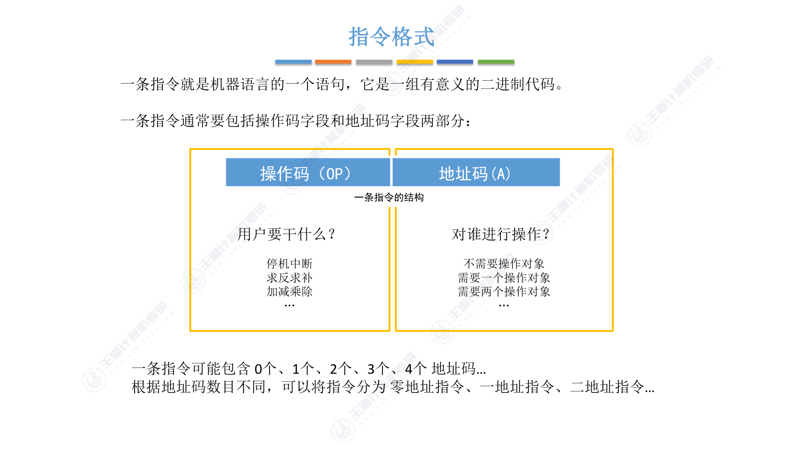
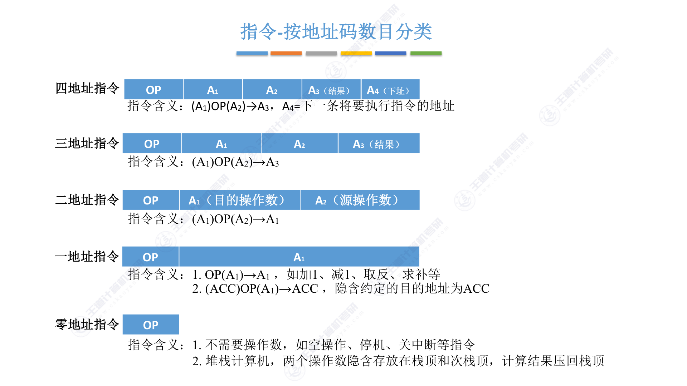

# 4.1.1+2+3 指令的基本格式

## 思维导图

> 这里需要图片：第四章指令系统思维导图（指令定义、指令格式、按地址码分类、按长度分类、按操作码分类、按操作类型分类）

---

## 一、指令的定义

**指令（又称机器指令）** 是指示计算机执行某种操作的命令，是计算机运行的**最小功能单位**。

一台计算机的所有指令的集合构成该机的**指令系统**，也称为**指令集**。一台计算机只能执行自己指令系统中的指令，不能执行其他系统的指令（如 x86、ARM 各自独立）。

## 二、指令格式

一条指令就是机器语言的一个语句，它是一组有意义的二进制代码。一条指令通常包括**操作码字段**和**地址码字段**两部分：

- **操作码（OP）**：指明"做什么"——停机中断、求反求补、加减乘除等
- **地址码（A）**：指明"对谁进行操作"——不需要操作对象 / 需要1个 / 需要2个

一条指令可能包含 **0个、1个、2个、3个、4个** 地址码。根据地址码数目不同，可将指令分为零地址指令、一地址指令、二地址指令……

## 三、按地址码数目分类

### 1. 零地址指令

格式：`OP`

- **不需要操作数**：如空操作、停机、关中断等
- **堆栈计算机**：两个操作数隐含存放在栈顶和次栈顶，计算结果压回栈顶

### 2. 一地址指令

格式：`OP A₁`

**两种含义：**

- **单操作数指令**（加1、减1、取反、求补）：
    - \( OP(A_1) \rightarrow A_1 \)
    - 访存 3 次：取指 → 读 \(A_1\) → 写 \(A_1\)

- **隐含 ACC 的双操作数指令**：
    - \( (ACC) \ OP(A_1) \rightarrow ACC \)
    - 访存 2 次：取指 → 读 \(A_1\)

### 3. 二地址指令

格式：`OP A₁（目的） A₂（源）`

- \( (A_1) \ OP(A_2) \rightarrow A_1 \)
- 访存 4 次：取指 → 读 \(A_1\) → 读 \(A_2\) → 写 \(A_1\)

### 4. 三地址指令

格式：`OP A₁ A₂ A₃（结果）`

- \( (A_1) \ OP(A_2) \rightarrow A_3 \)
- 访存 4 次：取指 → 读 \(A_1\) → 读 \(A_2\) → 写 \(A_3\)

### 5. 四地址指令

格式：`OP A₁ A₂ A₃（结果） A₄（下址）`

- \( (A_1) \ OP(A_2) \rightarrow A_3 \)，\( A_4 \) = 下一条将要执行指令的地址
- 访存 4 次：取指 → 读 \(A_1\) → 读 \(A_2\) → 写 \(A_3\)

> 正常情况下取指后 PC+1，而四地址指令执行后将 PC 修改为 \( A_4 \) 所指地址。

!!! note "地址码位数的影响"
    - \( n \) 位地址码的直接寻址范围 \( = 2^n \)
    - 若指令总长度固定不变，则**地址码数量越多，寻址能力越差**

### 6. 各类指令访存次数对比

| 指令类型 | 格式 | 含义 | 访存次数 |
|---------|------|------|---------|
| 零地址 | `OP` | 不需要操作数 / 堆栈隐含 | — |
| 一地址 | `OP A₁` | \( OP(A_1) \rightarrow A_1 \) 或 \( (ACC) \ OP(A_1) \rightarrow ACC \) | 2~3次 |
| 二地址 | `OP A₁ A₂` | \( (A_1) \ OP(A_2) \rightarrow A_1 \) | 4次 |
| 三地址 | `OP A₁ A₂ A₃` | \( (A_1) \ OP(A_2) \rightarrow A_3 \) | 4次 |
| 四地址 | `OP A₁ A₂ A₃ A₄` | \( (A_1) \ OP(A_2) \rightarrow A_3 \)，\( A_4 \) = 下址 | 4次 |

## 四、按指令长度分类

- **指令字长**：一条指令的总长度（可能会变）
- **机器字长**：CPU 进行一次整数运算所能处理的二进制数据的位数（通常和 ALU 直接相关）
- **存储字长**：一个存储单元中的二进制代码位数（通常和 MDR 位数相同）

根据指令长度与机器字长的关系：**半字长指令、单字长指令、双字长指令**（指令长度是机器字长的多少倍）。

> 指令字长会影响取指令所需时间。如：机器字长 = 存储字长 = 16bit，则取一条双字长指令需要**两次访存**。

- **定长指令字结构**：所有指令长度都相等
- **变长指令字结构**：各种指令长度不等

## 五、按操作码长度分类

- **定长操作码**：所有指令操作码长度相同，\( n \) 位 → \( 2^n \) 条指令。译码电路**简单**，灵活性低
- **可变长操作码**：操作码长度可变。译码电路**复杂**，灵活性高

> 定长指令字结构 + 可变长操作码 → **扩展操作码指令格式**（不同地址数的指令使用不同长度的操作码）。

## 六、按操作类型分类

| 操作类型 | 说明 | 典型指令 |
|---------|------|---------|
| 数据传送 | 主存与 CPU 之间的数据传送 | LOAD、STORE |
| 算术逻辑操作 | 加减乘除、与或非异或等 | — |
| 移位操作 | 算术移位、逻辑移位、循环移位 | — |
| 转移操作 | 改变程序执行顺序 | JMP、JZ、JO、JC、CALL、RETURN、Trap |
| 输入输出操作 | CPU 和 I/O 设备之间的数据传送 | 端口读写 |

## 考点总结

### 核心概念

- 指令 = 操作码 + 地址码，是计算机运行的最小功能单位
- 地址码数目决定指令类型（零地址 ~ 四地址）
- 指令字长、机器字长、存储字长三者的区别与联系

### 常见考点

1. 各类指令的**访存次数计算**（一地址指令的两种情况）
2. 地址码位数与寻址范围的关系：\( n \) 位 → 直接寻址范围 \( 2^n \)
3. 定长 vs 变长指令字结构、定长 vs 可变长操作码的对比
4. 指令字长对取指时间的影响

### 易错点

!!! warning "常见错误"
    1. 一地址指令的两种含义容易混淆：单操作数指令 vs 隐含 ACC 的双操作数指令
    2. 四地址指令中 \( A_4 \) 是**下一条指令的地址**，而非操作数地址
    3. 地址码位数影响的是**直接寻址范围**，不是指令的总寻址能力
    4. 取指令的访存次数容易被遗漏——所有指令都需要至少 1 次取指访存

## 本节小结

指令系统是计算机硬件与软件的接口。本节从指令的基本格式出发，介绍了指令的定义、操作码与地址码的结构，重点分析了按地址码数目分类（零地址 ~ 四地址指令）的格式与含义，以及按指令长度、操作码长度、操作类型的分类方式。核心要点是理解各类指令的访存次数差异和地址码位数对寻址范围的影响。
