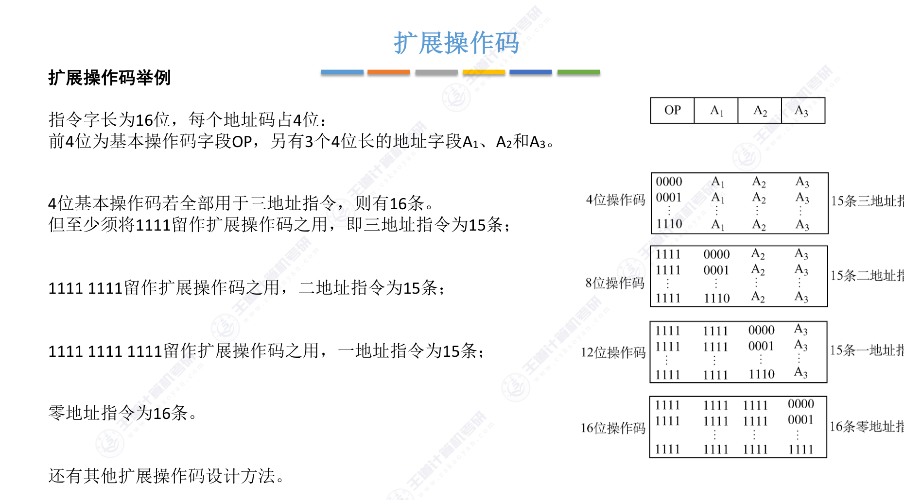
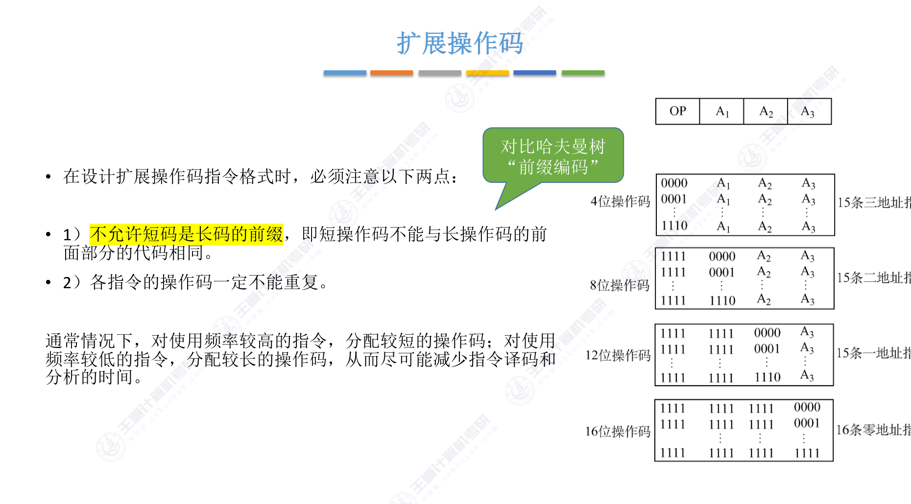

# 4.1.4 扩展操作码指令格式

## 思维导图

> 这里需要图片：扩展操作码指令格式思维导图（包含：基本概念、扩展操作码举例、设计要点、操作码分类等内容）

---

## 一、基本概念

指令由**操作码**和若干个**地址码**组成。根据指令系统中指令长度和操作码长度的不同组合，可以引出以下概念：

- **定长指令字结构**：指令系统中所有指令的长度都相等
- **变长指令字结构**：指令系统中各种指令的长度不等

- **定长操作码**：指令系统中所有指令的操作码长度都相同
- **可变长操作码**：指令系统中各指令的操作码长度可变

> **核心定义：** 定长指令字结构 + 可变长操作码 = **扩展操作码指令格式**
>
> 即不同地址数的指令使用不同长度的操作码。

## 二、扩展操作码举例

以一个经典例子说明扩展操作码的工作原理：**指令字长为16位，每个地址码占4位**。

前4位为基本操作码字段OP，另有3个4位长的地址字段 \( A_1 \)、\( A_2 \) 和 \( A_3 \)。

**扩展过程：**

1. **三地址指令（4位操作码）**：4位基本操作码若全部用于三地址指令，则有 \( 2^4 = 16 \) 条。但至少须将 `1111` 留作扩展操作码之用，即三地址指令为 **15条**

2. **二地址指令（8位操作码）**：`1111 1111` 留作扩展操作码之用，二地址指令为 **15条**

3. **一地址指令（12位操作码）**：`1111 1111 1111` 留作扩展操作码之用，一地址指令为 **15条**

4. **零地址指令（16位操作码）**：零地址指令为 **16条**

!!! note "扩展操作码的核心思想"
    地址码每减少一个（少4位），操作码就增加4位，从而可以表示更多的指令。通过这种方式，在定长指令字的限制下，仍能灵活地支持不同地址数的指令。

## 三、设计要点

在设计扩展操作码指令格式时，必须注意以下两点：

> **1）不允许短码是长码的前缀**
>
> 即短操作码不能与长操作码的前面部分的代码相同。这一点与哈夫曼编码（前缀编码）的原理一致。

> **2）各指令的操作码一定不能重复**

**指令分配策略：**

- 对使用频率**较高**的指令，分配**较短**的操作码
- 对使用频率**较低**的指令，分配**较长**的操作码
- 目的：尽可能减少指令译码和分析的时间

!!! warning "前缀编码原则"
    扩展操作码本质上是一种**前缀编码**。就像哈夫曼编码一样，短码不能是长码的前缀，否则译码时会产生歧义。

## 四、扩展操作码设计方法

**通用公式：** 设地址长度为 \( n \)，上一层留出 \( m \) 种状态，下一层可扩展出 \( m \times 2^n \) 种状态。

!!! example "设计题：16位指令字长的指令系统设计"
    设指令字长固定为16位，地址码为4位，试设计一套指令系统满足：

    **a) 有15条三地址指令**

    \[
    2^4 = 16 \text{种状态，留出} 16 - 15 = 1 \text{种}
    \]

    **b) 有12条二地址指令**

    \[
    1 \times 2^4 = 16 \text{种，留出} 16 - 12 = 4 \text{种}
    \]

    **c) 有62条一地址指令**

    \[
    4 \times 2^4 = 64 \text{种，留出} 64 - 62 = 2 \text{种}
    \]

    **d) 有32条零地址指令**

    \[
    2 \times 2^4 = 32 \text{种}
    \]

    **解题关键：** 每减少一个地址码（4位），操作码增加4位，可扩展的状态数 = 上一层留出的状态数 \( \times 2^n \)

## 五、操作码分类总结

### 1. 定长操作码

在指令字的最高位部分分配固定的若干位（定长）表示操作码。一般 \( n \) 位操作码字段的指令系统最大能够表示 \( 2^n \) 条指令。

**优点：** 定长操作码对于简化计算机硬件设计，提高指令译码和识别速度很有利

**缺点：** 指令数量增加时会占用更多固定位，留给表示操作数地址的位数受限

### 2. 扩展操作码（不定长操作码）

全部指令的操作码字段的位数不固定，且分散地放在指令字的不同位置上。最常见的变长操作码方法是扩展操作码，使操作码的长度随地址码的减少而增加，不同地址数的指令可以具有不同长度的操作码，从而在满足需要的前提下，有效地缩短指令字长。

**优点：** 在指令字长有限的前提下仍保持比较丰富的指令种类

**缺点：** 增加了指令译码和分析的难度，使控制器的设计复杂化

## 考点总结

### 核心概念

1. **扩展操作码的定义**：扩展操作码 = 定长指令字结构 + 可变长操作码
2. **核心思想**：不同地址数的指令使用不同长度的操作码
3. **扩展规律**：地址码每减少一个（少 \( n \) 位），操作码增加 \( n \) 位
4. **前缀编码**：短操作码不能是长操作码的前缀，各指令操作码不能重复

### 常见考点

#### 考点1：扩展操作码的位数计算

给定指令字长和地址码位数，计算各级操作码的位数。

!!! example "典型计算题"
    **题目**：某指令系统字长为32位，每个地址码占8位，采用扩展操作码。求三地址、二地址、一地址、零地址指令的操作码位数。

    **解答：**

    - 三地址指令：操作码 = \( 32 - 8 \times 3 = 8 \) 位
    - 二地址指令：操作码 = \( 32 - 8 \times 2 = 16 \) 位
    - 一地址指令：操作码 = \( 32 - 8 \times 1 = 24 \) 位
    - 零地址指令：操作码 = \( 32 - 8 \times 0 = 32 \) 位

#### 考点2：各级指令数量计算（扩展公式）

**核心公式**：设地址长度为 \( n \)，上一层留出 \( m \) 种状态，下一层可扩展出 \( m \times 2^n \) 种状态。

!!! example "典型计算题"
    **题目**：指令字长16位，每个地址码4位。三地址指令有15条，二地址指令有12条，一地址指令有62条，求零地址指令最多有多少条。

    **解答：**

    - 三地址指令：\( 2^4 = 16 \) 种，留出 \( 16 - 15 = 1 \) 种
    - 二地址指令：\( 1 \times 2^4 = 16 \) 种，留出 \( 16 - 12 = 4 \) 种
    - 一地址指令：\( 4 \times 2^4 = 64 \) 种，留出 \( 64 - 62 = 2 \) 种
    - 零地址指令：\( 2 \times 2^4 = 32 \) 种

#### 考点3：设计题——给定约束设计扩展操作码方案

这是考研重点题型。需要根据各级指令数量要求，设计操作码编码方案。

!!! example "设计题"
    **题目**：设指令字长固定为16位，每个地址码4位，试设计一套指令系统满足：有8条三地址指令，15条二地址指令，124条一地址指令，零地址指令若干条。写出各指令的操作码编码范围。

    **解答：**

    - 三地址指令：\( 2^4 = 16 \) 种，留出 \( 16 - 8 = 8 \) 种
        - 编码范围：`0000` ~ `0111`（8条）
        - 留作扩展：`1000` ~ `1111`（8种）

    - 二地址指令：\( 8 \times 2^4 = 128 \) 种，需15条，留出 \( 128 - 15 = 113 \) 种
        - 编码范围：`1000 0000` ~ `1000 1110`（15条）
        - 留作扩展：`1000 1111` ~ `1111 1111`（113种）

    - 一地址指令：\( 113 \times 2^4 = 1808 \) 种，需124条，满足要求
        - 编码范围：`1000 1111 0000` ~ `1000 1111 0111 1011`（124条）

    - 零地址指令：剩余编码均可作为零地址指令

#### 考点4：定长操作码与扩展操作码对比

| 比较项 | 定长操作码 | 扩展操作码 |
|--------|-----------|-----------|
| **操作码位数** | 固定 | 可变 |
| **译码复杂度** | 简单 | 复杂 |
| **指令种类** | 受限（\( n \) 位最多 \( 2^n \) 条） | 更丰富 |
| **硬件成本** | 低 | 高 |
| **典型应用** | RISC | CISC |

#### 考点5：前缀编码原则的应用

- 短操作码**不能**是长操作码的前缀（与哈夫曼编码原理相同）
- 各指令的操作码**不能重复**
- 高频指令分配短操作码，低频指令分配长操作码

#### 考点6：扩展操作码的总指令数计算

- 三地址指令最多 \( 2^n - 1 \) 条（留1种扩展）
- 二地址指令最多 \( (2^n - 1) \times 2^n - 1 \) 条
- 以此类推

!!! example "计算题"
    **题目**：若指令字长16位，地址码4位，求最多可设计多少条三地址、二地址、一地址、零地址指令。

    **解答：**

    - 三地址指令：\( 2^4 - 1 = 15 \) 条
    - 二地址指令：\( 15 \times 2^4 - 1 = 239 \) 条
    - 一地址指令：\( 239 \times 2^4 - 1 = 3823 \) 条
    - 零地址指令：\( 3824 \times 2^4 = 61184 \) 条（全部用于零地址）

### 易错点

!!! warning "常见错误"
    1. **忘记留扩展标志**：每级都要留出至少1种状态作为扩展标志，否则操作码冲突
    2. **扩展公式用错**：应该是上一层**留出的**状态数 \( \times 2^n \)，不是上一层**总**状态数
    3. **混淆指令字长与操作码长度**：操作码长度是可变的，指令字长是固定的
    4. **前缀冲突**：设计时忘记检查短码是否是长码的前缀
    5. **零地址指令条数计算错误**：零地址指令不需要留扩展标志，可以使用全部编码
    6. **忽略"至少留1条"**：如果题目没有要求某级指令的数量，仍然需要至少留1种状态给下一级

## 本节小结

扩展操作码是考研重点内容，常以设计题形式出现。核心要点：

1. 掌握扩展操作码的设计方法：每级留出状态、\( m \times 2^n \) 公式
2. 理解前缀编码原则：短码不能是长码的前缀
3. 能够根据约束条件设计扩展操作码方案
4. 能够计算各级操作码位数和指令数量
5. 定长操作码与扩展操作码的优缺点对比
