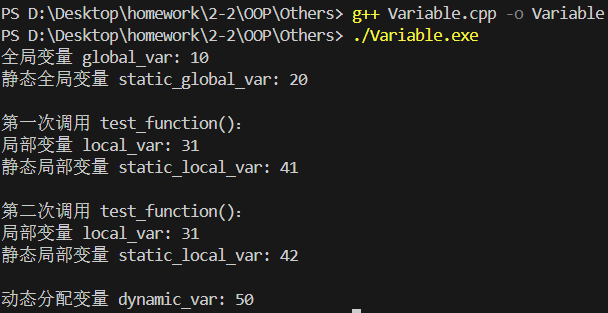

# Lecture1: Using Objects

## 一、字符串（string）的使用

### 1. 基本操作

头文件需包含 `<string>`： 

```cpp
#include <string>
```

定义与初始化示例：

```cpp
string str;          // 空字符串
string str = "Hello"; // 直接初始化
```

输入输出使用 `cin` 和 `cout`：  

```cpp
cin >> str;  // 输入（以空格分隔）
cout << str; // 输出
```

拼接与操作示例：  

```cpp
string str3 = str1 + str2; // 直接拼接
str1 += str2;              // 追加内容
str1 += "lalala";          // 追加字符串字面量
```

### 2. 常用成员函数

子字符串使用 `substr(pos, len)`：  

```cpp
string sub = str.substr(0, 3); // 从位置0开始取3个字符
```

赋值使用`assign()`：

```cpp
string s1 = "Hello";
s1.assign("World");          // s1 赋值变为 "World"

string s2;
s2.assign(5, 'A');          // s2 初始化为 "AAAAA"
s2.assign("Hello", 3);      // 取前3个字符，s2 变为 "Hel"
```

插入字符串使用`insert(pos, str)`： 

```cpp
string s1 = "Hello";
s1.insert(2, "WTY");         // 在位置2插入 "WTY"，s1变为 "HeWTYllo"

string s2 = "C++";
s2.insert(3, " Programming"); // 在末尾追加，s2变为 "C++ Programming"

string s3 = "12345";
s3.insert(1, 3, '-');       // 在位置1插入3个'-'，s3变为 "1---2345"
```

删除部分内容使用`erase(pos, len)`：

```cpp
string s1 = "Ciallo";
s1.erase(2, 3);              // 从位置2删除3个字符，s 变为 "Ciao"

string s2 = "Hello World";
s2.erase(5);                // 从位置5删除到末尾，s2 变为 "Hello"
```

替换内容使用`replace(pos, len, new_str)`：

```cpp
string s = "Hello World";
s.replace(6, 5, "Universe"); // 从位置6开始替换5个字符为 "Universe"，结果 "Hello Universe"

string s2 = "C++ is hard";
s2.replace(4, 2, "not");    // 替换 "is" 为 "not"，结果 "C++ not hard"

string s3 = "123456";
s3.replace(1, 4, "WTY");    // 从位置1替换4个字符为 "WTY"，结果 "1WTY6"
```

## 二、内存模型

### 1. 变量类型

| 变量类型                  | 存储区域       | 说明                         |
|---------------------------|----------------|------------------------------|
| 全局变量                  | 全局数据区     | 程序启动时分配，生命周期长   |
| 静态全局变量（static）    | 全局数据区     | 仅当前文件可见               |
| 局部变量                  | 栈（stack）    | **函数结束时**自动释放           |
| 静态局部变量（static）    | 全局数据区     | **函数调用间**保持值不变         |
| 动态分配变量（new/delete）| 堆（heap）     | 手动管理生命周期             |

问AI要了一段简单的测试代码，可以跑来看看：

```cpp
#include <iostream>
using namespace std;

// 全局变量（全局数据区）
int global_var = 10;

// 静态全局变量（全局数据区，仅当前文件可见）
static int static_global_var = 20;

void test_function() {
    // 局部变量（栈）
    int local_var = 30;
    local_var++;
    cout << "局部变量 local_var: " << local_var << endl;

    // 静态局部变量（全局数据区，函数调用间保留值）
    static int static_local_var = 40;
    static_local_var++;
    cout << "静态局部变量 static_local_var: " << static_local_var << endl;
}

int main() {
    // 动态分配变量（堆）
    int* dynamic_var = new int(50);

    // 全局变量和静态全局变量在程序启动时已初始化
    cout << "全局变量 global_var: " << global_var << endl;
    cout << "静态全局变量 static_global_var: " << static_global_var << endl;

    // 调用函数两次，观察局部变量和静态局部变量的变化
    cout << "\n第一次调用 test_function()：" << endl;
    test_function();
    cout << "\n第二次调用 test_function()：" << endl;
    test_function();

    // 动态分配变量需手动释放
    cout << "\n动态分配变量 dynamic_var: " << *dynamic_var << endl;
    delete dynamic_var;

    return 0;
}
```



### 2. 静态变量

静态全局变量限制其他文件访问（通过 `static` 修饰）。  

静态局部变量特点：首次访问时初始化，函数调用间保留值。  
 
```cpp
void func() {
    static int count = 0; // 只会初始化一次
    count ++;
    cout << count;        // 每次调用递增
}
```

## 三、常量（const）

### 1. 常量变量

常量指针与指针常量： 
 
```cpp
const int* p1;        // 指向常量的指针（值不可改）
int* const p2 = &x;   // 指针本身是常量（地址不可改）
```

### 2. 函数参数中的const

保护数据不被修改：

```cpp
void print(const string& s) {
    // s不能被修改
    cout << s;
}
```

### 3. 动态分配的常量对象：  

```cpp
const int* p = new const int(10); // 分配常量
delete p;                         // 释放
```

## 四、指针与对象

### 1. 基本操作

定义指针示例（和C语言差不多）： 

```cpp
string s = "hello";
string* ps = &s;        // 指向对象的指针
```

访问成员方法（和C语言差不多）：

```cpp
(*ps).length();         // 解引用后访问
ps->length();           // 等价写法（更简洁）
```

注意事项：  

未初始化的指针可能指向无效对象：

```cpp
string* ps;             // 这样不好，需初始化
```

指针赋值指向同一对象：  

```cpp
string *ps1 = nullptr;
string *ps2 = "e5t2usw3nt";
ps1 = ps2;  // 安全，此时两者指向同一对象"e5t2usw3nt"的地址
```

### 2. 动态内存管理（new/delete）

#### 2.1 动态分配与释放

**单个对象**分配与释放：

```cpp
int* p = new int(107);      // 分配107
delete p;              // 释放
```

**数组**分配与释放： 

```cpp
int* arr = new int[10]; // 分配10个int空间
delete[] arr;           // 必须使用 delete[]
```

#### 2.2 常见错误

重复释放同一内存：  

```cpp
delete p;
...
...
delete p; // 导致未定义行为
```

释放方式不对：  

```cpp
int* arr = new int[10];
delete arr;         // 应用 delete[]
```

## 五、引用（References）

### 1. 基本特性

引用必须**初始化**：  

```cpp
int x = 10;
int& y = x;          // y是x的别名
y = 20;              // 修改y就会修改x
```

引用**不可重新绑定**：  

```cpp
int a = 5;
y = a;               // 这个只是赋值操作，非重新绑定
```

### 2. 引用与指针の简单对比

| 特性       | 引用                          | 指针                          |
|------------|-------------------------------|-------------------------------|
| 是否可为空 | 否                            | 是                            |
| 能否重绑定 | 否（绑定后不可变）            | 是（可指向其他地址）          |