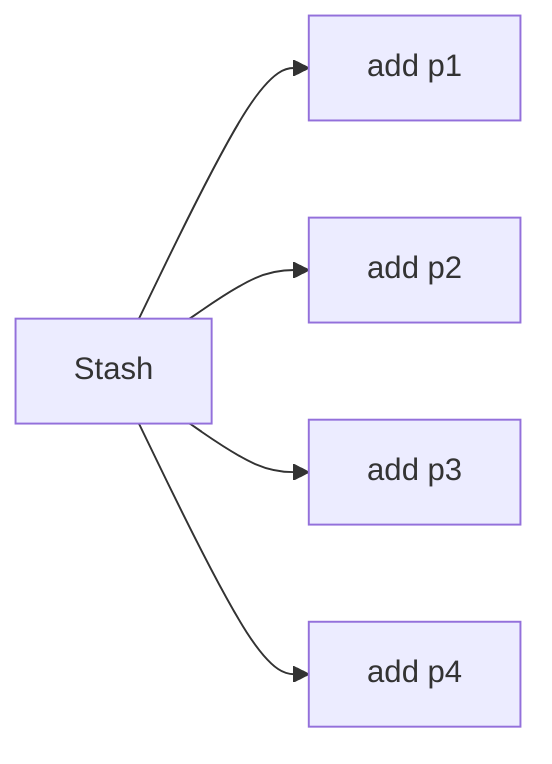
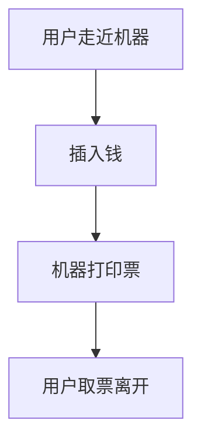
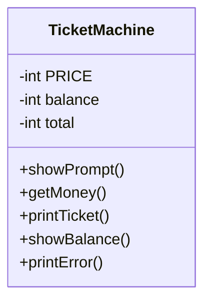
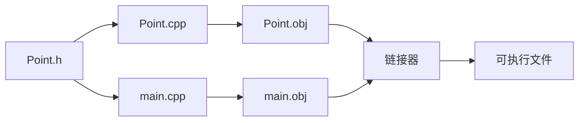

# Lecture 2: Classes and Objects 

## 一、从结构体到类

### 1 结构体（struct）的局限性

- **只包含数据**：传统C结构体只能定义数据成员
- **无封装性**：所有成员默认为public
- **无成员函数**：无法将操作与数据绑定

```cpp
// 这里写个C风格结构体示例
typedef struct point {
    float x;
    float y;
} Point;

Point a;
a.x = 1; 
a.y = 2;

void print(const Point* p) {
    printf("%f %f\n", p->x, p->y);
}
```

### 2. 类（Class）的引入

- **封装数据与操作**：将数据和相关函数绑定在一起
- **访问控制**：通过public/private控制访问权限
- **构造函数**：初始化对象状态

```cpp
// C++类示例
class Point {
public:
    void init(int x, int y);     // 初始化方法
    void move(int dx, int dy);   // 移动点
    void print() const;          // 打印点坐标
    
private:
    int x;  // x坐标
    int y;  // y坐标
};

// 成员函数实现（这里或许还看不懂，我们接着往后看）
void Point::init(int ix, int iy) {
    x = ix;
    y = iy;
}

void Point::move(int dx, int dy) {
    x += dx;
    y += dy;
}

void Point::print() const {
    cout << x << ' ' << y << endl;
}
```

## 二、类与对象的基本概念

### 1. 对象 = 属性 + 服务

| 概念        | 说明                         | 示例                  |
|-------------|------------------------------|-----------------------|
| **属性**    | 对象的状态/数据              | `Point::x, Point::y` |
| **服务**    | 对象提供的操作/方法          | `Point::move()`      |
| **对象**    | 类的具体实例                 | `Point a;`           |
| **类**      | 创建对象的蓝图/模板          | `class Point {...}`  |

### 2.2 类 vs 对象
| 特性        | 类（Class）                  | 对象（Object）        |
|-------------|------------------------------|-----------------------|
| **性质**    | 抽象模板                     | 具体实例             |
| **内存**    | 不占用内存                   | 运行时分配内存       |
| **关系**    | 定义对象的类型               | 类的具体表现         |
| **示例**    | `class Car {...}`           | `Car myTesla;`       |

### 2.3 OOP核心特性
1. **万物皆对象**：程序中的所有元素都是对象
2. **对象间通信**：通过消息传递（方法调用）
3. **对象独立性**：每个对象拥有自己的内存空间
4. **类型系统**：每个对象都有特定类型
5. **多态性**：同类型对象响应相同消息

## 三、成员函数与this指针

### 1. 成员函数实现 与 作用域解析运算符

举个例子吧。我们在类中声明了一个成员函数，比如：

```cpp
class Point {
public:
    void print();  // 声明一个成员函数print
};
```

#### 1.1 正确做法

但是我们**不能直接在类外写函数体**，而是要使用一种特殊的语法——**作用域解析运算符 `::`** 来告诉编译器这个函数是属于哪个类的：

```cpp
// 类定义
class Point {
public:
    void print();  // 成员函数声明
};

// 类外实现成员函数
// 此处::表明了这个函数是Point这个类里面的
void Point::print() {
    std::cout << x << " " << y << std::endl;
}
```

所以，这里就可以知道：

- `Point::print()` 表示：“我要实现的是 `Point` 这个类中的 `print` 函数”。
- 而编译器通过 `::` 知道这个函数属于哪个类，它就可以正确地访问该类的成员变量（如 `x` 和 `y`）。

#### 1.2 错误做法

如果你这样写：

```cpp
void print() {
    std::cout << x << " " << y << std::endl;
}
```

会发生问题：

1. 编译器会认为这是一个**全局函数**，不是 `Point` 类的成员函数。
2. 它无法访问 `x` 和 `y`，因为它们是 `Point` 类的`Private`成员。
3. 接着编译器会报错：

```bash
# 比如以下报错
error: ‘x’ was not declared in this scope
```

#### 1.3 总结

从上面的简单例子可以学到，C++ 是静态类型语言，要求每个函数必须明确归属。当我们在类外面写函数体时，必须告诉编译器（用`::`）这个函数属于哪个类，否则：

- 编译器不知道这是类的成员函数还是全局函数；
- 无法访问类的成员变量；
- 无法调用时绑定到对象上。

!!! example "类比：现实生活中的“归属关系”"

    想象你在一个叫做ZJU的学校里：

    - **类**就像是专业（比如 “IS”）；
    - **成员函数**就像专业里的学生（比如这位叫 “Wen”的小同学）；
        - 如果你说 “Wen”，但是ZJU里名字叫作Wen的有这么多，别人可能不知道是哪个专业的Wen；
        - 如果你要说 “IS: :Wen”，别人才知道你是说哪个Wen。

    同理：

    - `print()` 是名字；
    - `Point::print()` 才是完整的身份标识。

#### 1.4 完整代码演示

可以跑一跑这个代码。

```cpp
#include <iostream>
using namespace std;

class Point {
public:
    void init(int x, int y); //初始化函数
    void print();            //输出打印函数

private:
    int x;
    int y;
};

// 类外实现成员函数
//用::标识这个函数的类
void Point::init(int x_val, int y_val) {
    x = x_val;
    y = y_val;
}

void Point::print() {
    cout << "Point(" << x << ", " << y << ")" << endl;
}

int main() {
    Point p;
    p.init(10, 20);
    p.print();  // 输出预期：Point(10, 20)
}
```

### 2.`this`指针

#### 2.1 `this`的含义

在 C++ 中，**每个非静态成员函数都有一个隐含的参数：`this` 指针**。它指向**调用该函数的对象本身**，比如当你写：

```cpp
// 编译器视角的成员函数
void Point::move(int dx, int dy) {
    this->x += dx;  // 等价于 x += dx
    this->y += dy;  // 等价于 y += dy
}

// 调用时的转换
Point a;
a.move(2, 2);  
```

编译器实际上会把它转换为类似这样的：

```cpp
// 转换前：a.move(2, 2); 
Point::move(&a, 2, 2);
```

也就是说，成员函数其实有一个隐藏的第一个参数：

```cpp
void Point::move(Point* this, int dx, int dy);
```

!!! waring "`this`的使用"

    从上面就可以看出来，我们不能显式声明 `this` 参数（编译器自动处理），但可以在函数体内使用它。

    `this`只能在成员函数中使用(静态函数没有 `this`)，它也不可以重新赋值（自C++ 11起，它是`Type* const` 类型）。

#### 2.2 `this`的常见用途

##### 2.2.1 解决变量命名冲突

当局部变量和成员变量同名时，可以用 `this->x` 来明确访问成员变量。举个例子：

```cpp
class Point {
public:
    void setX(int x) {
        x = x;          // 错误：这里把形参赋给自己，没效果
        this->x = x;    // 正确：将形参 x 赋给成员变量 x
    }

private:
    int x;
};
```

编译器视角：

- `x = x;`：两个 `x` 都是函数参数 `x`，没有修改成员变量。
- `this->x = x;`：明确告诉编译器“左边的是成员变量”。

##### 2.2.2 返回当前对象（支持链式调用）

你可以让成员函数返回当前对象的引用，实现链式调用。示例：

```cpp
class Point {
public:
    Point& move(int dx, int dy) {
        x += dx;
        y += dy;
        return *this;  // 返回当前对象的引用
    }

    void print() const {
        std::cout << "Point(" << x << ", " << y << ")" << std::endl;
    }

private:
    int x, y;
};

int main() {
    Point p;
    p.move(1, 2).move(3, 4).print();  // 支持链式调用
}
```

输出得到：

```
Point(4, 6)
```

> 这种方式广泛应用于 STL 和现代 C++ 编程中，比如流操作 `std::cout << "Hello" << std::endl;`

##### 2.2.3 区分全局函数和成员函数

如果你有一个全局函数和一个成员函数同名，可以用 `this->` 来指定调用成员函数。示例：

```cpp
#include <iostream>
using namespace std;

void g() {
    cout << "Global g()" << endl;
}

class SSK {
public:
    void g() {
        cout << "Member g()" << endl;
    }

    void f() {
        ::g();        // 显式调用全局 g()
        this->g();    // 显式调用成员 g()
    }
};

int main() {
    SSK s;
    s.f();
}
```

输出得到：

```txt
Global g()
Member g()
```

#### 2.3 this 指针的高级用法（进阶）

##### 2.3.1 判断是否是自赋值（自我拷贝）

在重载赋值运算符时，经常需要判断是否自己给自己赋值。

```cpp
class MyClass {
public:
    MyClass& operator=(const MyClass& other) {
        if (this == &other) return *this;  // 自我赋值直接返回
        // 执行真正的赋值逻辑
        return *this;
    }
};
```

##### 2.3.2 用于转发构造函数（C++ 11）

虽然 `this` 不能用来直接调用其他构造函数，但 C++ 11 支持委托构造函数语法：

```cpp
class Point {
public:
    Point(int x, int y) : x(x), y(y) {}

    Point() : Point(0, 0) {}  // 委托构造函数，不是用 this，而是用初始化列表

private:
    int x, y;
};
```

## 四、容器设计：Stash示例

### 4.1 容器概念
- **定义**：存储其他对象的对象
- **通用接口**：
  - `put()`：添加元素
  - `get()`：获取元素
- **动态扩展**：运行时根据需要扩容



### 4.2 Stash实现
```cpp
// Stash2.h
struct Stash {
    int size;       // 每个元素大小
    int quantity;   // 存储空间总数
    int next;       // 下一个空位
    unsigned char* storage; // 动态字节数组
    
    // 成员函数
    void initialize(int size);
    void cleanup();
    int add(const void* element);
    void* fetch(int index);
    int count();
    void inflate(int increase);
};
```

### 4.3 关键函数实现
```cpp
// Stash2.cpp
void Stash::initialize(int sz) {
    size = sz;
    quantity = 0;
    storage = 0;
    next = 0;
}

int Stash::add(const void* element) {
    if(next >= quantity)  // 空间不足时扩容
        inflate(100);     // 增加100个元素空间
        
    // 拷贝元素到存储空间
    memcpy(&(storage[next * size]), element, size);
    next++;
    return(next - 1);  // 返回添加元素的索引
}

void* Stash::fetch(int index) {
    if(index >= next)
        return 0;  // 越界检查
    return &(storage[index * size]);  // 返回元素指针
}
```

## 五、项目构建与Makefile

### 5.1 Makefile作用
- **自动化编译**：管理多文件项目依赖
- **增量编译**：仅重新编译修改过的文件
- **规则定义**：指定目标、依赖和构建命令

### 5.2 Makefile核心语法
```makefile
# 基本规则
target: dependencies
    commands

# 示例
sum: main.o sum.o
    gcc -o sum main.o sum.o

main.o: main.c sum.h
    gcc -c main.c

sum.o: sum.c sum.h
    gcc -c sum.c
```

### 5.3 Makefile高级特性
1. **自动变量**：
   ```makefile
   sum: main.o sum.o
       gcc -o $@ $^  # $@=目标名, $^=所有依赖
   ```

2. **模式规则**：
   ```makefile
   %.o: %.c
       gcc -c $< -o $@  # $<=第一个依赖
   ```

3. **条件语句**：
   ```makefile
   ifeq ($(USE_SUM),1)
   sum.o: sum1.c
   else
   sum.o: sum2.c
   endif
   ```

4. **伪目标**：
   ```makefile
   clean:
       rm -f *.o sum
   ```

### 5.4 项目构建示例
```makefile
# 编译Stash测试程序
CXX = g++
CXXFLAGS = -std=c++11 -Wall

all: stash_test

stash_test: Stash2Test.o Stash2.o
    $(CXX) $(CXXFLAGS) -o $@ $^

Stash2Test.o: Stash2Test.cpp Stash2.h
    $(CXX) $(CXXFLAGS) -c $<

Stash2.o: Stash2.cpp Stash2.h
    $(CXX) $(CXXFLAGS) -c $<

clean:
    rm -f *.o stash_test
```

## 六、案例分析：Ticket Machine

### 6.1 过程式实现


**问题**：
- 无状态保持
- 无法扩展功能
- 缺乏对象概念

### 6.2 面向对象设计


**优势**：
1. **状态封装**：PRICE, balance, total作为属性
2. **行为绑定**：操作与数据关联
3. **可扩展性**：易于添加新功能

### 6.3 类实现
```cpp
class TicketMachine {
public:
    void showPrompt();
    void getMoney(int amount);
    void printTicket();
    void showBalance() const;
    void printError(const string& msg);
    
private:
    const int PRICE = 10;  // 票价
    int balance = 0;       // 当前余额
    int total = 0;         // 总收入
};

// 使用方法
TicketMachine tm;
tm.getMoney(20);
tm.printTicket();
```

## 七、头文件与实现分离

### 7.1 文件组织原则
| 文件类型   | 内容                  | 示例         |
|------------|-----------------------|--------------|
| 头文件(.h) | 类声明、函数原型      | `Point.h`    |
| 源文件(.cpp)| 成员函数实现          | `Point.cpp`  |
| 主程序     | 使用类的代码          | `main.cpp`   |

### 7.2 头文件保护
```cpp
// Point.h
#ifndef POINT_H  // 如果没有定义POINT_H
#define POINT_H  // 定义POINT_H

class Point {
public:
    void move(int dx, int dy);
private:
    int x, y;
};

#endif // POINT_H
```

**作用**：防止多次包含导致的重复定义错误

### 7.3 编译单元与链接


## 八、最佳实践与总结

### 8.1 类设计原则
1. **高内聚**：类应该专注于单一功能
2. **低耦合**：减少类之间的依赖
3. **封装性**：隐藏内部实现细节
4. **清晰的接口**：提供简单易用的公共方法

### 8.2 C vs C++对比
| 特性        | C 风格                  | C++ 面向对象           |
|-------------|-------------------------|------------------------|
| **数据组织**| 结构体(struct)          | 类(class)             |
| **函数**    | 全局函数                | 成员函数              |
| **访问**    | 直接访问字段            | 通过方法访问          |
| **初始化**  | 手动初始化              | 构造函数              |
| **示例**    | `move(&a, 2, 2)`       | `a.move(2, 2)`        |

### 8.3 核心要点总结
1. **类是蓝图**：定义对象的属性和行为
2. **对象是实例**：运行时创建的具体实体
3. **封装是关键**：隐藏实现，暴露接口
4. **this指针**：成员函数的隐含参数
5. **头文件分离**：.h声明 vs .cpp实现
6. **Makefile**：自动化构建复杂项目

> "面向对象设计的核心不是创建完美的层次结构，而是管理依赖关系。" - Robert C. Martin