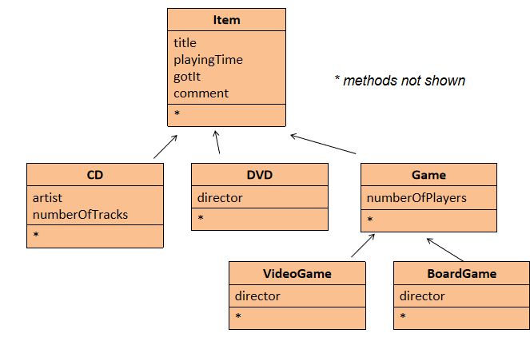
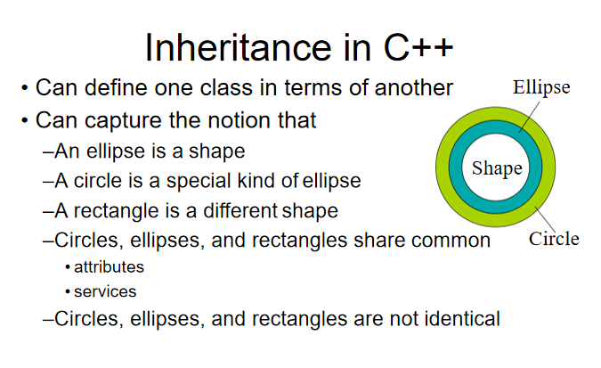
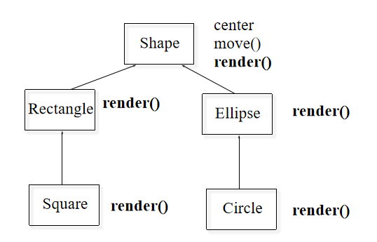
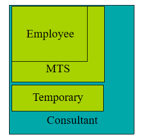
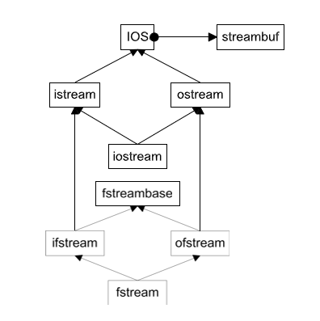

# Lecture5: Inheritance

## 一、简介

本节课主要讲了两种重要机制：**继承（Inheritance）**和**组合（Composition）**。

还讲解了C++里头的**内联函数（Inline Functions）**、**标准模板库（STL）**的基本概念和使用场景。


## 二、内联函数（Inline Functions）

### 1. 内联函数的基本概念

- **定义**：内联函数是一种在调用处直接展开函数体的函数，类似于预处理器宏，但消除了函数调用的开销。
- **目的**：减少函数调用带来的额外开销（如参数压栈、返回地址推送等），从而提高程序执行效率。

#### 1.1 函数调用的开销

函数调用涉及以下步骤，这些步骤会增加执行时间：

- 推送参数（Push parameters）
- 推送返回地址（Push return address）
- 准备返回值（Prepare return values）
- 弹出所有推送的内容（Pop all pushed）

#### 1.2 内联函数的工作原理

内联函数通过在调用点直接插入函数体代码来避免上述开销。例如：

```cpp
int f(int i) { return i * 2; }
int main() {
    int a = 4;
    int b = f(a); // 普通函数调用
}
```

使用内联函数后：

```cpp
inline int f(int i) { return i * 2; }
int main() {
    int a = 4;
    int b = f(a); // 展开为 b = a * 2;
}
```

展开后等价于：

```cpp
int main() {
    int a = 4;
    int b = a + a; // 无函数调用开销
}
```


### 2. 内联函数的实现

- **语法**：在函数定义前添加`inline`关键字。
- **放置位置**：内联函数的定义必须放在头文件中，以便在多个源文件中使用。
- **特点**：
    - 内联函数的定义不会生成独立的`.obj`文件代码，而是作为声明存在。
    - 不必担心多重定义问题，因为内联函数没有独立的函数体。

示例：

```cpp
inline int plusOne(int x) { return ++x; }
```

#### 2.1 在头文件中定义

```cpp
// header.h
inline int f(int i) { return i * 2; }

// main.cpp
#include "header.h"
int main() {
    int a = 4;
    printf("%d", f(a)); // 输出 8
}
```

### 3. 内联函数的优缺点

#### 3.1 优点

- **性能提升**：消除函数调用开销，适合小型、频繁调用的函数。
- **类型安全**：相比C语言中的宏（如`#define f(a) (a)+(a)`），内联函数会检查参数类型。

示例（宏的问题）：

```cpp
#define f(a) (a)+(a)
int main() {
    double a = 4;
    printf("%d", f(a)); // 类型不匹配，可能导致错误
}
```

内联函数改进：

```cpp
inline int f(int i) { return i * 2; }
int main() {
    double a = 4;
    printf("%d", f(a)); // 类型检查，避免错误
}
```

#### 3.2 缺点

- **代码膨胀**：函数体在每个调用点展开，可能增加代码体积。
- **编译器限制**：
    - 编译器可能忽略`inline`请求（例如函数过大或递归）。
    - 递归函数无法内联。


### 4. 内联函数的使用场景

#### 4.1 建议内联的情况

- **小型函数**：2-3行代码。
- **频繁调用**：如循环中的函数。

#### 4.2 不建议内联的情况

- **大型函数**：超过20行。
- **递归函数**：无法展开。

#### 4.3 懒人方法

- **全内联**：所有函数都声明为`inline`。
- **全不内联**：完全避免使用`inline`。


### 5. 类中的内联函数

- **自动内联**：在类声明中定义的成员函数默认是内联的。

示例：

```cpp
class Cup {
    int color;
public:
    int getColor() { return color; } // 自动内联
    void setColor(int color) { this->color = color; } // 自动内联
};
```

- **外部定义**：如果在类外定义内联函数，必须在定义前加`inline`，且定义需在调用前，保持接口清晰。

示例（避免混乱）：

```cpp
class Cup {
    int color;
public:
    int getColor();
    void setColor(int color);
};

inline int Cup::getColor() { return color; }
inline void Cup::setColor(int color) { this->color = color; }
```


## 三、继承（Inheritance）

### 1. 继承的基本概念

- **定义**：继承允许一个类（派生类/子类）从另一个类（基类/父类）继承属性和方法。
- **目的**：实现代码复用，扩展功能。
- **关系**：派生类与基类之间是“Is-A”关系（例如，“学生是人”）。

```cpp
class Base {
    // 基类定义
};

class Derived : public Base {
    // 派生类定义
};
```

> `public`表示公有继承（还有`protected`和`private`继承）。


### 2. 继承的特性

#### 2.1 构造函数与析构函数

- **构造顺序**：**基类构造函数**先于**派生类调用**。
- **析构顺序**：**派生类析构函数**先于**基类调用**。
- **默认调用**：如果不显式调用基类构造函数，会调用基类的**默认构造函数**。

示例：

```cpp
class Employee {
protected:
    std::string m_name, m_ssn;
public:
    Employee(const std::string& name, const std::string& ssn)
        : m_name(name), m_ssn(ssn) {}
};

class Manager : public Employee {
private:
    std::string m_title;
public:
    Manager(const std::string& name, const std::string& ssn, const std::string& title)
        : Employee(name, ssn), m_title(title) {}
};
```

#### 2.2 访问控制

| 访问级别   | 基类中定义 | 派生类访问 | 外部访问 |
||||-|
| **public**   | 可见       | 可见       | 可见     |
| **protected**| 可见       | 可见       | 不可见   |
| **private**  | 可见       | 不可见     | 不可见   |

- **继承类型影响**：

    - **公有继承**：基类的`public`和`protected`成员在派生类中保持原访问级别。
    - **保护继承**：基类的`public`和`protected`变为`protected`。
    - **私有继承**：基类的`public`和`protected`变为`private`。

#### 2.3 名称隐藏（Name Hiding）

如果派生类重新定义基类的函数，所有基类中同名的重载函数将被隐藏。

示例：

```cpp
class Employee {
public:
    void print(std::ostream& out) const;
    void print(std::ostream& out, const std::string& msg) const;
};

class Manager : public Employee {
public:
    void print(std::ostream& out) const; // 隐藏基类的两个print
};
```

在默认情况下，通过` Manager `对象只能直接调用` Manager `类自己定义的` print `函数。 基类 `Employee` 中的两个 `print` 函数都被隐藏了，无法通过 `Manager` 对象直接使用。

> 那么基类的 print 函数彻底不能用了吗？
> 
> 不是的！如果你确实需要调用基类中的 `print` 函数，可以通过显式指定基类名来绕过名称隐藏。例如：
> ```
> Manager m;
> m.Employee::print(std::cout);
> m.Employee::print(std::cout, "Hello");
> ```


#### 2.4 不被继承的内容

- **构造函数**
- **析构函数**
- **赋值操作符（operator =）**
- **私有数据**：存在但不可直接访问。

#### 2.5 公共继承与替代性

**公共继承的替代性原则**：

- 如果 `B` 是 `A`（`B` 是 `A` 的子类），那么在任何需要 `A` 的地方都可以使用 `B`。
- 一切对 `A` 成立的属性和行为，对 `B` 也必须成立。
- **注意**：如果替代性不成立（即 `B` 不能完全替代 `A`），需要谨慎设计继承关系，以免导致逻辑错误。

### 3. 继承的应用示例

#### 3.1 **DoME**（Database of Multimedia Entertainment）

这里以简化版的存储CD和DVD信息为例。



- **问题**：CD和DVD类有大量重复代码。
- **解决方案**：使用继承定义通用基类`Item`。

类层次：

```cpp
class Item {
protected:
    std::string title, comment;
    int playingTime;
    bool gotIt;
public:
    void print();
};

class CD : public Item {
private:
    std::string artist;
    int numberOfTracks;
};

class DVD : public Item {
private:
    std::string director;
};
```

#### 3.2 绘图



- 基类 `Shape`

```cpp
class XYPos {...}; // 表示 x, y 坐标的类
class Shape {
public:
    Shape();
    virtual ~Shape(); // 虚析构函数
    virtual void render(); // 虚函数：绘制
    void move(const XYPos&); // 非虚函数：移动
    virtual void resize(); // 虚函数：调整大小
protected:
    XYPos center; // 中心点坐标
};
```

- 派生类 `Ellipse`

```cpp
class Ellipse : public Shape {
public:
    Ellipse(float maj, float minr); // 构造函数，接收长轴和短轴
    virtual void render(); // 重写绘制函数
protected:
    float major_axis, minor_axis; // 长轴和短轴
};
```

- 派生类 `Circle`

```cpp
class Circle : public Ellipse {
public:
    Circle(float radius) : Ellipse(radius, radius) {} // 调用基类构造函数
    virtual void render(); // 重写绘制函数
private:
    double area; //面积
};
```



- 使用示例

```cpp
void render(Shape* p) {
    p->render(); // 调用正确的 render 函数（动态绑定）
}

void func() {
    Ellipse ell(10, 20);
    Circle circ(40);
    ell.render(); // 调用 Ellipse::render()
    circ.render(); // 调用 Circle::render()
    render(&ell); // 调用 Ellipse::render()
    render(&circ); // 调用 Circle::render()
    // render(Shape* p)使用指针调用 render()，
    // 通过虚函数机制实现动态绑定，调用对象的实际类型对应的render函数。
}
```

### 4. 多态性（Polymorphism）

#### 4.1 上转型（Upcasting）

- **定义**：将一个**派生类（子类）的对象**视为它的**基类（父类）对象**。
- **应用**：在编程中，上转型通常表现为：将派生类对象的指针或引用赋值给基类类型的指针或引用。
- **示例**：“学生是人”。学生是人的一个具体类型（派生类），人是一个更一般的类型（基类）。你可以把一个学生看作是一个人，因为学生具备人的一切基本特征。

```cpp
// Manager 是 Employee 的派生类
Manager Wen("Wen", "444-55-6666", "ZJU");
Employee* ep = &Wen; // 上转型
ep->print(std::cout);
// 调用基类版本，也就是说：
// 调用ep->print(cout);时，会调用基类Employee的print函数，而不是Manager的版本。
```

- **优缺点**：是安全的，因为派生类包含基类的所有属性和行为；但会丢失派生类的特定类型信息。

#### 4.2 虚函数（Virtual Functions）

- **非虚函数**：**静态绑定**，调用**类型已知**的函数，执行速度快。
- **虚函数**：**动态绑定**，根据**对象实际类型**调用函数。
- **纯虚函数**：没有具体实现的函数声明，目的是为**派生类（子类）提供一个必须实现的接口**。

示例：

```cpp
class Shape {
public:
    // 这是一个纯虚函数，用 = 0 标记，表示它没有实现体，派生类必须去具体实现它
    virtual void render() = 0; 
    // 这是一个普通的虚函数，没有 = 0，说明它可以有默认实现（尽管这里没有提供具体实现）
    virtual void resize();  
    // 这是一个普通的成员函数，不是虚函数，调用时会根据指针或引用的静态类型（而不是对象的实际类型）决定使用哪个版本。
    void move(const XYPos&);
protected:
    XYPos center;
};

class Ellipse : public Shape {
public:
    // 重写了基类的纯虚函数 render
    void render() override;
protected:
    float major_axis, minor_axis;
};
```

- **虚函数表**（vtable）

C++ 使用**虚函数表（vtable）**实现动态绑定：

    - 每个类有一个虚函数表，存储该类的虚函数地址。
    - 每个对象包含一个指向其虚函数表的指针（vptr）。
    - 当调用虚函数时，程序通过 vptr 查找 vtable，调用对应的函数。

**示例**：在方才绘图的例子中：

- `Shape` 类的 vtable 包含：
    - `Shape::~Shape()`
    - `Shape::render()`
    - `Shape::resize()`
- `Ellipse` 类的 vtable 包含：
    - `Ellipse::~Ellipse()`
    - `Ellipse::render()`
    - `Shape::resize()`（未重写，继承基类的实现）
- `Circle` 类的 vtable 包含：
    - `Circle::~Circle()`
    - `Circle::render()`
    - `Circle::resize()`
    - `Circle::radius()`

- **虚析构函数**

为什么需要虚析构函数？

如果基类的析构函数不是虚函数，删除基类指针时只会调用基类的析构函数，可能导致派生类资源未被正确释放。

声明基类的析构函数为 `virtual`，确保删除基类指针时调用派生类的析构函数。

```cpp
Shape* p = new Ellipse(100, 200);
delete p; // 如果 ~Shape() 是虚函数，调用 Ellipse::~Ellipse()
```

#### 4.3 抽象基类（Abstract Base Class, ABC）

- **定义**：包含纯虚函数（`virtual ... = 0`）的类，不能实例化（由于抽象基类中存在未实现的纯虚函数，直接创建抽象基类的对象会导致编译错误）。
- **用途**：定义接口，强制派生类实现。


## 四、组合（Composition）

### 1. 组合的基本概念

- **定义**：通过将对象嵌入另一个对象实现复用。
- **关系**：组合表达的是 “Has-A”关系，即一个对象“拥有”另一个对象作为其组成部分。例如，“汽车有引擎”：Car 类可以通过包含一个 Engine 类的对象来表示汽车的引擎部分。

示例：

```cpp
class Engine {
    // 引擎定义
};

class Car {
    Engine engine; // 组合
};
```

### 2. 组合的特性

- **构造顺序**：嵌入对象先构造。例如，在创建 `Car` 对象时，`Engine` 对象的构造函数会先被调用。
- **析构顺序**：嵌入对象后析构。例如，当 Car 对象销毁时，Engine 对象的析构函数会在 Car 的析构函数之后调用（与构造顺序相反）。
- **访问**：通过包含类的接口访问嵌入对象。（嵌入对象通常是 `private` 或 `protected`，以封装实现细节）如果需要外部访问嵌入对象的接口，可以通过包含类的公共方法间接调用。

示例（Savings & Account）：

```cpp
class Person { ... };
class Currency { ... };

class SavingsAccount {
private:
    Person m_saver;
    Currency m_balance;
public:
    SavingsAccount(const char* name, const char* address, int cents)
        : m_saver(name, address), m_balance(0, cents) {}
    void print() {
        m_saver.print();
        m_balance.print();
    }
};
```


## 五、对象切片（Object Slicing）

### 1. 对象切片现象

当将派生类对象赋值给基类对象时，会发生**对象切片**：

- 只有基类的部分被复制，派生类的额外数据被丢弃。
- 虚函数表（vtable）也被替换为基类的 vtable。

**示例**：
```cpp
Ellipse elly(20, 40);
Circle circ(60);
elly = circ; // 对象切片
```

**结果**：

- `circ` 的 `area` 属性被切掉，只复制了 `Ellipse` 类部分的成员。
- `elly` 的 vtable 是 `Ellipse` 的 vtable，调用 `elly.render()` 会执行 `Ellipse::render()`。

### 2. 使用指针或引用避免切片

使用指针或引用可以避免对象切片：

```cpp
Ellipse* elly = new Ellipse(20, 40);
Circle* circ = new Circle(60);
elly = circ;    // 指针赋值
elly->render(); // 调用 Circle::render()
```

**说明**：指针或引用保留了对象的实际类型，调用虚函数时会执行正确的版本。（上面的例子调用`Circle::render()`）

### 3. 引用参数的行为

引用参数类似于指针，调用虚函数时会根据对象的实际类型进行动态绑定：

```cpp
void func(Ellipse& elly) {
    elly.render();
}
Circle circ(60);
func(circ); // 调用 Circle::render()
```

## 六、函数重写与虚函数

### 1. 重写的定义

实际上前面已经涉及到了，所谓**重写（Overriding）**，就是指在派生类中重新定义基类的虚函数，提供新的实现：

```cpp
// 基类
class Base {
public:
    virtual void func() { cout << "Base::func()"; }
};
// 派生类
class Derived : public Base {
public:
    virtual void func() override { // 使用 override 关键字明确重写
        cout << "Derived::func!";
        Base::func(); // 调用基类版本
    }
};
```

**注意**：重写函数可以调用基类的版本，增加新功能而无需重复基类的代码。

在 C++ 中，虚函数（Virtual Function）是支持动态绑定（Dynamic Binding）的函数，用于实现多态。而当基类定义了多个同名虚函数（即重载的虚函数），派生类在重写（override）这些虚函数时，必须小心处理所有重载版本，否则可能导致未重写的版本被隐藏，从而引发意外行为。

比如下面这个代码：

```cpp
class Base {
public:
    virtual void func() { std::cout << "Base::func()" << std::endl; }
    virtual void func(int x) { std::cout << "Base::func(int)" << std::endl; }
};

class Derived : public Base {
public:
    virtual void func() override { // 只重写了无参数版本
        std::cout << "Derived::func()" << std::endl;
        Base::func(); // 调用基类的 func()
    }
};

int main() {
    Derived d;
    // 调用 Derived::func()
    d.func();      
    // 编译器报错：no matching function for call to 'Derived::func(int)'
    d.func(5);     
    // 显式调用基类的 func(int)
    d.Base::func(5);
}
```

### 2. 返回类型放宽

在现代 C++ 中，派生类的虚函数可以返回基类虚函数返回类型的子类（适用于指针或引用类型）：

```cpp
class Expr {
public:
    virtual Expr* newExpr();
    virtual Expr& clone();
    virtual Expr self();
};
class BinaryExpr : public Expr {
public:
    virtual BinaryExpr* newExpr(); // 合法
    virtual BinaryExpr& clone();   // 合法
    virtual BinaryExpr self();     // 错误：返回类型不是指针或引用
};
```

## 七、标准模板库（STL）

- **定义**：C++标准库的一部分，提供通用数据结构和算法。
- **组件**：
    - **容器（Containers）**：`vector`、`list`、`map`等。
    - **迭代器（Iterators）**：访问容器元素。
    - **算法（Algorithms）**：排序、搜索等。

- **主要容器**：

    - **vector**：动态数组。
    - **list**：双向链表。
    - **map**：键值对映射。

- **示例**（vector）：

```cpp
#include <vector>
using namespace std;

int main() {
    vector<int> x;
    for (int a = 0; a < 1000; a++) {
        x.push_back(a);
    }
    for (auto p = x.begin(); p != x.end(); p++) {
        cout << *p << " ";
    }
}
```

## 八、多重继承（Multiple Inheritance, MI）

### 1. **多重继承的定义**

**多重继承**是指一个派生类可以同时继承多个基类，从而获得多个基类的属性和行为。

- **特点**：派生类继承了所有基类的成员（数据成员和成员函数），可以“混合”多个基类的功能。
- **在课件中的描述**：多重继承允许“混搭”（Mix and Match）不同基类的特性，例如一个类可以同时具有 `Employee` 和 `Temporary` 的属性。

#### **语法示例**：

```cpp
class Employee {
protected:
    string name;
    EmpID id;
};

class MTS : public Employee {
protected:
    Degrees degree_info;
};

class Temporary {
protected:
    Company employer;
};

class Consultant : public MTS, public Temporary {};
```



**具体分析**：`Consultant` 继承了 `MTS` 和 `Temporary`，因此拥有：

    - `Employee` 的成员：`name` 和 `id`（通过 `MTS` 继承）。
    - `MTS` 的成员：`degree_info`。
    - `Temporary` 的成员：`employer`。

这体现了多重继承的“混合”能力：`Consultant` 是一个既是 `MTS`（技术专家）又是 `Temporary`（临时工）的类。

#### **类关系**：

- 多重继承仍然遵循 **Is-A** 关系：

    - `Consultant` 是 `MTS`（技术专家）。
    - `Consultant` 是 `Temporary`（临时工）。

- 但多重继承引入了更复杂的数据布局和潜在问题，需要谨慎设计。

### 2. **多重继承的数据布局**

多重继承会影响对象的内存布局，因为派生类需要容纳多个基类的成员。

#### **数据布局问题示例**：

多重继承会“复杂化数据布局”（MI Complicates Data Layouts），这里来一个示例：

```cpp
class B1 { int m_i; };
class D1 : public B1 {};
class D2 : public B1 {};
class M : public D1, public D2 {};
```

**内存布局**：

`M` 包含两个 `B1` 的副本：

- `D1::B1.m_i`：来自 `D1` 的 `B1` 部分。
- `D2::B1.m_i`：来自 `D2` 的 `B1` 部分。

**问题**：访问 `m.m_i` 会导致歧义，因为编译器无法确定使用哪个 `B1` 的 `m_i`。

**代码示例**：
```cpp
void main() {
    M m;
    m.m_i++; // 错误！歧义：D1::B1.m_i 还是 D2::B1.m_i？
    B1* p = new M; // 错误！无法确定指向哪个 B1。
    B1* p2 = dynamic_cast<D1*>(new M); // 正确：明确指向 D1 的 B1 部分。
}
```

- **歧义**：`M` 中有两个 `B1` 子对象，导致访问 `m_i` 时需要明确指定作用域（如 `m.D1::m_i`）。
- **转换问题**：将 `M*` 转换为 `B1*` 会失败，因为编译器不知道选择 `D1` 的 `B1` 还是 `D2` 的 `B1`。
- **解决方法**：使用 `dynamic_cast` 指定具体路径，或者使用虚拟基类（后文详述）。

#### 复制基类（Replicated Bases）：

- 复制基类通常不是问题，因为 `D1` 和 `D2` 使用 `B1` 是实现细节。
- 但如果复制导致逻辑混乱（例如，两个 `m_i` 值的语义不一致），需要特别注意。


### 3. **虚拟基类（Virtual Base Classes）**

为了解决多重继承中基类被多次复制的问题，C++ 提供了**虚拟基类**（Virtual Base Class），确保派生类中只有一个基类副本。

#### **虚拟基类示例**：
```cpp
class B1 { int m_i; };
// virtual
class D1 : virtual public B1 {};
class D2 : virtual public B1 {};
class M : public D1, public D2 {};

void main() {
    M m;
    m.m_i++; // 正确：只有一个 B1 的 m_i
    B1* p = new M; // 正确：只有一个 B1
}
```

**关键点**：

- 使用 `virtual` 关键字声明继承（如 `class D1 : virtual public B1`）。
- `M` 中只有一个 `B1` 子对象，消除了歧义。
- 访问 `m.m_i` 或将 `M*` 转换为 `B1*` 都是合法的。

#### **虚拟基类的实现**：

- **间接表示**：虚拟基类通过指针间接表示。
- 编译器在派生类中维护一个指向虚拟基类的指针（或偏移量），确保所有派生类共享同一个基类实例。
- **构造顺序**：虚拟基类由最底层的派生类（如 `M`）负责构造，而不是中间类（如 `D1` 或 `D2`）。

#### **代价**：

- **运行时开销**：虚拟基类引入指针间接，增加内存和性能开销。
- **复杂性**：
    - 虚拟基类的构造函数可能被多次调用（如果不小心设计）。
    - 构造顺序复杂：虚拟基类优先于非虚拟基类构造，由最底层的派生类调用。

#### **建议**：

不要使用.jpg

### 4. **协议/接口类（Protocol/Interface Classes）**

课件提到协议类作为多重继承的一种安全用法，特别适合定义接口。

#### **协议类的定义**：

- **特性**：

    - 所有非静态成员函数是**纯虚函数**（`= 0`），除了析构函数。
    - 虚析构函数为空（`virtual ~ClassName() {}`）。
    - 无非静态数据成员（只可能有静态成员）。

- **作用**：定义标准接口，派生类实现具体功能。

#### Unix 字符设备接口

```cpp
class CDevice {
public:
    virtual ~CDevice();
    virtual int read(...) = 0;
    virtual int write(...) = 0;
    virtual int open(...) = 0;
    virtual int close(...) = 0;
    virtual int ioctl(...) = 0;
};
```

**分析**：

- `CDevice` 是一个纯抽象类（接口），没有数据成员，只有纯虚函数。
- 派生类（如具体的设备驱动）实现这些函数，提供具体功能。
- **适合多重继承**：因为协议类不包含数据成员，复制多个副本不会导致数据冗余或歧义。

#### **为什么安全？**

- 协议类没有非静态数据成员，复制基类不会导致内存浪费或逻辑问题。
- 抽象基类（如协议类）可以安全复制，无需虚拟基类。


### 5. **多重继承的实际应用：IOStreams 包**

以 C++ 标准库的 `iostream` 包为例。



#### **IOStreams 的类层次**：
- **基类**：`ios`，管理流状态（如错误标志、格式化选项）。
- **派生类**：
    - `istream`：继承 `ios`，处理输入流，关联一个 `streambuf`（缓冲区）。
    - `ostream`：继承 `ios`，处理输出流，关联一个 `streambuf`。
    - `iostream`：继承 `istream` 和 `ostream`，支持双向流。

#### **问题：复制 `streambuf`**

- 如果 `istream` 和 `ostream` 直接继承 `ios`，`iostream` 会包含两个 `ios` 和两个 `streambuf` 副本。
- **后果**：两个 `streambuf` 可能导致数据不一致（如输入和输出缓冲区不同步）。

#### **解决方案：虚拟继承**：

```cpp
class ios { /* 流状态 */ };
class istream : virtual public ios { /* 输入流 */ };
class ostream : virtual public ios { /* 输出流 */ };
class iostream : public istream, public ostream {};
```

**效果**：
- 使用 `virtual public ios` 确保 `iostream` 中只有一个 `ios` 和 `streambuf` 副本。
- 避免了数据冗余和逻辑混乱。

### 6. **多重继承的复杂性与注意事项**

课件在“Complications of MI”部分列出了多重继承的潜在问题，并提供了避免复杂性的建议。

#### **复杂性**：
1. **代码重复调用**：
      - 虚拟基类的构造函数可能被多次调用（如果设计不当）。
      - 例如，`M` 构造时，`B1` 的构造函数由 `M` 直接调用，而不是 `D1` 或 `D2`。

2. **名称冲突**：
      - 不同基类的同名成员可能冲突。
      - **解决方法**：使用**支配规则**（Dominance Rule）或显式限定（如 `D1::m_i`）。

3. **构造顺序**：
      - 虚拟基类的构造由最底层的派生类负责，可能导致初始化顺序难以预测。
      - 非虚拟基类按声明顺序构造，虚拟基类优先构造。

4. **编译器实现差异**：
      - 课件提到“编译器对虚拟基类的支持仍不完善”（Compilers are still iffy），可能导致实现依赖性。

#### **建议**：

- **谨慎使用多重继承**：避免不必要的复杂性。
- **避免菱形继承**：菱形继承（如 `ios` 示例）容易导致复制或逻辑问题。
- **优先使用协议类**：协议类无数据成员，适合多重继承。
- **选择性使用虚拟基类**：
    - 如果复制基类无害（如协议类），无需虚拟继承。
    - 如果需要共享基类实例（如 `iostream` 的 `streambuf`），使用虚拟继承。


**替代方案**：

- **组合（Composition）**：通过包含对象代替继承（如 `Consultant` 包含 `MTS` 和 `Temporary` 的实例）。
- **接口（Protocol Classes）**：使用纯虚函数定义接口，减少数据成员问题。

## 九、继承与组合的简单对比

- 继承（Inheritance）：表示“Is-A”关系，例如“学生是人”（`Student` 是 `Person` 的子类）。
- 组合（Composition）：表示“Has-A”关系，例如“汽车有引擎”（`Car` 包含一个 `Engine` 实例）。