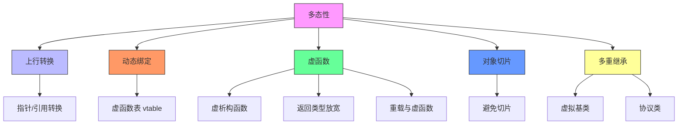
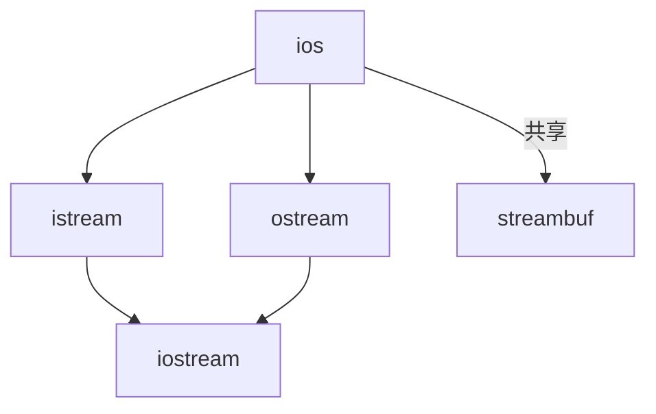
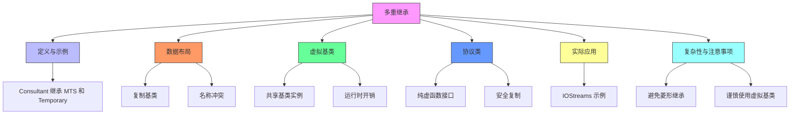

# 面向对象程序设计 - 第7讲：多态性

## 一、多态性与继承基础

### 1. 继承的概念

**定义**：继承是指一个类（子类/派生类）能够以另一个类（基类/父类）为基础，定义其行为或实现，形成一个“超集”关系。  
- **类关系**：继承体现了一种 **Is-A** 关系。例如：
  - `Student` 是 `Person`。
  - `Manager` 是 `Employee`。
- **术语**：
  - **基类（Base Class）**：也称为超类（Super Class）或父类（Parent Class）。
  - **派生类（Derived Class）**：也称为子类（Sub Class）或子类（Child Class）。

!!! example "继承示例"
    ```cpp
    class Person {};
    class Student : public Person {};
    class Employee {};
    class Manager : public Employee {};
    ```

### 2. 公共继承与替代性

**公共继承的替代性原则**：
- 如果 `B` 是 `A`（`B` 是 `A` 的子类），那么在任何需要 `A` 的地方都可以使用 `B`。
- 一切对 `A` 成立的属性和行为，对 `B` 也必须成立。
- **注意**：如果替代性不成立（即 `B` 不能完全替代 `A`），需要谨慎设计继承关系，以免导致逻辑错误。

---

## 二、上行转换（Upcasting）

### 1. 上行转换定义

**上行转换（Upcasting）**是指将派生类的引用或指针转换为基类的引用或指针的过程。  
- **特点**：
  - 这是安全的，因为派生类包含基类的所有属性和行为。
  - 但会丢失派生类的特定类型信息。

### 2. 上行转换示例

```cpp
Manager pete("Pete", "444-55-6666", "Bakery");
Employee* ep = &pete; // 上行转换：Manager* 转为 Employee*
Employee& er = pete;  // 上行转换：Manager& 转为 Employee&
```

**结果**：
- 调用 `ep->print(cout);` 时，会调用基类 `Employee` 的 `print` 函数，而不是 `Manager` 的版本。
- 这是因为上行转换后，编译器只知道 `ep` 是 `Employee` 类型，丢失了 `Manager` 的具体信息。

---

## 三、绘制程序示例

### 1. 绘制程序的类层次结构

以一个绘制程序为例，展示继承和多态的应用：
- **基类**：`Shape` 定义通用属性和行为。
- **派生类**：
  - `Ellipse`：椭圆，继承自 `Shape`。
  - `Circle`：圆，继承自 `Ellipse`（但课件中指出这是一个**不佳的设计选择**，因为圆和椭圆的几何性质不完全兼容）。
  - `Rectangle`：矩形，继承自 `Shape`。
  - `Square`：正方形，继承自 `Rectangle`。

**操作**：
- `render()`：绘制图形。
- `move()`：移动图形位置。
- `resize()`：调整图形大小。

**数据**：
- 所有形状共享一个中心点 `center`。

### 2. 代码示例

#### 基类 `Shape`
```cpp
class XYPos {...}; // 表示 x, y 坐标的类
class Shape {
public:
    Shape();
    virtual ~Shape(); // 虚析构函数
    virtual void render(); // 虚函数：绘制
    void move(const XYPos&); // 非虚函数：移动
    virtual void resize(); // 虚函数：调整大小
protected:
    XYPos center; // 中心点坐标
};
```

#### 派生类 `Ellipse`
```cpp
class Ellipse : public Shape {
public:
    Ellipse(float maj, float minr); // 构造函数，接收长轴和短轴
    virtual void render(); // 重写绘制函数
protected:
    float major_axis, minor_axis; // 长轴和短轴
};
```

#### 派生类 `Circle`
```cpp
class Circle : public Ellipse {
public:
    Circle(float radius) : Ellipse(radius, radius) {} // 调用基类构造函数
    virtual void render(); // 重写绘制函数
};
```

#### 使用示例
```cpp
void render(Shape* p) {
    p->render(); // 调用正确的 render 函数（动态绑定）
}

void func() {
    Ellipse ell(10, 20);
    Circle circ(40);
    ell.render(); // 调用 Ellipse::render()
    circ.render(); // 调用 Circle::render()
    render(&ell); // 调用 Ellipse::render()
    render(&circ); // 调用 Circle::render()
}
```

**说明**：
- `render(Shape* p)` 使用指针调用 `render()`，通过虚函数机制实现动态绑定，调用对象的实际类型对应的 `render` 函数。

---

## 四、多态性

### 1. 多态性的定义

**多态性**是指通过基类指针或引用调用派生类对象时，能够根据对象的实际类型执行正确的函数版本。  
- **关键机制**：
  - **上行转换**：将派生类对象视为基类对象。
  - **动态绑定**：在运行时根据对象的实际类型选择要调用的函数。

### 2. 静态绑定与动态绑定

- **静态绑定**：在编译时确定要调用的函数，基于变量的声明类型。
- **动态绑定**：在运行时根据对象的实际类型确定要调用的函数，依赖于虚函数机制。

---

## 五、C++ 中的虚函数机制

### 1. 虚函数表（vtable）

C++ 使用**虚函数表（vtable）**实现动态绑定：
- 每个类有一个虚函数表，存储该类的虚函数地址。
- 每个对象包含一个指向其虚函数表的指针（vptr）。
- 当调用虚函数时，程序通过 vptr 查找 vtable，调用对应的函数。

**示例**：
- `Shape` 类的 vtable 包含：
  - `Shape::~Shape()`
  - `Shape::render()`
  - `Shape::resize()`
- `Ellipse` 类的 vtable 包含：
  - `Ellipse::~Ellipse()`
  - `Ellipse::render()`
  - `Shape::resize()`（未重写，继承基类的实现）
- `Circle` 类的 vtable 包含：
  - `Circle::~Circle()`
  - `Circle::render()`
  - `Circle::resize()`
  - `Circle::radius()`

### 2. 虚析构函数

**为什么需要虚析构函数**：
- 如果基类的析构函数不是虚函数，删除基类指针时只会调用基类的析构函数，可能导致派生类资源未被正确释放。
- 声明基类的析构函数为 `virtual`，确保删除基类指针时调用派生类的析构函数。

```cpp
Shape* p = new Ellipse(100.0f, 200.0f);
delete p; // 如果 ~Shape() 是虚函数，调用 Ellipse::~Ellipse()
```

---

## 六、对象切片（Object Slicing）

### 1. 对象切片现象

当将派生类对象赋值给基类对象时，会发生**对象切片**：
- 只有基类的部分被复制，派生类的额外数据被丢弃。
- 虚函数表（vtable）也被替换为基类的 vtable。

**示例**：
```cpp
Ellipse elly(20.0f, 40.0f);
Circle circ(60.0f);
elly = circ; // 对象切片
```

**结果**：
- `circ` 的 `area` 属性被切掉，只复制了 `Ellipse` 部分的成员。
- `elly` 的 vtable 是 `Ellipse` 的 vtable，调用 `elly.render()` 会执行 `Ellipse::render()`。

### 2. 使用指针或引用避免切片

使用指针或引用可以避免对象切片：
```cpp
Ellipse* elly = new Ellipse(20.0f, 40.0f);
Circle* circ = new Circle(60.0f);
elly = circ; // 指针赋值
elly->render(); // 调用 Circle::render()
```

**说明**：
- 指针或引用保留了对象的实际类型，调用虚函数时会执行正确的版本。

### 3. 引用参数的行为

引用参数类似于指针，调用虚函数时会根据对象的实际类型进行动态绑定：
```cpp
void func(Ellipse& elly) {
    elly.render();
}
Circle circ(60.0f);
func(circ); // 调用 Circle::render()
```

---

## 七、函数重写（Overriding）

### 1. 重写的定义

**重写（Overriding）**是指在派生类中重新定义基类的虚函数，提供新的实现：
```cpp
class Base {
public:
    virtual void func() { cout << "Base::func()"; }
};
class Derived : public Base {
public:
    virtual void func() override { // 使用 override 关键字明确重写
        cout << "Derived::func!";
        Base::func(); // 调用基类版本
    }
};
```

**注意**：
- 重写函数可以调用基类的版本，增加新功能而无需重复基类的代码。

### 2. 返回类型放宽

在现代 C++ 中，派生类的虚函数可以返回基类虚函数返回类型的子类（适用于指针或引用类型）：
```cpp
class Expr {
public:
    virtual Expr* newExpr();
    virtual Expr& clone();
    virtual Expr self();
};
class BinaryExpr : public Expr {
public:
    virtual BinaryExpr* newExpr(); // 合法
    virtual BinaryExpr& clone();   // 合法
    virtual BinaryExpr self();    // 错误：返回类型不是指针或引用
};
```

---

## 八、函数重载与虚函数

### 1. 重载与虚函数

当基类定义了多个同名虚函数（重载），派生类必须重写所有版本，否则未重写的版本会被隐藏：
```cpp
class Base {
public:
    virtual void func();
    virtual void func(int);
};
class Derived : public Base {
public:
    virtual void func() override { Base::func(); }
    virtual void func(int) override { /* 新实现 */ }
};
```

**注意**：
- 如果只重写部分版本，其他版本会被隐藏，可能导致意外行为。

---

## 九、继承中的注意事项

### 1. 避免重定义非虚函数

**非虚函数**是静态绑定的，派生类重定义非虚函数不会实现动态分派：
- **建议**：不要重定义继承的非虚函数。

### 2. 避免重定义默认参数

默认参数是静态绑定的，重定义可能导致不一致的行为：
- **建议**：不要在派生类中重定义继承的默认参数值。

### 3. 构造函数中的虚函数

在构造函数中调用虚函数时，不会触发动态绑定：
```cpp
class A {
public:
    A() { f(); } // 调用 A::f()
    virtual void f() { cout << "A::f()"; }
};
class B : public A {
public:
    B() { f(); } // 调用 B::f()
    void f() override { cout << "B::f()"; }
};
```

**原因**：
- 在构造 `B` 时，先构造 `A`，此时对象类型为 `A`，调用 `A::f()`。
- 只有在对象完全构造后，虚函数才会动态绑定。

---

## 十、多重继承（Multiple Inheritance, MI）

### 1. 多重继承的定义

**多重继承**允许一个类同时继承多个基类：
```cpp
class Employee {
protected:
    string name;
    EmpID id;
};
class MTS : public Employee {
protected:
    Degrees degree_info;
};
class Temporary {
protected:
    Company employer;
};
class Consultant : public MTS, public Temporary {};
```

**特点**：
- `Consultant` 继承了 `MTS` 和 `Temporary` 的所有属性（如 `name`、`id`、`degree_info`、`employer`）。

### 2. 数据布局问题

多重继承可能导致数据布局复杂：
- 每个基类的数据成员在派生类中是独立的（复制基类）。
- **问题**：如果多个基类共享同一个基类（如 `Employee`），可能导致数据冗余。

**示例**：
```cpp
class B1 { int m_i; };
class D1 : public B1 {};
class D2 : public B1 {};
class M : public D1, public D2 {};
```

- `M` 中包含两个 `B1` 的副本（`D1::B1.m_i` 和 `D2::B1.m_i`）。
- 访问 `m.m_i` 会导致歧义，需明确指定 `D1::m_i` 或 `D2::m_i`。

**解决方法**：
- 使用 `dynamic_cast`：
  ```cpp
  B1* p2 = dynamic_cast<D1*>(new M); // 明确指向 D1 的 B1 部分
  ```

### 3. 虚拟基类

为了避免基类被多次复制，可以使用**虚拟基类**：
```cpp
class B1 { int m_i; };
class D1 : virtual public B1 {};
class D2 : virtual public B1 {};
class M : public D1, public D2 {};
```

**效果**：
- `M` 中只有一个 `B1` 的副本，`m.m_i` 无歧义。
- 访问 `B1* p = new M;` 是合法的。

**代价**：
- 虚拟基类引入运行时和空间开销（如指针间接）。
- 构造函数顺序复杂，虚拟基类由最底层的派生类构造。

### 4. 多重继承的复杂性

- **代码重复调用**：虚拟基类的代码可能被多次调用。
- **名称冲突**：不同基类的同名成员可能冲突，需通过**支配规则**解决。
- **建议**：
  - 谨慎使用多重继承，避免菱形继承（Diamond Pattern）。
  - 如果基类是抽象类（无数据成员，仅纯虚函数），可以安全复制，无需虚拟基类。

---

## 十一、协议/接口类

### 1. 协议类的定义

**协议类（Interface Class）**是抽象基类，具有以下特点：
- 所有非静态成员函数是**纯虚函数**（除了析构函数）。
- 虚析构函数为空。
- 无非静态数据成员。

**示例**：Unix 字符设备接口
```cpp
class CDevice {
public:
    virtual ~CDevice();
    virtual int read(...) = 0;
    virtual int write(...) = 0;
    virtual int open(...) = 0;
    virtual int close(...) = 0;
    virtual int ioctl(...) = 0;
};
```

**用途**：
- 定义标准接口，派生类实现具体功能。
- 适合多重继承，因为协议类无数据成员，不引入复制问题。

---

## 十二、多重继承的实际应用

### 1. IOStreams 包中的多重继承

C++ 标准库的 `iostream` 使用多重继承：
- `ios` 是基类，包含流状态。
- `istream` 和 `ostream` 分别继承 `ios`，并共享一个 `streambuf`。
- `iostream` 继承 `istream` 和 `ostream`，可能导致两个 `streambuf` 的副本。

**解决方案**：
- 使用**虚拟继承**确保 `ios` 和 `streambuf` 只有一个副本：
  ```cpp
  class istream : virtual public ios {};
  class ostream : virtual public ios {};
  class iostream : public istream, public ostream {};
  ```

---

## 十三、多态性与继承的注意事项

### 1. 避免的问题

- **菱形继承**：导致数据复制或逻辑复杂，尽量避免。
- **虚拟基类的开销**：增加运行时和空间复杂性，仅在必要时使用。
- **名称冲突**：通过明确限定或支配规则解决。

### 2. 最佳实践

- **优先使用单继承**：简单且易于维护。
- **使用协议类**：定义接口，减少多重继承的复杂性。
- **声明虚析构函数**：确保资源正确释放。
- **谨慎重写虚函数**：确保所有重载版本都被覆盖。

---

## 十四、总结图解




# 面向对象程序设计 - 第7讲：多态性

## 一、多态性与继承基础

### 1. 继承的概念

**定义**：继承是指一个类（子类/派生类）能够以另一个类（基类/父类）为基础，定义其行为或实现，形成一个“超集”关系。  
- **类关系**：继承体现了一种 **Is-A** 关系。例如：
  - `Student` 是 `Person`。
  - `Manager` 是 `Employee`。
- **术语**：
  - **基类（Base Class）**：也称为超类（Super Class）或父类（Parent Class）。
  - **派生类（Derived Class）**：也称为子类（Sub Class）或子类（Child Class）。

!!! example "继承示例"
    ```cpp
    class Person {};
    class Student : public Person {};
    class Employee {};
    class Manager : public Employee {};
    ```

### 2. 公共继承与替代性

**公共继承的替代性原则**：
- 如果 `B` 是 `A`（`B` 是 `A` 的子类），那么在任何需要 `A` 的地方都可以使用 `B`。
- 一切对 `A` 成立的属性和行为，对 `B` 也必须成立。
- **注意**：如果替代性不成立（即 `B` 不能完全替代 `A`），需要谨慎设计继承关系，以免导致逻辑错误。

## 二、上行转换（Upcasting）

### 1. 上行转换定义

**上行转换（Upcasting）**是指将派生类的引用或指针转换为基类的引用或指针的过程。  
- **特点**：
  - 这是安全的，因为派生类包含基类的所有属性和行为。
  - 但会丢失派生类的特定类型信息。

### 2. 上行转换示例

```cpp
Manager pete("Pete", "444-55-6666", "Bakery");
Employee* ep = &pete; // 上行转换：Manager* 转为 Employee*
Employee& er = pete;  // 上行转换：Manager& 转为 Employee&
```

**结果**：
- 调用 `ep->print(cout);` 时，会调用基类 `Employee` 的 `print` 函数，而不是 `Manager` 的版本。
- 这是因为上行转换后，编译器只知道 `ep` 是 `Employee` 类型，丢失了 `Manager` 的具体信息。

## 三、绘制程序示例

### 1. 绘制程序的类层次结构

以一个绘制程序为例，展示继承和多态的应用：
- **基类**：`Shape` 定义通用属性和行为。
- **派生类**：
  - `Ellipse`：椭圆，继承自 `Shape`。
  - `Circle`：圆，继承自 `Ellipse`（但课件中指出这是一个**不佳的设计选择**，因为圆和椭圆的几何性质不完全兼容）。
  - `Rectangle`：矩形，继承自 `Shape`。
  - `Square`：正方形，继承自 `Rectangle`。

**操作**：
- `render()`：绘制图形。
- `move()`：移动图形位置。
- `resize()`：调整图形大小。

**数据**：
- 所有形状共享一个中心点 `center`。

### 2. 代码示例

#### 基类 `Shape`
```cpp
class XYPos {...}; // 表示 x, y 坐标的类
class Shape {
public:
    Shape();
    virtual ~Shape(); // 虚析构函数
    virtual void render(); // 虚函数：绘制
    void move(const XYPos&); // 非虚函数：移动
    virtual void resize(); // 虚函数：调整大小
protected:
    XYPos center; // 中心点坐标
};
```

#### 派生类 `Ellipse`
```cpp
class Ellipse : public Shape {
public:
    Ellipse(float maj, float minr); // 构造函数，接收长轴和短轴
    virtual void render(); // 重写绘制函数
protected:
    float major_axis, minor_axis; // 长轴和短轴
};
```

#### 派生类 `Circle`
```cpp
class Circle : public Ellipse {
public:
    Circle(float radius) : Ellipse(radius, radius) {} // 调用基类构造函数
    virtual void render(); // 重写绘制函数
};
```

#### 使用示例
```cpp
void render(Shape* p) {
    p->render(); // 调用正确的 render 函数（动态绑定）
}

void func() {
    Ellipse ell(10, 20);
    Circle circ(40);
    ell.render(); // 调用 Ellipse::render()
    circ.render(); // 调用 Circle::render()
    render(&ell); // 调用 Ellipse::render()
    render(&circ); // 调用 Circle::render()
}
```

**说明**：
- `render(Shape* p)` 使用指针调用 `render()`，通过虚函数机制实现动态绑定，调用对象的实际类型对应的 `render` 函数。

## 四、多态性

### 1. 多态性的定义

**多态性**是指通过基类指针或引用调用派生类对象时，能够根据对象的实际类型执行正确的函数版本。  
- **关键机制**：
  - **上行转换**：将派生类对象视为基类对象。
  - **动态绑定**：在运行时根据对象的实际类型选择要调用的函数。

### 2. 静态绑定与动态绑定

- **静态绑定**：在编译时确定要调用的函数，基于变量的声明类型。
- **动态绑定**：在运行时根据对象的实际类型确定要调用的函数，依赖于虚函数机制。

## 五、C++ 中的虚函数机制

### 1. 虚函数表（vtable）

C++ 使用**虚函数表（vtable）**实现动态绑定：
- 每个类有一个虚函数表，存储该类的虚函数地址。
- 每个对象包含一个指向其虚函数表的指针（vptr）。
- 当调用虚函数时，程序通过 vptr 查找 vtable，调用对应的函数。

**示例**：
- `Shape` 类的 vtable 包含：
  - `Shape::~Shape()`
  - `Shape::render()`
  - `Shape::resize()`
- `Ellipse` 类的 vtable 包含：
  - `Ellipse::~Ellipse()`
  - `Ellipse::render()`
  - `Shape::resize()`（未重写，继承基类的实现）
- `Circle` 类的 vtable 包含：
  - `Circle::~Circle()`
  - `Circle::render()`
  - `Circle::resize()`
  - `Circle::radius()`

### 2. 虚析构函数

**为什么需要虚析构函数**：
- 如果基类的析构函数不是虚函数，删除基类指针时只会调用基类的析构函数，可能导致派生类资源未被正确释放。
- 声明基类的析构函数为 `virtual`，确保删除基类指针时调用派生类的析构函数。

```cpp
Shape* p = new Ellipse(100.0f, 200.0f);
delete p; // 如果 ~Shape() 是虚函数，调用 Ellipse::~Ellipse()
```

## 六、对象切片（Object Slicing）

### 1. 对象切片现象

当将派生类对象赋值给基类对象时，会发生**对象切片**：
- 只有基类的部分被复制，派生类的额外数据被丢弃。
- 虚函数表（vtable）也被替换为基类的 vtable。

**示例**：
```cpp
Ellipse elly(20.0f, 40.0f);
Circle circ(60.0f);
elly = circ; // 对象切片
```

**结果**：
- `circ` 的 `area` 属性被切掉，只复制了 `Ellipse` 部分的成员。
- `elly` 的 vtable 是 `Ellipse` 的 vtable，调用 `elly.render()` 会执行 `Ellipse::render()`。

### 2. 使用指针或引用避免切片

使用指针或引用可以避免对象切片：
```cpp
Ellipse* elly = new Ellipse(20.0f, 40.0f);
Circle* circ = new Circle(60.0f);
elly = circ; // 指针赋值
elly->render(); // 调用 Circle::render()
```

**说明**：
- 指针或引用保留了对象的实际类型，调用虚函数时会执行正确的版本。

### 3. 引用参数的行为

引用参数类似于指针，调用虚函数时会根据对象的实际类型进行动态绑定：
```cpp
void func(Ellipse& elly) {
    elly.render();
}
Circle circ(60.0f);
func(circ); // 调用 Circle::render()
```

## 七、函数重写（Overriding）

### 1. 重写的定义

**重写（Overriding）**是指在派生类中重新定义基类的虚函数，提供新的实现：
```cpp
class Base {
public:
    virtual void func() { cout << "Base::func()"; }
};
class Derived : public Base {
public:
    virtual void func() override { // 使用 override 关键字明确重写
        cout << "Derived::func!";
        Base::func(); // 调用基类版本
    }
};
```

**注意**：
- 重写函数可以调用基类的版本，增加新功能而无需重复基类的代码。

### 2. 返回类型放宽

在现代 C++ 中，派生类的虚函数可以返回基类虚函数返回类型的子类（适用于指针或引用类型）：
```cpp
class Expr {
public:
    virtual Expr* newExpr();
    virtual Expr& clone();
    virtual Expr self();
};
class BinaryExpr : public Expr {
public:
    virtual BinaryExpr* newExpr(); // 合法
    virtual BinaryExpr& clone();   // 合法
    virtual BinaryExpr self();    // 错误：返回类型不是指针或引用
};
```

## 八、函数重载与虚函数

当基类定义了多个同名虚函数（重载），派生类必须重写所有版本，否则未重写的版本会被隐藏：
```cpp
class Base {
public:
    virtual void func();
    virtual void func(int);
};
class Derived : public Base {
public:
    virtual void func() override { Base::func(); }
    virtual void func(int) override { /* 新实现 */ }
};
```

**注意**：如果只重写部分版本，其他版本会被隐藏，可能导致意外行为。

## 九、继承中的注意事项

### 1. 避免重定义非虚函数

**非虚函数**是静态绑定的，派生类重定义非虚函数不会实现动态分派：
- **建议**：不要重定义继承的非虚函数。

### 2. 避免重定义默认参数

默认参数是静态绑定的，重定义可能导致不一致的行为：
- **建议**：不要在派生类中重定义继承的默认参数值。

### 3. 构造函数中的虚函数

在构造函数中调用虚函数时，不会触发动态绑定：
```cpp
class A {
public:
    A() { f(); } // 调用 A::f()
    virtual void f() { cout << "A::f()"; }
};
class B : public A {
public:
    B() { f(); } // 调用 B::f()
    void f() override { cout << "B::f()"; }
};
```

**原因**：
- 在构造 `B` 时，先构造 `A`，此时对象类型为 `A`，调用 `A::f()`。
- 只有在对象完全构造后，虚函数才会动态绑定。

## 十、多重继承（Multiple Inheritance, MI）

### 1. 多重继承的定义

**多重继承**允许一个类同时继承多个基类：
```cpp
class Employee {
protected:
    string name;
    EmpID id;
};
class MTS : public Employee {
protected:
    Degrees degree_info;
};
class Temporary {
protected:
    Company employer;
};
class Consultant : public MTS, public Temporary {};
```

**特点**：
- `Consultant` 继承了 `MTS` 和 `Temporary` 的所有属性（如 `name`、`id`、`degree_info`、`employer`）。

### 2. 数据布局问题

多重继承可能导致数据布局复杂：
- 每个基类的数据成员在派生类中是独立的（复制基类）。
- **问题**：如果多个基类共享同一个基类（如 `Employee`），可能导致数据冗余。

**示例**：
```cpp
class B1 { int m_i; };
class D1 : public B1 {};
class D2 : public B1 {};
class M : public D1, public D2 {};
```

- `M` 中包含两个 `B1` 的副本（`D1::B1.m_i` 和 `D2::B1.m_i`）。
- 访问 `m.m_i` 会导致歧义，需明确指定 `D1::m_i` 或 `D2::m_i`。

**解决方法**：
- 使用 `dynamic_cast`：
  ```cpp
  B1* p2 = dynamic_cast<D1*>(new M); // 明确指向 D1 的 B1 部分
  ```

### 3. 虚拟基类

为了避免基类被多次复制，可以使用**虚拟基类**：
```cpp
class B1 { int m_i; };
class D1 : virtual public B1 {};
class D2 : virtual public B1 {};
class M : public D1, public D2 {};
```

**效果**：
- `M` 中只有一个 `B1` 的副本，`m.m_i` 无歧义。
- 访问 `B1* p = new M;` 是合法的。

**代价**：
- 虚拟基类引入运行时和空间开销（如指针间接）。
- 构造函数顺序复杂，虚拟基类由最底层的派生类构造。

### 4. 多重继承的复杂性

- **代码重复调用**：虚拟基类的代码可能被多次调用。
- **名称冲突**：不同基类的同名成员可能冲突，需通过**支配规则**解决。
- **建议**：
  - 谨慎使用多重继承，避免菱形继承（Diamond Pattern）。
  - 如果基类是抽象类（无数据成员，仅纯虚函数），可以安全复制，无需虚拟基类。

## 十一、协议/接口类

### 1. 协议类的定义

**协议类（Interface Class）**是抽象基类，具有以下特点：
- 所有非静态成员函数是**纯虚函数**（除了析构函数）。
- 虚析构函数为空。
- 无非静态数据成员。

**示例**：Unix 字符设备接口
```cpp
class CDevice {
public:
    virtual ~CDevice();
    virtual int read(...) = 0;
    virtual int write(...) = 0;
    virtual int open(...) = 0;
    virtual int close(...) = 0;
    virtual int ioctl(...) = 0;
};
```

**用途**：
- 定义标准接口，派生类实现具体功能。
- 适合多重继承，因为协议类无数据成员，不引入复制问题。

## 十二、多重继承的实际应用

### 1. IOStreams 包中的多重继承

C++ 标准库的 `iostream` 使用多重继承：
- `ios` 是基类，包含流状态。
- `istream` 和 `ostream` 分别继承 `ios`，并共享一个 `streambuf`。
- `iostream` 继承 `istream` 和 `ostream`，可能导致两个 `streambuf` 的副本。

**解决方案**：
- 使用**虚拟继承**确保 `ios` 和 `streambuf` 只有一个副本：
  ```cpp
  class istream : virtual public ios {};
  class ostream : virtual public ios {};
  class iostream : public istream, public ostream {};
  ```

## 十三、多态性与继承的注意事项

### 1. 避免的问题

- **菱形继承**：导致数据复制或逻辑复杂，尽量避免。
- **虚拟基类的开销**：增加运行时和空间复杂性，仅在必要时使用。
- **名称冲突**：通过明确限定或支配规则解决。

### 2. 最佳实践

- **优先使用单继承**：简单且易于维护。
- **使用协议类**：定义接口，减少多重继承的复杂性。
- **声明虚析构函数**：确保资源正确释放。
- **谨慎重写虚函数**：确保所有重载版本都被覆盖。

## 十四、总结图解


好的！多重继承（Multiple Inheritance, MI）是 C++ 中一个复杂但强大的特性，课件“7 Polymorphism.pptx”中对此有详细讲解，但内容确实容易让人感到困惑。我将结合课件内容，从学生视角出发，以通俗、清晰的方式展开讲解，涵盖多重继承的定义、代码示例、潜在问题、虚拟基类、协议类、实际应用以及注意事项。笔记将采用与“Lecture7.md”和“Lecture8.md”一致的 Markdown 风格，确保内容翔实、无遗漏，并提供图解帮助理解。

---

## 十、多重继承（Multiple Inheritance, MI）

### 1. **多重继承的定义**

**多重继承**是指一个派生类可以同时继承多个基类，从而获得多个基类的属性和行为。  
- **特点**：派生类继承了所有基类的成员（数据成员和成员函数），可以“混合”多个基类的功能。
- **在课件中的描述**：多重继承允许“混搭”（Mix and Match）不同基类的特性，例如一个类可以同时具有 `Employee` 和 `Temporary` 的属性。

#### **课件示例**：
```cpp
class Employee {
protected:
    string name;
    EmpID id;
};

class MTS : public Employee {
protected:
    Degrees degree_info;
};

class Temporary {
protected:
    Company employer;
};

class Consultant : public MTS, public Temporary {};
```

**分析**：
- `Consultant` 继承了 `MTS` 和 `Temporary`，因此拥有：
  - `Employee` 的成员：`name` 和 `id`（通过 `MTS` 继承）。
  - `MTS` 的成员：`degree_info`。
  - `Temporary` 的成员：`employer`。
- 这体现了多重继承的“混合”能力：`Consultant` 是一个既是 `MTS`（技术专家）又是 `Temporary`（临时工）的类。

#### **类关系**：
- 多重继承仍然遵循 **Is-A** 关系：
  - `Consultant` 是 `MTS`（技术专家）。
  - `Consultant` 是 `Temporary`（临时工）。
- 但多重继承引入了更复杂的数据布局和潜在问题，需要谨慎设计。

---

### 2. **多重继承的数据布局**

多重继承会影响对象的内存布局，因为派生类需要容纳多个基类的成员。

#### **课件中的数据布局问题**：
课件提到多重继承会“复杂化数据布局”（MI Complicates Data Layouts），并给出了一个示例：
```cpp
class B1 { int m_i; };
class D1 : public B1 {};
class D2 : public B1 {};
class M : public D1, public D2 {};
```

**内存布局**：
- `M` 包含两个 `B1` 的副本：
  - `D1::B1.m_i`：来自 `D1` 的 `B1` 部分。
  - `D2::B1.m_i`：来自 `D2` 的 `B1` 部分。
- **问题**：访问 `m.m_i` 会导致歧义，因为编译器无法确定使用哪个 `B1` 的 `m_i`。

**代码示例**：
```cpp
void main() {
    M m;
    m.m_i++; // 错误！歧义：D1::B1.m_i 还是 D2::B1.m_i？
    B1* p = new M; // 错误！无法确定指向哪个 B1。
    B1* p2 = dynamic_cast<D1*>(new M); // 正确：明确指向 D1 的 B1 部分。
}
```

#### **问题分析**：
- **歧义**：`M` 中有两个 `B1` 子对象，导致访问 `m_i` 时需要明确指定作用域（如 `m.D1::m_i`）。
- **转换问题**：将 `M*` 转换为 `B1*` 会失败，因为编译器不知道选择 `D1` 的 `B1` 还是 `D2` 的 `B1`。
- **解决方法**：使用 `dynamic_cast` 指定具体路径，或者使用虚拟基类（后文详述）。

#### **复制基类（Replicated Bases）**：
- 课件指出，复制基类通常不是问题，因为 `D1` 和 `D2` 使用 `B1` 是实现细节。
- 但如果复制导致逻辑混乱（例如，两个 `m_i` 值的语义不一致），需要特别注意。

---

### 3. **虚拟基类（Virtual Base Classes）**

为了解决多重继承中基类被多次复制的问题，C++ 提供了**虚拟基类**（Virtual Base Class），确保派生类中只有一个基类副本。

#### **课件中的虚拟基类示例**：
```cpp
class B1 { int m_i; };
class D1 : virtual public B1 {};
class D2 : virtual public B1 {};
class M : public D1, public D2 {};

void main() {
    M m;
    m.m_i++; // 正确：只有一个 B1 的 m_i
    B1* p = new M; // 正确：只有一个 B1
}
```

**关键点**：
- 使用 `virtual` 关键字声明继承（如 `class D1 : virtual public B1`）。
- `M` 中只有一个 `B1` 子对象，消除了歧义。
- 访问 `m.m_i` 或将 `M*` 转换为 `B1*` 都是合法的。

#### **虚拟基类的实现**：
- **间接表示**：课件提到“虚拟基类通过指针间接表示”（Virtual base classes are represented indirectly）。
- 编译器在派生类中维护一个指向虚拟基类的指针（或偏移量），确保所有派生类共享同一个基类实例。
- **构造顺序**：虚拟基类由最底层的派生类（如 `M`）负责构造，而不是中间类（如 `D1` 或 `D2`）。

#### **代价**：
- **运行时开销**：虚拟基类引入指针间接，增加内存和性能开销。
- **复杂性**：
  - 虚拟基类的构造函数可能被多次调用（如果不小心设计）。
  - 构造顺序复杂：虚拟基类优先于非虚拟基类构造，由最底层的派生类调用。

#### **课件中的建议**：
- 如果复制基类不会导致逻辑问题（如抽象基类无数据成员），可以不使用虚拟基类。
- 仅在需要共享基类实例时使用虚拟基类，避免不必要的开销。

---

### 4. **协议/接口类（Protocol/Interface Classes）**

课件提到协议类作为多重继承的一种安全用法，特别适合定义接口。

#### **协议类的定义**：
- **特性**：
  - 所有非静态成员函数是**纯虚函数**（`= 0`），除了析构函数。
  - 虚析构函数为空（`virtual ~ClassName() {}`）。
  - 无非静态数据成员（只可能有静态成员）。
- **作用**：定义标准接口，派生类实现具体功能。

#### **课件示例**：Unix 字符设备接口
```cpp
class CDevice {
public:
    virtual ~CDevice();
    virtual int read(...) = 0;
    virtual int write(...) = 0;
    virtual int open(...) = 0;
    virtual int close(...) = 0;
    virtual int ioctl(...) = 0;
};
```

**分析**：
- `CDevice` 是一个纯抽象类（接口），没有数据成员，只有纯虚函数。
- 派生类（如具体的设备驱动）实现这些函数，提供具体功能。
- **适合多重继承**：因为协议类不包含数据成员，复制多个副本不会导致数据冗余或歧义。

#### **为什么安全？**
- 协议类没有非静态数据成员，复制基类不会导致内存浪费或逻辑问题。
- 课件建议：抽象基类（如协议类）可以安全复制，无需虚拟基类。

---

### 5. **多重继承的实际应用：IOStreams 包**

课件以 C++ 标准库的 `iostream` 包为例，展示了多重继承的实际应用。

#### **IOStreams 的类层次**：
- **基类**：`ios`，管理流状态（如错误标志、格式化选项）。
- **派生类**：
  - `istream`：继承 `ios`，处理输入流，关联一个 `streambuf`（缓冲区）。
  - `ostream`：继承 `ios`，处理输出流，关联一个 `streambuf`。
  - `iostream`：继承 `istream` 和 `ostream`，支持双向流。

#### **问题：复制 `streambuf`**：
- 如果 `istream` 和 `ostream` 直接继承 `ios`，`iostream` 会包含两个 `ios` 和两个 `streambuf` 副本。
- **后果**：两个 `streambuf` 可能导致数据不一致（如输入和输出缓冲区不同步）。

#### **解决方案：虚拟继承**：
```cpp
class ios { /* 流状态 */ };
class istream : virtual public ios { /* 输入流 */ };
class ostream : virtual public ios { /* 输出流 */ };
class iostream : public istream, public ostream {};
```

**效果**：
- 使用 `virtual public ios` 确保 `iostream` 中只有一个 `ios` 和 `streambuf` 副本。
- 避免了数据冗余和逻辑混乱。

#### **课件中的图解**：
课件展示了 `iostream` 的继承结构（菱形继承，Diamond Pattern）：


- **非虚拟继承**：`iostream` 包含两个 `ios` 和两个 `streambuf`。
- **虚拟继承**：只有一个 `ios` 和 `streambuf`，通过指针间接访问。

---

### 6. **多重继承的复杂性与注意事项**

课件在“Complications of MI”部分列出了多重继承的潜在问题，并提供了避免复杂性的建议。

#### **复杂性**：
1. **代码重复调用**：
   - 虚拟基类的构造函数可能被多次调用（如果设计不当）。
   - 例如，`M` 构造时，`B1` 的构造函数由 `M` 直接调用，而不是 `D1` 或 `D2`。

2. **名称冲突**：
   - 不同基类的同名成员可能冲突。
   - **解决方法**：使用**支配规则**（Dominance Rule）或显式限定（如 `D1::m_i`）。

3. **构造顺序**：
   - 虚拟基类的构造由最底层的派生类负责，可能导致初始化顺序难以预测。
   - 非虚拟基类按声明顺序构造，虚拟基类优先构造。

4. **编译器实现差异**：
   - 课件提到“编译器对虚拟基类的支持仍不完善”（Compilers are still iffy），可能导致实现依赖性。

#### **课件的建议**：
- **谨慎使用多重继承**：避免不必要的复杂性。
- **避免菱形继承**：菱形继承（如 `ios` 示例）容易导致复制或逻辑问题。
- **优先使用协议类**：协议类无数据成员，适合多重继承。
- **选择性使用虚拟基类**：
  - 如果复制基类无害（如协议类），无需虚拟继承。
  - 如果需要共享基类实例（如 `iostream` 的 `streambuf`），使用虚拟继承。

---

### 7. **最佳实践与 TIPS**

课件在“TIPS for MI”部分提供了多重继承的使用建议：

1. **优先单继承**：
   - 单继承简单、易维护，优先考虑。
   - 只有在需要组合多个基类功能时才使用多重继承。

2. **使用协议类**：
   - 协议类（如 `CDevice`）是多重继承的安全选择，因为它们不引入数据成员。

3. **谨慎使用虚拟基类**：
   - 虚拟基类增加开销（空间和时间），仅在需要共享基类时使用。
   - 如果基类是抽象类（无数据成员），可以允许复制，无需虚拟继承。

4. **避免菱形继承**：
   - 菱形继承（Diamond Pattern）复杂且昂贵，尽量设计替代方案（如组合代替继承）。

5. **解决名称冲突**：
   - 使用显式作用域（如 `D1::m_i`）或支配规则处理冲突。

#### **课件中的“Say NO”**：
课件通过图片（如 `image5.png` 等）强调避免滥用多重继承，暗示复杂继承结构可能导致“头痛”的维护问题。

---

### 8. **实际设计中的权衡**

多重继承在某些场景下很有用，但需要权衡利弊：
- **优点**：
  - 灵活性：可以组合多个基类的功能（如 `Consultant` 兼具 `MTS` 和 `Temporary` 的特性）。
  - 代码复用：直接继承多个基类的实现。
- **缺点**：
  - 复杂性：数据布局、构造顺序、名称冲突等问题。
  - 性能开销：虚拟基类引入间接访问。
  - 可维护性：复杂继承关系难以理解和调试。

**替代方案**：
- **组合（Composition）**：通过包含对象代替继承（如 `Consultant` 包含 `MTS` 和 `Temporary` 的实例）。
- **接口（Protocol Classes）**：使用纯虚函数定义接口，减少数据成员问题。

---

### 9. **总结图解**



---


## 十、多重继承（Multiple Inheritance, MI）

### 1. 定义
多重继承允许一个派生类同时继承多个基类，获得所有基类的成员。

**示例**：
```cpp
class Employee { protected: string name; EmpID id; };
class MTS : public Employee { protected: Degrees degree_info; };
class Temporary { protected: Company employer; };
class Consultant : public MTS, public Temporary {};
```

- `Consultant` 拥有 `name`, `id`, `degree_info`, `employer`。
- 体现 **Is-A** 关系：`Consultant` 是 `MTS` 和 `Temporary`。

### 2. 数据布局
多重继承导致派生类包含多个基类子对象，可能引发问题。

**示例**：
```cpp
class B1 { int m_i; };
class D1 : public B1 {};
class D2 : public B1 {};
class M : public D1, public D2 {};
```

- `M` 包含两个 `B1` 副本：`D1::B1.m_i` 和 `D2::B1.m_i`。
- **问题**：访问 `m.m_i` 导致歧义，需显式指定 `D1::m_i` 或 `D2::m_i`。
- **解决**：使用 `dynamic_cast<D1*>(new M)` 明确路径。

### 3. 虚拟基类
虚拟基类确保派生类中只有一个基类副本。

**示例**：
```cpp
class B1 { int m_i; };
class D1 : virtual public B1 {};
class D2 : virtual public B1 {};
class M : public D1, public D2 {};
```

- **效果**：`M` 中只有一个 `B1`，`m.m_i` 无歧义。
- **实现**：通过指针间接访问虚拟基类。
- **代价**：增加运行时和空间开销，构造顺序复杂。

### 4. 协议/接口类
协议类是抽象基类，适合多重继承。

**示例**：Unix 字符设备
```cpp
class CDevice {
public:
    virtual ~CDevice();
    virtual int read(...) = 0;
    virtual int write(...) = 0;
    virtual int open(...) = 0;
    virtual int close(...) = 0;
    virtual int ioctl(...) = 0;
};
```

- **特点**：无非静态数据成员，仅纯虚函数，安全复制。

### 5. 实际应用：IOStreams
C++ 的 `iostream` 使用多重继承：
- `istream` 和 `ostream` 继承 `ios`，共享 `streambuf`。
- `iostream` 继承 `istream` 和 `ostream`。
- **虚拟继承**确保单一 `ios` 和 `streambuf`。

### 6. 复杂性与注意事项
- **问题**：
  - 代码重复调用（虚拟基类）。
  - 名称冲突（需支配规则或显式限定）。
  - 构造顺序复杂（虚拟基类优先）。
- **建议**：
  - 谨慎使用多重继承，避免菱形继承。
  - 优先单继承或协议类。
  - 仅在必要时使用虚拟基类。

### 7. 图解


如果你还有具体问题或需要更深入的例子，请告诉我！